# For Comprehensions

Scala's `for` comprehension is the ideal FP abstraction for sequential
programs that interact with the world. Since we'll be using it a lot,
we're going to relearn the principles of `for` and how scalaz can help
us to write cleaner code.

This chapter doesn't try to write pure programs and the techniques are
applicable to non-FP codebases.

## Syntax Sugar

Scala's `for` is just a simple rewrite rule, also called *syntax
sugar*, that doesn't have any contextual information.

To see what a `for` comprehension is doing, we use the `show` and
`reify` feature in the REPL to print out what code looks like after
type inference.

{lang="text"}
~~~~~~~~
  scala> import scala.reflect.runtime.universe._
  scala> val a, b, c = Option(1)
  scala> show { reify {
           for { i <- a ; j <- b ; k <- c } yield (i + j + k)
         } }
  
  res:
  $read.a.flatMap(
    ((i) => $read.b.flatMap(
      ((j) => $read.c.map(
        ((k) => i.$plus(j).$plus(k)))))))
~~~~~~~~

There is a lot of noise due to additional sugarings (e.g. `+` is
rewritten `$plus`, etc). We'll skip the `show` and `reify` for brevity
when the REPL line is `reify>`, and manually clean up the generated
code so that it doesn't become a distraction.

{lang="text"}
~~~~~~~~
  reify> for { i <- a ; j <- b ; k <- c } yield (i + j + k)
  
  a.flatMap {
    i => b.flatMap {
      j => c.map {
        k => i + j + k }}}
~~~~~~~~

The rule of thumb is that every `<-` (called a *generator*) is a
nested `flatMap` call, with the final generator a `map` containing the
`yield` body.

### Assignment

We can assign values inline like `ij = i + j` (a `val` keyword is not
needed).

{lang="text"}
~~~~~~~~
  reify> for {
           i <- a
           j <- b
           ij = i + j
           k <- c
         } yield (ij + k)
  
  a.flatMap {
    i => b.map { j => (j, i + j) }.flatMap {
      case (j, ij) => c.map {
        k => ij + k }}}
~~~~~~~~

A `map` over the `b` introduces the `ij` which is flat-mapped along
with the `j`, then the final `map` for the code in the `yield`.

Unfortunately we cannot assign before any generators. It has been
requested as a language feature but has not been implemented:
<https://github.com/scala/bug/issues/907>

{lang="text"}
~~~~~~~~
  scala> for {
           initial = getDefault
           i <- a
         } yield initial + i
  <console>:1: error: '<-' expected but '=' found.
~~~~~~~~

We can workaround the limitation by defining a `val` outside the `for`

{lang="text"}
~~~~~~~~
  scala> val initial = getDefault
  scala> for { i <- a } yield initial + i
~~~~~~~~

or create an `Option` out of the initial assignment

{lang="text"}
~~~~~~~~
  scala> for {
           initial <- Option(getDefault)
           i <- a
         } yield initial + i
~~~~~~~~

A> `val` doesn't have to assign to a single value, it can be anything
A> that works as a `case` in a pattern match.
A> 
A> {lang="text"}
A> ~~~~~~~~
A>   scala> val (first, second) = ("hello", "world")
A>   first: String = hello
A>   second: String = world
A>   
A>   scala> val list: List[Int] = ...
A>   scala> val head :: tail = list
A>   head: Int = 1
A>   tail: List[Int] = List(2, 3)
A> ~~~~~~~~
A> 
A> The same is true for assignment in `for` comprehensions
A> 
A> {lang="text"}
A> ~~~~~~~~
A>   scala> val maybe = Option(("hello", "world"))
A>   scala> for {
A>            entry <- maybe
A>            (first, _) = entry
A>          } yield first
A>   res: Some(hello)
A> ~~~~~~~~
A> 
A> But be careful that you don't miss any cases or you'll get a runtime
A> exception (a *totality* failure).
A> 
A> {lang="text"}
A> ~~~~~~~~
A>   scala> val a :: tail = list
A>   caught scala.MatchError: List()
A> ~~~~~~~~

### Filter

It is possible to put `if` statements after a generator to filter
values by a predicate

{lang="text"}
~~~~~~~~
  reify> for {
           i  <- a
           j  <- b
           if i > j
           k  <- c
         } yield (i + j + k)
  
  a.flatMap {
    i => b.withFilter {
      j => i > j }.flatMap {
        j => c.map {
          k => i + j + k }}}
~~~~~~~~

Older versions of scala used `filter`, but `Traversable.filter`
creates new collections for every predicate, so `withFilter` was
introduced as the more performant alternative.

We can accidentally trigger a `withFilter` by providing type
information: it is actually interpreted as a pattern match.

{lang="text"}
~~~~~~~~
  reify> for { i: Int <- a } yield i
  
  a.withFilter {
    case i: Int => true
    case _      => false
  }.map { case i: Int => i }
~~~~~~~~

Like in assignment, a generator can use a pattern match on the left
hand side. But unlike assignment (which throws `MatchError` on
failure), generators are *filtered* and will not fail at runtime.
However, there is an inefficient double application of the pattern.

A> The compiler plugin [`better-monadic-for`](https://github.com/oleg-py/better-monadic-for) produces alternative, **better**,
A> desugarings than the scala compiler. This example is interpreted as:
A> 
A> {lang="text"}
A> ~~~~~~~~
A>   reify> for { i: Int <- a } yield i
A>   
A>   a.map { (i: Int) => i}
A> ~~~~~~~~
A> 
A> instead of inefficient double matching (in the best case) and silent filtering
A> at runtime (in the worst case). Highly recommended.

### For Each

Finally, if there is no `yield`, the compiler will use `foreach`
instead of `flatMap`, which is only useful for side-effects.

{lang="text"}
~~~~~~~~
  reify> for { i <- a ; j <- b } println(s"$i $j")
  
  a.foreach { i => b.foreach { j => println(s"$i $j") } }
~~~~~~~~

### Summary

The full set of methods supported by `for` comprehensions do not share
a common super type; each generated snippet is independently compiled.
If there were a trait, it would roughly look like:

{lang="text"}
~~~~~~~~
  trait ForComprehensible[C[_]] {
    def map[A, B](f: A => B): C[B]
    def flatMap[A, B](f: A => C[B]): C[B]
    def withFilter[A](p: A => Boolean): C[A]
    def foreach[A](f: A => Unit): Unit
  }
~~~~~~~~

If the context (`C[_]`) of a `for` comprehension doesn't provide its
own `map` and `flatMap`, all is not lost. If an implicit
`scalaz.Bind[T]` is available for `T`, it will provide `map` and
`flatMap`.

A> It often surprises developers when inline `Future` calculations in a
A> `for` comprehension do not run in parallel:
A> 
A> {lang="text"}
A> ~~~~~~~~
A>   import scala.concurrent._
A>   import ExecutionContext.Implicits.global
A>   
A>   for {
A>     i <- Future { expensiveCalc() }
A>     j <- Future { anotherExpensiveCalc() }
A>   } yield (i + j)
A> ~~~~~~~~
A> 
A> This is because the `flatMap` spawning `anotherExpensiveCalc` is
A> strictly **after** `expensiveCalc`. To ensure that two `Future`
A> calculations begin in parallel, start them outside the `for`
A> comprehension.
A> 
A> {lang="text"}
A> ~~~~~~~~
A>   val a = Future { expensiveCalc() }
A>   val b = Future { anotherExpensiveCalc() }
A>   for { i <- a ; j <- b } yield (i + j)
A> ~~~~~~~~
A> 
A> `for` comprehensions are fundamentally for defining sequential
A> programs. We will show a far superior way of defining parallel
A> computations in a later chapter. Spoiler: don't use `Future`.

## Unhappy path

So far we've only looked at the rewrite rules, not what is happening
in `map` and `flatMap`. Let's consider what happens when the `for`
context decides that it can't proceed any further.

In the `Option` example, the `yield` is only called when `i,j,k` are
all defined.

{lang="text"}
~~~~~~~~
  for {
    i <- a
    j <- b
    k <- c
  } yield (i + j + k)
~~~~~~~~

If any of `a,b,c` are `None`, the comprehension short-circuits with
`None` but it doesn't tell us what went wrong.

A> How often have you seen a function that takes `Option` parameters but
A> requires them all to exist? An alternative to throwing a runtime
A> exception is to use a `for` comprehension, giving us totality (a
A> return value for every input):
A> 
A> {lang="text"}
A> ~~~~~~~~
A>   def namedThings(
A>     someName  : Option[String],
A>     someNumber: Option[Int]
A>   ): Option[String] = for {
A>     name   <- someName
A>     number <- someNumber
A>   } yield s"$number ${name}s"
A> ~~~~~~~~
A> 
A> but this is verbose, clunky and bad style. If a function requires
A> every input then it should make its requirement explicit, pushing the
A> responsibility of dealing with optional parameters to its caller ---
A> don't use `for` unless you need to.
A> 
A> {lang="text"}
A> ~~~~~~~~
A>   def namedThings(name: String, num: Int) = s"$num ${name}s"
A> ~~~~~~~~

If we use `Either`, then a `Left` will cause the `for` comprehension
to short circuit with extra information, much better than `Option` for
error reporting:

{lang="text"}
~~~~~~~~
  scala> val a = Right(1)
  scala> val b = Right(2)
  scala> val c: Either[String, Int] = Left("sorry, no c")
  scala> for { i <- a ; j <- b ; k <- c } yield (i + j + k)
  
  Left(sorry, no c)
~~~~~~~~

And lastly, let's see what happens with a `Future` that fails:

{lang="text"}
~~~~~~~~
  scala> import scala.concurrent._
  scala> import ExecutionContext.Implicits.global
  scala> for {
           i <- Future.failed[Int](new Throwable)
           j <- Future { println("hello") ; 1 }
         } yield (i + j)
  scala> Await.result(f, duration.Duration.Inf)
  caught java.lang.Throwable
~~~~~~~~

The `Future` that prints to the terminal is never called because, like
`Option` and `Either`, the `for` comprehension short circuits.

Short circuiting for the unhappy path is a common and important theme.
`for` comprehensions cannot express resource cleanup: there is no way
to `try` / `finally`. This is good, in FP it puts a clear ownership of
responsibility for unexpected error recovery and resource cleanup onto
the context (which is usually a `Monad` as we'll see later), not the
business logic.

## Gymnastics

Although it is easy to rewrite simple sequential code as a `for`
comprehension, sometimes we'll want to do something that appears to
require mental summersaults. This section collects some practical
examples and how to deal with them.

### Fallback Logic

Let's say we are calling out to a method that returns an `Option` and
if it is not successful we want to fallback to another method (and so
on and so on), like when we're using a cache:

{lang="text"}
~~~~~~~~
  def getFromRedis(s: String): Option[String]
  def getFromSql(s: String): Option[String]
  
  getFromRedis(key) orElse getFromSql(key)
~~~~~~~~

If we have to do this for an asynchronous version of the same API

{lang="text"}
~~~~~~~~
  def getFromRedis(s: String): Future[Option[String]]
  def getFromSql(s: String): Future[Option[String]]
~~~~~~~~

then we have to be careful not to do extra work because

{lang="text"}
~~~~~~~~
  for {
    cache <- getFromRedis(key)
    sql   <- getFromSql(key)
  } yield cache orElse sql
~~~~~~~~

will run both queries. We can pattern match on the first result but
the type is wrong

{lang="text"}
~~~~~~~~
  for {
    cache <- getFromRedis(key)
    res   <- cache match {
               case Some(_) => cache !!! wrong type !!!
               case None    => getFromSql(key)
             }
  } yield res
~~~~~~~~

We need to create a `Future` from the `cache`

{lang="text"}
~~~~~~~~
  for {
    cache <- getFromRedis(key)
    res   <- cache match {
               case Some(_) => Future.successful(cache)
               case None    => getFromSql(key)
             }
  } yield res
~~~~~~~~

`Future.successful` creates a new `Future`, much like an `Option` or
`List` constructor.

If functional programming was like this all the time, it'd be a
nightmare. Thankfully these tricky situations are the corner cases.

### Early Exit

Let's say we have some condition that should exit early with a successful value.

If we want to exit early with an error, it is standard practice in OOP to throw
an exception

{lang="text"}
~~~~~~~~
  def getA: Int = ...
  
  val a = getA
  require(a > 0, s"$a must be positive")
  a * 10
~~~~~~~~

which can be rewritten async

{lang="text"}
~~~~~~~~
  def getA: Future[Int] = ...
  def error(msg: String): Future[Nothing] =
    Future.failed(new RuntimeException(msg))
  
  for {
    a <- getA
    b <- if (a <= 0) error(s"$a must be positive")
         else Future.successful(a)
  } yield b * 10
~~~~~~~~

But if we want to exit early with a successful return value, the simple
synchronous code:

{lang="text"}
~~~~~~~~
  def getB: Int = ...
  
  val a = getA
  if (a <= 0) 0
  else a * getB
~~~~~~~~

translates into a nested `for` comprehension when our dependencies are
asynchronous:

{lang="text"}
~~~~~~~~
  def getB: Future[Int] = ...
  
  for {
    a <- getA
    c <- if (a <= 0) Future.successful(0)
         else for { b <- getB } yield a * b
  } yield c
~~~~~~~~

A> If there is an implicit `Monad[T]` for `T[_]` (i.e. `T` is monadic) then scalaz
A> lets us create a `T[A]` from a value `a: A` by calling `a.pure[T]`.
A> 
A> Scalaz provides `Monad[Future]`, and `.pure[Future]` calls `Future.successful`.
A> Besides `pure` being slightly shorter to type, it is a general concept that
A> works beyond `Future`, and is therefore recommended.
A> 
A> {lang="text"}
A> ~~~~~~~~
A>   for {
A>     a <- getA
A>     c <- if (a <= 0) 0.pure[Future]
A>          else for { b <- getB } yield a * b
A>   } yield c
A> ~~~~~~~~

## Incomprehensible

The context we're comprehending over must stay the same: we can't mix
contexts.

{lang="text"}
~~~~~~~~
  scala> def option: Option[Int] = ...
  scala> def future: Future[Int] = ...
  scala> for {
           a <- option
           b <- future
         } yield a * b
  <console>:23: error: type mismatch;
   found   : Future[Int]
   required: Option[?]
           b <- future
                ^
~~~~~~~~

Nothing can help us mix arbitrary contexts in a `for` comprehension
because the meaning is not well defined.

But when we have nested contexts the intention is usually obvious yet
the compiler still doesn't accept our code.

{lang="text"}
~~~~~~~~
  scala> def getA: Future[Option[Int]] = ...
  scala> def getB: Future[Option[Int]] = ...
  scala> for {
           a <- getA
           b <- getB
         } yield a * b
  <console>:30: error: value * is not a member of Option[Int]
         } yield a * b
                   ^
~~~~~~~~

Here we want `for` to take care of the outer context and let us write
our code on the inner `Option`. Hiding the outer context is exactly
what a *monad transformer* does, and scalaz provides implementations
for `Option` and `Either` named `OptionT` and `EitherT` respectively.

The outer context can be anything that normally works in a `for`
comprehension, but it needs to stay the same throughout.

We create an `OptionT` from each method call. This changes the context
of the `for` from `Future[Option[_]]` to `OptionT[Future, _]`.

{lang="text"}
~~~~~~~~
  scala> val result = for {
           a <- OptionT(getA)
           b <- OptionT(getB)
         } yield a * b
  result: OptionT[Future, Int] = OptionT(Future(<not completed>))
~~~~~~~~

`.run` returns us to the original context

{lang="text"}
~~~~~~~~
  scala> result.run
  res: Future[Option[Int]] = Future(<not completed>)
~~~~~~~~

Alternatively, `OptionT[Future, Int]` has `getOrElse` and `getOrElseF`
methods, taking `Int` and `Future[Int]` respectively, returning a
`Future[Int]`.

The monad transformer also allows us to mix `Future[Option[_]]` calls with
methods that just return plain `Future` via `.liftM[OptionT]` (provided by
scalaz):

{lang="text"}
~~~~~~~~
  scala> def getC: Future[Int] = ...
  scala> val result = for {
           a <- OptionT(getA)
           b <- OptionT(getB)
           c <- getC.liftM[OptionT]
         } yield a * b / c
  result: OptionT[Future, Int] = OptionT(Future(<not completed>))
~~~~~~~~

and we can mix with methods that return plain `Option` by wrapping
them in `Future.successful` (`.pure[Future]`) followed by `OptionT`

{lang="text"}
~~~~~~~~
  scala> def getD: Option[Int] = ...
  scala> val result = for {
           a <- OptionT(getA)
           b <- OptionT(getB)
           c <- getC.liftM[OptionT]
           d <- OptionT(getD.pure[Future])
         } yield (a * b) / (c * d)
  result: OptionT[Future, Int] = OptionT(Future(<not completed>))
~~~~~~~~

It is messy again, but it is better than writing nested `flatMap` and
`map` by hand. We can clean it up with a DSL that handles all the
required conversions into `OptionT[Future, _]`

{lang="text"}
~~~~~~~~
  def liftFutureOption[A](f: Future[Option[A]]) = OptionT(f)
  def liftFuture[A](f: Future[A]) = f.liftM[OptionT]
  def liftOption[A](o: Option[A]) = OptionT(o.pure[Future])
  def lift[A](a: A)               = liftOption(Option(a))
~~~~~~~~

combined with the `|>` operator, which applies the function on the
right to the value on the left, to visually separate the logic from
the transformers

{lang="text"}
~~~~~~~~
  scala> val result = for {
           a <- getA       |> liftFutureOption
           b <- getB       |> liftFutureOption
           c <- getC       |> liftFuture
           d <- getD       |> liftOption
           e <- 10         |> lift
         } yield e * (a * b) / (c * d)
  result: OptionT[Future, Int] = OptionT(Future(<not completed>))
~~~~~~~~

A> `|>` is often called the *thrush operator* because of its uncanny
A> resemblance to the cute bird.

This approach also works for `EitherT` (and others) as the inner
context, but their lifting methods are more complex and require
parameters. Scalaz provides monad transformers for a lot of its own
types, so it is worth checking if one is available.

Implementing a monad transformer is an advanced topic. Although
`ListT` exists, it should be avoided because it can unintentionally
reorder `flatMap` calls according to
<https://github.com/scalaz/scalaz/issues/921>. A better alternative is
`StreamT`, which we will visit later.

# Application Design

In this chapter we will write the business logic and tests for a
purely functional server application.

## Specification

Our application will manage a just-in-time build farm on a shoestring
budget. It will listen to a [Drone](https://github.com/drone/drone) Continuous Integration server, and
spawn worker agents using [Google Container Engine](https://cloud.google.com/container-engine/) (GKE) to meet the
demand of the work queue.

{width=60%}
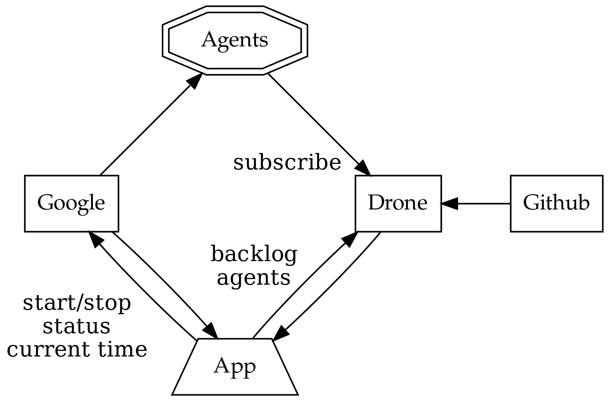

Drone receives work when a contributor submits a github pull request
to a managed project. Drone assigns the work to its agents, each
processing one job at a time.

The goal of our app is to ensure that there are enough agents to
complete the work, with a cap on the number of agents, whilst
minimising the total cost. Our app needs to know the number of items
in the *backlog* and the number of available *agents*.

Google can spawn *nodes*, each can host multiple drone agents. When an
agent starts up, it registers itself with drone and drone takes care
of the lifecycle (including keep-alive calls to detect removed
agents).

GKE charges a fee per minute of uptime, rounded up to the nearest hour
for each node. One does not simply spawn a new node for each job in
the work queue, we must re-use nodes and retain them until their 59th
minute to get the most value for money.

Our app needs to be able to start and stop nodes, as well as check
their status (e.g. uptimes, list of inactive nodes) and to know what
time GKE believes it to be.

In addition, there is no API to talk directly to an *agent* so we do
not know if any individual agent is performing any work for the drone
server. If we accidentally stop an agent whilst it is performing work,
it is inconvenient and requires a human to restart the job.

Contributors can manually add agents to the farm, so counting agents
and nodes is not equivalent. We don't need to supply any nodes if
there are agents available.

The failure mode should always be to take the least costly option.

Both Drone and GKE have a JSON over REST API with OAuth 2.0
authentication.

## Interfaces / Algebras

Let's codify the architecture diagram from the previous section.

In FP, an *algebra* takes the place of an `interface` in Java, or the
set of valid messages for an `Actor` in Akka. This is the layer where
we define all side-effecting interactions of our system.

There is tight iteration between writing the business logic and the
algebra: it is a good level of abstraction to design a system.

{lang="text"}
~~~~~~~~
  package algebra
  
  import java.time.Instant
  import scalaz.NonEmptyList
  
  trait Drone[F[_]] {
    def getBacklog: F[Int]
    def getAgents: F[Int]
  }
  
  final case class MachineNode(id: String)
  trait Machines[F[_]] {
    def getTime: F[Instant]
    def getManaged: F[NonEmptyList[MachineNode]]
    def getAlive: F[Map[MachineNode, Instant]]
    def start(node: MachineNode): F[MachineNode]
    def stop(node: MachineNode): F[MachineNode]
  }
~~~~~~~~

We've used `NonEmptyList`, easily created by calling `.toNel` on the
stdlib's `List` (returning an `Option[NonEmptyList]`), otherwise
everything should be familiar.

A> It is good practice in FP to encode constraints in parameters **and** return types
A> --- it means we never need to handle situations that are impossible. However,
A> this often conflicts with *Postel's law* "be liberal in what you accept from
A> others".
A> 
A> Although we agree that parameters should be as general as possible, we do not
A> agree that a function should take `Seq` unless it can handle empty `Seq`,
A> otherwise the only course of action would be to exception, breaking totality and
A> causing a side effect.
A> 
A> We prefer `NonEmptyList`, not because it is a `List`, but because of its
A> non-empty property. When we learn about scalaz's typeclass hierarchy, we will
A> see a better way to request non-emptyness.

## Business Logic

Now we write the business logic that defines the application's
behaviour, considering only the happy path.

First, the imports

{lang="text"}
~~~~~~~~
  package logic
  
  import java.time.Instant
  import java.time.temporal.ChronoUnit
  
  import scala.concurrent.duration._
  
  import scalaz._
  import Scalaz._
  
  import algebra._
~~~~~~~~

We need a `WorldView` class to hold a snapshot of our knowledge of the
world. If we were designing this application in Akka, `WorldView`
would probably be a `var` in a stateful `Actor`.

`WorldView` aggregates the return values of all the methods in the
algebras, and adds a *pending* field to track unfulfilled requests.

{lang="text"}
~~~~~~~~
  final case class WorldView(
    backlog: Int,
    agents: Int,
    managed: NonEmptyList[MachineNode],
    alive: Map[MachineNode, Instant],
    pending: Map[MachineNode, Instant],
    time: Instant
  )
~~~~~~~~

Now we are ready to write our business logic, but we need to indicate
that we depend on `Drone` and `Machines`.

We create a *module* to contain our main business logic. A module is
pure and depends only on other modules, algebras and pure functions.

{lang="text"}
~~~~~~~~
  final class DynAgents[F[_]](D: Drone[F], M: Machines[F])
                             (implicit F: Monad[F]) {
~~~~~~~~

The implicit `Monad[F]` means that `F` is *monadic*, allowing us to
use `map`, `pure` and, of course, `flatMap` via `for` comprehensions.

We have access to the algebra of `Drone` and `Machines` as `D` and `M`,
respectively. Using a single capital letter name is a common naming convention
for monad and algebra implementations.

Our business logic will run in an infinite loop (pseudocode)

{lang="text"}
~~~~~~~~
  state = initial()
  while True:
    state = update(state)
    state = act(state)
~~~~~~~~

We must write three functions: `initial`, `update` and `act`, all
returning an `F[WorldView]`.

### initial

In `initial` we call all external services and aggregate their results
into a `WorldView`. We default the `pending` field to an empty `Map`.

{lang="text"}
~~~~~~~~
  def initial: F[WorldView] = for {
    db <- D.getBacklog
    da <- D.getAgents
    mm <- M.getManaged
    ma <- M.getAlive
    mt <- M.getTime
  } yield WorldView(db, da, mm, ma, Map.empty, mt)
~~~~~~~~

Recall from Chapter 1 that `flatMap` (i.e. when we use the `<-`
generator) allows us to operate on a value that is computed at
runtime. When we return an `F[_]` we are returning another program to
be interpreted at runtime, that we can then `flatMap`. This is how we
safely chain together sequential side-effecting code, whilst being
able to provide a pure implementation for tests. FP could be described
as Extreme Mocking.

### update

`update` should call `initial` to refresh our world view, preserving
known `pending` actions.

If a node has changed state, we remove it from `pending` and if a
pending action is taking longer than 10 minutes to do anything, we
assume that it failed and forget that we asked to do it.

{lang="text"}
~~~~~~~~
  def update(old: WorldView): F[WorldView] = for {
    snap <- initial
    changed = symdiff(old.alive.keySet, snap.alive.keySet)
    pending = (old.pending -- changed).filterNot {
      case (_, started) => timediff(started, snap.time) >= 10.minutes
    }
    update = snap.copy(pending = pending)
  } yield update
  
  private def symdiff[T](a: Set[T], b: Set[T]): Set[T] =
    (a union b) -- (a intersect b)
  
  private def timediff(from: Instant, to: Instant): FiniteDuration =
    ChronoUnit.MINUTES.between(from, to).minutes
~~~~~~~~

Note that we use assignment for pure functions like `symdiff`,
`timediff` and `copy`. Pure functions don't need test mocks, they have
explicit inputs and outputs, so you could move all pure code into
standalone methods on a stateless `object`, testable in isolation.
We're happy testing only the public methods, preferring that our
business logic is easy to read.

### act

The `act` method is slightly more complex, so we'll split it into two
parts for clarity: detection of when an action needs to be taken,
followed by taking action. This simplification means that we can only
perform one action per invocation, but that is reasonable because we
can control the invocations and may choose to re-run `act` until no
further action is taken.

We write the scenario detectors as extractors for `WorldView`, which
is nothing more than an expressive way of writing `if` / `else`
conditions.

We need to add agents to the farm if there is a backlog of work, we
have no agents, we have no nodes alive, and there are no pending
actions. We return a candidate node that we would like to start:

{lang="text"}
~~~~~~~~
  private object NeedsAgent {
    def unapply(world: WorldView): Option[MachineNode] = world match {
      case WorldView(backlog, 0, managed, alive, pending, _)
           if backlog > 0 && alive.isEmpty && pending.isEmpty
             => Option(managed.head)
      case _ => None
    }
  }
~~~~~~~~

If there is no backlog, we should stop all nodes that have become
stale (they are not doing any work). However, since Google charge per
hour we only shut down machines in their 58th+ minute to get the most
out of our money. We return the non-empty list of nodes to stop.

As a financial safety net, all nodes should have a maximum lifetime of
5 hours.

{lang="text"}
~~~~~~~~
  private object Stale {
    def unapply(world: WorldView): Option[NonEmptyList[MachineNode]] =
      world match {
        case WorldView(backlog, _, _, alive, pending, time) if alive.nonEmpty =>
          (alive -- pending.keys).collect {
            case (n, started)
                if backlog == 0 && timediff(started, time).toMinutes % 60 >= 58 =>
              n
            case (n, started) if timediff(started, time) >= 5.hours => n
          }.toList.toNel
  
        case _ => None
      }
  }
~~~~~~~~

Now that we have detected the scenarios that can occur, we can write
the `act` method. When we schedule a node to be started or stopped, we
add it to `pending` noting the time that we scheduled the action.

{lang="text"}
~~~~~~~~
  def act(world: WorldView): F[WorldView] = world match {
    case NeedsAgent(node) =>
      for {
        _ <- M.start(node)
        update = world.copy(pending = Map(node -> world.time))
      } yield update
  
    case Stale(nodes) =>
      nodes.foldLeftM(world) { (world, n) =>
        for {
          _ <- M.stop(n)
          update = world.copy(pending = world.pending + (n -> world.time))
        } yield update
      }
  
    case _ => world.pure[F]
  }
~~~~~~~~

Because `NeedsAgent` and `Stale` do not cover all possible situations,
we need a catch-all `case _` to do nothing. Recall from Chapter 2 that
`.pure` creates the `for`'s (monadic) context from a value.

`foldLeftM` is like `foldLeft` over `nodes`, but each iteration of the
fold may return a monadic value. In our case, each iteration of the
fold returns `F[WorldView]`.

The `M` is for Monadic and you will find more of these *lifted*
methods that behave as one would expect, taking monadic values in
place of values.

## Unit Tests

The FP approach to writing applications is a designer's dream: you can
delegate writing the implementations of algebras to your team members
while focusing on making your business logic meet the requirements.

Our application is highly dependent on timing and third party
webservices. If this was a traditional OOP application, we'd create
mocks for all the method calls, or test actors for the outgoing
mailboxes. FP mocking is equivalent to providing an alternative
implementation of dependency algebras. The algebras already isolate
the parts of the system that need to be mocked --- everything else is
pure.

We'll start with some test data

{lang="text"}
~~~~~~~~
  object Data {
    val node1   = MachineNode("1243d1af-828f-4ba3-9fc0-a19d86852b5a")
    val node2   = MachineNode("550c4943-229e-47b0-b6be-3d686c5f013f")
    val managed = NonEmptyList(node1, node2)
  
    import Instant.parse
    val time1 = parse("2017-03-03T18:07:00.000+01:00[Europe/London]")
    val time2 = parse("2017-03-03T18:59:00.000+01:00[Europe/London]") // +52 mins
    val time3 = parse("2017-03-03T19:06:00.000+01:00[Europe/London]") // +59 mins
    val time4 = parse("2017-03-03T23:07:00.000+01:00[Europe/London]") // +5 hours
  
    val needsAgents = WorldView(5, 0, managed, Map.empty, Map.empty, time1)
  }
  import Data._
~~~~~~~~

We implement algebras by extending `Drone` and `Machines` with a specific
monadic context, `Id` being the simplest.

Our "mock" implementations simply play back a fixed `WorldView`. We've
isolated the state of our system, so we can use `var` to store the
state:

{lang="text"}
~~~~~~~~
  class Mutable(state: WorldView) {
    var started, stopped: Int = 0
  
    private val D: Drone[Id] = new Drone[Id] {
      def getBacklog: Int = state.backlog
      def getAgents: Int = state.agents
    }
  
    private val M: Machines[Id] = new Machines[Id] {
      def getAlive: Map[MachineNode, Instant] = state.alive
      def getManaged: NonEmptyList[MachineNode] = state.managed
      def getTime: Instant = state.time
      def start(node: MachineNode): MachineNode = { started += 1 ; node }
      def stop(node: MachineNode): MachineNode = { stopped += 1 ; node }
    }
  
    val program = new DynAgents[Id](D, M)
  }
~~~~~~~~

A> We will return to this code later on in the book and replace `var` with a
A> principled way of managing state.

When we write a unit test (here using `FlatSpec` from scalatest), we create an
instance of `Mutable` and then import all of its members.

Our implicit `drone` and `machines` both use the `Id` execution
context and therefore interpreting this program with them returns an
`Id[WorldView]` that we can assert on.

In this trivial case we just check that the `initial` method returns
the same value that we use in the static implementations:

{lang="text"}
~~~~~~~~
  "Business Logic" should "generate an initial world view" in {
    val mutable = new Mutable(needsAgents)
    import mutable._
  
    program.initial shouldBe needsAgents
  }
~~~~~~~~

We can create more advanced tests of the `update` and `act` methods,
helping us flush out bugs and refine the requirements:

{lang="text"}
~~~~~~~~
  it should "remove changed nodes from pending" in {
    val world = WorldView(0, 0, managed, Map(node1 -> time3), Map.empty, time3)
    val mutable = new Mutable(world)
    import mutable._
  
    val old = world.copy(alive = Map.empty,
                         pending = Map(node1 -> time2),
                         time = time2)
    program.update(old) shouldBe world
  }
  
  it should "request agents when needed" in {
    val mutable = new Mutable(needsAgents)
    import mutable._
  
    val expected = needsAgents.copy(
      pending = Map(node1 -> time1)
    )
  
    program.act(needsAgents) shouldBe expected
  
    mutable.stopped shouldBe 0
    mutable.started shouldBe 1
  }
~~~~~~~~

It would be boring to go through the full test suite. Convince
yourself with a thought experiment that the following tests are easy
to implement using the same approach:

-   not request agents when pending
-   don't shut down agents if nodes are too young
-   shut down agents when there is no backlog and nodes will shortly incur new costs
-   not shut down agents if there are pending actions
-   shut down agents when there is no backlog if they are too old
-   shut down agents, even if they are potentially doing work, if they are too old
-   ignore unresponsive pending actions during update

All of these tests are synchronous and isolated to the test runner's
thread (which could be running tests in parallel). If we'd designed
our test suite in Akka, our tests would be subject to arbitrary
timeouts and failures would be hidden in logfiles.

The productivity boost of simple tests for business logic cannot be
overstated. Consider that 90% of an application developer's time
interacting with the customer is in refining, updating and fixing
these business rules. Everything else is implementation detail.

## Parallel

The application that we have designed runs each of its algebraic
methods sequentially. But there are some obvious places where work can
be performed in parallel.

### initial

In our definition of `initial` we could ask for all the information we
need at the same time instead of one query at a time.

As opposed to `flatMap` for sequential operations, scalaz uses
`Apply` syntax for parallel operations:

{lang="text"}
~~~~~~~~
  ^^^^(D.getBacklog, D.getAgents, M.getManaged, M.getAlive, M.getTime)
~~~~~~~~

which can also use infix notation:

{lang="text"}
~~~~~~~~
  (D.getBacklog |@| D.getAgents |@| M.getManaged |@| M.getAlive |@| M.getTime)
~~~~~~~~

If each of the parallel operations returns a value in the same monadic
context, we can apply a function to the results when they all return.
Rewriting `update` to take advantage of this:

{lang="text"}
~~~~~~~~
  def initial: F[WorldView] =
    ^^^^(D.getBacklog, D.getAgents, M.getManaged, M.getAlive, M.getTime) {
      case (db, da, mm, ma, mt) => WorldView(db, da, mm, ma, Map.empty, mt)
    }
~~~~~~~~

### act

In the current logic for `act`, we are stopping each node
sequentially, waiting for the result, and then proceeding. But we
could stop all the nodes in parallel and then update our view of the
world.

A disadvantage of doing it this way is that any failures will cause us
to short-circuit before updating the `pending` field. But that's a
reasonable tradeoff since our `update` will gracefully handle the case
where a `node` is shut down unexpectedly.

We need a method that operates on `NonEmptyList` that allows us to
`map` each element into an `F[MachineNode]`, returning an
`F[NonEmptyList[MachineNode]]`. The method is called `traverse`, and
when we `flatMap` over it we get a `NonEmptyList[MachineNode]` that we
can deal with in a simple way:

{lang="text"}
~~~~~~~~
  for {
    stopped <- nodes.traverse(M.stop)
    updates = stopped.map(_ -> world.time).toList.toMap
    update = world.copy(pending = world.pending ++ updates)
  } yield update
~~~~~~~~

Arguably, this is easier to understand than the sequential version.

### Parallel Interpretation

Marking something as suitable for parallel execution does not guarantee that it
will be executed in parallel: that is the responsibility of the implementation.
Not to state the obvious: parallel execution is supported by `Future`, but not
`Id`.

Of course, we need to be careful when implementing algebras such that they can
perform operations safely in parallel, perhaps requiring protecting internal
state with concurrency locks or actors.

## Summary

1.  *algebras* define the interface between systems.
2.  *modules* define pure logic and depend on algebras and other modules.
3.  Test implementations can mock out the side-effecting parts of the system,
    enabling a high level of test coverage for the business logic.
4.  algebraic methods can be performed in parallel by taking their
    product or traversing sequences (caveat emptor, revisited later).

# Data and Functionality

From OOP we are used to thinking about data and functionality
together: class hierarchies carry methods, and traits can demand that
data fields exist. Runtime polymorphism of an object is in terms of
"is a" relationships, requiring classes to inherit from common
interfaces. This can get messy as a codebase grows. Simple data types
become obscured by hundreds of lines of methods, trait mixins suffer
from initialisation order errors, and testing / mocking of highly
coupled components becomes a chore.

FP takes a different approach, defining data and functionality
separately. In this chapter, we will cover the basics of data types
and the advantages of constraining ourselves to a subset of the Scala
language. We will also discover *typeclasses* as a way to achieve
compiletime polymorphism: thinking about functionality of a data
structure in terms of "has a" rather than "is a" relationships.

## Data

The fundamental building blocks of data types are

-   `final case class` also known as *products*
-   `sealed abstract class` also known as *coproducts*
-   `case object` and `Int`, `Double`, `String` (etc) *values*

with no methods or fields other than the constructor parameters.

The collective name for *products*, *coproducts* and *values* is
*Algebraic Data Type* (ADT).

We compose data types from the `AND` and `XOR` (exclusive `OR`)
Boolean algebra: a product contains every type that it is composed of,
but a coproduct can be only one. For example

-   product: `ABC = a AND b AND c`
-   coproduct: `XYZ = x XOR y XOR z`

written in Scala

{lang="text"}
~~~~~~~~
  // values
  case object A
  type B = String
  type C = Int
  
  // product
  final case class ABC(a: A.type, b: B, c: C)
  
  // coproduct
  sealed abstract class XYZ
  case object X extends XYZ
  case object Y extends XYZ
  final case class Z(b: B) extends XYZ
~~~~~~~~

### Generalised ADTs

When we introduce a type parameter into an ADT, we call it a
*Generalised Algebraic Data Type* (GADT).

`scalaz.IList`, a safe alternative to the stdlib `List`, is a GADT:

{lang="text"}
~~~~~~~~
  sealed abstract class IList[A]
  final case class INil[A]() extends IList[A]
  final case class ICons[A](head: A, tail: IList[A]) extends IList[A]
~~~~~~~~

If an ADT refers to itself, we call it a *recursive type*. `IList` is
recursive because `ICons` contains a reference to `IList`.

### Functions on ADTs

ADTs can contain *pure functions*

{lang="text"}
~~~~~~~~
  final case class UserConfiguration(accepts: Int => Boolean)
~~~~~~~~

But ADTs that contain functions come with some caveats as they don't
translate perfectly onto the JVM. For example, legacy `Serializable`,
`hashCode`, `equals` and `toString` do not behave as one might
reasonably expect.

Unfortunately, `Serializable` is used by popular frameworks, despite
far superior alternatives. A common pitfall is forgetting that
`Serializable` may attempt to serialise the entire closure of a
function, which can crash production servers. A similar caveat applies
to legacy Java classes such as `Throwable`, which can carry references
to arbitrary objects. This is one of the reasons why we restrict what
can live on an ADT.

We will explore alternatives to the legacy methods when we discuss the
scalaz library in the next chapter, at the cost of losing
interoperability with some legacy Java and Scala code.

### Exhaustivity

It is important that we use `sealed abstract class`, not just
`abstract class`, when defining a data type. Sealing a `class` means
that all subtypes must be defined in the same file, allowing the
compiler to know about them in pattern match exhaustivity checks and
in macros that eliminate boilerplate. e.g.

{lang="text"}
~~~~~~~~
  scala> sealed abstract class Foo
         final case class Bar(flag: Boolean) extends Foo
         final case object Baz extends Foo
  
  scala> def thing(foo: Foo) = foo match {
           case Bar(_) => true
         }
  <console>:14: error: match may not be exhaustive.
  It would fail on the following input: Baz
         def thing(foo: Foo) = foo match {
                               ^
~~~~~~~~

This shows the developer what they have broken when they add a new
product to the codebase. We're using `-Xfatal-warnings`, otherwise
this is just a warning.

However, the compiler will not perform exhaustivity checking if the
`class` is not sealed or if there are guards, e.g.

{lang="text"}
~~~~~~~~
  scala> def thing(foo: Foo) = foo match {
           case Bar(flag) if flag => true
         }
  
  scala> thing(Baz)
  scala.MatchError: Baz (of class Baz$)
    at .thing(<console>:15)
~~~~~~~~

To remain safe, don't use guards on `sealed` types.

The [`-Xstrict-patmat-analysis`](https://github.com/scala/scala/pull/5617) flag has been proposed as a language
improvement to perform additional pattern matcher checks.

### Alternative Products and Coproducts

Another form of product is a tuple, which is like an unlabelled `final
case class`.

`(A.type, B, C)` is equivalent to `ABC` in the above example but it is
best to use `final case class` when part of an ADT because the lack of
names is awkward to deal with.

Another form of coproduct is when we nest `Either` types. e.g.

{lang="text"}
~~~~~~~~
  Either[X.type, Either[Y.type, Z]]
~~~~~~~~

equivalent to the `XYZ` sealed abstract class. A cleaner syntax to define
nested `Either` types is to create an alias type ending with a colon,
allowing infix notation with association from the right:

{lang="text"}
~~~~~~~~
  type |:[L,R] = Either[L, R]
  
  X.type |: Y.type |: Z
~~~~~~~~

This is useful to create anonymous coproducts when you can't put all
the implementations into the same source file.

{lang="text"}
~~~~~~~~
  type Accepted = String |: Long |: Boolean
~~~~~~~~

Yet another alternative coproduct is to create a custom `sealed abstract class`
with `final case class` definitions that simply wrap the desired type:

{lang="text"}
~~~~~~~~
  sealed abstract class Accepted
  final case class AcceptedString(value: String) extends Accepted
  final case class AcceptedLong(value: Long) extends Accepted
  final case class AcceptedBoolean(value: Boolean) extends Accepted
~~~~~~~~

Pattern matching on these forms of coproduct can be tedious, which is why [Union
Types](https://contributors.scala-lang.org/t/733) are being explored in the Dotty next-generation scala compiler. Macros
such as [totalitarian](https://github.com/propensive/totalitarian) and [iotaz](https://github.com/frees-io/iota) exist as alternative ways of encoding anonymous
coproducts.

A> We can also use a `sealed trait` in place of a `sealed abstract class`
A> but there are binary compatibility advantages to using `abstract
A> class`. A `sealed trait` is only needed if you need to create a
A> complicated ADT with multiple inheritance.

### Convey Information

Besides being a container for necessary business information, data
types can be used to encode constraints. For example,

{lang="text"}
~~~~~~~~
  final case class NonEmptyList[A](head: A, tail: IList[A])
~~~~~~~~

can never be empty. This makes `scalaz.NonEmptyList` a useful data type despite
containing the same information as `List`.

Product types often contain types that are far more general than is allowed. In
traditional OOP this would be handled with input validation through assertions:

{lang="text"}
~~~~~~~~
  final case class Person(name: String, age: Int) {
    require(name.nonEmpty && age > 0) // breaks Totality, don't do this!
  }
~~~~~~~~

Instead, we can use the `Either` data type to provide `Right[Person]` for valid
instances and protect invalid instances from propagating. Note that the
constructor is `private`:

{lang="text"}
~~~~~~~~
  final case class Person private(name: String, age: Int)
  object Person {
    def apply(name: String, age: Int): Either[String, Person] = {
      if (name.nonEmpty && age > 0) Right(new Person(name, age))
      else Left(s"bad input: $name, $age")
    }
  }
  
  def welcome(person: Person): String =
    s"${person.name} you look wonderful at ${person.age}!"
  
  for {
    person <- Person("", -1)
  } yield welcome(person)
~~~~~~~~

#### Refined Data Types

A clean way to restrict the values of a general type is with the `refined`
library, providing a suite of restrictions to the contents of data. To install
refined, add the following to `build.sbt`

{lang="text"}
~~~~~~~~
  libraryDependencies += "eu.timepit" %% "refined-scalaz" % "0.8.7"
~~~~~~~~

and the following imports

{lang="text"}
~~~~~~~~
  import eu.timepit.refined
  import refined.api.Refined
~~~~~~~~

`Refined` allows us to define `Person` using adhoc refined types to capture
requirements exactly (typically written `A Refined B` rather than `Refined[A,
B]`)

{lang="text"}
~~~~~~~~
  import refined.numeric.Positive
  import refined.collection.NonEmpty
  
  final case class Person(
    name: String Refined NonEmpty,
    age: Int Refined Positive
  )
~~~~~~~~

`A Refined B` can be read as "an `A` that meets the requirements defined in
`B`". The underlying value can be obtained with `.value`. We can construct a
value at runtime using `.refineV`

{lang="text"}
~~~~~~~~
  scala> import refined.refineV
  scala> refineV[NonEmpty]("")
  Left(Predicate isEmpty() did not fail.)
  
  scala> refineV[NonEmpty]("Sam")
  Right(Sam)
~~~~~~~~

And if we add the following import

{lang="text"}
~~~~~~~~
  import refined.auto._
~~~~~~~~

we can construct *valid* values at compiletime and get a compile error if the
provided value does not meet the requirements

{lang="text"}
~~~~~~~~
  scala> val sam: String Refined NonEmpty = "Sam"
  Sam
  
  scala> val empty: String Refined NonEmpty = ""
  <console>:21: error: Predicate isEmpty() did not fail.
~~~~~~~~

More complex requirements can be captured, for example we can use the built-in
rule `MaxSize` with the following imports

{lang="text"}
~~~~~~~~
  import refined.W
  import refined.boolean.And
  import refined.collection.MaxSize
~~~~~~~~

capturing the requirement that the `String` must be both non-empty and have a
maximum size of 10 characters:

{lang="text"}
~~~~~~~~
  type Name = NonEmpty And MaxSize[W.`10`.T]
  
  final case class Person(
    name: String Refined Name,
    age: Int Refined Positive
  )
~~~~~~~~

A> The `W` notation is short for "witness". This syntax will be much simpler in
A> scala 2.13, which has support for *literal types*:
A> 
A> {lang="text"}
A> ~~~~~~~~
A>   type Name = NonEmpty And MaxSize[10]
A> ~~~~~~~~

It is easy to define custom requirements that are not covered by the refined
library. For example, the requirement that a `String` contains a valid
`java.net.URL` is as simple as

{lang="text"}
~~~~~~~~
  final case class Url()
  object Url {
    implicit def urlValidate: refined.Validate.Plain[String, Url] =
      Validate.fromPartial(new java.net.URL(_), "Url", Url())
  }
~~~~~~~~

which can be used as `String Refined Url`.

### Simple to Share

By not providing any functionality, ADTs can have a minimal set of
dependencies. This makes them easy to publish and share with other
developers. By using a simple data modelling language, it makes it
possible to interact with cross-discipline teams, such as DBAs, UI
developers and business analysts, using the actual code instead of a
hand written document as the source of truth.

Furthermore, tooling can be more easily written to produce or consume
schemas from other programming languages and wire protocols.

### Counting Complexity

The complexity of a data type is the number of instances that can
exist. A good data type has the least amount of complexity it needs to
hold the information it conveys, and no more.

Values have a built-in complexity:

-   `Unit` has one instance (why it is called "unit")
-   `Boolean` has two instances
-   `Int` has 4,294,967,295 instances
-   `String` has effectively infinite instances

To find the complexity of a product, we multiply the complexity of
each part.

-   `(Boolean, Boolean)` has 4 instances (`2*2`)
-   `(Boolean, Boolean, Boolean)` has 8 instances (`2*2*2`)

To find the complexity of a coproduct, we add the complexity of each
part.

-   `(Boolean |: Boolean)` has 4 instances (`2+2`)
-   `(Boolean |: Boolean |: Boolean)` has 6 instances (`2+2+2`)

To find the complexity of a GADT, multiply each part by the complexity
of the type parameter:

-   `Option[Boolean]` has 3 instances, `Some[Boolean]` and `None` (`2+1`)

In FP, functions are *total* and must return an instance for every
input, no `Exception`. Minimising the complexity of inputs and outputs
is the best way to achieve totality. As a rule of thumb, it is a sign
of a badly designed function when the complexity of a function's
return value is larger than the product of its inputs: it is a source
of entropy.

The complexity of a total function itself is the number of possible
functions that can satisfy the type signature: the output to the power
of the input.

-   `Unit => Boolean` has complexity 2
-   `Boolean => Boolean` has complexity 4
-   `Option[Boolean] => Option[Boolean]` has complexity 27
-   `Boolean => Int` is a mere quintillion going on a sextillion.
-   `Int => Boolean` is so big that if all implementations were assigned a unique
    number, each would require 4 gigabytes to represent.

In reality, `Int => Boolean` will be something simple like `isOdd`, `isEven` or
a sparse `BitSet`. This function, when used in an ADT, could be better replaced
with a coproduct labelling the limited set of functions that are relevant.

When our complexity is "infinity in, infinity out" we should introduce
restrictive data types and validation closer to the point of input with
`Refined` from the previous section.

The ability to count the complexity of a type signature has one other practical
application: we can find simpler type signatures with High School algebra! To go
from a type signature to its algebra of complexity, simply replace

-   `Either[A, B]` with `a + b`
-   `(A, B)` with `a * b`
-   `A => B` with `b ^ a`

do some rearranging, and convert back. For example, say we've designed a
framework based on callbacks and we've managed to work ourselves into the
situation where we have created this type signature:

{lang="text"}
~~~~~~~~
  (A => C) => ((B => C) => C)
~~~~~~~~

We can convert and rearrange

{lang="text"}
~~~~~~~~
  (c ^ (c ^ b)) ^ (c ^ a)
  = c ^ ((c ^ b) * (c ^ a))
  = c ^ (c ^ (a + b))
~~~~~~~~

then convert back to types and get

{lang="text"}
~~~~~~~~
  (Either[A, B] => C) => C
~~~~~~~~

which is much simpler: we only need to ask the users of our framework to provide
a `Either[A, B] => C`.

The same line of reasoning can be used to prove that

{lang="text"}
~~~~~~~~
  A => B => C
~~~~~~~~

is equivalent to

{lang="text"}
~~~~~~~~
  (A, B) => C
~~~~~~~~

also known as *Currying*.

### Prefer Coproduct over Product

An archetypal modelling problem that comes up a lot is when there are
mutually exclusive configuration parameters `a`, `b` and `c`. The
product `(a: Boolean, b: Boolean, c: Boolean)` has complexity 8
whereas the coproduct

{lang="text"}
~~~~~~~~
  sealed abstract class Config
  object Config {
    case object A extends Config
    case object B extends Config
    case object C extends Config
  }
~~~~~~~~

has a complexity of 3. It is better to model these configuration
parameters as a coproduct rather than allowing 5 invalid states to
exist.

The complexity of a data type also has implications on testing. It is
practically impossible to test every possible input to a function, but it is
easy to test a sample of values with the [scalacheck](https://www.scalacheck.org/) property testing framework.
If a random sample of a data type has a low probability of being valid, it is a
sign that the data is modelled incorrectly.

### Optimisations

A big advantage of using a simplified subset of the Scala language to
represent data types is that tooling can optimise the JVM bytecode
representation.

For example, we can pack `Boolean` and `Option` fields into an `Array[Byte]`,
cache instances, memoise `hashCode`, optimise `equals`, use `@switch` statements
when pattern matching, and much more.

These optimisations are not applicable to OOP `class` hierarchies that
may be managing state, throwing exceptions, or providing adhoc method
implementations.

### Generic Representation

We showed that product is synonymous with tuple and coproduct is
synonymous with nested `Either`. The [shapeless](https://github.com/milessabin/shapeless) library takes this
duality to the extreme and introduces a representation that is
*generic* for all ADTs:

-   `shapeless.HList` (symbolically `::`) for representing products
    (`scala.Product` already exists for another purpose)
-   `shapeless.Coproduct` (symbolically `:+:`) for representing coproducts

Shapeless provides the ability to convert back and forth between a
generic representation and the ADT, allowing functions to be written
that work **for every** `final case class` and `sealed abstract class`.

{lang="text"}
~~~~~~~~
  scala> import shapeless._
         final case class Foo(a: String, b: Long)
         Generic[Foo].to(Foo("hello", 13L))
  res: String :: Long :: HNil = hello :: 13 :: HNil
  
  scala> Generic[Foo].from("hello" :: 13L :: HNil)
  res: Foo = Foo(hello,13)
  
  scala> sealed abstract class Bar
         case object Irish extends Bar
         case object English extends Bar
  
  scala> Generic[Bar].to(Irish)
  res: English.type :+: Irish.type :+: CNil = Inl(Irish)
  
  scala> Generic[Bar].from(Inl(Irish))
  res: Bar = Irish
~~~~~~~~

`HNil` is the empty product and `CNil` is the empty coproduct.

It is not necessary to know how to write generic code to be able to
make use of shapeless. However, it is an important part of FP Scala so
we will return to it later with a dedicated chapter.

## Functionality

Pure functions are typically defined as methods on an `object`.

{lang="text"}
~~~~~~~~
  package object math {
    def sin(x: Double): Double = java.lang.Math.sin(x)
    ...
  }
  
  math.sin(1.0)
~~~~~~~~

However, it can be clunky to use `object` methods since it reads
inside-out, not left to right. In addition, a function on an `object`
steals the namespace. If we were to define `sin(t: T)` somewhere else
we get *ambiguous reference* errors. This is the same problem as
Java's static methods vs class methods.

W> If you like to put methods on a `trait`, requiring users to mix your
W> traits into their `classes` or `objects` with the *cake pattern*,
W> please get out of this nasty habit: you're leaking internal
W> implementation detail to public APIs, bloating your bytecode, and
W> creating a lot of noise for IDE autocompleters.

With the `implicit class` language feature (also known as *extension
methodology* or *syntax*), and a little boilerplate, we can get the
familiar style:

{lang="text"}
~~~~~~~~
  scala> implicit class DoubleOps(x: Double) {
           def sin: Double = math.sin(x)
         }
  
  scala> 1.0.sin
  res: Double = 0.8414709848078965
~~~~~~~~

Often it is best to just skip the `object` definition and go straight
for an `implicit class`, keeping boilerplate to a minimum:

{lang="text"}
~~~~~~~~
  implicit class DoubleOps(x: Double) {
    def sin: Double = java.lang.Math.sin(x)
  }
~~~~~~~~

A> `implicit class` is syntax sugar for an implicit conversion:
A> 
A> {lang="text"}
A> ~~~~~~~~
A>   implicit def DoubleOps(x: Double): DoubleOps = new DoubleOps(x)
A>   class DoubleOps(x: Double) {
A>     def sin: Double = java.lang.Math.sin(x)
A>   }
A> ~~~~~~~~
A> 
A> Which unfortunately has a runtime cost: each time the extension method
A> is called, an intermediate `DoubleOps` will be constructed and then
A> thrown away. This can contribute to GC pressure in hotspots.
A> 
A> There is a slightly more verbose form of `implicit class` that avoids
A> the allocation and is therefore preferred:
A> 
A> {lang="text"}
A> ~~~~~~~~
A>   implicit final class DoubleOps(val x: Double) extends AnyVal {
A>     def sin: Double = java.lang.Math.sin(x)
A>   }
A> ~~~~~~~~

### Polymorphic Functions

The more common kind of function is a polymorphic function, which
lives in a *typeclass*. A typeclass is a trait that:

-   holds no state
-   has a type parameter
-   has at least one abstract method (*primitive combinators*)
-   may contain *generalised* methods (*derived combinators*)
-   may extend other typeclasses

There can only be one implementation of a typeclass for any given type
parameter, a property known as *typeclass coherence*. Typeclasses look
superficially similar to algebraic interfaces from the previous chapter, but
algebras do not have to be coherent.

A> Typeclass coherence is primarily about consistency, and the consistency gives us
A> the confidence to use `implicit` parameters. It would be difficult to reason
A> about code that performs differently depending on the implicit imports that are
A> in scope. Typeclass coherence effectively says that imports should not impact
A> the behaviour of the code.
A> 
A> Additionally, typeclass coherence allows us to globally cache implicits at
A> runtime and save memory allocations, gaining performance improvements from
A> reduced pressure on the garbage collector.

Typeclasses are used in the Scala stdlib. We'll explore a simplified
version of `scala.math.Numeric` to demonstrate the principle:

{lang="text"}
~~~~~~~~
  trait Ordering[T] {
    def compare(x: T, y: T): Int
  
    def lt(x: T, y: T): Boolean = compare(x, y) < 0
    def gt(x: T, y: T): Boolean = compare(x, y) > 0
  }
  
  trait Numeric[T] extends Ordering[T] {
    def plus(x: T, y: T): T
    def times(x: T, y: T): T
    def negate(x: T): T
    def zero: T
  
    def abs(x: T): T = if (lt(x, zero)) negate(x) else x
  }
~~~~~~~~

We can see all the key features of a typeclass in action:

-   there is no state
-   `Ordering` and `Numeric` have type parameter `T`
-   `Ordering` has abstract `compare` and `Numeric` has abstract `plus`,
    `times`, `negate` and `zero`
-   `Ordering` defines generalised `lt` and `gt` based on `compare`,
    `Numeric` defines `abs` in terms of `lt`, `negate` and `zero`.
-   `Numeric` extends `Ordering`

We can now write functions for types that "have a" `Numeric`
typeclass:

{lang="text"}
~~~~~~~~
  def signOfTheTimes[T](t: T)(implicit N: Numeric[T]): T = {
    import N._
    times(negate(abs(t)), t)
  }
~~~~~~~~

We are no longer dependent on the OOP hierarchy of our input types,
i.e. we don't demand that our input "is a" `Numeric`, which is vitally
important if we want to support a third party class that we cannot
redefine.

Another advantage of typeclasses is that the association of
functionality to data is at compiletime, as opposed to OOP runtime
dynamic dispatch.

For example, whereas the `List` class can only have one implementation
of a method, a typeclass method allows us to have a different
implementation depending on the `List` contents and therefore offload
work to compiletime instead of leaving it to runtime.

### Syntax

The syntax for writing `signOfTheTimes` is clunky, there are some
things we can do to clean it up.

Downstream users will prefer to see our method use *context bounds*,
since the signature reads cleanly as "takes a `T` that has a
`Numeric`"

{lang="text"}
~~~~~~~~
  def signOfTheTimes[T: Numeric](t: T): T = ...
~~~~~~~~

but now we have to use `implicitly[Numeric[T]]` everywhere. By
defining boilerplate on the companion of the typeclass

{lang="text"}
~~~~~~~~
  object Numeric {
    def apply[T](implicit numeric: Numeric[T]): Numeric[T] = numeric
  }
~~~~~~~~

we can obtain the implicit with less noise

{lang="text"}
~~~~~~~~
  def signOfTheTimes[T: Numeric](t: T): T = {
    val N = Numeric[T]
    import N._
    times(negate(abs(t)), t)
  }
~~~~~~~~

But it is still worse for us as the implementors. We have the
syntactic problem of inside-out static methods vs class methods. We
deal with this by introducing `ops` on the typeclass companion:

{lang="text"}
~~~~~~~~
  object Numeric {
    def apply[T](implicit numeric: Numeric[T]): Numeric[T] = numeric
  
    object ops {
      implicit class NumericOps[T](t: T)(implicit N: Numeric[T]) {
        def +(o: T): T = N.plus(t, o)
        def *(o: T): T = N.times(t, o)
        def unary_-: T = N.negate(t)
        def abs: T = N.abs(t)
  
        // duplicated from Ordering.ops
        def <(o: T): T = N.lt(t, o)
        def >(o: T): T = N.gt(t, o)
      }
    }
  }
~~~~~~~~

Note that `-x` is expanded into `x.unary_-` by the compiler's syntax
sugar, which is why we define `unary_-` as an extension method. We can
now write the much cleaner:

{lang="text"}
~~~~~~~~
  import Numeric.ops._
  def signOfTheTimes[T: Numeric](t: T): T = -(t.abs) * t
~~~~~~~~

The good news is that we never need to write this boilerplate because
[Simulacrum](https://github.com/mpilquist/simulacrum) provides a `@typeclass` macro annotation to have the
companion `apply` and `ops` automatically generated. It even allows us
to define alternative (usually symbolic) names for common methods. In
full:

{lang="text"}
~~~~~~~~
  import simulacrum._
  
  @typeclass trait Ordering[T] {
    def compare(x: T, y: T): Int
    @op("<") def lt(x: T, y: T): Boolean = compare(x, y) < 0
    @op(">") def gt(x: T, y: T): Boolean = compare(x, y) > 0
  }
  
  @typeclass trait Numeric[T] extends Ordering[T] {
    @op("+") def plus(x: T, y: T): T
    @op("*") def times(x: T, y: T): T
    @op("unary_-") def negate(x: T): T
    def zero: T
    def abs(x: T): T = if (lt(x, zero)) negate(x) else x
  }
  
  import Numeric.ops._
  def signOfTheTimes[T: Numeric](t: T): T = -(t.abs) * t
~~~~~~~~

### Instances

*Instances* of `Numeric` (which are also instances of `Ordering`) are
defined as an `implicit val` that extends the typeclass, and can
provide optimised implementations for the generalised methods:

{lang="text"}
~~~~~~~~
  implicit val NumericDouble: Numeric[Double] = new Numeric[Double] {
    def plus(x: Double, y: Double): Double = x + y
    def times(x: Double, y: Double): Double = x * y
    def negate(x: Double): Double = -x
    def zero: Double = 0.0
    def compare(x: Double, y: Double): Int = java.lang.Double.compare(x, y)
  
    // optimised
    override def lt(x: Double, y: Double): Boolean = x < y
    override def gt(x: Double, y: Double): Boolean = x > y
    override def abs(x: Double): Double = java.lang.Math.abs(x)
  }
~~~~~~~~

Although we are using `+`, `*`, `unary_-`, `<` and `>` here, which are
the ops (and could be an infinite loop!), these methods exist already
on `Double`. Class methods are always used in preference to extension
methods. Indeed, the scala compiler performs special handling of
primitives and converts these method calls into raw `dadd`, `dmul`,
`dcmpl` and `dcmpg` bytecode instructions, respectively.

We can also implement `Numeric` for Java's `BigDecimal` class (avoid
`scala.BigDecimal`, [it is fundamentally broken](https://github.com/scala/bug/issues/9670))

{lang="text"}
~~~~~~~~
  import java.math.{ BigDecimal => BD }
  
  implicit val NumericBD: Numeric[BD] = new Numeric[BD] {
    def plus(x: BD, y: BD): BD = x.add(y)
    def times(x: BD, y: BD): BD = x.multiply(y)
    def negate(x: BD): BD = x.negate
    def zero: BD = BD.ZERO
    def compare(x: BD, y: BD): Int = x.compareTo(y)
  }
~~~~~~~~

We could even take some liberties and create our own data structure
for complex numbers:

{lang="text"}
~~~~~~~~
  final case class Complex[T](r: T, i: T)
~~~~~~~~

And derive a `Numeric[Complex[T]]` if `Numeric[T]` exists. Since these
instances depend on the type parameter, it is a `def`, not a `val`.

{lang="text"}
~~~~~~~~
  implicit def numericComplex[T: Numeric]: Numeric[Complex[T]] =
    new Numeric[Complex[T]] {
      type CT = Complex[T]
      def plus(x: CT, y: CT): CT = Complex(x.r + y.r, x.i + y.i)
      def times(x: CT, y: CT): CT =
        Complex(x.r * y.r + (-x.i * y.i), x.r * y.i + x.i * y.r)
      def negate(x: CT): CT = Complex(-x.r, -x.i)
      def zero: CT = Complex(Numeric[T].zero, Numeric[T].zero)
      def compare(x: CT, y: CT): Int = {
        val real = (Numeric[T].compare(x.r, y.r))
        if (real != 0) real
        else Numeric[T].compare(x.i, y.i)
      }
    }
~~~~~~~~

The observant reader may notice that `abs` is not at all what a
mathematician would expect. The correct return value for `abs` should
be `T`, not `Complex[T]`.

`scala.math.Numeric` tries to do too much and does not generalise
beyond real numbers. This is a good lesson that smaller, well defined,
typeclasses are often better than a monolithic collection of overly
specific features.

If you need to write generic code that works for a wide range of
number types, prefer [spire](https://github.com/non/spire) to the stdlib. Indeed, in the next chapter
we will see that concepts such as having a zero element, or adding two
values, are worthy of their own typeclass.

### Implicit Resolution

We've discussed implicits a lot: this section is to clarify what
implicits are and how they work.

*Implicit parameters* are when a method requests that a unique
instance of a particular type is in the *implicit scope* of the
caller, with special syntax for typeclass instances. Implicit
parameters are a clean way to thread configuration through an
application.

In this example, `foo` requires that typeclasses for `Numeric` and
shapeless' `Typeable` are available for `T`, as well as an implicit
(user-defined) `Config` object.

{lang="text"}
~~~~~~~~
  def foo[T: Numeric: Typeable](implicit conf: Config) = ...
~~~~~~~~

*Implicit conversion* is when an `implicit def` exists. One such use
of implicit conversions is to enable extension methodology. When the
compiler is resolving a call to a method, it first checks if the
method exists on the type, then its ancestors (Java-like rules). If it
fails to find a match, it will search the *implicit scope* for
conversions to other types, then search for methods on those types.

Another use for implicit conversion is *typeclass derivation*. In the
previous section we wrote an `implicit def` that derived a
`Numeric[Complex[T]]` if a `Numeric[T]` is in the implicit scope. It
is possible to chain together many `implicit def` (including
recursively) which is the basis of *typeful programming*, allowing for
computations to be performed at compiletime rather than runtime.

The glue that combines implicit parameters (receivers) with implicit
conversion (providers) is implicit resolution.

First, the normal variable scope is searched for implicits, in order:

-   local scope, including scoped imports (e.g. the block or method)
-   outer scope, including scoped imports (e.g. members in the class)
-   ancestors (e.g. members in the super class)
-   the current package object
-   ancestor package objects (only when using nested packages)
-   the file's imports

If that fails to find a match, the special scope is searched, which
looks for implicit instances inside a type's companion, its package
object, outer objects (if nested), and then repeated for ancestors.
This is performed, in order, for the:

-   given parameter type
-   expected parameter type
-   type parameter (if there is one)

If two matching implicits are found in the same phase of implicit
resolution, an *ambiguous implicit* error is raised.

Implicits are often defined on a `trait`, which is then extended by an
object. This is to try and control the priority of an implicit
relative to another more specific one, to avoid ambiguous implicits.

The Scala Language Specification is rather vague for corner cases, and
the compiler implementation is the *de facto* standard. There are some
rules of thumb that we will use throughout this book, e.g. prefer
`implicit val` over `implicit object` despite the temptation of less
typing. It is a [quirk of implicit resolution](https://github.com/scala/bug/issues/10411) that `implicit object` on
companion objects are not treated the same as `implicit val`.

Implicit resolution falls short when there is a hierarchy of
typeclasses, like `Ordering` and `Numeric`. If we write a function
that takes an implicit `Ordering`, and we call it for a type which has
an instance of `Numeric` defined on the `Numeric` companion, the
compiler will fail to find it. A workaround is to add implicit
conversions to the companion of `Ordering` that up-cast more specific
instances. [Fixed In Dotty](https://github.com/lampepfl/dotty/issues/2047).

Implicit resolution is particularly hit-or-miss [if type aliases are used](https://github.com/scala/bug/issues/10582) where
the *shape* of the implicit parameters are changed. For example an implicit
parameter using an alias such as `type Values[A] = List[Option[A]]` will
probably fail to find implicits defined as raw `List[Option[A]]` because the
shape is changed from a *thing of things* of `A` to a *thing* of `A`.

## Modelling OAuth2

We will finish this chapter with a practical example of data modelling
and typeclass derivation, combined with algebra / module design from
the previous chapter.

In our `drone-dynamic-agents` application, we must communicate with
Drone and Google Cloud using JSON over REST. Both services use [OAuth2](https://tools.ietf.org/html/rfc6749)
for authentication. Although there are many ways to interpret OAuth2,
we'll focus on the version that works for Google Cloud (the Drone
version is even simpler).

### Description

Every Google Cloud application needs to have an *OAuth 2.0 Client Key*
set up at

{lang="text"}
~~~~~~~~
  https://console.developers.google.com/apis/credentials?project={PROJECT_ID}
~~~~~~~~

You will be provided with a *Client ID* and a *Client secret*.

The application can then obtain a one time *code* by making the user
perform an *Authorization Request* in their browser (yes, really, **in
their browser**). We need to make this page open in the browser:

{lang="text"}
~~~~~~~~
  https://accounts.google.com/o/oauth2/v2/auth?\
    redirect_uri={CALLBACK_URI}&\
    prompt=consent&\
    response_type=code&\
    scope={SCOPE}&\
    access_type=offline&\
    client_id={CLIENT_ID}
~~~~~~~~

The *code* is delivered to the `{CALLBACK_URI}` in a `GET` request. To
capture it in our application, we need to have a web server listening
on `localhost`.

Once we have the *code*, we can perform an *Access Token Request*:

{lang="text"}
~~~~~~~~
  POST /oauth2/v4/token HTTP/1.1
  Host: www.googleapis.com
  Content-length: {CONTENT_LENGTH}
  content-type: application/x-www-form-urlencoded
  user-agent: google-oauth-playground
  code={CODE}&\
    redirect_uri={CALLBACK_URI}&\
    client_id={CLIENT_ID}&\
    client_secret={CLIENT_SECRET}&\
    scope={SCOPE}&\
    grant_type=authorization_code
~~~~~~~~

which gives a JSON response payload

{lang="text"}
~~~~~~~~
  {
    "access_token": "BEARER_TOKEN",
    "token_type": "Bearer",
    "expires_in": 3600,
    "refresh_token": "REFRESH_TOKEN"
  }
~~~~~~~~

*Bearer tokens* typically expire after an hour, and can be refreshed
by sending an HTTP request with any valid *refresh token*:

{lang="text"}
~~~~~~~~
  POST /oauth2/v4/token HTTP/1.1
  Host: www.googleapis.com
  Content-length: {CONTENT_LENGTH}
  content-type: application/x-www-form-urlencoded
  user-agent: google-oauth-playground
  client_secret={CLIENT_SECRET}&
    grant_type=refresh_token&
    refresh_token={REFRESH_TOKEN}&
    client_id={CLIENT_ID}
~~~~~~~~

responding with

{lang="text"}
~~~~~~~~
  {
    "access_token": "BEARER_TOKEN",
    "token_type": "Bearer",
    "expires_in": 3600
  }
~~~~~~~~

Google expires all but the most recent 50 *bearer tokens*, so the
expiry times are just guidance. The *refresh tokens* persist between
sessions and can be expired manually by the user. We can therefore
have a one-time setup application to obtain the refresh token and then
include the refresh token as configuration for the user's install of
the headless server.

### Data

The first step is to model the data needed for OAuth2. We create an ADT with
fields having exactly the same name as required by the OAuth2 server. We will
use `String` and `Long` for brevity, but we could use refined types if they leak
into our business models.

{lang="text"}
~~~~~~~~
  package http.oauth2.client.api
  
  import refined.api.Refined
  import refined.string.Url
  
  final case class AuthRequest(
    redirect_uri: String Refined Url,
    scope: String,
    client_id: String,
    prompt: String = "consent",
    response_type: String = "code",
    access_type: String = "offline"
  )
  final case class AccessRequest(
    code: String,
    redirect_uri: String Refined Url,
    client_id: String,
    client_secret: String,
    scope: String = "",
    grant_type: String = "authorization_code"
  )
  final case class AccessResponse(
    access_token: String,
    token_type: String,
    expires_in: Long,
    refresh_token: String
  )
  final case class RefreshRequest(
    client_secret: String,
    refresh_token: String,
    client_id: String,
    grant_type: String = "refresh_token"
  )
  final case class RefreshResponse(
    access_token: String,
    token_type: String,
    expires_in: Long
  )
~~~~~~~~

W> Avoid using `java.net.URL` at all costs: it uses DNS to resolve the
W> hostname part when performing `toString`, `equals` or `hashCode`.
W> 
W> Apart from being insane, and **very very** slow, these methods can throw
W> I/O exceptions (are not *pure*), and can change depending on your
W> network configuration (are not *deterministic*).
W> 
W> The refined type `String Refined Url` allows us to perform equality checks based
W> on the `String` and we can safely construct a `URL` only if it is needed by a
W> legacy API.

### Functionality

We need to marshal the data classes we defined in the previous section
into JSON, URLs and POST-encoded forms. Since this requires
polymorphism, we will need typeclasses.

[spray-json](https://github.com/spray/spray-json) gives us an ADT for JSON and typeclasses to convert to/from that ADT
(paraphrased for brevity):

{lang="text"}
~~~~~~~~
  package spray.json
  
  sealed abstract class JsValue
  case object JsNull extends JsValue
  final case class JsBoolean(value: Boolean) extends JsValue
  final case class JsNumber(value: BigDecimal) extends JsValue
  final case class JsString(value: String) extends JsValue
  final case class JsArray(value: Vector[JsValue]) extends JsValue
  final case class JsObject(fields: Map[String, JsValue]) extends JsValue
  
  @typeclass trait JsonWriter[T] {
    def toJson(t: T): JsValue
  }
  @typeclass trait JsonReader[T] {
    def fromJson(j: JsValue): T
  }
~~~~~~~~

To depend on `spray-json` in our project we must add the following to
`build.sbt`:

{lang="text"}
~~~~~~~~
  libraryDependencies += "xyz.driver" %% "spray-json-derivation" % "0.4.1"
~~~~~~~~

Because `spray-json-derivation` provides *derived* typeclass instances, we can
conjure up a `JsonReader[AccessResponse]` and `JsonReader[RefreshResponse]`.
This is an example of parsing text into `AccessResponse`:

{lang="text"}
~~~~~~~~
  scala> import spray.json.ImplicitDerivedFormats._
  
         for {
           json     <- spray.json.JsonParser("""
                       {
                         "access_token": "BEARER_TOKEN",
                         "token_type": "Bearer",
                         "expires_in": 3600,
                         "refresh_token": "REFRESH_TOKEN"
                       }
                       """)
           response <- JsonReader[AccessResponse].fromJson(json)
         } yield response
  
  res = AccessResponse(BEARER_TOKEN,Bearer,3600,REFRESH_TOKEN)
~~~~~~~~

We need to write our own typeclasses for URL and POST encoding. The
following is a reasonable design:

{lang="text"}
~~~~~~~~
  package http.encoding
  
  final case class UrlQuery(params: List[(String, String)]) {
    def forUrl(url: String Refined Url): String Refined Url = ...
  }
  
  @typeclass trait UrlQueryWriter[A] {
    def toUrlQuery(a: A): UrlQuery
  }
  
  @typeclass trait UrlEncodedWriter[A] {
    def toUrlEncoded(a: A): String
  }
~~~~~~~~

We need to provide typeclass instances for basic types:

{lang="text"}
~~~~~~~~
  object UrlEncodedWriter {
    import ops._
    implicit val string: UrlEncodedWriter[String] =
      { s => java.net.URLEncoder.encode(s, "UTF-8") }
    implicit val long: UrlEncodedWriter[Long] = _.toString
    implicit val stringySeq: UrlEncodedWriter[Seq[(String, String)]] =
      _.map { case (k, v) => s"${k.toUrlEncoded}=${v.toUrlEncoded}" }.mkString("&")
    implicit val url: UrlEncodedWriter[String Refined Url] =
      { s => java.net.URLEncoder.encode(s.value, "UTF-8") }
  }
~~~~~~~~

A> `UrlEncodedWriter` is making use of the *Single Abstract Method* (SAM types)
A> Scala language feature. The full form of the above is
A> 
A> {lang="text"}
A> ~~~~~~~~
A>   implicit val string: UrlEncodedWriter[String] =
A>     new UrlEncodedWriter[String] {
A>       override def toUrlEncoded(s: String): String = ...
A>     }
A> ~~~~~~~~
A> 
A> When the Scala compiler expects a class (which has a single abstract
A> method) but receives a lambda, it fills in the boilerplate
A> automatically.
A> 
A> Prior to SAM types, a common pattern was to define a method named
A> `instance` on the typeclass companion
A> 
A> {lang="text"}
A> ~~~~~~~~
A>   def instance[T](f: T => String): UrlEncodedWriter[T] =
A>     new UrlEncodedWriter[T] {
A>       override def toUrlEncoded(t: T): String = f(t)
A>     }
A> ~~~~~~~~
A> 
A> allowing for
A> 
A> {lang="text"}
A> ~~~~~~~~
A>   implicit val string: UrlEncodedWriter[String] = instance { s => ... }
A> ~~~~~~~~
A> 
A> This pattern is still used in code that must support older versions of
A> Scala, or for typeclasses instances that need to provide more than one
A> method.

In a dedicated chapter on *Typeclass Derivation* we will calculate instances of
`UrlQueryWriter` and `UrlEncodedWriter` automatically, but for now we will write
the boilerplate for the types we wish to convert:

{lang="text"}
~~~~~~~~
  import UrlEncodedWriter.ops._
  object AuthRequest {
    private def stringify[T: UrlEncodedWriter](t: T) =
      java.net.URLDecoder.decode(t.toUrlEncoded, "UTF-8")
  
    implicit val query: UrlQueryWriter[AuthRequest] = { a =>
      UriQuery(List(
        ("redirect_uri"  -> stringify(a.redirect_uri)),
        ("scope"         -> stringify(a.scope)),
        ("client_id"     -> stringify(a.client_id)),
        ("prompt"        -> stringify(a.prompt)),
        ("response_type" -> stringify(a.response_type)),
        ("access_type"   -> stringify(a.access_type)))
    }
  }
  object AccessRequest {
    implicit val encoded: UrlEncodedWriter[AccessRequest] = { a =>
      Seq(
        "code"          -> a.code.toUrlEncoded,
        "redirect_uri"  -> a.redirect_uri.toUrlEncoded,
        "client_id"     -> a.client_id.toUrlEncoded,
        "client_secret" -> a.client_secret.toUrlEncoded,
        "scope"         -> a.scope.toUrlEncoded,
        "grant_type"    -> a.grant_type.toUrlEncoded
      ).toUrlEncoded
    }
  }
  object RefreshRequest {
    implicit val encoded: UrlEncodedWriter[RefreshRequest] = { r =>
      Seq(
        "client_secret" -> r.client_secret.toUrlEncoded,
        "refresh_token" -> r.refresh_token.toUrlEncoded,
        "client_id"     -> r.client_id.toUrlEncoded,
        "grant_type"    -> r.grant_type.toUrlEncoded
      ).toUrlEncoded
    }
  }
~~~~~~~~

### Module

That concludes the data and functionality modelling required to
implement OAuth2. Recall from the previous chapter that we define
mockable components that need to interact with the world as algebras,
and we define pure business logic in a module.

We define our dependency algebras, and use context bounds to show that our
responses must have a `JsonReader` and our `POST` payload must have a
`UrlEncodedWriter`:

{lang="text"}
~~~~~~~~
  package http.client.algebra
  
  final case class Response[T](header: HttpResponseHeader, body: T)
  
  trait JsonHttpClient[F[_]] {
    def get[B: JsonReader](
      uri: String Refined Url,
      headers: List[HttpHeader] = Nil
    ): F[Response[B]]
  
    def postUrlencoded[A: UrlEncoded, B: JsonReader](
      uri: String Refined Url,
      payload: A,
      headers: List[HttpHeader] = Nil
    ): F[Response[B]]
  }
~~~~~~~~

{lang="text"}
~~~~~~~~
  package http.oauth2.client.algebra
  
  final case class CodeToken(token: String, redirect_uri: String Refined Url)
  
  trait UserInteraction[F[_]] {
    /** returns the URL of the local server */
    def start: F[String Refined Url]
  
    /** prompts the user to open this URL */
    def open(uri: String Refined Url): F[Unit]
  
    /** recover the code from the callback */
    def stop: F[CodeToken]
  }
  
  trait LocalClock[F[_]] {
    def now: F[java.time.LocalDateTime]
  }
~~~~~~~~

some convenient data classes

{lang="text"}
~~~~~~~~
  final case class ServerConfig(
    auth: String Refined Url,
    access: String Refined Url,
    refresh: String Refined Url,
    scope: String,
    clientId: String,
    clientSecret: String
  )
  final case class RefreshToken(token: String)
  final case class BearerToken(token: String, expires: LocalDateTime)
~~~~~~~~

and then write an OAuth2 client:

{lang="text"}
~~~~~~~~
  import java.time.temporal.ChronoUnit
  import http.encoding.UrlQueryWriter.ops._
  import spray.json.ImplicitDerivedFormats._
  
  class OAuth2Client[F[_]: Monad](
    config: ServerConfig
  )(
    implicit
    user: UserInteraction[F],
    client: JsonHttpClient[F],
    clock: LocalClock[F]
  ) {
    def authenticate: F[CodeToken] =
      for {
        callback <- user.start
        params   = AuthRequest(callback, config.scope, config.clientId)
        _        <- user.open(params.toUrlQuery.forUrl(config.auth))
        code     <- user.stop
      } yield code
  
    def access(code: CodeToken): F[(RefreshToken, BearerToken)] =
      for {
        request <- AccessRequest(code.token,
                                 code.redirect_uri,
                                 config.clientId,
                                 config.clientSecret).pure[F]
        response <- client.postUrlencoded[AccessRequest, AccessResponse](
                     config.access, request)
        time    <- clock.now
        msg     = response.body
        expires = time.plus(msg.expires_in, ChronoUnit.SECONDS)
        refresh = RefreshToken(msg.refresh_token)
        bearer  = BearerToken(msg.access_token, expires)
      } yield (refresh, bearer)
  
    def bearer(refresh: RefreshToken): F[BearerToken] =
      for {
        request <- RefreshRequest(config.clientSecret,
                                  refresh.token,
                                  config.clientId).pure[F]
        response <- client.postUrlencoded[RefreshRequest, RefreshResponse](
                     config.refresh, request)
        time    <- clock.now
        msg     = response.body
        expires = time.plus(msg.expires_in, ChronoUnit.SECONDS)
        bearer  = BearerToken(msg.access_token, expires)
      } yield bearer
  }
~~~~~~~~

## Summary

-   data types are defined as *products* (`final case class`) and
    *coproducts* (`sealed abstract class`).
-   `Refined` types can enforce constraints on values
-   specific functions are defined on `implicit class`
-   polymorphic functions are defined as *typeclasses*. Functionality is
    provided via "has a" *context bounds*, rather than "is a" class
    hierarchies.
-   *typeclass instances* are implementations of the typeclass.
-   `@simulacrum.typeclass` generates `.ops` on the companion, providing
    convenient syntax for types that have a typeclass instance.
-   *typeclass derivation* is compiletime composition of typeclass
    instances.
-   *generic instances* automatically derive instances for your data
    types.

# Scalaz Typeclasses

In this chapter we will tour most of the typeclasses in `scalaz-core`.
We don't use everything in `drone-dynamic-agents` so we will give
standalone examples when appropriate.

There has been criticism of the naming in scalaz, and functional
programming in general. Most names follow the conventions introduced
in the Haskell programming language, based on *Category Theory*. Feel
free to set up `type` aliases in your own codebase if you would prefer
to use verbs based on the primary functionality of the typeclass (e.g.
`Mappable`, `Pureable`, `FlatMappable`) until you are comfortable with
the standard names.

Before we introduce the typeclass hierarchy, we will peek at the four
most important methods from a control flow perspective: the methods we
will use the most in typical FP applications:

| Typeclass     | Method     | From   | Given       | To        |
|------------- |---------- |------ |----------- |--------- |
| `Functor`     | `map`      | `F[A]` | `A => B`    | `F[B]`    |
| `Applicative` | `pure`     | `A`    |             | `F[A]`    |
| `Monad`       | `flatMap`  | `F[A]` | `A => F[B]` | `F[B]`    |
| `Traverse`    | `traverse` | `F[A]` | `A => G[B]` | `G[F[B]]` |

We know that operations which return a `F[_]` can be run sequentially
in a `for` comprehension by `.flatMap`, defined on its `Monad[F]`. The
context `F[_]` can be thought of as a container for an intentional
*effect* with `A` as the output: `flatMap` allows us to generate new
effects `F[B]` at runtime based on the results of evaluating previous
effects.

Of course, not all type constructors `F[_]` are effectful, even if
they have a `Monad[F]`. Often they are data structures. By using the
least specific abstraction, we can reuse code for `List`, `Either`,
`Future` and more.

If we only need to transform the output from an `F[_]`, that's just
`map`, introduced by `Functor`. In Chapter 3, we ran effects in
parallel by creating a product and mapping over them. In Functional
Programming, parallelisable computations are considered **less**
powerful than sequential ones.

In between `Monad` and `Functor` is `Applicative`, defining `pure`
that lets us lift a value into an effect, or create a data structure
from a single value.

`traverse` is useful for rearranging type constructors. If you find
yourself with an `F[G[_]]` but you really need a `G[F[_]]` then you
need `Traverse`. For example, say you have a `List[Future[Int]]` but
you need it to be a `Future[List[Int]]`, just call
`.traverse(identity)`, or its simpler sibling `.sequence`.

## Agenda

This chapter is longer than usual and jam-packed with information: it
is perfectly reasonable to attack it over several sittings. You are
not expected to remember everything (doing so would require
super-human powers) so treat this chapter as a way of knowing where to
look for more information.

Notably absent are typeclasses that extend `Monad`, which get their
own chapter later.

Scalaz uses code generation, not simulacrum. However, for brevity, we present
code snippets with `@typeclass`. Equivalent syntax is available when we `import
scalaz._, Scalaz._` and is available under the `scalaz.syntax` package in the
scalaz source code.

{width=100%}
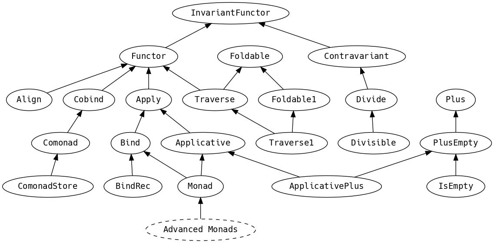

{width=100%}
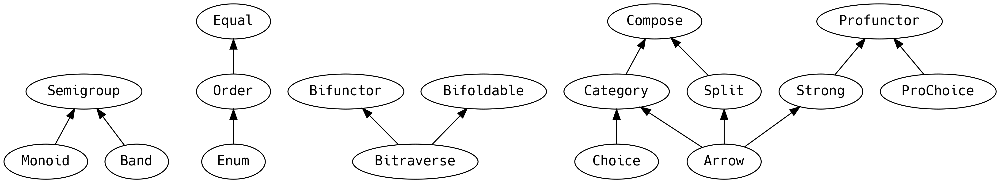

{width=80%}
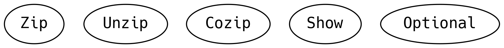

## Appendable Things

{width=25%}
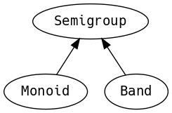

{lang="text"}
~~~~~~~~
  @typeclass trait Semigroup[A] {
    @op("|+|") def append(x: A, y: =>A): A
  
    def multiply1(value: F, n: Int): F = ...
  }
  
  @typeclass trait Monoid[A] extends Semigroup[A] {
    def zero: A
  
    def multiply(value: F, n: Int): F =
      if (n <= 0) zero else multiply1(value, n - 1)
  }
  
  @typeclass trait Band[A] extends Semigroup[A]
~~~~~~~~

A> `|+|` is known as the TIE Fighter operator. There is an Advanced TIE
A> Fighter in an upcoming section, which is very exciting.

A `Semigroup` should exist for a type if two elements can be combined
to produce another element of the same type. The operation must be
*associative*, meaning that the order of nested operations should not
matter, i.e.

{lang="text"}
~~~~~~~~
  (a |+| b) |+| c == a |+| (b |+| c)
  
  (1 |+| 2) |+| 3 == 1 |+| (2 |+| 3)
~~~~~~~~

A `Monoid` is a `Semigroup` with a *zero* element (also called *empty*
or *identity*). Combining `zero` with any other `a` should give `a`.

{lang="text"}
~~~~~~~~
  a |+| zero == a
  
  a |+| 0 == a
~~~~~~~~

This is probably bringing back memories of `Numeric` from Chapter 4,
which tried to do too much and was unusable beyond the most basic of
number types. There are implementations of `Monoid` for all the
primitive numbers, but the concept of *appendable* things is useful
beyond numbers.

{lang="text"}
~~~~~~~~
  scala> "hello" |+| " " |+| "world!"
  res: String = "hello world!"
  
  scala> List(1, 2) |+| List(3, 4)
  res: List[Int] = List(1, 2, 3, 4)
~~~~~~~~

`Band` has the law that the `append` operation of the same two
elements is *idempotent*, i.e. gives the same value. Examples are
anything that can only be one value, such as `Unit`, least upper
bounds, or a `Set`. `Band` provides no further methods yet users can
make use of the guarantees for performance optimisation.

A> Viktor Klang, of Lightbend fame, lays claim to the phrase
A> [effectively-once delivery](https://twitter.com/viktorklang/status/789036133434978304) for message processing with idempotent
A> operations, i.e. `Band.append`.

As a realistic example for `Monoid`, consider a trading system that
has a large database of reusable trade templates. Creating the default
values for a new trade involves selecting and combining templates with
a "last rule wins" merge policy (e.g. if templates have a value for
the same field).

We'll create a simple template schema to demonstrate the principle,
but keep in mind that a realistic system would have a more complicated
ADT.

{lang="text"}
~~~~~~~~
  sealed abstract class Currency
  case object EUR extends Currency
  case object USD extends Currency
  
  final case class TradeTemplate(
    payments: List[java.time.LocalDate],
    ccy: Option[Currency],
    otc: Option[Boolean]
  )
~~~~~~~~

If we write a method that takes `templates: List[TradeTemplate]`, we
only need to call

{lang="text"}
~~~~~~~~
  val zero = Monoid[TradeTemplate].zero
  templates.foldLeft(zero)(_ |+| _)
~~~~~~~~

and our job is done!

But to get `zero` or call `|+|` we must have an instance of
`Monoid[TradeTemplate]`. Although we will generically derive this in a
later chapter, for now we'll create an instance on the companion:

{lang="text"}
~~~~~~~~
  object TradeTemplate {
    implicit val monoid: Monoid[TradeTemplate] = Monoid.instance(
      (a, b) => TradeTemplate(a.payments |+| b.payments,
                              a.ccy |+| b.ccy,
                              a.otc |+| b.otc),
      TradeTemplate(Nil, None, None)
    )
  }
~~~~~~~~

However, this doesn't do what we want because `Monoid[Option[A]]` will append
its contents, e.g.

{lang="text"}
~~~~~~~~
  scala> Option(2) |+| None
  res: Option[Int] = Some(2)
  scala> Option(2) |+| Option(1)
  res: Option[Int] = Some(3)
~~~~~~~~

whereas we want "last rule wins". We can override the default
`Monoid[Option[A]]` with our own:

{lang="text"}
~~~~~~~~
  implicit def lastWins[A]: Monoid[Option[A]] = Monoid.instance(
    {
      case (None, None)   => None
      case (only, None)   => only
      case (None, only)   => only
      case (_   , winner) => winner
    },
    None
  )
~~~~~~~~

Now everything compiles, let's try it out...

{lang="text"}
~~~~~~~~
  scala> import java.time.{LocalDate => LD}
  scala> val templates = List(
           TradeTemplate(Nil,                     None,      None),
           TradeTemplate(Nil,                     Some(EUR), None),
           TradeTemplate(List(LD.of(2017, 8, 5)), Some(USD), None),
           TradeTemplate(List(LD.of(2017, 9, 5)), None,      Some(true)),
           TradeTemplate(Nil,                     None,      Some(false))
         )
  
  scala> templates.foldLeft(zero)(_ |+| _)
  res: TradeTemplate = TradeTemplate(
                         List(2017-08-05,2017-09-05),
                         Some(USD),
                         Some(false))
~~~~~~~~

All we needed to do was implement one piece of business logic and
`Monoid` took care of everything else for us!

Note that the list of `payments` are concatenated. This is because the
default `Monoid[List]` uses concatenation of elements and happens to
be the desired behaviour. If the business requirement was different,
it would be a simple case of providing a custom
`Monoid[List[LocalDate]]`. Recall from Chapter 4 that with compiletime
polymorphism we can have a different implementation of `append`
depending on the `E` in `List[E]`, not just the base runtime class
`List`.

A> When we introduced typeclasses in Chapter 4 we said that there can only be one
A> implementation of a typeclass for a given type parameter, e.g. there is only one
A> `Monoid[Option[Boolean]]` in the application. *Orphan instances* such as
A> `lastWins` are the easiest way to break coherence.
A> 
A> We could try to justify locally breaking typeclass coherence by making
A> `lastWins` private, but when we get to the `Plus` typeclass we will see a better
A> way to implement our `Monoid`. When we get to tagged types, we will see an even
A> better way: using `LastOption` instead of `Option` in our data model.
A> 
A> Please don't break typeclass coherence at home, kids.

## Objecty Things

In the chapter on Data and Functionality we said that the JVM's notion
of equality breaks down for many things that we can put into an ADT.
The problem is that the JVM was designed for Java, and `equals` is
defined on `java.lang.Object` whether it makes sense or not. There is
no way to remove `equals` and no way to guarantee that it is
implemented.

However, in FP we prefer typeclasses for polymorphic functionality and
even concepts as simple equality are captured at compiletime.

{width=20%}
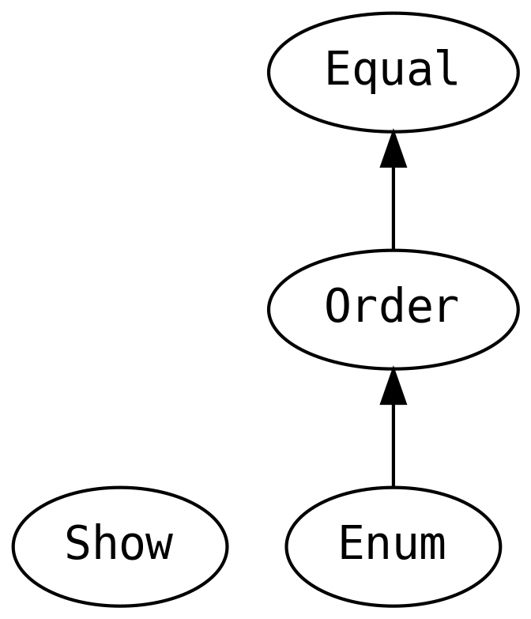

{lang="text"}
~~~~~~~~
  @typeclass trait Equal[F]  {
    @op("===") def equal(a1: F, a2: F): Boolean
    @op("/==") def notEqual(a1: F, a2: F): Boolean = !equal(a1, a2)
  }
~~~~~~~~

Indeed `===` (*triple equals*) is more typesafe than `==` (*double
equals*) because it can only be compiled when the types are the same
on both sides of the comparison. You'd be surprised how many bugs this
catches.

`equal` has the same implementation requirements as `Object.equals`

-   *commutative* `f1 === f2` implies `f2 === f1`
-   *reflexive* `f === f`
-   *transitive* `f1 === f2 && f2 === f3` implies `f1 === f3`

By throwing away the universal concept of `Object.equals` we don't
take equality for granted when we construct an ADT, stopping us at
compiletime from expecting equality when there is none.

Continuing the trend of replacing old Java concepts, rather than data
*being a* `java.lang.Comparable`, they now *have an* `Order` according
to:

{lang="text"}
~~~~~~~~
  @typeclass trait Order[F] extends Equal[F] {
    @op("?|?") def order(x: F, y: F): Ordering
  
    override  def equal(x: F, y: F): Boolean = order(x, y) == Ordering.EQ
    @op("<" ) def lt(x: F, y: F): Boolean = ...
    @op("<=") def lte(x: F, y: F): Boolean = ...
    @op(">" ) def gt(x: F, y: F): Boolean = ...
    @op(">=") def gte(x: F, y: F): Boolean = ...
  
    def max(x: F, y: F): F = ...
    def min(x: F, y: F): F = ...
    def sort(x: F, y: F): (F, F) = ...
  }
  
  sealed abstract class Ordering
  object Ordering {
    case object LT extends Ordering
    case object EQ extends Ordering
    case object GT extends Ordering
  }
~~~~~~~~

`Order` implements `.equal` in terms of the new primitive `.order`. When a
typeclass implements a parent's *primitive combinator* with a *derived
combinator*, an **implied law of substitution** for the typeclass is added. If an
instance of `Order` were to override `.equal` for performance reasons, it must
behave identically the same as the original.

Things that have an order may also be discrete, allowing us to walk
successors and predecessors:

{lang="text"}
~~~~~~~~
  @typeclass trait Enum[F] extends Order[F] {
    def succ(a: F): F
    def pred(a: F): F
    def min: Option[F]
    def max: Option[F]
  
    @op("-+-") def succn(n: Int, a: F): F = ...
    @op("---") def predn(n: Int, a: F): F = ...
  
    @op("|->" ) def fromToL(from: F, to: F): List[F] = ...
    @op("|-->") def fromStepToL(from: F, step: Int, to: F): List[F] = ...
    @op("|=>" ) def fromToL(from: F, to: F): EphemeralStream[F] = ...
    @op("|==>") def fromStepToL(from: F, step: Int, to: F): EphemeralStream[F] = ...
  }
~~~~~~~~

{lang="text"}
~~~~~~~~
  scala> 10 |--> (2, 20)
  res: List[Int] = List(10, 12, 14, 16, 18, 20)
  
  scala> 'm' |-> 'u'
  res: List[Char] = List(m, n, o, p, q, r, s, t, u)
~~~~~~~~

A> `|==>` is scalaz's Lightsaber. This is the syntax of a Functional
A> Programmer. Not as clumsy or random as `fromStepToL`. An elegant
A> syntax... for a more civilised age.

We'll discuss `EphemeralStream` in the next chapter, for now you just
need to know that it is a potentially infinite data structure that
avoids memory retention problems in the stdlib `Stream`.

Similarly to `Object.equals`, the concept of a `.toString` on every
`class` does not make sense in Java. We would like to enforce
stringyness at compiletime and this is exactly what `Show` achieves:

{lang="text"}
~~~~~~~~
  trait Show[F] {
    def show(f: F): Cord = ...
    def shows(f: F): String = ...
  }
~~~~~~~~

We'll explore `Cord` in more detail in the chapter on data types, you
need only know that it is an efficient data structure for storing and
manipulating `String`.

Unfortunately, due to Scala's default implicit conversions in
`Predef`, and language level support for `toString` in interpolated
strings, it can be incredibly hard to remember to use `shows` instead
of `toString`.

## Mappable Things

We're focusing on things that can be mapped over, or traversed, in
some sense:

{width=100%}
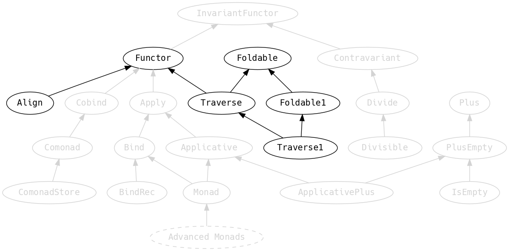

### Functor

{lang="text"}
~~~~~~~~
  @typeclass trait Functor[F[_]] {
    def map[A, B](fa: F[A])(f: A => B): F[B]
  
    def void[A](fa: F[A]): F[Unit] = map(fa)(_ => ())
    def fproduct[A, B](fa: F[A])(f: A => B): F[(A, B)] = map(fa)(a => (a, f(a)))
  
    def fpair[A](fa: F[A]): F[(A, A)] = map(fa)(a => (a, a))
    def strengthL[A, B](a: A, f: F[B]): F[(A, B)] = map(f)(b => (a, b))
    def strengthR[A, B](f: F[A], b: B): F[(A, B)] = map(f)(a => (a, b))
  
    def lift[A, B](f: A => B): F[A] => F[B] = map(_)(f)
    def mapply[A, B](a: A)(f: F[A => B]): F[B] = map(f)((ff: A => B) => ff(a))
  }
~~~~~~~~

The only abstract method is `map`, and it must *compose*, i.e. mapping
with `f` and then again with `g` is the same as mapping once with the
composition of `f` and `g`:

{lang="text"}
~~~~~~~~
  fa.map(f).map(g) == fa.map(f.andThen(g))
~~~~~~~~

The `map` should also perform a no-op if the provided function is
`identity` (i.e. `x => x`)

{lang="text"}
~~~~~~~~
  fa.map(identity) == fa
  
  fa.map(x => x) == fa
~~~~~~~~

`Functor` defines some convenience methods around `map` that can be
optimised by specific instances. The documentation has been
intentionally omitted in the above definitions to encourage you to
guess what a method does before looking at the implementation. Please
spend a moment studying only the type signature of the following
before reading further:

{lang="text"}
~~~~~~~~
  def void[A](fa: F[A]): F[Unit]
  def fproduct[A, B](fa: F[A])(f: A => B): F[(A, B)]
  
  def fpair[A](fa: F[A]): F[(A, A)]
  def strengthL[A, B](a: A, f: F[B]): F[(A, B)]
  def strengthR[A, B](f: F[A], b: B): F[(A, B)]
  
  // harder
  def lift[A, B](f: A => B): F[A] => F[B]
  def mapply[A, B](a: A)(f: F[A => B]): F[B]
~~~~~~~~

1.  `void` takes an instance of the `F[A]` and always returns an
    `F[Unit]`, it forgets all the values whilst preserving the
    structure.
2.  `fproduct` takes the same input as `map` but returns `F[(A, B)]`,
    i.e. it tuples the contents with the result of applying the
    function. This is useful when we wish to retain the input.
3.  `fpair` twins all the elements of `A` into a tuple `F[(A, A)]`
4.  `strengthL` pairs the contents of an `F[B]` with a constant `A` on
    the left.
5.  `strengthR` pairs the contents of an `F[A]` with a constant `B` on
    the right.
6.  `lift` takes a function `A => B` and returns a `F[A] => F[B]`. In
    other words, it takes a function over the contents of an `F[A]` and
    returns a function that operates **on** the `F[A]` directly.
7.  `mapply` is a mind bender. Say you have an `F[_]` of functions `A
       => B` and a value `A`, then you can get an `F[B]`. It has a similar
    signature to `pure` but requires the caller to provide the `F[A =>
       B]`.

`fpair`, `strengthL` and `strengthR` look pretty useless, but they are
useful when we wish to retain some information that would otherwise be
lost to scope.

`Functor` has some special syntax:

{lang="text"}
~~~~~~~~
  implicit class FunctorOps[F[_]: Functor, A](self: F[A]) {
    def as[B](b: =>B): F[B] = Functor[F].map(self)(_ => b)
    def >|[B](b: =>B): F[B] = as(b)
  }
~~~~~~~~

`as` and `>|` are a way of replacing the output with a constant.

In our example application, as a nasty hack (which we didn't even
admit to until now), we defined `start` and `stop` to return their
input:

{lang="text"}
~~~~~~~~
  def start(node: MachineNode): F[MachineNode]
  def stop (node: MachineNode): F[MachineNode]
~~~~~~~~

This allowed us to write terse business logic such as

{lang="text"}
~~~~~~~~
  for {
    _      <- m.start(node)
    update = world.copy(pending = Map(node -> world.time))
  } yield update
~~~~~~~~

and

{lang="text"}
~~~~~~~~
  for {
    stopped <- nodes.traverse(m.stop)
    updates = stopped.map(_ -> world.time).toList.toMap
    update  = world.copy(pending = world.pending ++ updates)
  } yield update
~~~~~~~~

But this hack pushes unnecessary complexity into the implementations. It is
better if we let our algebras return `F[Unit]` and use `as`:

{lang="text"}
~~~~~~~~
  m.start(node) as world.copy(pending = Map(node -> world.time))
~~~~~~~~

and

{lang="text"}
~~~~~~~~
  for {
    stopped <- nodes.traverse(a => m.stop(a) as a)
    updates = stopped.map(_ -> world.time).toList.toMap
    update  = world.copy(pending = world.pending ++ updates)
  } yield update
~~~~~~~~

As a bonus, we are now using the less powerful `Functor` instead of
`Monad` when starting a node.

### Foldable

Technically, `Foldable` is for data structures that can be walked to
produce a summary value. However, this undersells the fact that it is
a one-typeclass army that can provide most of what you'd expect to see
in a Collections API.

There are so many methods we are going to have to split them out,
beginning with the abstract methods:

{lang="text"}
~~~~~~~~
  @typeclass trait Foldable[F[_]] {
    def foldMap[A, B: Monoid](fa: F[A])(f: A => B): B
    def foldRight[A, B](fa: F[A], z: =>B)(f: (A, =>B) => B): B
    def foldLeft[A, B](fa: F[A], z: B)(f: (B, A) => B): B = ...
~~~~~~~~

An instance of `Foldable` need only implement `foldMap` and
`foldRight` to get all of the functionality in this typeclass,
although methods are typically optimised for specific data structures.

You might recognise `foldMap` by its marketing buzzword name, **MapReduce**. Given
an `F[A]`, a function from `A` to `B`, and a way to combine `B` (provided by the
`Monoid`, along with a zero `B`), we can produce a summary value of type `B`.
There is no enforced operation order, allowing for parallel computation.

`foldRight` does not require its parameters to have a `Monoid`,
meaning that it needs a starting value `z` and a way to combine each
element of the data structure with the summary value. The order for
traversing the elements is from right to left and therefore it cannot
be parallelised.

A> `foldRight` is conceptually the same as the `foldRight` in the Scala
A> stdlib. However, there is a problem with the stdlib `foldRight`
A> signature, solved in scalaz: very large data structures can stack
A> overflow. `List.foldRight` cheats by implementing `foldRight` as a
A> reversed `foldLeft`
A> 
A> {lang="text"}
A> ~~~~~~~~
A>   override def foldRight[B](z: B)(op: (A, B) => B): B =
A>     reverse.foldLeft(z)((right, left) => op(left, right))
A> ~~~~~~~~
A> 
A> but the concept of reversing is not universal and this workaround
A> cannot be used for all data structures. Let's say we want to find
A> out if there is a small number in a `Stream`, with an early exit:
A> 
A> {lang="text"}
A> ~~~~~~~~
A>   scala> def isSmall(i: Int): Boolean = i < 10
A>   scala> (1 until 100000).toStream.foldRight(false) {
A>            (el, acc) => isSmall(el) || acc
A>          }
A>   java.lang.StackOverflowError
A>     at scala.collection.Iterator.toStream(Iterator.scala:1403)
A>     ...
A> ~~~~~~~~
A> 
A> Scalaz solves the problem by taking a *byname* parameter for the
A> aggregate value
A> 
A> {lang="text"}
A> ~~~~~~~~
A>   scala> (1 |=> 100000).foldRight(false)(el => acc => isSmall(el) || acc )
A>   res: Boolean = true
A> ~~~~~~~~
A> 
A> which means that the `acc` is not evaluated unless it is needed.
A> 
A> It is worth baring in mind that not all operations are stack safe in
A> `foldRight`. If we were to require evaluation of all elements, we can
A> also get a `StackOverflowError` with scalaz's `EphemeralStream`
A> 
A> {lang="text"}
A> ~~~~~~~~
A>   scala> (1L |=> 100000L).foldRight(0L)(el => acc => el |+| acc )
A>   java.lang.StackOverflowError
A>     at scalaz.Foldable.$anonfun$foldr$1(Foldable.scala:100)
A>     ...
A> ~~~~~~~~

`foldLeft` traverses elements from left to right. `foldLeft` can be
implemented in terms of `foldMap`, but most instances choose to
implement it because it is such a basic operation. Since it is usually
implemented with tail recursion, there are no *byname* parameters.

The only law for `Foldable` is that `foldLeft` and `foldRight` should
each be consistent with `foldMap` for monoidal operations. e.g.
appending an element to a list for `foldLeft` and prepending an
element to a list for `foldRight`. However, `foldLeft` and `foldRight`
do not need to be consistent with each other: in fact they often
produce the reverse of each other.

The simplest thing to do with `foldMap` is to use the `identity`
function, giving `fold` (the natural sum of the monoidal elements),
with left/right variants to allow choosing based on performance
criteria:

{lang="text"}
~~~~~~~~
  def fold[A: Monoid](t: F[A]): A = ...
  def sumr[A: Monoid](fa: F[A]): A = ...
  def suml[A: Monoid](fa: F[A]): A = ...
~~~~~~~~

Recall that when we learnt about `Monoid`, we wrote this:

{lang="text"}
~~~~~~~~
  scala> templates.foldLeft(Monoid[TradeTemplate].zero)(_ |+| _)
~~~~~~~~

We now know this is silly and we should have written:

{lang="text"}
~~~~~~~~
  scala> templates.toIList.fold
  res: TradeTemplate = TradeTemplate(
                         List(2017-08-05,2017-09-05),
                         Some(USD),
                         Some(false))
~~~~~~~~

`.fold` doesn't work on stdlib `List` because it already has a method
called `fold` that does it is own thing in its own special way.

The strangely named `intercalate` inserts a specific `A` between each
element before performing the `fold`

{lang="text"}
~~~~~~~~
  def intercalate[A: Monoid](fa: F[A], a: A): A = ...
~~~~~~~~

which is a generalised version of the stdlib's `mkString`:

{lang="text"}
~~~~~~~~
  scala> List("foo", "bar").intercalate(",")
  res: String = "foo,bar"
~~~~~~~~

The `foldLeft` provides the means to obtain any element by traversal
index, including a bunch of other related methods:

{lang="text"}
~~~~~~~~
  def index[A](fa: F[A], i: Int): Option[A] = ...
  def indexOr[A](fa: F[A], default: =>A, i: Int): A = ...
  def length[A](fa: F[A]): Int = ...
  def count[A](fa: F[A]): Int = length(fa)
  def empty[A](fa: F[A]): Boolean = ...
  def element[A: Equal](fa: F[A], a: A): Boolean = ...
~~~~~~~~

Scalaz is a pure library of only *total functions*, whereas the stdlib `.apply`
returns `A` and can throw an exception, `Foldable.index` returns an `Option[A]`
with the convenient `.indexOr` returning an `A` when a default value is
provided. `.element` is similar to the stdlib `.contains` but uses `Equal`
rather than ill-defined JVM equality.

These methods *really* sound like a collections API. And, of course,
anything with a `Foldable` can be converted into a `List`

{lang="text"}
~~~~~~~~
  def toList[A](fa: F[A]): List[A] = ...
~~~~~~~~

There are also conversions to other stdlib and scalaz data types such
as `.toSet`, `.toVector`, `.toStream`, `.to[T <: TraversableLike]`,
`.toIList` and so on.

There are useful predicate checks

{lang="text"}
~~~~~~~~
  def filterLength[A](fa: F[A])(f: A => Boolean): Int = ...
  def all[A](fa: F[A])(p: A => Boolean): Boolean = ...
  def any[A](fa: F[A])(p: A => Boolean): Boolean = ...
~~~~~~~~

`filterLength` is a way of counting how many elements are `true` for a
predicate, `all` and `any` return `true` if all (or any) element meets
the predicate, and may exit early.

A> We've seen the `NonEmptyList` in previous chapters. For the sake of
A> brevity we use a type alias `Nel` in place of `NonEmptyList`.
A> 
A> We've also seen `IList` in previous chapters, recall that it is an
A> alternative to stdlib `List` with impure methods, like `apply`,
A> removed.

We can split an `F[A]` into parts that result in the same `B` with
`splitBy`

{lang="text"}
~~~~~~~~
  def splitBy[A, B: Equal](fa: F[A])(f: A => B): IList[(B, Nel[A])] = ...
  def splitByRelation[A](fa: F[A])(r: (A, A) => Boolean): IList[Nel[A]] = ...
  def splitWith[A](fa: F[A])(p: A => Boolean): List[Nel[A]] = ...
  def selectSplit[A](fa: F[A])(p: A => Boolean): List[Nel[A]] = ...
  
  def findLeft[A](fa: F[A])(f: A => Boolean): Option[A] = ...
  def findRight[A](fa: F[A])(f: A => Boolean): Option[A] = ...
~~~~~~~~

for example

{lang="text"}
~~~~~~~~
  scala> IList("foo", "bar", "bar", "faz", "gaz", "baz").splitBy(_.charAt(0))
  res = [(f, [foo]), (b, [bar, bar]), (f, [faz]), (g, [gaz]), (b, [baz])]
~~~~~~~~

noting that there are two parts indexed by `f`.

`splitByRelation` avoids the need for an `Equal` but we must provide
the comparison operator.

`splitWith` splits the elements into groups that alternatively satisfy
and don't satisfy the predicate. `selectSplit` selects groups of
elements that satisfy the predicate, discarding others. This is one of
those rare occasions when two methods share the same type signature
but have different meanings.

`findLeft` and `findRight` are for extracting the first element (from
the left, or right, respectively) that matches a predicate.

Making further use of `Equal` and `Order`, we have the `distinct`
methods which return groupings.

{lang="text"}
~~~~~~~~
  def distinct[A: Order](fa: F[A]): IList[A] = ...
  def distinctE[A: Equal](fa: F[A]): IList[A] = ...
  def distinctBy[A, B: Equal](fa: F[A])(f: A => B): IList[A] =
~~~~~~~~

`distinct` is implemented more efficiently than `distinctE` because it
can make use of ordering and therefore use a quicksort-esque algorithm
that is much faster than the stdlib's naive `List.distinct`. Data
structures (such as sets) can implement `distinct` in their `Foldable`
without doing any work.

`distinctBy` allows grouping by the result of applying a function to
the elements. For example, grouping names by their first letter.

We can make further use of `Order` by extracting the minimum or
maximum element (or both extrema) including variations using the `Of`
or `By` pattern to first map to another type or to use a different
type to do the order comparison.

{lang="text"}
~~~~~~~~
  def maximum[A: Order](fa: F[A]): Option[A] = ...
  def maximumOf[A, B: Order](fa: F[A])(f: A => B): Option[B] = ...
  def maximumBy[A, B: Order](fa: F[A])(f: A => B): Option[A] = ...
  
  def minimum[A: Order](fa: F[A]): Option[A] = ...
  def minimumOf[A, B: Order](fa: F[A])(f: A => B): Option[B] = ...
  def minimumBy[A, B: Order](fa: F[A])(f: A => B): Option[A] = ...
  
  def extrema[A: Order](fa: F[A]): Option[(A, A)] = ...
  def extremaOf[A, B: Order](fa: F[A])(f: A => B): Option[(B, B)] = ...
  def extremaBy[A, B: Order](fa: F[A])(f: A => B): Option[(A, A)] =
~~~~~~~~

For example we can ask which `String` is maximum `By` length, or what
is the maximum length `Of` the elements.

{lang="text"}
~~~~~~~~
  scala> List("foo", "fazz").maximumBy(_.length)
  res: Option[String] = Some(fazz)
  
  scala> List("foo", "fazz").maximumOf(_.length)
  res: Option[Int] = Some(4)
~~~~~~~~

This concludes the key features of `Foldable`. You are forgiven for
already forgetting all the methods you've just seen: the key takeaway
is that anything you'd expect to find in a collection library is
probably on `Foldable` and if it isn't already, it [probably should be](https://github.com/scalaz/scalaz/issues/1448).

We'll conclude with some variations of the methods we've already seen.
First there are methods that take a `Semigroup` instead of a `Monoid`:

{lang="text"}
~~~~~~~~
  def fold1Opt[A: Semigroup](fa: F[A]): Option[A] = ...
  def foldMap1Opt[A, B: Semigroup](fa: F[A])(f: A => B): Option[B] = ...
  def sumr1Opt[A: Semigroup](fa: F[A]): Option[A] = ...
  def suml1Opt[A: Semigroup](fa: F[A]): Option[A] = ...
  ...
~~~~~~~~

returning `Option` to account for empty data structures (recall that
`Semigroup` does not have a `zero`).

A> The methods read "one-Option", not `10 pt` as in typesetting.

The typeclass `Foldable1` contains a lot more `Semigroup` variants of
the `Monoid` methods shown here (all suffixed `1`) and makes sense for
data structures which are never empty, without requiring a `Monoid` on
the elements.

Very importantly, there are variants that take monadic return values.
We already used `foldLeftM` when we first wrote the business logic of
our application, now you know that `Foldable` is where it came from:

{lang="text"}
~~~~~~~~
  def foldLeftM[G[_]: Monad, A, B](fa: F[A], z: B)(f: (B, A) => G[B]): G[B] = ...
  def foldRightM[G[_]: Monad, A, B](fa: F[A], z: =>B)(f: (A, =>B) => G[B]): G[B] = ...
  def foldMapM[G[_]: Monad, A, B: Monoid](fa: F[A])(f: A => G[B]): G[B] = ...
  def findMapM[M[_]: Monad, A, B](fa: F[A])(f: A => M[Option[B]]): M[Option[B]] = ...
  def allM[G[_]: Monad, A](fa: F[A])(p: A => G[Boolean]): G[Boolean] = ...
  def anyM[G[_]: Monad, A](fa: F[A])(p: A => G[Boolean]): G[Boolean] = ...
  ...
~~~~~~~~

You may also see Curried versions, e.g.

{lang="text"}
~~~~~~~~
  def foldl[A, B](fa: F[A], z: B)(f: B => A => B): B = ...
  def foldr[A, B](fa: F[A], z: =>B)(f: A => (=> B) => B): B = ...
  ...
~~~~~~~~

### Traverse

`Traverse` is what happens when you cross a `Functor` with a `Foldable`

{lang="text"}
~~~~~~~~
  trait Traverse[F[_]] extends Functor[F] with Foldable[F] {
    def traverse[G[_]: Applicative, A, B](fa: F[A])(f: A => G[B]): G[F[B]]
    def sequence[G[_]: Applicative, A](fga: F[G[A]]): G[F[A]] = ...
  
    def reverse[A](fa: F[A]): F[A] = ...
  
    def zipL[A, B](fa: F[A], fb: F[B]): F[(A, Option[B])] = ...
    def zipR[A, B](fa: F[A], fb: F[B]): F[(Option[A], B)] = ...
    def indexed[A](fa: F[A]): F[(Int, A)] = ...
    def zipWithL[A, B, C](fa: F[A], fb: F[B])(f: (A, Option[B]) => C): F[C] = ...
    def zipWithR[A, B, C](fa: F[A], fb: F[B])(f: (Option[A], B) => C): F[C] = ...
  
    def mapAccumL[S, A, B](fa: F[A], z: S)(f: (S, A) => (S, B)): (S, F[B]) = ...
    def mapAccumR[S, A, B](fa: F[A], z: S)(f: (S, A) => (S, B)): (S, F[B]) = ...
  }
~~~~~~~~

At the beginning of the chapter we showed the importance of `traverse`
and `sequence` for swapping around type constructors to fit a
requirement (e.g. `List[Future[_]]` to `Future[List[_]]`). You will
use these methods more than you could possibly imagine.

In `Foldable` we weren't able to assume that `reverse` was a universal
concept, but now we can reverse a thing.

We can also `zip` together two things that have a `Traverse`, getting
back `None` when one side runs out of elements, using `zipL` or `zipR`
to decide which side to truncate when the lengths don't match. A
special case of `zip` is to add an index to every entry with
`indexed`.

`zipWithL` and `zipWithR` allow combining the two sides of a `zip`
into a new type, and then returning just an `F[C]`.

`mapAccumL` and `mapAccumR` are regular `map` combined with an
accumulator. If you find your old Java sins are making you want to
reach for a `var`, and refer to it from a `map`, you want `mapAccumL`.

For example, let's say we have a list of words and we want to blank
out words we've already seen. The filtering algorithm is not allowed
to process the list of words a second time so it can be scaled to an
infinite stream:

{lang="text"}
~~~~~~~~
  scala> val freedom =
  """We campaign for these freedoms because everyone deserves them.
     With these freedoms, the users (both individually and collectively)
     control the program and what it does for them."""
     .split("\\s+")
     .toList
  
  scala> def clean(s: String): String = s.toLowerCase.replaceAll("[,.()]+", "")
  
  scala> freedom
         .mapAccumL(Set.empty[String]) { (seen, word) =>
           val cleaned = clean(word)
           (seen + cleaned, if (seen(cleaned)) "_" else word)
         }
         ._2
         .intercalate(" ")
  
  res: String =
  """We campaign for these freedoms because everyone deserves them.
     With _ _ the users (both individually and collectively)
     control _ program _ what it does _ _"""
~~~~~~~~

Finally `Traverse1`, like `Foldable1`, provides variants of these
methods for data structures that cannot be empty, accepting the weaker
`Semigroup` instead of a `Monoid`, and an `Apply` instead of an
`Applicative`.

### Align

`Align` is about merging and padding anything with a `Functor`. Before
looking at `Align`, meet the `\&/` data type (spoken as *These*, or
*hurray!*).

{lang="text"}
~~~~~~~~
  sealed abstract class \&/[+A, +B]
  final case class This[A](aa: A) extends (A \&/ Nothing)
  final case class That[B](bb: B) extends (Nothing \&/ B)
  final case class Both[A, B](aa: A, bb: B) extends (A \&/ B)
~~~~~~~~

i.e. it is a data encoding of inclusive logical `OR`.

{lang="text"}
~~~~~~~~
  @typeclass trait Align[F[_]] extends Functor[F] {
    def alignWith[A, B, C](f: A \&/ B => C): (F[A], F[B]) => F[C]
    def align[A, B](a: F[A], b: F[B]): F[A \&/ B] = ...
  
    def merge[A: Semigroup](a1: F[A], a2: F[A]): F[A] = ...
  
    def pad[A, B]: (F[A], F[B]) => F[(Option[A], Option[B])] = ...
    def padWith[A, B, C](f: (Option[A], Option[B]) => C): (F[A], F[B]) => F[C] = ...
~~~~~~~~

Hopefully by this point you are becoming more capable of reading type
signatures to understand the purpose of a method.

`alignWith` takes a function from either an `A` or a `B` (or both) to
a `C` and returns a lifted function from a tuple of `F[A]` and `F[B]`
to an `F[C]`. `align` constructs a `\&/` out of two `F[_]`.

`merge` allows us to combine two `F[A]` when `A` has a `Semigroup`. For example,
the implementation of `Semigroup[Map[K, V]]` defers to `Semigroup[V]`, combining
two entries results in combining their values, having the consequence that
`Map[K, List[A]]` behaves like a multimap:

{lang="text"}
~~~~~~~~
  scala> Map("foo" -> List(1)) merge Map("foo" -> List(1), "bar" -> List(2))
  res = Map(foo -> List(1, 1), bar -> List(2))
~~~~~~~~

and a `Map[K, Int]` simply tally their contents when merging:

{lang="text"}
~~~~~~~~
  scala> Map("foo" -> 1) merge Map("foo" -> 1, "bar" -> 2)
  res = Map(foo -> 2, bar -> 2)
~~~~~~~~

`.pad` and `.padWith` are for partially merging two data structures that might
be missing values on one side. For example if we wanted to aggregate independent
votes and retain the knowledge of where the votes came from

{lang="text"}
~~~~~~~~
  scala> Map("foo" -> 1) pad Map("foo" -> 1, "bar" -> 2)
  res = Map(foo -> (Some(1),Some(1)), bar -> (None,Some(2)))
  
  scala> Map("foo" -> 1, "bar" -> 2) pad Map("foo" -> 1)
  res = Map(foo -> (Some(1),Some(1)), bar -> (Some(2),None))
~~~~~~~~

There are convenient variants of `align` that make use of the
structure of `\&/`

{lang="text"}
~~~~~~~~
  ...
    def alignSwap[A, B](a: F[A], b: F[B]): F[B \&/ A] = ...
    def alignA[A, B](a: F[A], b: F[B]): F[Option[A]] = ...
    def alignB[A, B](a: F[A], b: F[B]): F[Option[B]] = ...
    def alignThis[A, B](a: F[A], b: F[B]): F[Option[A]] = ...
    def alignThat[A, B](a: F[A], b: F[B]): F[Option[B]] = ...
    def alignBoth[A, B](a: F[A], b: F[B]): F[Option[(A, B)]] = ...
  }
~~~~~~~~

which should make sense from their type signatures. Examples:

{lang="text"}
~~~~~~~~
  scala> List(1,2,3) alignSwap List(4,5)
  res = List(Both(4,1), Both(5,2), That(3))
  
  scala> List(1,2,3) alignA List(4,5)
  res = List(Some(1), Some(2), Some(3))
  
  scala> List(1,2,3) alignB List(4,5)
  res = List(Some(4), Some(5), None)
  
  scala> List(1,2,3) alignThis List(4,5)
  res = List(None, None, Some(3))
  
  scala> List(1,2,3) alignThat List(4,5)
  res = List(None, None, None)
  
  scala> List(1,2,3) alignBoth List(4,5)
  res = List(Some((1,4)), Some((2,5)), None)
~~~~~~~~

Note that the `A` and `B` variants use inclusive `OR`, whereas the
`This` and `That` variants are exclusive, returning `None` if there is
a value in both sides, or no value on either side.

## Variance

We must return to `Functor` for a moment and discuss an ancestor that
we previously ignored:

{width=100%}
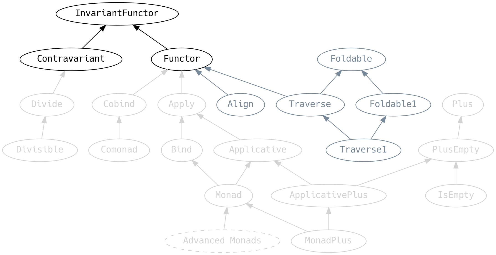

`InvariantFunctor`, also known as the *exponential functor*, has a
method `xmap` which says that given a function from `A` to `B`, and a
function from `B` to `A`, then we can convert `F[A]` to `F[B]`.

`Functor` is a short name for what should be *covariant functor*. But
since `Functor` is so popular it gets the nickname. Likewise
`Contravariant` should really be *contravariant functor*.

`Functor` implements `xmap` with `map` and ignores the function from
`B` to `A`. `Contravariant`, on the other hand, implements `xmap` with
`contramap` and ignores the function from `A` to `B`:

{lang="text"}
~~~~~~~~
  @typeclass trait InvariantFunctor[F[_]] {
    def xmap[A, B](fa: F[A], f: A => B, g: B => A): F[B]
    ...
  }
  
  @typeclass trait Functor[F[_]] extends InvariantFunctor[F] {
    def map[A, B](fa: F[A])(f: A => B): F[B]
    def xmap[A, B](fa: F[A], f: A => B, g: B => A): F[B] = map(fa)(f)
    ...
  }
  
  @typeclass trait Contravariant[F[_]] extends InvariantFunctor[F] {
    def contramap[A, B](fa: F[A])(f: B => A): F[B]
    def xmap[A, B](fa: F[A], f: A => B, g: B => A): F[B] = contramap(fa)(g)
    ...
  }
~~~~~~~~

It is important to note that, although related at a theoretical level,
the words *covariant*, *contravariant* and *invariant* do not directly
refer to Scala type variance (i.e. `+` and `-` prefixes that may be
written in type signatures). *Invariance* here means that it is
possible to map the contents of a structure `F[A]` into `F[B]`. Using
`identity` we can see that `A` can be safely downcast (or upcast) into
`B` depending on the variance of the functor.

This sounds so hopelessly abstract that it needs a practical example
immediately, before we can take it seriously. In Chapter 4 we used
`spray-json-derivation` to derive a JSON encoder for our data types and we gave
a brief description of the `JsonWriter` typeclass. This is an expanded version:

{lang="text"}
~~~~~~~~
  @typeclass trait JsonWriter[A] { self =>
    def toJson(a: A): JsValue
  
    def contramap[B](f: B => A): JsonWriter[B] = new JsonWriter[B] {
      def toJson(b: B): JsValue = self.toJson(f(b))
    }
  }
~~~~~~~~

Now consider the case where we want to write an instance of an `JsonWriter[B]`
in terms of another `JsonWriter[A]`, for example if we have a data type `Alpha`
that simply wraps a `Double`. This is exactly what `contramap` is for:

{lang="text"}
~~~~~~~~
  final case class Alpha(value: Double)
  
  object Alpha {
    implicit val encoder: JsonWriter[Alpha] = JsonWriter[Double].contramap(_.value)
  }
~~~~~~~~

On the other hand, a `JsonReader` typically has a `Functor`:

{lang="text"}
~~~~~~~~
  @typeclass trait JsonReader[A] { self =>
    def fromJson(j: JsValue): A
  
    def map[B](f: A => B): JsonReader[B] = new JsonReader[B] {
      def fromJson(j: JsValue): B = f(self.fromJson(j))
    }
  }
~~~~~~~~

Methods on a typeclass can have their type parameters in
*contravariant position* (method parameters) or in *covariant
position* (return type). If a typeclass has a combination of covariant
and contravariant positions, it might have an *invariant functor*.

Consider what happens if we combine `JsonWriter` and `JsonReader` into one
typeclass. We can no longer construct a `Format` by using `map` or `contramap`
alone, we need `xmap`:

{lang="text"}
~~~~~~~~
  @typeclass trait JsonFormat[A] extends JsonWriter[A] with JsonReader[A] { self =>
    def xmap[B](f: A => B, g: B => A): JsonFormat[B] = new JsonFormat[B] {
      def toJson(b: B): JsValue = self.toJson(g(b))
      def fromJson(j: JsValue): B = f(self.fromJson(j))
    }
  }
~~~~~~~~

A> Although `JsonWriter` implements `contramap`, `JsonReader` implements `map`, and
A> `Format` implements `xmap` we are not saying that these typeclasses extend
A> `InvariantFunctor`, rather they *have an* `InvariantFunctor`.
A> 
A> We could implement instances of
A> 
A> -   `Functor[JsonReader]`
A> -   `Contravariant[JsonWriter]`
A> -   `InvariantFunctor[JsonFormat]`
A> 
A> on our companions, and use scalaz syntax to have the exact same `map`,
A> `contramap` and `xmap`.
A> 
A> However, since we don't need anything else that the invariants provide
A> (and it is a lot of boilerplate for a textbook), we just implement the
A> bare minimum on the typeclasses themselves. The invariant instance
A> [could be generated automatically](https://github.com/mpilquist/simulacrum/issues/85).

One of the most compelling uses for `xmap` is to provide typeclasses
for *value types*. A value type is a compiletime wrapper for another
type, that does not incur any object allocation costs (subject to some
rules of use).

For example we can provide context around some numbers to avoid
getting them mixed up:

{lang="text"}
~~~~~~~~
  final case class Alpha(value: Double) extends AnyVal
  final case class Beta (value: Double) extends AnyVal
  final case class Rho  (value: Double) extends AnyVal
  final case class Nu   (value: Double) extends AnyVal
~~~~~~~~

If we want to put these types in a JSON message, we'd need to write a
custom `Format` for each type, which is tedious. But our `Format`
implements `xmap`, allowing `Format` to be constructed from a simple
pattern:

{lang="text"}
~~~~~~~~
  implicit val double: JsonFormat[Double] = ...
  
  implicit val alpha: JsonFormat[Alpha] = double.xmap(Alpha(_), _.value)
  implicit val beta : JsonFormat[Beta]  = double.xmap(Beta(_) , _.value)
  implicit val rho  : JsonFormat[Rho]   = double.xmap(Rho(_)  , _.value)
  implicit val nu   : JsonFormat[Nu]    = double.xmap(Nu(_)   , _.value)
~~~~~~~~

Macros can automate the construction of these instances, so we don't
need to write them: we'll revisit this later in a dedicated chapter on
Typeclass Derivation.

### Composition

Invariants can be composed via methods with intimidating type
signatures. There are many permutations of `compose` on most
typeclasses, we will not list them all.

{lang="text"}
~~~~~~~~
  @typeclass trait Functor[F[_]] extends InvariantFunctor[F] {
    def compose[G[_]: Functor]: Functor[λ[α => F[G[α]]]] = ...
    def icompose[G[_]: Contravariant]: Contravariant[λ[α => F[G[α]]]] = ...
    ...
  }
  @typeclass trait Contravariant[F[_]] extends InvariantFunctor[F] {
    def compose[G[_]: Contravariant]: Functor[λ[α => F[G[α]]]] = ...
    def icompose[G[_]: Functor]: Contravariant[λ[α => F[G[α]]]] = ...
    ...
  }
~~~~~~~~

The `α =>` type syntax is a `kind-projector` *type lambda* that says if
`Functor[F]` is composed with a type `G[_]` (that has a `Functor[G]`), we get a
`Functor[F[G[_]]]` that operates on the `A` in `F[G[A]]`.

An example of `Functor.compose` is where `F[_]` is `List`, `G[_]` is
`Option`, and we want to be able to map over the `Int` inside a
`List[Option[Int]]` without changing the two structures:

{lang="text"}
~~~~~~~~
  scala> val lo = List(Some(1), None, Some(2))
  scala> Functor[List].compose[Option].map(lo)(_ + 1)
  res: List[Option[Int]] = List(Some(2), None, Some(3))
~~~~~~~~

This lets us jump into nested effects and structures and apply a
function at the layer we want.

## Apply and Bind

Consider this the warm-up act to `Applicative` and `Monad`

{width=100%}
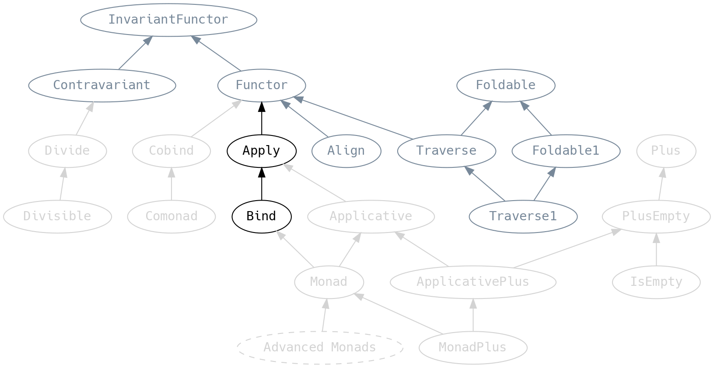

### Apply

`Apply` extends `Functor` by adding a method named `ap` which is
similar to `map` in that it applies a function to values. However,
with `ap`, the function is in a similar context to the values.

{lang="text"}
~~~~~~~~
  @typeclass trait Apply[F[_]] extends Functor[F] {
    @op("<*>") def ap[A, B](fa: =>F[A])(f: =>F[A => B]): F[B]
    ...
~~~~~~~~

A> `<*>` is the Advanced TIE Fighter, as flown by Darth Vader. Appropriate since it
A> looks like an angry parent.

It is worth taking a moment to consider what that means for a simple data
structure like `Option[A]`, having the following implementation of `.ap`

{lang="text"}
~~~~~~~~
  implicit def option[A]: Apply[Option[A]] = new Apply[Option[A]] {
    override def ap[A, B](fa: =>Option[A])(f: =>Option[A => B]) = f match {
      case Some(ff) => fa.map(ff)
      case None    => None
    }
    ...
  }
~~~~~~~~

To implement `.ap`, we must first extract the function `ff: A => B` from `f:
Option[A => B]`, then we can map over `fa`. The extraction of the function from
the context is the important power that `Apply` brings, allowing multiple
function to be combined inside the context.

Returning to `Apply`, we find `.applyX` boilerplate that allows us to combine
parallel functions and then map over their combined output:

{lang="text"}
~~~~~~~~
  @typeclass trait Apply[F[_]] extends Functor[F] {
    ...
    def apply2[A,B,C](fa: =>F[A], fb: =>F[B])(f: (A, B) => C): F[C] = ...
    def apply3[A,B,C,D](fa: =>F[A],fb: =>F[B],fc: =>F[C])(f: (A,B,C) =>D): F[D] = ...
    ...
    def apply12[...]
~~~~~~~~

Read `.apply2` as a contract promising: "if you give me an `F` of `A` and an `F`
of `B`, with a way of combining `A` and `B` into a `C`, then I can give you an
`F` of `C`". There are many uses for this contract and the two most important are:

-   constructing some typeclasses for a product type `C` from its constituents `A`
    and `B`
-   performing *effects* in parallel, like the drone and google algebras we
    created in Chapter 3, and then combining their results.

Indeed, `Apply` is so useful that it has special syntax:

{lang="text"}
~~~~~~~~
  implicit class ApplyOps[F[_]: Apply, A](self: F[A]) {
    def *>[B](fb: F[B]): F[B] = Apply[F].apply2(self,fb)((_,b) => b)
    def <*[B](fb: F[B]): F[A] = Apply[F].apply2(self,fb)((a,_) => a)
    def |@|[B](fb: F[B]): ApplicativeBuilder[F, A, B] = ...
  }
  
  class ApplicativeBuilder[F[_]: Apply, A, B](a: F[A], b: F[B]) {
    def tupled: F[(A, B)] = Apply[F].apply2(a, b)(Tuple2(_))
    def |@|[C](cc: F[C]): ApplicativeBuilder3[C] = ...
  
    sealed abstract class ApplicativeBuilder3[C](c: F[C]) {
      ..ApplicativeBuilder4
        ...
          ..ApplicativeBuilder12
  }
~~~~~~~~

which is exactly what we used in Chapter 3:

{lang="text"}
~~~~~~~~
  (d.getBacklog |@| d.getAgents |@| m.getManaged |@| m.getAlive |@| m.getTime)
~~~~~~~~

A> The `|@|` operator has many names. Some call it the *Cartesian Product
A> Syntax*, others call it the *Cinnamon Bun*, the *Admiral Ackbar* or
A> the *Macaulay Culkin*. We prefer to call it *The Scream* operator,
A> after the Munch painting, because it is also the sound your CPU makes
A> when it is parallelising All The Things.

The syntax `<*` and `*>` (left bird and right bird) offer a convenient way to
ignore the output from one of two parallel effects.

Unfortunately, although the `|@|` syntax is clear, there is a problem
in that a new `ApplicativeBuilder` object is allocated for each
additional effect. If the work is I/O-bound, the memory allocation
cost is insignificant. However, when performing CPU-bound work, use
the alternative *lifting with arity* syntax, which does not produce
any intermediate objects:

{lang="text"}
~~~~~~~~
  def ^[F[_]: Apply,A,B,C](fa: =>F[A],fb: =>F[B])(f: (A,B) =>C): F[C] = ...
  def ^^[F[_]: Apply,A,B,C,D](fa: =>F[A],fb: =>F[B],fc: =>F[C])(f: (A,B,C) =>D): F[D] = ...
  ...
  def ^^^^^^[F[_]: Apply, ...]
~~~~~~~~

used like

{lang="text"}
~~~~~~~~
  ^^^^(d.getBacklog, d.getAgents, m.getManaged, m.getAlive, m.getTime)
~~~~~~~~

or directly call `applyX`

{lang="text"}
~~~~~~~~
  Apply[F].apply5(d.getBacklog, d.getAgents, m.getManaged, m.getAlive, m.getTime)
~~~~~~~~

Despite being of most value for dealing with effects, `Apply` provides
convenient syntax for dealing with data structures. Consider rewriting

{lang="text"}
~~~~~~~~
  for {
    foo <- data.foo: Option[String]
    bar <- data.bar: Option[Int]
  } yield foo + bar.shows
~~~~~~~~

as

{lang="text"}
~~~~~~~~
  (data.foo |@| data.bar)(_ + _.shows) : Option[String]
~~~~~~~~

If we only want the combined output as a tuple, methods exist to do
just that:

{lang="text"}
~~~~~~~~
  @op("tuple") def tuple2[A,B](fa: =>F[A],fb: =>F[B]): F[(A,B)] = ...
  def tuple3[A,B,C](fa: =>F[A],fb: =>F[B],fc: =>F[C]): F[(A,B,C)] = ...
  ...
  def tuple12[...]
~~~~~~~~

{lang="text"}
~~~~~~~~
  (data.foo tuple data.bar) : Option[(String, Int)]
~~~~~~~~

There are also the generalised versions of `ap` for more than two
parameters:

{lang="text"}
~~~~~~~~
  def ap2[A,B,C](fa: =>F[A],fb: =>F[B])(f: F[(A,B) => C]): F[C] = ...
  def ap3[A,B,C,D](fa: =>F[A],fb: =>F[B],fc: =>F[C])(f: F[(A,B,C) => D]): F[D] = ...
  ...
  def ap12[...]
~~~~~~~~

along with `lift` methods that take normal functions and lift them into the
`F[_]` context, the generalisation of `Functor.lift`

{lang="text"}
~~~~~~~~
  def lift2[A,B,C](f: (A,B) => C): (F[A],F[B]) => F[C] = ...
  def lift3[A,B,C,D](f: (A,B,C) => D): (F[A],F[B],F[C]) => F[D] = ...
  ...
  def lift12[...]
~~~~~~~~

and `apF`, a partially applied syntax for `ap`

{lang="text"}
~~~~~~~~
  def apF[A,B](f: =>F[A => B]): F[A] => F[B] = ...
~~~~~~~~

Finally `forever`

{lang="text"}
~~~~~~~~
  def forever[A, B](fa: F[A]): F[B] = ...
~~~~~~~~

repeating an effect without stopping. The instance of `Apply` must be
stack safe or we'll get `StackOverflowError`.

### Bind

`Bind` introduces `bind`, synonymous with `flatMap`, which allows
functions over the result of an effect to return a new effect, or for
functions over the values of a data structure to return new data
structures that are then joined.

{lang="text"}
~~~~~~~~
  @typeclass trait Bind[F[_]] extends Apply[F] {
  
    @op(">>=") def bind[A, B](fa: F[A])(f: A => F[B]): F[B]
    def flatMap[A, B](fa: F[A])(f: A => F[B]): F[B] = bind(fa)(f)
  
    override def ap[A, B](fa: => F[A])(f: => F[A => B]): F[B] =
      bind(f)(x => map(fa)(x))
    override def apply2[A, B, C](fa: => F[A], fb: => F[B])(f: (A, B) => C): F[C] =
      bind(fa)(a => map(fb)(b => f(a, b)))
  
    def join[A](ffa: F[F[A]]): F[A] = bind(ffa)(identity)
  
    def mproduct[A, B](fa: F[A])(f: A => F[B]): F[(A, B)] = ...
    def ifM[B](value: F[Boolean], t: =>F[B], f: =>F[B]): F[B] = ...
  
  }
~~~~~~~~

The `.join` may be familiar if you have ever used `.flatten` in the stdlib, it
takes a nested context and squashes it into one.

Although not necessarily implemented as such, we can think of `.bind` as being a
`Functor.map` followed by `.join`

{lang="text"}
~~~~~~~~
  def bind[A, B](fa: F[A])(f: A => F[B]): F[B] = join(map(fa)(f))
~~~~~~~~

Derived combinators are introduced for `.ap` and `.apply2` that require
consistency with `.bind`. We will see later that this law has consequences for
parallelisation strategies.

`mproduct` is like `Functor.fproduct` and pairs the function's input
with its output, inside the `F`.

`ifM` is a way to construct a conditional data structure or effect:

{lang="text"}
~~~~~~~~
  scala> List(true, false, true).ifM(List(0), List(1, 1))
  res: List[Int] = List(0, 1, 1, 0)
~~~~~~~~

`ifM` and `ap` are optimised to cache and reuse code branches, compare
to the longer form

{lang="text"}
~~~~~~~~
  scala> List(true, false, true).flatMap { b => if (b) List(0) else List(1, 1) }
~~~~~~~~

which produces a fresh `List(0)` or `List(1, 1)` every time the branch
is invoked.

A> These kinds of optimisations are possible in FP because all methods
A> are deterministic, also known as *referentially transparent*.
A> 
A> If a method returns a different value every time it is called, it is
A> *impure* and breaks the reasoning and optimisations that we can
A> otherwise make.
A> 
A> If the `F` is an effect, perhaps one of our drone or Google algebras,
A> it does not mean that the output of the call to the algebra is cached.
A> Rather the reference to the operation is cached. The performance
A> optimisation of `ifM` is only noticeable for data structures, and more
A> pronounced with the difficulty of the work in each branch.
A> 
A> We will explore the concept of determinism and value caching in more
A> detail in the next chapter.

`Bind` also has some special syntax

{lang="text"}
~~~~~~~~
  implicit class BindOps[F[_]: Bind, A] (self: F[A]) {
    def >>[B](b: =>F[B]): F[B] = Bind[F].bind(self)(_ => b)
    def >>: F[A] = Bind[F].bind(self)(a => f(a).map(_ => a))
  }
~~~~~~~~

`>>` is when we wish to discard the input to `bind` and `>>!` is when
we want to run an effect but discard its output.

## Applicative and Monad

From a functionality point of view, `Applicative` is `Apply` with a
`pure` method, and `Monad` extends `Applicative` with `Bind`.

{width=100%}
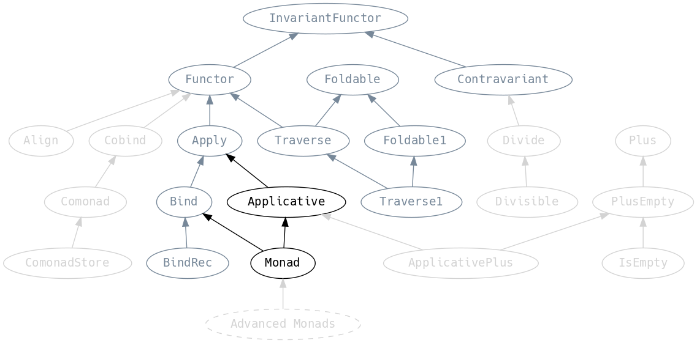

{lang="text"}
~~~~~~~~
  @typeclass trait Applicative[F[_]] extends Apply[F] {
    def point[A](a: =>A): F[A]
    def pure[A](a: =>A): F[A] = point(a)
  }
  
  @typeclass trait Monad[F[_]] extends Applicative[F] with Bind[F]
~~~~~~~~

In many ways, `Applicative` and `Monad` are the culmination of everything we've
seen in this chapter. `.pure` (or `.point` as it is more commonly known for data
structures) allows us to create effects or data structures from values.

Instances of `Applicative` must meet some laws, effectively asserting
that all the methods are consistent:

-   **Identity**: `fa <*> pure(identity) === fa`, (where `fa` is an `F[A]`) i.e.
    applying `pure(identity)` does nothing.
-   **Homomorphism**: `pure(a) <*> pure(ab) === pure(ab(a))` (where `ab` is an `A =>
      B`), i.e. applying a `pure` function to a `pure` value is the same as applying
    the function to the value and then using `pure` on the result.
-   **Interchange**: `pure(a) <*> fab === fab <*> pure(f => f(a))`, (where `fab` is
    an `F[A => B]`), i.e. `pure` is a left and right identity
-   **Mappy**: `map(fa)(f) === fa <*> pure(f)`

`Monad` adds additional laws:

-   **Left Identity**: `pure(a).bind(f) === f(a)`
-   **Right Identity**: `a.bind(pure(_)) === a`
-   **Associativity**: `fa.bind(f).bind(g) === fa.bind(a => f(a).bind(g))` where
    `fa` is an `F[A]`, `f` is an `A => F[B]` and `g` is a `B => F[C]`.

Associativity says that chained `bind` calls must agree with nested
`bind`. However, it does not mean that we can rearrange the order,
which would be *commutativity*. For example, recalling that `flatMap`
is an alias to `bind`, we cannot rearrange

{lang="text"}
~~~~~~~~
  for {
    _ <- machine.start(node1)
    _ <- machine.stop(node1)
  } yield true
~~~~~~~~

as

{lang="text"}
~~~~~~~~
  for {
    _ <- machine.stop(node1)
    _ <- machine.start(node1)
  } yield true
~~~~~~~~

`start` and `stop` are **non**-*commutative*, because the intended
effect of starting then stopping a node is different to stopping then
starting it!

But `start` is commutative with itself, and `stop` is commutative with
itself, so we can rewrite

{lang="text"}
~~~~~~~~
  for {
    _ <- machine.start(node1)
    _ <- machine.start(node2)
  } yield true
~~~~~~~~

as

{lang="text"}
~~~~~~~~
  for {
    _ <- machine.start(node2)
    _ <- machine.start(node1)
  } yield true
~~~~~~~~

which are equivalent. We're making a lot of assumptions about the
Google Container API here, but this is a reasonable choice to make.

A practical consequence is that a `Monad` must be *commutative* if its
`applyX` methods can be allowed to run in parallel. We cheated in
Chapter 3 when we ran these effects in parallel

{lang="text"}
~~~~~~~~
  (d.getBacklog |@| d.getAgents |@| m.getManaged |@| m.getAlive |@| m.getTime)
~~~~~~~~

because we know that they are commutative among themselves. When it comes to
interpreting our application, later in the book, we will have to provide
evidence that these effects are in fact commutative, or an asynchronous
implementation may choose to sequence the operations to be on the safe side.

The subtleties of how we deal with (re)-ordering of effects, and what
those effects are, deserves a dedicated chapter on Advanced Monads.

## Divide and Conquer

{width=100%}
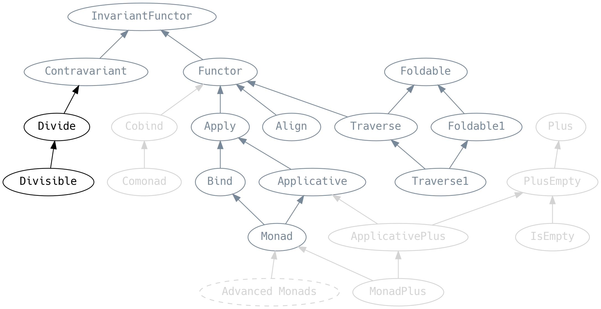

`Divide` is the `Contravariant` analogue of `Apply`

{lang="text"}
~~~~~~~~
  @typeclass trait Divide[F[_]] extends Contravariant[F] {
    def divide[A, B, C](fa: F[A], fb: F[B])(f: C => (A, B)): F[C] = divide2(fa, fb)(f)
  
    def divide1[A1, Z](a1: F[A1])(f: Z => A1): F[Z] = ...
    def divide2[A, B, C](fa: F[A], fb: F[B])(f: C => (A, B)): F[C] = ...
    ...
    def divide22[...] = ...
~~~~~~~~

`divide` says that if we can break a `C` into an `A` and a `B`, and
we're given an `F[A]` and an `F[B]`, then we can get an `F[C]`. Hence,
*divide and conquer*.

This is a great way to generate contravariant typeclass instances for
product types by breaking the products into their parts. Scalaz has an
instance of `Divide[Equal]`, let's construct an `Equal` for a new
product type `Foo`

{lang="text"}
~~~~~~~~
  scala> case class Foo(s: String, i: Int)
  scala> implicit val fooEqual: Equal[Foo] =
           Divide[Equal].divide2(Equal[String], Equal[Int]) {
             (foo: Foo) => (foo.s, foo.i)
           }
  scala> Foo("foo", 1) === Foo("bar", 1)
  res: Boolean = false
~~~~~~~~

It is a good moment to look again at `Apply`

{lang="text"}
~~~~~~~~
  @typeclass trait Apply[F[_]] extends Functor[F] {
    ...
    def apply2[A, B, C](fa: =>F[A], fb: =>F[B])(f: (A, B) => C): F[C] = ...
    def apply3[A,B,C,D](fa: =>F[A],fb: =>F[B],fc: =>F[C])(f: (A,B,C) =>D): F[D] = ...
    ...
    def apply12[...]
    ...
  }
~~~~~~~~

It is now easier to spot that `applyX` is how we can derive typeclasses
for covariant typeclasses.

Mirroring `Apply`, `Divide` also has terse syntax for tuples. A softer
*divide so that you may reign* approach to world domination:

{lang="text"}
~~~~~~~~
  ...
    def tuple2[A1, A2](a1: F[A1], a2: F[A2]): F[(A1, A2)] = ...
    ...
    def tuple22[...] = ...
  
    def deriving2[A1: F, A2: F, Z](f: Z => (A1, A2)): F[Z] = ...
    ...
    def deriving22[...] = ...
  }
~~~~~~~~

and `deriving`, which is even more convenient to use for typeclass
derivation:

{lang="text"}
~~~~~~~~
  implicit val fooEqual: Equal[Foo] = Divide[Equal].deriving2(f => (f.s, f.i))
~~~~~~~~

Generally, if encoder typeclasses can provide an instance of `Divide`,
rather than stopping at `Contravariant`, it makes it possible to
derive instances for any `case class`. Similarly, decoder typeclasses
can provide an `Apply` instance. We will explore this in a dedicated
chapter on Typeclass Derivation.

`Divisible` is the `Contravariant` analogue of `Applicative` and
introduces `conquer`, the equivalent of `pure`

{lang="text"}
~~~~~~~~
  @typeclass trait Divisible[F[_]] extends Divide[F] {
    def conquer[A]: F[A]
  }
~~~~~~~~

`conquer` allows creating fallback implementations that effectively ignore the
type parameter. Such values are called *universally quantified*. For example,
the `Divisible[Equal].conquer[String]` returns a trivial implementation of
`Equal` that always returns `true`, which allows us to implement `contramap` in
terms of `divide`

{lang="text"}
~~~~~~~~
  override def contramap[A, B](fa: F[A])(f: B => A): F[B] =
    divide(conquer[Unit], fa)(c => ((), f(c)))
~~~~~~~~

## Plus

{width=100%}
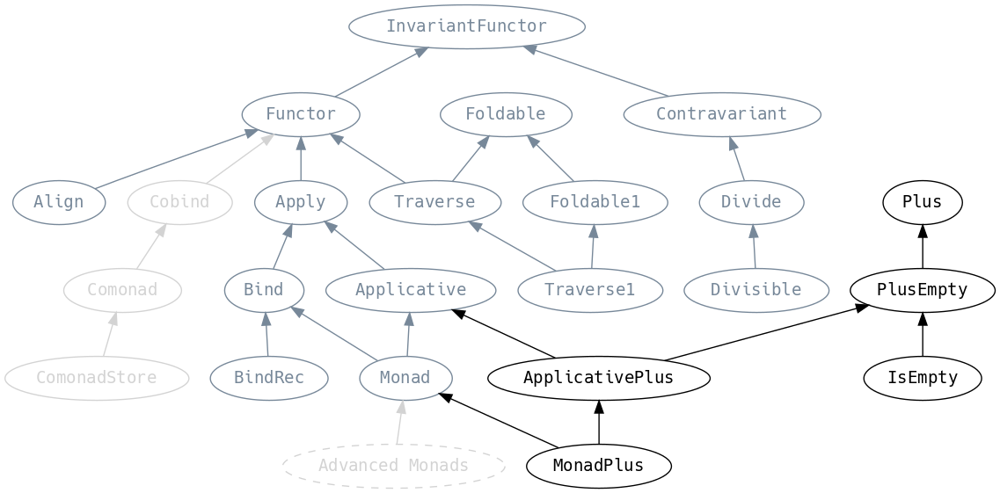

`Plus` is `Semigroup` but for type constructors, and `PlusEmpty` is
the equivalent of `Monoid` (they even have the same laws) whereas
`IsEmpty` is novel and allows us to query if an `F[A]` is empty:

{lang="text"}
~~~~~~~~
  @typeclass trait Plus[F[_]] {
    @op("<+>") def plus[A](a: F[A], b: =>F[A]): F[A]
  }
  @typeclass trait PlusEmpty[F[_]] extends Plus[F] {
    def empty[A]: F[A]
  }
  @typeclass trait IsEmpty[F[_]] extends PlusEmpty[F] {
    def isEmpty[A](fa: F[A]): Boolean
  }
~~~~~~~~

A> `<+>` is the TIE Interceptor, and now we're almost out of TIE
A> Fighters...

Although it may look on the surface as if `<+>` behaves like `|+|`

{lang="text"}
~~~~~~~~
  scala> List(2,3) |+| List(7)
  res = List(2, 3, 7)
  
  scala> List(2,3) <+> List(7)
  res = List(2, 3, 7)
~~~~~~~~

it is best to think of it as operating only at the `F[_]` level, never looking
into the contents. `Plus` has the convention that it should ignore failures and
"pick the first winner". `<+>` can therefore be used as a mechanism for early
exit (losing information) and failure-handling via fallbacks:

{lang="text"}
~~~~~~~~
  scala> Option(1) |+| Option(2)
  res = Some(3)
  
  scala> Option(1) <+> Option(2)
  res = Some(1)
  
  scala> Option.empty[Int] <+> Option(1)
  res = Some(1)
~~~~~~~~

For example, if we have a `NonEmptyList[Option[Int]]` and we want to ignore
`None` values (failures) and pick the first winner (`Some`), we can call `<+>`
from `Foldable1.foldRight1`:

{lang="text"}
~~~~~~~~
  scala> NonEmptyList(None, None, Some(1), Some(2), None)
         .foldRight1(_ <+> _)
  res: Option[Int] = Some(1)
~~~~~~~~

In fact, now that we know about `Plus`, we release that we didn't need to break
typeclass coherence (when we defined a locally scoped `Monoid[Option[A]]`) in
the section on Appendable Things. Our objective was to "pick the last winner",
which is the same as "pick the winner" if the arguments are swapped. Note the
use of the TIE Interceptor for `ccy` and `otc` and that `b` comes before `a` in

{lang="text"}
~~~~~~~~
  implicit val monoid: Monoid[TradeTemplate] = Monoid.instance(
    (a, b) =>
      TradeTemplate(a.payments |+| b.payments,
                    b.ccy <+> a.ccy,
                    b.otc <+> a.otc),
    TradeTemplate(Nil, None, None)
  )
~~~~~~~~

`Applicative` and `Monad` have specialised versions of `PlusEmpty`

{lang="text"}
~~~~~~~~
  @typeclass trait ApplicativePlus[F[_]] extends Applicative[F] with PlusEmpty[F]
  
  @typeclass trait MonadPlus[F[_]] extends Monad[F] with ApplicativePlus[F] {
    def unite[T[_]: Foldable, A](ts: F[T[A]]): F[A] = ...
  
    def withFilter[A](fa: F[A])(f: A => Boolean): F[A] = ...
  }
~~~~~~~~

`ApplicativePlus` is also known as `Alternative`.

`unite` looks a `Foldable.fold` on the contents of `F[_]` but is
folding with the `PlusEmpty[F].monoid` (not the `Monoid[A]`). For
example, uniting `List[Either[_, _]]` means `Left` becomes `empty`
(`Nil`) and the contents of `Right` become single element `List`,
which are then concatenated:

{lang="text"}
~~~~~~~~
  scala> List(Right(1), Left("boo"), Right(2)).unite
  res: List[Int] = List(1, 2)
  
  scala> val boo: Either[String, Int] = Left("boo")
         boo.foldMap(a => a.pure[List])
  res: List[String] = List()
  
  scala> val n: Either[String, Int] = Right(1)
         n.foldMap(a => a.pure[List])
  res: List[Int] = List(1)
~~~~~~~~

`withFilter` allows us to make use of `for` comprehension language
support as discussed in Chapter 2. It is fair to say that the Scala
language has built-in language support for `MonadPlus`, not just
`Monad`!

Returning to `Foldable` for a moment, we can reveal some methods that
we did not discuss earlier

{lang="text"}
~~~~~~~~
  @typeclass trait Foldable[F[_]] {
    ...
    def msuml[G[_]: PlusEmpty, A](fa: F[G[A]]): G[A] = ...
    def collapse[X[_]: ApplicativePlus, A](x: F[A]): X[A] = ...
    ...
  }
~~~~~~~~

`msuml` does a `fold` using the `Monoid` from the `PlusEmpty[G]` and
`collapse` does a `foldRight` using the `PlusEmpty` of the target
type:

{lang="text"}
~~~~~~~~
  scala> IList(Option(1), Option.empty[Int], Option(2)).fold
  res: Option[Int] = Some(3) // uses Monoid[Option[Int]]
  
  scala> IList(Option(1), Option.empty[Int], Option(2)).msuml
  res: Option[Int] = Some(1) // uses PlusEmpty[Option].monoid
  
  scala> IList(1, 2).collapse[Option]
  res: Option[Int] = Some(1)
~~~~~~~~

## Lone Wolves

Some of the typeclasses in scalaz are stand-alone and not part of the
larger hierarchy.

{width=80%}
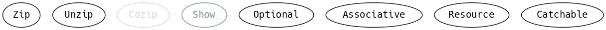

### Zippy

{lang="text"}
~~~~~~~~
  @typeclass trait Zip[F[_]]  {
    def zip[A, B](a: =>F[A], b: =>F[B]): F[(A, B)]
  
    def zipWith[A, B, C](fa: =>F[A], fb: =>F[B])(f: (A, B) => C)
                        (implicit F: Functor[F]): F[C] = ...
  
    def ap(implicit F: Functor[F]): Apply[F] = ...
  
    @op("<*|*>") def apzip[A, B](f: =>F[A] => F[B], a: =>F[A]): F[(A, B)] = ...
  
  }
~~~~~~~~

The core method is `zip` which is a less powerful version of
`Divide.tuple2`, and if a `Functor[F]` is provided then `zipWith` can
behave like `Apply.apply2`. Indeed, an `Apply[F]` can be created from
a `Zip[F]` and a `Functor[F]` by calling `ap`.

`apzip` takes an `F[A]` and a lifted function from `F[A] => F[B]`,
producing an `F[(A, B)]` similar to `Functor.fproduct`.

A> `<*|*>` is the creepy Jawa operator.

{lang="text"}
~~~~~~~~
  @typeclass trait Unzip[F[_]]  {
    @op("unfzip") def unzip[A, B](a: F[(A, B)]): (F[A], F[B])
  
    def firsts[A, B](a: F[(A, B)]): F[A] = ...
    def seconds[A, B](a: F[(A, B)]): F[B] = ...
  
    def unzip3[A, B, C](x: F[(A, (B, C))]): (F[A], F[B], F[C]) = ...
    ...
    def unzip7[A ... H](x: F[(A, (B, ... H))]): ...
  }
~~~~~~~~

The core method is `unzip` with `firsts` and `seconds` allowing for
selecting either the first or second element of a tuple in the `F`.
Importantly, `unzip` is the opposite of `zip`.

The methods `unzip3` to `unzip7` are repeated applications of `unzip`
to save on boilerplate. For example, if handed a bunch of nested
tuples, the `Unzip[Id]` is a handy way to flatten them:

{lang="text"}
~~~~~~~~
  scala> Unzip[Id].unzip7((1, (2, (3, (4, (5, (6, 7)))))))
  res = (1,2,3,4,5,6,7)
~~~~~~~~

In a nutshell, `Zip` and `Unzip` are less powerful versions of
`Divide` and `Apply`, providing useful features without requiring the
`F` to make too many promises.

### Optional

`Optional` is a generalisation of data structures that can optionally
contain a value, like `Option` and `Either`.

Recall that `\/` (*disjunction*) is scalaz's improvement of
`scala.Either`. We will also see `Maybe`, scalaz's improvement of
`scala.Option`

{lang="text"}
~~~~~~~~
  sealed abstract class Maybe[A]
  final case class Empty[A]()    extends Maybe[A]
  final case class Just[A](a: A) extends Maybe[A]
~~~~~~~~

{lang="text"}
~~~~~~~~
  @typeclass trait Optional[F[_]] {
    def pextract[B, A](fa: F[A]): F[B] \/ A
  
    def getOrElse[A](fa: F[A])(default: =>A): A = ...
    def orElse[A](fa: F[A])(alt: =>F[A]): F[A] = ...
  
    def isDefined[A](fa: F[A]): Boolean = ...
    def nonEmpty[A](fa: F[A]): Boolean = ...
    def isEmpty[A](fa: F[A]): Boolean = ...
  
    def toOption[A](fa: F[A]): Option[A] = ...
    def toMaybe[A](fa: F[A]): Maybe[A] = ...
  }
~~~~~~~~

These are methods that should be familiar, except perhaps `pextract`,
which is a way of letting the `F[_]` return some implementation
specific `F[B]` or the value. For example, `Optional[Option].pextract`
returns `Option[Nothing] \/ A`, i.e. `None \/ A`.

Scalaz gives a ternary operator to things that have an `Optional`

{lang="text"}
~~~~~~~~
  implicit class OptionalOps[F[_]: Optional, A](fa: F[A]) {
    def ?[X](some: =>X): Conditional[X] = new Conditional[X](some)
    final class Conditional[X](some: =>X) {
      def |(none: =>X): X = if (Optional[F].isDefined(fa)) some else none
    }
  }
~~~~~~~~

for example

{lang="text"}
~~~~~~~~
  scala> val knock_knock: Option[String] = ...
         knock_knock ? "who's there?" | "<tumbleweed>"
~~~~~~~~

Next time you write a function that takes an `Option`, consider
rewriting it to take `Optional` instead: it'll make it easier to
migrate to data structures that have better error handling without any
loss of functionality.

### Catchable

Our grand plans to write total functions that return a value for every
input may be in ruins when exceptions are the norm in the Java
standard library, the Scala standard library, and the myriad of legacy
systems that we must interact with.

scalaz does not magically handle exceptions automatically, but it does
provide the mechanism to protect against bad legacy systems.

{lang="text"}
~~~~~~~~
  @typeclass trait Catchable[F[_]] {
    def attempt[A](f: F[A]): F[Throwable \/ A]
    def fail[A](err: Throwable): F[A]
  }
~~~~~~~~

`attempt` will catch any exceptions inside `F[_]` and make the JVM
`Throwable` an explicit return type that can be mapped into an error
reporting ADT, or left as an indicator to downstream callers that
*Here be Dragons*.

`fail` permits callers to throw an exception in the `F[_]` context
and, since this breaks purity, will be removed from scalaz. Exceptions
that are raised via `fail` must be later handled by `attempt` since it
is just as bad as calling legacy code that throws an exception.

It is worth noting that `Catchable[Id]` cannot be implemented. An
`Id[A]` cannot exist in a state that may contain an exception.
However, there are instances for both `scala.concurrent.Future`
(asynchronous) and `scala.Either` (synchronous), allowing `Catchable`
to abstract over the unhappy path. `MonadError`, as we will see in a
later chapter, is a superior replacement.

## Co-things

A *co-thing* typically has some opposite type signature to whatever
*thing* does, but is not necessarily its inverse. To highlight the
relationship between *thing* and *co-thing*, we will include the type
signature of *thing* wherever we can.

{width=100%}
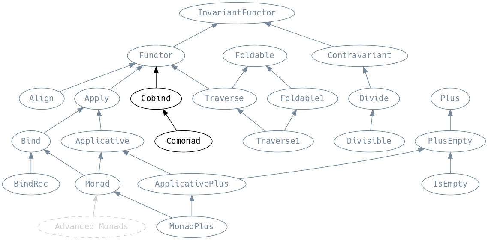

{width=80%}

### Cobind

{lang="text"}
~~~~~~~~
  @typeclass trait Cobind[F[_]] extends Functor[F] {
    def cobind[A, B](fa: F[A])(f: F[A] => B): F[B]
  //def   bind[A, B](fa: F[A])(f: A => F[B]): F[B]
  
    def cojoin[A](fa: F[A]): F[F[A]] = ...
  //def   join[A](ffa: F[F[A]]): F[A] = ...
  }
~~~~~~~~

`cobind` (also known as `coflatmap`) takes an `F[A] => B` that acts on
an `F[A]` rather than its elements. But this is not necessarily the
full `fa`, it is usually some substructure as defined by `cojoin`
(also known as `coflatten`) which expands a data structure.

Compelling use-cases for `Cobind` are rare, although when shown in the
`Functor` permutation table (for `F[_]`, `A` and `B`) it is difficult
to argue why any method should be less important than the others:

| method      | parameter          |
|----------- |------------------ |
| `map`       | `A => B`           |
| `contramap` | `B => A`           |
| `xmap`      | `(A => B, B => A)` |
| `ap`        | `F[A => B]`        |
| `bind`      | `A => F[B]`        |
| `cobind`    | `F[A] => B`        |

### Comonad

{lang="text"}
~~~~~~~~
  @typeclass trait Comonad[F[_]] extends Cobind[F] {
    def copoint[A](p: F[A]): A
  //def   point[A](a: =>A): F[A]
  }
~~~~~~~~

`copoint` (also `copure`) unwraps an element from a context. When
interpreting a pure program, we typically require a `Comonad` to run
the interpreter inside the application's `def main` entry point. For
example, `Comonad[Future].copoint` will `await` the execution of a
`Future[Unit]`.

Far more interesting is the `Comonad` of a *data structure*. This is a
way to construct a view of all elements alongside their neighbours.
Consider a *neighbourhood* (`Hood` for short) for a list containing
all the elements to the left of an element (`lefts`), the element
itself (the `focus`), and all the elements to its right (`rights`).

{lang="text"}
~~~~~~~~
  final case class Hood[A](lefts: IList[A], focus: A, rights: IList[A])
~~~~~~~~

A> We use scalaz data structures `IList` and `Maybe`, instead of stdlib
A> `List` and `Option`, to protect us from accidentally calling impure
A> methods.

The `lefts` and `rights` should each be ordered with the nearest to
the `focus` at the head, such that we can recover the original `IList`
via `.toList`

{lang="text"}
~~~~~~~~
  object Hood {
    implicit class Ops[A](hood: Hood[A]) {
      def toList: IList[A] = hood.lefts.reverse ::: hood.focus :: hood.rights
~~~~~~~~

We can write methods that let us move the focus one to the left
(`previous`) and one to the right (`next`)

{lang="text"}
~~~~~~~~
  ...
      def previous: Maybe[Hood[A]] = hood.lefts match {
        case INil() => Empty()
        case ICons(head, tail) =>
          Just(Hood(tail, head, hood.focus :: hood.rights))
      }
      def next: Maybe[Hood[A]] = hood.rights match {
        case INil() => Empty()
        case ICons(head, tail) =>
          Just(Hood(hood.focus :: hood.lefts, head, tail))
      }
~~~~~~~~

By introducing `more` to repeatedly apply an optional function to
`Hood` we can calculate *all* the `positions` that `Hood` can take in
the list

{lang="text"}
~~~~~~~~
  ...
      def more(f: Hood[A] => Maybe[Hood[A]]): IList[Hood[A]] =
        f(hood) match {
          case Empty() => INil()
          case Just(r) => ICons(r, r.more(f))
        }
      def positions: Hood[Hood[A]] = {
        val left  = hood.more(_.previous)
        val right = hood.more(_.next)
        Hood(left, hood, right)
      }
    }
~~~~~~~~

We can now implement `Comonad[Hood]`

{lang="text"}
~~~~~~~~
  ...
    implicit val comonad: Comonad[Hood] = new Comonad[Hood] {
      def map[A, B](fa: Hood[A])(f: A => B): Hood[B] =
        Hood(fa.lefts.map(f), f(fa.focus), fa.rights.map(f))
      def cobind[A, B](fa: Hood[A])(f: Hood[A] => B): Hood[B] =
        fa.positions.map(f)
      def copoint[A](fa: Hood[A]): A = fa.focus
    }
  }
~~~~~~~~

`cojoin` gives us a `Hood[Hood[IList]]` containing all the possible
neighbourhoods in our initial `IList`

{lang="text"}
~~~~~~~~
  scala> val middle = Hood(IList(4, 3, 2, 1), 5, IList(6, 7, 8, 9))
         println(middle.cojoin)
  
  res = Hood(
          [Hood([3,2,1],4,[5,6,7,8,9]),
           Hood([2,1],3,[4,5,6,7,8,9]),
           Hood([1],2,[3,4,5,6,7,8,9]),
           Hood([],1,[2,3,4,5,6,7,8,9])],
          Hood([4,3,2,1],5,[6,7,8,9]),
          [Hood([5,4,3,2,1],6,[7,8,9]),
           Hood([6,5,4,3,2,1],7,[8,9]),
           Hood([7,6,5,4,3,2,1],8,[9]),
           Hood([8,7,6,5,4,3,2,1],9,[])])
~~~~~~~~

Indeed, `cojoin` is just `positions`! We can `override` it with a more
direct (and performant) implementation

{lang="text"}
~~~~~~~~
  override def cojoin[A](fa: Hood[A]): Hood[Hood[A]] = fa.positions
~~~~~~~~

`Comonad` generalises the concept of `Hood` to arbitrary data
structures. `Hood` is an example of a *zipper* (unrelated to `Zip`).
Scalaz comes with a `Zipper` data type for streams (i.e. infinite 1D
data structures), which we will discuss in the next chapter.

One application of a zipper is for *cellular automata*, which compute
the value of each cell in the next generation by performing a
computation based on the neighbourhood of that cell.

### Cozip

{lang="text"}
~~~~~~~~
  @typeclass trait Cozip[F[_]] {
    def cozip[A, B](x: F[A \/ B]): F[A] \/ F[B]
  //def   zip[A, B](a: =>F[A], b: =>F[B]): F[(A, B)]
  //def unzip[A, B](a: F[(A, B)]): (F[A], F[B])
  
    def cozip3[A, B, C](x: F[A \/ (B \/ C)]): F[A] \/ (F[B] \/ F[C]) = ...
    ...
    def cozip7[A ... H](x: F[(A \/ (... H))]): F[A] \/ (... F[H]) = ...
  }
~~~~~~~~

Although named `cozip`, it is perhaps more appropriate to talk about
its symmetry with `unzip`. Whereas `unzip` splits `F[_]` of tuples
(products) into tuples of `F[_]`, `cozip` splits `F[_]` of
disjunctions (coproducts) into disjunctions of `F[_]`.

## Bi-things

Sometimes we may find ourselves with a thing that has two type holes
and we want to `map` over both sides. For example we might be tracking
failures in the left of an `Either` and we want to do something with the
failure messages.

The `Functor` / `Foldable` / `Traverse` typeclasses have bizarro
relatives that allow us to map both ways.

{width=30%}
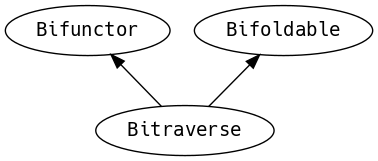

{lang="text"}
~~~~~~~~
  @typeclass trait Bifunctor[F[_, _]] {
    def bimap[A, B, C, D](fab: F[A, B])(f: A => C, g: B => D): F[C, D]
  
    @op("<-:") def leftMap[A, B, C](fab: F[A, B])(f: A => C): F[C, B] = ...
    @op(":->") def rightMap[A, B, D](fab: F[A, B])(g: B => D): F[A, D] = ...
    @op("<:>") def umap[A, B](faa: F[A, A])(f: A => B): F[B, B] = ...
  }
  
  @typeclass trait Bifoldable[F[_, _]] {
    def bifoldMap[A, B, M: Monoid](fa: F[A, B])(f: A => M)(g: B => M): M
  
    def bifoldRight[A,B,C](fa: F[A, B], z: =>C)(f: (A, =>C) => C)(g: (B, =>C) => C): C
    def bifoldLeft[A,B,C](fa: F[A, B], z: C)(f: (C, A) => C)(g: (C, B) => C): C = ...
  
    def bifoldMap1[A, B, M: Semigroup](fa: F[A,B])(f: A => M)(g: B => M): Option[M] = ...
  }
  
  @typeclass trait Bitraverse[F[_, _]] extends Bifunctor[F] with Bifoldable[F] {
    def bitraverse[G[_]: Applicative, A, B, C, D](fab: F[A, B])
                                                 (f: A => G[C])
                                                 (g: B => G[D]): G[F[C, D]]
  
    def bisequence[G[_]: Applicative, A, B](x: F[G[A], G[B]]): G[F[A, B]] = ...
  }
~~~~~~~~

A> `<-:` and `:->` are the happy operators!

Although the type signatures are verbose, these are nothing more than
the core methods of `Functor`, `Foldable` and `Bitraverse` taking two
functions instead of one, often requiring both functions to return the
same type so that their results can be combined with a `Monoid` or
`Semigroup`.

{lang="text"}
~~~~~~~~
  scala> val a: Either[String, Int] = Left("fail")
         val b: Either[String, Int] = Right(13)
  
  scala> b.bimap(_.toUpperCase, _ * 2)
  res: Either[String, Int] = Right(26)
  
  scala> a.bimap(_.toUpperCase, _ * 2)
  res: Either[String, Int] = Left(FAIL)
  
  scala> b :-> (_ * 2)
  res: Either[String,Int] = Right(26)
  
  scala> a :-> (_ * 2)
  res: Either[String, Int] = Left(fail)
  
  scala> { s: String => s.length } <-: a
  res: Either[Int, Int] = Left(4)
  
  scala> a.bifoldMap(_.length)(identity)
  res: Int = 4
  
  scala> b.bitraverse(s => Future(s.length), i => Future(i))
  res: Future[Either[Int, Int]] = Future(<not completed>)
~~~~~~~~

In addition, we can revisit `MonadPlus` (recall it is `Monad` with the
ability to `filterWith` and `unite`) and see that it can `separate`
`Bifoldable` contents of a `Monad`

{lang="text"}
~~~~~~~~
  @typeclass trait MonadPlus[F[_]] {
    ...
    def separate[G[_, _]: Bifoldable, A, B](value: F[G[A, B]]): (F[A], F[B]) = ...
    ...
  }
~~~~~~~~

This is very useful if we have a collection of bi-things and we want
to reorganise them into a collection of `A` and a collection of `B`

{lang="text"}
~~~~~~~~
  scala> val list: List[Either[Int, String]] =
           List(Right("hello"), Left(1), Left(2), Right("world"))
  
  scala> list.separate
  res: (List[Int], List[String]) = (List(1, 2), List(hello, world))
~~~~~~~~

## Very Abstract Things

What remains of the typeclass hierarchy are things that allow us to
meta-reason about functional programming and scalaz. We are not going
to discuss these yet as they deserve a full chapter on Category Theory
and are not needed in typical FP applications.

{width=60%}
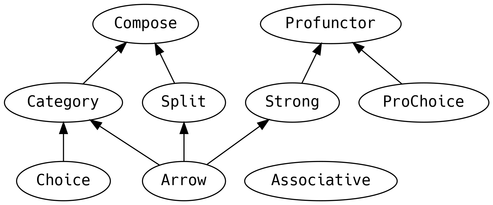

## Summary

That was a lot of material! We have just explored a standard library
of polymorphic functionality. But to put it into perspective: there
are more traits in the Scala stdlib Collections API than typeclasses
in scalaz.

It is normal for an FP application to only touch a small percentage of
the typeclass hierarchy, with most functionality coming from
domain-specific typeclasses. Even if the domain-specific typeclasses
are just specialised clones of something in scalaz, it is better to
write the code and later refactor it, than to over-abstract too early.

To help, we have included a cheat-sheet of the typeclasses and their
primary methods in the Appendix, inspired by Adam Rosien's [Scalaz
Cheatsheet](http://arosien.github.io/scalaz-cheatsheets/typeclasses.pdf). These cheat-sheets make an excellent replacement for the
family portrait on your office desk.

To help further, Valentin Kasas explains how to [combine `N` things](https://twitter.com/ValentinKasas/status/879414703340081156):

{width=70%}
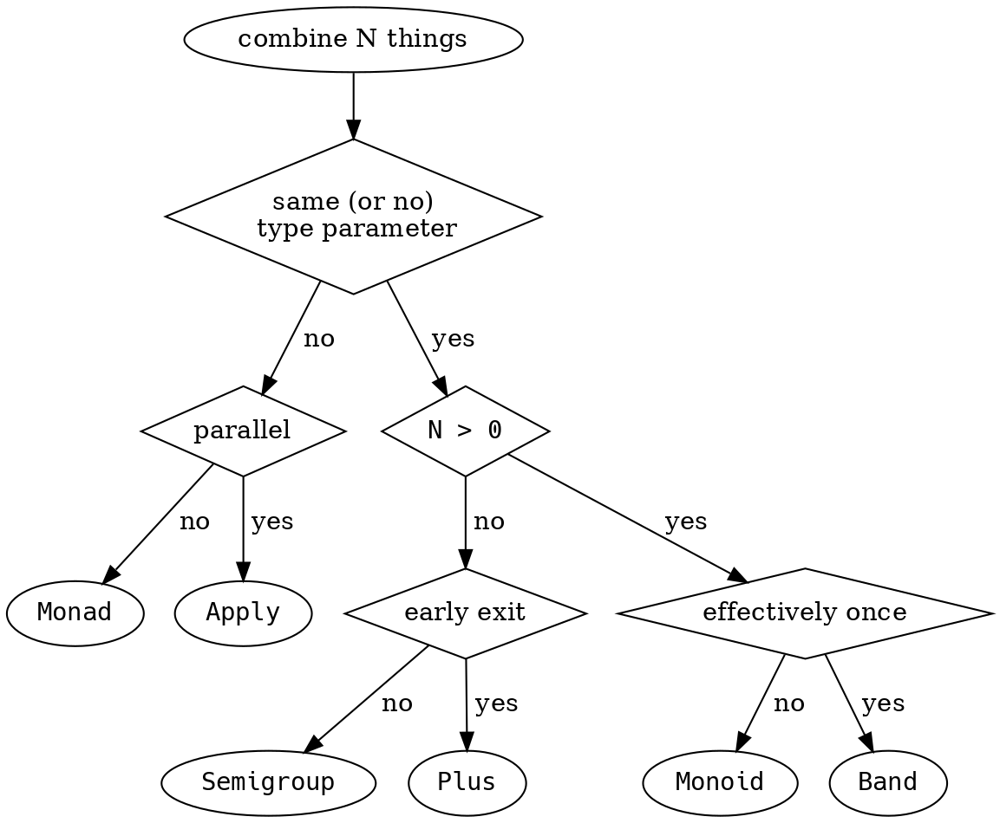

# Scalaz Data Types

Who doesn't love a good data structure? The answer is *nobody*, because data
structures are awesome.

In this chapter we'll explore the *collection-like* data types in scalaz, as
well as data types that augment the Scala language with useful semantics and
additional type safety.

The primary reason we care about having lots of collections at our disposal is
performance. A vector and a list can do the same things, but their performance
characteristics are different: a vector has constant lookup cost whereas a list
must be traversed.

W> Performance estimates - including claims in this chapter - should be taken with
W> a pinch of salt. Modern processor design, memory pipelining, and JVM garbage
W> collection can invalidate intuitive reasoning based on operation counting.
W> 
W> A hard truth of modern computers is that empirical performance tests, for a
W> specific task, can shock and surprise: e.g. lookup in a `List` is often faster
W> in practice than in a `Vector`. Use a tool such as [JMH](http://openjdk.java.net/projects/code-tools/jmh/) when performance testing.

All of the collections presented here are *persistent*: if we add or remove an
element we can still use the old version. Structural sharing is essential to the
performance of persistent data structures, otherwise the entire collection is
rebuilt with every operation.

Unlike the Java and Scala collections, there is no hierarchy to the data types
in scalaz: these collections are much simpler to understand. Polymorphic
functionality is provided by optimised instances of the typeclasses we studied
in the previous chapter. This makes it a lot easier to swap implementations for
performance reasons, and to provide our own.

## Type Variance

Many of scalaz's data types are *invariant* in their type parameters.
For example, `IList[A]` is **not** a subtype of `IList[B]` when `A <:
B`.

### Covariance

The problem with *covariant* type parameters, such as `class
List[+A]`, is that `List[A]` is a subtype of `List[Any]` and it is
easy to accidentally lose type information.

{lang="text"}
~~~~~~~~
  scala> List("hello") ++ List(' ') ++ List("world!")
  res: List[Any] = List(hello,  , world!)
~~~~~~~~

Note that the second list is a `List[Char]` and the compiler has
unhelpfully inferred the *Least Upper Bound* (LUB) to be `Any`.
Compare to `IList`, which requires explicit `.widen[Any]` to permit
the heinous crime:

{lang="text"}
~~~~~~~~
  scala> IList("hello") ++ IList(' ') ++ IList("world!")
  <console>:35: error: type mismatch;
   found   : Char(' ')
   required: String
  
  scala> IList("hello").widen[Any]
           ++ IList(' ').widen[Any]
           ++ IList("world!").widen[Any]
  res: IList[Any] = [hello, ,world!]
~~~~~~~~

Similarly, when the compiler infers a type `with Product with
Serializable` it is a strong indicator that accidental widening has
occurred due to covariance.

Unfortunately we must be careful when constructing invariant data
types because LUB calculations are performed on the parameters:

{lang="text"}
~~~~~~~~
  scala> IList("hello", ' ', "world")
  res: IList[Any] = [hello, ,world]
~~~~~~~~

Another similar problem arises from Scala's `Nothing` type, which is a subtype
of all other types, including `sealed` ADTs, `final` classes, primitives and
`null`.

There are no values of type `Nothing`: functions that take a `Nothing` as a
parameter cannot be run and functions that return `Nothing` will never return.
`Nothing` was introduced as a mechanism to enable covariant type parameters, but
a consequence is that we can write un-runnable code, by accident. Scalaz says we
do not need covariant type parameters which means that we are limiting ourselves
to writing practical code that can be run.

### Contrarivariance

On the other hand, *contravariant* type parameters, such as `trait
Thing[-A]`, can expose devastating [bugs in the compiler](https://issues.scala-lang.org/browse/SI-2509). Consider Paul
Phillips' (ex-`scalac` team) demonstration of what he calls
*contrarivariance*:

{lang="text"}
~~~~~~~~
  scala> :paste
         trait Thing[-A]
         def f(x: Thing[ Seq[Int]]): Byte   = 1
         def f(x: Thing[List[Int]]): Short  = 2
  
  scala> f(new Thing[ Seq[Int]] { })
         f(new Thing[List[Int]] { })
  
  res = 1
  res = 2
~~~~~~~~

As expected, the compiler is finding the most specific argument in
each call to `f`. However, implicit resolution gives unexpected
results:

{lang="text"}
~~~~~~~~
  scala> :paste
         implicit val t1: Thing[ Seq[Int]] =
           new Thing[ Seq[Int]] { override def toString = "1" }
         implicit val t2: Thing[List[Int]] =
           new Thing[List[Int]] { override def toString = "2" }
  
  scala> implicitly[Thing[ Seq[Int]]]
         implicitly[Thing[List[Int]]]
  
  res = 1
  res = 1
~~~~~~~~

Implicit resolution flips its definition of "most specific" for
contravariant types, rendering them useless for typeclasses or
anything that requires polymorphic functionality.

### Limitations of subtyping

`scala.Option` has a method `.flatten` which will convert
`Option[Option[B]]` into an `Option[B]`. However, Scala's type system
is unable to let us write the required type signature. Consider the
following that appears correct, but has a subtle bug:

{lang="text"}
~~~~~~~~
  sealed abstract class Option[+A] {
    def flatten[B, A <: Option[B]]: Option[B] = ...
  }
~~~~~~~~

The `A` introduced on `.flatten` is shadowing the `A` introduced on
the class. It is equivalent to writing

{lang="text"}
~~~~~~~~
  sealed abstract class Option[+A] {
    def flatten[B, C <: Option[B]]: Option[B] = ...
  }
~~~~~~~~

which is not the constraint we want.

To workaround this limitation, Scala defines infix classes `<:<` and
`=:=` along with implicit evidence that always creates a *witness*

{lang="text"}
~~~~~~~~
  sealed abstract class <:<[-From, +To] extends (From => To)
  implicit def conforms[A]: A <:< A = new <:<[A, A] { def apply(x: A): A = x }
  
  sealed abstract class =:=[ From,  To] extends (From => To)
  implicit def tpEquals[A]: A =:= A = new =:=[A, A] { def apply(x: A): A = x }
~~~~~~~~

`=:=` can be used to require that two type parameters are exactly the
same and `<:<` is used to describe subtype relationships, letting us
implement `.flatten` as

{lang="text"}
~~~~~~~~
  sealed abstract class Option[+A] {
    def flatten[B](implicit ev: A <:< Option[B]): Option[B] = this match {
      case None        => None
      case Some(value) => ev(value)
    }
  }
  final case class Some[+A](value: A) extends Option[A] 
  case object None                    extends Option[Nothing]
~~~~~~~~

Scalaz improves on `<:<` and `=:=` with *Liskov* (aliased to `<~<`)
and *Leibniz* (`===`).

{lang="text"}
~~~~~~~~
  sealed abstract class Liskov[-A, +B] {
    def apply(a: A): B = ...
    def subst[F[-_]](p: F[B]): F[A]
  
    def andThen[C](that: Liskov[B, C]): Liskov[A, C] = ...
    def onF[X](fa: X => A): X => B = ...
    ...
  }
  object Liskov {
    type <~<[-A, +B] = Liskov[A, B]
    type >~>[+B, -A] = Liskov[A, B]
  
    implicit def refl[A]: (A <~< A) = ...
    implicit def isa[A, B >: A]: A <~< B = ...
  
    implicit def witness[A, B](lt: A <~< B): A => B = ...
    ...
  }
  
  // type signatures have been simplified
  sealed abstract class Leibniz[A, B] {
    def apply(a: A): B = ...
    def subst[F[_]](p: F[A]): F[B]
  
    def flip: Leibniz[B, A] = ...
    def andThen[C](that: Leibniz[B, C]): Leibniz[A, C] = ...
    def onF[X](fa: X => A): X => B = ...
    ...
  }
  object Leibniz {
    type ===[A, B] = Leibniz[A, B]
  
    implicit def refl[A]: Leibniz[A, A] = ...
  
    implicit def subst[A, B](a: A)(implicit f: A === B): B = ...
    implicit def witness[A, B](f: A === B): A => B = ...
    ...
  }
~~~~~~~~

Other than generally useful methods and implicit conversions, the
scalaz `<~<` and `===` evidence is more principled than in the stdlib.

A> Liskov is named after Barbara Liskov of *Liskov substitution
A> principle* fame, the foundation of Object Oriented Programming.
A> 
A> Gottfried Wilhelm Leibniz basically invented *everything* in the 17th
A> century. He believed in a [God called Monad](https://en.wikipedia.org/wiki/Monad_(philosophy)). Eugenio Moggi later reused
A> the name for what we know as `scalaz.Monad`. Not a God, just a mere
A> mortal like you and me.

## Evaluation

Java is a *strict* evaluation language: all the parameters to a method
must be evaluated to a *value* before the method is called. Scala
introduces the notion of *by-name* parameters on methods with `a: =>A`
syntax. These parameters are wrapped up as a zero argument function
which is called every time the `a` is referenced. We seen *by-name* a
lot in the typeclasses.

Scala also has *by-need* evaluation of values, with the `lazy`
keyword: the computation is evaluated at most once to produce the
value. Unfortunately, scala does not support *by-need* evaluation of
method parameters.

A> If the calculation of a `lazy val` throws an exception, it is retried
A> every time it is accessed. Because exceptions can break referential
A> transparency, we limit our discussion to `lazy val` calculations that
A> do not throw exceptions.

Scalaz formalises the three evaluation strategies with an ADT

{lang="text"}
~~~~~~~~
  sealed abstract class Name[A] {
    def value: A
  }
  object Name {
    def apply[A](a: =>A) = new Name[A] { def value = a }
    ...
  }
  
  sealed abstract class Need[A] extends Name[A]
  object Need {
    def apply[A](a: =>A): Need[A] = new Need[A] {
      private lazy val value0: A = a
      def value = value0
    }
    ...
  }
  
  final case class Value[A](value: A) extends Need[A]
~~~~~~~~

The weakest form of evaluation is `Name`, giving no computational
guarantees. Next is `Need`, guaranteeing *at most once* evaluation,
whereas `Value` is pre-computed and therefore *exactly once*
evaluation.

If we wanted to be super-pedantic we could go back to all the
typeclasses and make their methods take `Name`, `Need` or `Value`
parameters. Instead we can assume that normal parameters can always be
wrapped in a `Value`, and *by-name* parameters can be wrapped with
`Name`.

When we write *pure programs*, we are free to replace any `Name` with
`Need` or `Value`, and vice versa, with no change to the correctness
of the program. This is the essence of *referential transparency*: the
ability to replace a computation by its value, or a value by its
computation.

In functional programming we almost always want `Value` or `Need`
(also known as *strict* and *lazy*): there is little value in `Name`.
Because there is no language level support for lazy method parameters,
methods typically ask for a *by-name* parameter and then convert it
into a `Need` internally, getting a boost to performance.

A> `Lazy` (with a capital `L`) is often used in core Scala libraries for
A> data types with *by-name* semantics: a misnomer that has stuck.
A> 
A> More generally, we're all pretty lazy about how we talk about laziness: it can
A> be good to seek clarification about what kind of laziness is being discussed. Or
A> don't. Because, lazy.

`Name` provides instances of the following typeclasses

-   `Monad`
-   `Comonad`
-   `Distributive`
-   `Traverse1`
-   `Align`
-   `Zip` / `Unzip` / `Cozip`

A> *by-name* and *lazy* are not the free lunch they appear to be. When
A> Scala converts *by-name* parameters and `lazy val` into bytecode,
A> there is an object allocation overhead.
A> 
A> Before rewriting everything to use *by-name* parameters, ensure that
A> the cost of the overhead does not eclipse the saving. There is no
A> benefit unless there is the possibility of **not** evaluating. High
A> performance code that runs in a tight loop and always evaluates will
A> suffer.

## Memoisation

Scalaz has the capability to memoise functions, formalised by `Memo`,
which doesn't make any guarantees about evaluation because of the
diversity of implementations:

{lang="text"}
~~~~~~~~
  sealed abstract class Memo[K, V] {
    def apply(z: K => V): K => V
  }
  object Memo {
    def memo[K, V](f: (K => V) => K => V): Memo[K, V]
  
    def nilMemo[K, V]: Memo[K, V] = memo[K, V](identity)
  
    def arrayMemo[V >: Null : ClassTag](n: Int): Memo[Int, V] = ...
    def doubleArrayMemo(n: Int, sentinel: Double = 0.0): Memo[Int, Double] = ...
  
    def immutableHashMapMemo[K, V]: Memo[K, V] = ...
    def immutableTreeMapMemo[K: scala.Ordering, V]: Memo[K, V] = ...
  }
~~~~~~~~

`memo` allows us to create custom implementations of `Memo`, `nilMemo`
doesn't memoise, evaluating the function normally. The remaining
implementations intercept calls to the function and cache results
backed by stdlib collection implementations.

To use `Memo` we simply wrap a function with a `Memo` implementation
and then call the memoised function:

{lang="text"}
~~~~~~~~
  scala> def foo(n: Int): String = {
           println("running")
           if (n > 10) "wibble" else "wobble"
         }
  
  scala> val mem = Memo.arrayMemo[String](100)
         val mfoo = mem(foo)
  
  scala> mfoo(1)
  running // evaluated
  res: String = wobble
  
  scala> mfoo(1)
  res: String = wobble // memoised
~~~~~~~~

If the function takes more than one parameter, we must `tupled` the
method, with the memoised version taking a tuple.

{lang="text"}
~~~~~~~~
  scala> def bar(n: Int, m: Int): String = "hello"
         val mem = Memo.immutableHashMapMemo[(Int, Int), String]
         val mbar = mem((bar _).tupled)
  
  scala> mbar((1, 2))
  res: String = "hello"
~~~~~~~~

`Memo` is typically treated as a special construct and the usual rule
about *purity* is relaxed for implementations. To be pure only
requires that our implementations of `Memo` are referential
transparent in the evaluation of `K => V`. We may use mutable data and
perform I/O in the implementation of `Memo`, e.g. with an LRU or
distributed cache, without having to declare an effect in the type
signature. Other functional programming languages have automatic
memoisation managed by their runtime environment and `Memo` is our way
of extending the JVM to have similar support, unfortunately only on an
opt-in basis.

## Tagging

In the section introducing `Monoid` we built a `Monoid[TradeTemplate]` and
realised that scalaz does not do what we wanted with `Monoid[Option[A]]`. This
is not an oversight of scalaz: often we find that a data type can implement a
fundamental typeclass in multiple valid ways and that the default implementation
doesn't do what we want, or simply isn't defined.

Basic examples are `Monoid[Boolean]` (conjunction `&&` vs disjunction `||`) and
`Monoid[Int]` (multiplication vs addition).

To implement `Monoid[TradeTemplate]` we found ourselves either breaking
typeclass coherency, or using a different typeclass.

`scalaz.Tag` is designed to address the multiple typeclass implementation
problem without breaking typeclass coherency.

The definition is quite contorted, but the syntax to use it is very clean. This
is how we trick the compiler into allowing us to define an infix type `A @@ T`
that is erased to `A` at runtime:

{lang="text"}
~~~~~~~~
  type @@[A, T] = Tag.k.@@[A, T]
  
  object Tag {
    @inline val k: TagKind = IdTagKind
    @inline def apply[A, T](a: A): A @@ T = k(a)
    ...
  
    final class TagOf[T] private[Tag]() { ... }
    def of[T]: TagOf[T] = new TagOf[T]
  }
  sealed abstract class TagKind {
    type @@[A, T]
    def apply[A, T](a: A): A @@ T
    ...
  }
  private[scalaz] object IdTagKind extends TagKind {
    type @@[A, T] = A
    @inline override def apply[A, T](a: A): A = a
    ...
  }
~~~~~~~~

A> i.e. we tag things with Princess Leia hair buns `@@`.

Some useful tags are provided in the `Tags` object

{lang="text"}
~~~~~~~~
  object Tags {
    sealed trait First
    val First = Tag.of[First]
  
    sealed trait Last
    val Last = Tag.of[Last]
  
    sealed trait Multiplication
    val Multiplication = Tag.of[Multiplication]
  
    sealed trait Disjunction
    val Disjunction = Tag.of[Disjunction]
  
    sealed trait Conjunction
    val Conjunction = Tag.of[Conjunction]
  
    ...
  }
~~~~~~~~

`First` / `Last` are used to select `Monoid` instances that pick the first or
last non-zero operand. `Multiplication` is for numeric multiplication instead of
addition. `Disjunction` / `Conjunction` are to select `&&` or `||`,
respectively.

In our `TradeTemplate`, instead of using `Option[Currency]` we can use
`Option[Currency] @@ Tags.Last`. Indeed this is so common that we can use the
built-in alias, `LastOption`

{lang="text"}
~~~~~~~~
  type LastOption[A] = Option[A] @@ Tags.Last
~~~~~~~~

letting us write a much cleaner `Monoid[TradeTemplate]`

{lang="text"}
~~~~~~~~
  final case class TradeTemplate(
    payments: List[java.time.LocalDate],
    ccy: LastOption[Currency],
    otc: LastOption[Boolean]
  )
  object TradeTemplate {
    implicit val monoid: Monoid[TradeTemplate] = Monoid.instance(
      (a, b) =>
        TradeTemplate(a.payments |+| b.payments,
                      a.ccy |+| b.ccy,
                      a.otc |+| b.otc),
        TradeTemplate(Nil, Tag(None), Tag(None))
    )
  }
~~~~~~~~

To create a raw value of type `LastOption`, we apply `Tag` to an `Option`. Here
we are calling `Tag(None)`.

In the chapter on typeclass derivation, we'll go one step further and
automatically derive the `monoid`.

It is tempting to use `Tag` to markup data types for some form of validation
(e.g. `String @@ PersonName`), but this should be avoided because there are no
checks on the content of the runtime value. `Tag` should only be used for
typeclass selection purposes, and we will dedicate a chapter on *type
refinement* which is how we can mark up types with arbitrary value-level
constraints.

## Natural Transformations

A function from one type to another is written as `A => B` in scala, which is
syntax sugar for a `Function1[A, B]`. Scalaz provides similar syntax sugar `F ~>
G` for functions over type constructors `F[_]` to `G[_]`.

These `F ~> G` are called *natural transformations* and are *universally
quantified* because they don't care about the contents of `F[_]`.

{lang="text"}
~~~~~~~~
  type ~>[-F[_], +G[_]] = NaturalTransformation[F, G]
  trait NaturalTransformation[-F[_], +G[_]] {
    def apply[A](fa: F[A]): G[A]
  
    def compose[E[_]](f: E ~> F): E ~> G = ...
    def andThen[H[_]](f: G ~> H): F ~> H = ...
  }
~~~~~~~~

An example of a natural transformation is a function that converts an `IList`
into a `List`

{lang="text"}
~~~~~~~~
  scala> val convert = new (IList ~> List) {
           def apply[A](fa: IList[A]): List[A] = fa.toList
         }
  
  scala> convert(IList(1, 2, 3))
  res: List[Int] = List(1, 2, 3)
~~~~~~~~

Or, more concisely, making use of `kind-projector`'s syntax sugar:

{lang="text"}
~~~~~~~~
  scala> val convert = λ[IList ~> List](_.toList)
  
  scala> val convert = Lambda[IList ~> List](_.toList)
~~~~~~~~

However, in day-to-day development, it is far more likely that we will use a
natural transformation to map between algebras. For example, in
`drone-dynamic-agents` we may want to implement our Google Container Engine
`Machines` algebra with an off-the-shelf algebra, `BigMachines`. Instead of
changing all our business logic and tests to use this new `BigMachines`
interface, we may be able to write a transformation from `Machines ~>
BigMachines`. We will return to this idea in the chapter on Advanced Monads.

There is also a natural transformation for type constructors with two type
holes:

{lang="text"}
~~~~~~~~
  type ~~>[-F[_,_], +G[_,_]] = BiNaturalTransformation[F, G]
  trait BiNaturalTransformation[-F[_, _], +G[_, _]] {
    def apply[A, B](f: F[A, B]): G[A, B]
    def compose[E[_, _]](f: E ~~> F) = ...
  }
~~~~~~~~

## `Isomorphism`

Sometimes we have two types that are really the same thing, causing
compatibility problems because the compiler doesn't know what we know. This
typically happens when we use third party code that is the same as something we
already have.

This is when `Isomorphism` can help us out. An isomorphism defines a formal "is
equivalent to" relationship between two types. There are three variants, to
account for types of different shapes:

{lang="text"}
~~~~~~~~
  object Isomorphism {
    trait Iso[Arr[_, _], A, B] {
      def to: Arr[A, B]
      def from: Arr[B, A]
    }
    type IsoSet[A, B] = Iso[Function1, A, B]
    type <=>[A, B] = IsoSet[A, B]
    object IsoSet {
      def apply[A, B](to: A => B, from: B => A): A <=> B = ...
    }
  
    trait Iso2[Arr[_[_], _[_]], F[_], G[_]] {
      def to: Arr[F, G]
      def from: Arr[G, F]
    }
    type IsoFunctor[F[_], G[_]] = Iso2[NaturalTransformation, F, G]
    type <~>[F[_], G[_]] = IsoFunctor[F, G]
    object IsoFunctor {
      def apply[F[_], G[_]](to: F ~> G, from: G ~> F): F <~> G = ...
    }
  
    trait Iso3[Arr[_[_, _], _[_, _]], F[_, _], G[_, _]] {
      def to: Arr[F, G]
      def from: Arr[G, F]
    }
    type IsoBifunctor[F[_, _], G[_, _]] = Iso3[~~>, F, G]
    type <~~>[F[_, _], G[_, _]] = IsoBifunctor[F, G]
  
    ...
  }
~~~~~~~~

The type aliases `IsoSet`, `IsoFunctor` and `IsoBifunctor` cover the common
cases: a regular function, natural transformation and binatural. Convenience
functions allow us to generate instances from existing functions or natural
transformations. However, it is often easier to use one of the abstract
`Template` classes to define an isomorphism. For example:

{lang="text"}
~~~~~~~~
  val listIListIso: List <~> IList =
    new IsoFunctorTemplate[List, IList] {
      def to[A](fa: List[A]) = fromList(fa)
      def from[A](fa: IList[A]) = fa.toList
    }
~~~~~~~~

If we introduce an isomorphism, we can generate many of the standard
typeclasses. For example

{lang="text"}
~~~~~~~~
  trait IsomorphismSemigroup[F, G] extends Semigroup[F] {
    implicit def G: Semigroup[G]
    def iso: F <=> G
    def append(f1: F, f2: => F): F = iso.from(G.append(iso.to(f1), iso.to(f2)))
  }
~~~~~~~~

allows us to derive a `Semigroup[F]` for a type `F` if we have an `F <=> G` and
a `Semigroup[G]`. Almost all the typeclasses in the hierarchy provide an
isomorphic variant. If we find ourselves copying and pasting a typeclass
implementation, it is worth considering if `Isomorphism` is the better solution.

## Containers

### Maybe

We have already encountered scalaz's improvement over `scala.Option`,
called `Maybe`. It is an improvement because it does not have any
unsafe methods like `Option.get`, which can throw an exception, and is
invariant.

It is typically used to represent when a thing may be
present or not without giving any extra context as to why it may be
missing.

{lang="text"}
~~~~~~~~
  sealed abstract class Maybe[A] { ... }
  object Maybe {
    final case class Empty[A]()    extends Maybe[A]
    final case class Just[A](a: A) extends Maybe[A]
  
    def empty[A]: Maybe[A] = Empty()
    def just[A](a: A): Maybe[A] = Just(a)
  
    def fromOption[A](oa: Option[A]): Maybe[A] = ...
    def fromNullable[A](a: A): Maybe[A] = if (null == a) empty else just(a)
    ...
  }
~~~~~~~~

The `.empty` and `.just` companion methods are preferred to creating
raw `Empty` or `Just` instances because they return a `Maybe`, helping
with type inference. This pattern is often referred to as returning a
*sum type*, which is when we have multiple implementations of a
`sealed trait` but never use a specific subtype in a method signature.

A convenient `implicit class` allows us to call `.just` on any value
and receive a `Maybe`

{lang="text"}
~~~~~~~~
  implicit class MaybeOps[A](self: A) {
    def just: Maybe[A] = Maybe.just(self)
  }
~~~~~~~~

`Maybe` has a typeclass instance for all the things

-   `Align`
-   `Traverse`
-   `MonadPlus` / `IsEmpty`
-   `Cobind`
-   `Cozip` / `Zip` / `Unzip`
-   `Optional`

and delegate instances depending on `A`

-   `Monoid` / `Band` / `SemiLattice`
-   `Equal` / `Order` / `Show`

In addition to the above, `Maybe` has some niche functionality that is
not supported by a polymorphic typeclass.

{lang="text"}
~~~~~~~~
  sealed abstract class Maybe[A] {
    def cata[B](f: A => B, b: =>B): B = this match {
      case Just(a) => f(a)
      case Empty() => b
    }
  
    def |(a: =>A): A = cata(identity, a)
    def toLeft[B](b: =>B): A \/ B = cata(\/.left, \/-(b))
    def toRight[B](b: =>B): B \/ A = cata(\/.right, -\/(b))
    def <\/[B](b: =>B): A \/ B = toLeft(b)
    def \/>[B](b: =>B): B \/ A = toRight(b)
  
    def orZero(implicit A: Monoid[A]): A = getOrElse(A.zero)
    def unary_~(implicit A: Monoid[A]): A = orZero
  
    def orEmpty[F[_]: Applicative: PlusEmpty]: F[A] =
      cata(Applicative[F].point(_), PlusEmpty[F].empty)
    ...
  }
~~~~~~~~

`.cata` is a terser alternative to `.map(f).getOrElse(b)` and has the
simpler form `|` if the map is `identity` (i.e. just `.getOrElse`).

`.toLeft` and `.toRight`, and their symbolic aliases, create a disjunction
(explained in the next section) by taking a fallback for the `Empty` case.

`.orZero` (having `~foo` syntax) takes a `Monoid` to define the
default value.

`.orEmpty` uses an `ApplicativePlus` to create a single element or
empty container, not forgetting that we already get support for stdlib
collections from the `Foldable` instance's `.to` method.

{lang="text"}
~~~~~~~~
  scala> ~1.just
  res: Int = 1
  
  scala> Maybe.empty[Int].orZero
  res: Int = 0
  
  scala> Maybe.empty[Int].orEmpty[IList]
  res: IList[Int] = []
  
  scala> 1.just.orEmpty[IList]
  res: IList[Int] = [1]
  
  scala> 1.just.to[List] // from Foldable
  res: List[Int] = List(1)
~~~~~~~~

A> Methods are defined in OOP style on `Maybe`, contrary to our Chapter 4
A> lesson to use an `object` or `implicit class`. This is a common theme
A> in scalaz and the reason is largely historical:
A> 
A> -   text editors failed to find extension methods, but this now works
A>     seamlessly in IntelliJ, ENSIME and ScalaIDE.
A> -   there are corner cases where the compiler would fail to infer the
A>     types and not be able to find the extension method.
A> -   the stdlib defines some `implicit class` instances that add methods
A>     to all values, with conflicting method names. `+` is the most
A>     prominent example, turning everything into a concatenated `String`.
A> 
A> The same is true for functionality that is provided by typeclass
A> instances, such as these methods which are otherwise provided by
A> `Optional`
A> 
A> {lang="text"}
A> ~~~~~~~~
A>   sealed abstract class Maybe[A] {
A>     def getOrElse(a: =>A): A = ...
A>     ...
A>   }
A> ~~~~~~~~
A> 
A> However, recent versions of Scala have addressed many bugs and we are
A> now less likely to encounter problems.

### Either

Scalaz's improvement over `scala.Either` is symbolic, but it is common
to speak about it as *either* or `Disjunction`

{lang="text"}
~~~~~~~~
  sealed abstract class \/[+A, +B] { ... }
  final case class -\/[+A](a: A) extends (A \/ Nothing)
  final case class \/-[+B](b: B) extends (Nothing \/ B)
  
  type Disjunction[+A, +B] = \/[A, B]
  type DLeft[+A] = -\/[A]
  type DRight[+B] = \/-[B]
  
  object \/ {
    def left [A, B]: A => A \/ B = -\/(_)
    def right[A, B]: B => A \/ B = \/-(_)
  
    def fromEither[A, B](e: Either[A, B]): A \/ B = ...
    ...
  }
~~~~~~~~

with corresponding syntax

{lang="text"}
~~~~~~~~
  implicit class EitherOps[A](val self: A) {
    final def left [B]: (A \/ B) = -\/(self)
    final def right[B]: (B \/ A) = \/-(self)
  }
~~~~~~~~

allowing for easy construction of values. Note that the extension
method takes the type of the *other side*. So if we wish to create a
`String \/ Int` and we have an `Int`, we must pass `String` when
calling `.right`

{lang="text"}
~~~~~~~~
  scala> 1.right[String]
  res: String \/ Int = \/-(1)
  
  scala> "hello".left[Int]
  res: String \/ Int = -\/(hello)
~~~~~~~~

The symbolic nature of `\/` makes it read well in type signatures when
shown infix. Note that symbolic types in Scala associate from the left
and nested `\/` must have parentheses, e.g. `(A \/ (B \/ (C \/ D))`.

`\/` has right-biased (i.e. `flatMap` applies to `\/-`) typeclass
instances for:

-   `Monad` / `MonadError`
-   `Traverse` / `Bitraverse`
-   `Plus`
-   `Optional`
-   `Cozip`

and depending on the contents

-   `Equal` / `Order`
-   `Semigroup` / `Monoid` / `Band`

In addition, there are custom methods

{lang="text"}
~~~~~~~~
  sealed abstract class \/[+A, +B] { self =>
    def fold[X](l: A => X, r: B => X): X = self match {
      case -\/(a) => l(a)
      case \/-(b) => r(b)
    }
  
    def swap: (B \/ A) = self match {
      case -\/(a) => \/-(a)
      case \/-(b) => -\/(b)
    }
    def unary_~ : (B \/ A) = swap
  
    def |[BB >: B](x: =>BB): BB = getOrElse(x) // Optional[_]
    def |||[C, BB >: B](x: =>C \/ BB): C \/ BB = orElse(x) // Optional[_]
  
    def +++[AA >: A: Semigroup, BB >: B: Semigroup](x: =>AA \/ BB): AA \/ BB = ...
  
    def toEither: Either[A, B] = ...
  
    final class SwitchingDisjunction[X](right: =>X) {
      def <<?:(left: =>X): X = ...
    }
    def :?>>[X](right: =>X) = new SwitchingDisjunction[X](right)
    ...
  }
~~~~~~~~

`.fold` is similar to `Maybe.cata` and requires that both the left and
right sides are mapped to the same type.

`.swap` (and the `~foo` syntax) swaps a left into a right and a right
into a left.

The `|` alias to `getOrElse` appears similarly to `Maybe`. We also get
`|||` as an alias to `orElse`.

`+++` is for combining disjunctions with lefts taking preference over
right:

-   `right(v1) +++ right(v2)` gives `right(v1 |+| v2)`
-   `right(v1) +++ left (v2)` gives `left (v2)`
-   `left (v1) +++ right(v2)` gives `left (v1)`
-   `left (v1) +++ left (v2)` gives `left (v1 |+| v2)`

`.toEither` is provided for backwards compatibility with the Scala
stdlib.

The combination of `:?>>` and `<<?:` allow for a convenient syntax to
ignore the contents of an `\/`, but pick a default based on its type

{lang="text"}
~~~~~~~~
  scala> 1 <<?: foo :?>> 2
  res: Int = 2 // foo is a \/-
  
  scala> 1 <<?: ~foo :?>> 2
  res: Int = 1
~~~~~~~~

Scalaz also comes with `Either3`, for storing one of three values

{lang="text"}
~~~~~~~~
  sealed abstract class Either3[+A, +B, +C]
  final case class Left3[+A, +B, +C](a: A)   extends Either3[A, B, C]
  final case class Middle3[+A, +B, +C](b: B) extends Either3[A, B, C]
  final case class Right3[+A, +B, +C](c: C)  extends Either3[A, B, C]
~~~~~~~~

However, it is common to use nested disjunctions `A \/ (B \/ C)`, making
`Either3` redundant.

### Validation

At first sight, `Validation` (aliased with `\?/`, *happy Elvis*)
appears to be a clone of `Disjunction`:

{lang="text"}
~~~~~~~~
  sealed abstract class Validation[+E, +A] { ... }
  final case class Success[A](a: A) extends Validation[Nothing, A]
  final case class Failure[E](e: E) extends Validation[E, Nothing]
  
  type ValidationNel[E, +X] = Validation[NonEmptyList[E], X]
  
  object Validation {
    type \?/[+E, +A] = Validation[E, A]
  
    def success[E, A]: A => Validation[E, A] = Success(_)
    def failure[E, A]: E => Validation[E, A] = Failure(_)
    def failureNel[E, A](e: E): ValidationNel[E, A] = Failure(NonEmptyList(e))
  
    def lift[E, A](a: A)(f: A => Boolean, fail: E): Validation[E, A] = ...
    def liftNel[E, A](a: A)(f: A => Boolean, fail: E): ValidationNel[E, A] = ...
    def fromEither[E, A](e: Either[E, A]): Validation[E, A] = ...
    ...
  }
~~~~~~~~

With convenient syntax

{lang="text"}
~~~~~~~~
  implicit class ValidationOps[A](self: A) {
    def success[X]: Validation[X, A] = Validation.success[X, A](self)
    def successNel[X]: ValidationNel[X, A] = success
    def failure[X]: Validation[A, X] = Validation.failure[A, X](self)
    def failureNel[X]: ValidationNel[A, X] = Validation.failureNel[A, X](self)
  }
~~~~~~~~

However, the data structure itself is not the complete story.
`Validation` intentionally does not have an instance of any `Monad`,
restricting itself to success-biased versions of:

-   `Applicative`
-   `Traverse` / `Bitraverse`
-   `Cozip`
-   `Plus`
-   `Optional`

and depending on the contents

-   `Equal` / `Order`
-   `Show`
-   `Semigroup` / `Monoid`

The big advantage of restricting to `Applicative` is that `Validation`
is explicitly for situations where we wish to report all failures,
whereas `Disjunction` is used to stop at the first failure. To
accommodate failure accumulation, a popular form of `Validation` is
`ValidationNel`, having a `NonEmptyList[E]` in the failure position.

Consider performing input validation of data provided by a user using
`Disjunction` and `flatMap`:

{lang="text"}
~~~~~~~~
  scala> :paste
         final case class Credentials(user: Username, name: Fullname)
         final case class Username(value: String) extends AnyVal
         final case class Fullname(value: String) extends AnyVal
  
         def username(in: String): String \/ Username =
           if (in.isEmpty) "empty username".left
           else if (in.contains(" ")) "username contains spaces".left
           else Username(in).right
  
         def realname(in: String): String \/ Fullname =
           if (in.isEmpty) "empty real name".left
           else Fullname(in).right
  
  scala> for {
           u <- username("sam halliday")
           r <- realname("")
         } yield Credentials(u, r)
  res = -\/(username contains spaces)
~~~~~~~~

If we use `|@|` syntax

{lang="text"}
~~~~~~~~
  scala> (username("sam halliday") |@| realname("")) (Credentials.apply)
  res = -\/(username contains spaces)
~~~~~~~~

we still get back the first failure. This is because `Disjunction` is
a `Monad`, its `.applyX` methods must be consistent with `.flatMap`
and not assume that any operations can be performed out of order.
Compare to:

{lang="text"}
~~~~~~~~
  scala> :paste
         def username(in: String): ValidationNel[String, Username] =
           if (in.isEmpty) "empty username".failureNel
           else if (in.contains(" ")) "username contains spaces".failureNel
           else Username(in).success
  
         def realname(in: String): ValidationNel[String, Fullname] =
           if (in.isEmpty) "empty real name".failureNel
           else Fullname(in).success
  
  scala> (username("sam halliday") |@| realname("")) (Credentials.apply)
  res = Failure(NonEmpty[username contains spaces,empty real name])
~~~~~~~~

This time, we get back all the failures!

`Validation` has many of the same methods as `Disjunction`, such as
`.fold`, `.swap` and `+++`, plus some extra:

{lang="text"}
~~~~~~~~
  sealed abstract class Validation[+E, +A] {
    def append[F >: E: Semigroup, B >: A: Semigroup](x: F \?/ B]): F \?/ B = ...
  
    def disjunction: (E \/ A) = ...
    ...
  }
~~~~~~~~

`.append` (aliased by `+|+`) has the same type signature as `+++` but
prefers the `success` case

-   `failure(v1) +|+ failure(v2)` gives `failure(v1 |+| v2)`
-   `failure(v1) +|+ success(v2)` gives `success(v2)`
-   `success(v1) +|+ failure(v2)` gives `success(v1)`
-   `success(v1) +|+ success(v2)` gives `success(v1 |+| v2)`

A> `+|+` the surprised c3p0 operator.

`.disjunction` converts a `Validated[A, B]` into an `A \/ B`.
Disjunction has the mirror `.validation` and `.validationNel` to
convert into `Validation`, allowing for easy conversion between
sequential and parallel failure accumulation.

`\/` and `Validation` are the more performant FP equivalent of a checked
exception for input validation, avoiding both a stacktrace and requiring the
caller to deal with the failure resulting in more robust systems.

A> One of the slowest things on the JVM is to create an exception, due to the
A> resources required to construct the stacktrace. It is traditional to use
A> exceptions for input validation and parsing, which can be thousands of times
A> slower than the equivalent functions written with `\/` or `Validation`.
A> 
A> Some people claim that predictable exceptions for input validation are
A> referentially transparent because they will occur every time. However, the
A> stacktrace inside the exception depends on the call chain, giving a different
A> value depending on who calls it, thus breaking referential transparency.
A> Regardless, throwing an exception is not pure because it means the function is
A> not *Total*.

### These

We encountered `These`, a data encoding of inclusive logical `OR`,
when we learnt about `Align`. Let's take a closer look:

{lang="text"}
~~~~~~~~
  sealed abstract class \&/[+A, +B] { ... }
  object \&/ {
    type These[A, B] = A \&/ B
  
    final case class This[A](aa: A) extends (A \&/ Nothing)
    final case class That[B](bb: B) extends (Nothing \&/ B)
    final case class Both[A, B](aa: A, bb: B) extends (A \&/ B)
  
    def apply[A, B](a: A, b: B): These[A, B] = Both(a, b)
  }
~~~~~~~~

with convenient construction syntax

{lang="text"}
~~~~~~~~
  implicit class TheseOps[A](self: A) {
    final def wrapThis[B]: A \&/ B = \&/.This(self)
    final def `this`[B]: A \&/ B = wrapThis
    final def wrapThat[B]: B \&/ A = \&/.That(self)
    final def that[B]: B \&/ A = wrapThat
  }
  implicit class ThesePairOps[A, B](self: (A, B)) {
    final def both: A \&/ B = \&/.Both(self._1, self._2)
  }
~~~~~~~~

Annoyingly, `this` is a keyword in Scala and must be called with
back-ticks, or as `.wrapThis`.

`These` has typeclass instances for

-   `Monad`
-   `Bitraverse`
-   `Traverse`
-   `Cobind`

and depending on contents

-   `Semigroup` / `Monoid` / `Band`
-   `Equal` / `Order`
-   `Show`

`These` (`\&/`) has many of the methods we have come to expect of
`Disjunction` (`\/`) and `Validation` (`\?/`)

{lang="text"}
~~~~~~~~
  sealed abstract class \&/[+A, +B] {
    def fold[X](s: A => X, t: B => X, q: (A, B) => X): X = ...
    def swap: (B \&/ A) = ...
    def unary_~ : (B \&/ A) = swap
  
    def append[X >: A: Semigroup, Y >: B: Semigroup](o: =>(X \&/ Y)): X \&/ Y = ...
  
    def &&&[X >: A: Semigroup, C](t: X \&/ C): X \&/ (B, C) = ...
    ...
  }
~~~~~~~~

`.append` has 9 possible arrangements and data is never thrown away
because cases of `This` and `That` can always be converted into a
`Both`.

`.flatMap` is right-biased (`Both` and `That`), taking a `Semigroup`
of the left content (`This`) to combine rather than break early. `&&&`
is a convenient way of binding over two of *these*, creating a tuple
on the right and dropping data if it is not present in each of
*these*.

Although it is tempting to use `\&/` in return types, overuse is an
anti-pattern. The main reason to use `\&/` is to combine or split
potentially infinite *streams* of data in finite memory. Convenient
functions exist on the companion to deal with `EphemeralStream`
(aliased here to fit in a single line) or anything with a `MonadPlus`

{lang="text"}
~~~~~~~~
  type EStream[A] = EphemeralStream[A]
  
  object \&/ {
    def concatThisStream[A, B](x: EStream[A \&/ B]): EStream[A] = ...
    def concatThis[F[_]: MonadPlus, A, B](x: F[A \&/ B]): F[A] = ...
  
    def concatThatStream[A, B](x: EStream[A \&/ B]): EStream[B] = ...
    def concatThat[F[_]: MonadPlus, A, B](x: F[A \&/ B]): F[B] = ...
  
    def unalignStream[A, B](x: EStream[A \&/ B]): (EStream[A], EStream[B]) = ...
    def unalign[F[_]: MonadPlus, A, B](x: F[A \&/ B]): (F[A], F[B]) = ...
  
    def merge[A: Semigroup](t: A \&/ A): A = ...
    ...
  }
~~~~~~~~

### Higher Kinded Either

The `Coproduct` data type (not to be confused with the more general concept of a
*coproduct* in an ADT, or `shapeless.Coproduct`) wraps `Disjunction` for type
constructors:

{lang="text"}
~~~~~~~~
  final case class Coproduct[F[_], G[_], A](run: F[A] \/ G[A]) { ... }
  object Coproduct {
    def leftc[F[_], G[_], A](x: F[A]): Coproduct[F, G, A] = Coproduct(-\/(x))
    def rightc[F[_], G[_], A](x: G[A]): Coproduct[F, G, A] = Coproduct(\/-(x))
    ...
  }
~~~~~~~~

Typeclass instances simply delegate to those of the `F[_]` and `G[_]`.

The most popular use case for `Coproduct` is when we want to create an anonymous
coproduct for a GADT.

### Not So Eager

Built-in Scala tuples, and basic data types like `Maybe` and
`Disjunction` are eagerly-evaluated value types.

For convenience, *by-name* alternatives to `Name` are provided, having
the expected typeclass instances:

{lang="text"}
~~~~~~~~
  sealed abstract class LazyTuple2[A, B] {
    def _1: A
    def _2: B
  }
  ...
  sealed abstract class LazyTuple4[A, B, C, D] {
    def _1: A
    def _2: B
    def _3: C
    def _4: D
  }
  
  sealed abstract class LazyOption[+A] { ... }
  private final case class LazySome[A](a: () => A) extends LazyOption[A]
  private case object LazyNone extends LazyOption[Nothing]
  
  sealed abstract class LazyEither[+A, +B] { ... }
  private case class LazyLeft[A, B](a: () => A) extends LazyEither[A, B]
  private case class LazyRight[A, B](b: () => B) extends LazyEither[A, B]
~~~~~~~~

The astute reader will note that `Lazy*` is a misnomer, and these data
types should perhaps be: `ByNameTupleX`, `ByNameOption` and
`ByNameEither`.

### Const

`Const`, for *constant*, is a wrapper for a value of type `A`, along with a
spare type parameter `B`.

{lang="text"}
~~~~~~~~
  final case class Const[A, B](getConst: A)
~~~~~~~~

`Const` provides an instance of `Applicative[Const[A, ?]]` if there is a
`Monoid[A]` available:

{lang="text"}
~~~~~~~~
  implicit def applicative[A: Monoid]: Applicative[Const[A, ?]] =
    new Applicative[Const[A, ?]] {
      def point[B](b: =>B): Const[A, B] =
        Const(Monoid[A].zero)
      def ap[B, C](fa: =>Const[A, B])(fbc: =>Const[A, B => C]): Const[A, C] =
        Const(fbc.getConst |+| fa.getConst)
    }
~~~~~~~~

The most important thing about this `Applicative` is that it ignores the `B`
parameters, continuing on without failing and only combining the constant values
that it encounters.

Going back to our example application `drone-dynamic-agents`, we should first
refactor our `logic.scala` file to use `Applicative` instead of `Monad`. We
wrote `logic.scala` before we learnt about `Applicative` and now we know better:

{lang="text"}
~~~~~~~~
  final class DynAgents[F[_]: Applicative](D: Drone[F], M: Machines[F]) {
    ...
    def act(world: WorldView): F[WorldView] = world match {
      case NeedsAgent(node) =>
        M.start(node) >| world.copy(pending = Map(node -> world.time))
  
      case Stale(nodes) =>
        nodes.traverse { node =>
          M.stop(node) >| node
        }.map { stopped =>
          val updates = stopped.strengthR(world.time).toList.toMap
          world.copy(pending = world.pending ++ updates)
        }
  
      case _ => world.pure[F]
    }
    ...
  }
~~~~~~~~

Since our business logic only requires an `Applicative`, we can write mock
implementations with `F[a]` as `Const[String, a]`. In each case, we return the
name of the function that is called:

{lang="text"}
~~~~~~~~
  object ConstImpl {
    type F[a] = Const[String, a]
  
    private val D = new Drone[F] {
      def getBacklog: F[Int] = Const("backlog")
      def getAgents: F[Int]  = Const("agents")
    }
  
    private val M = new Machines[F] {
      def getAlive: F[Map[MachineNode, Instant]]   = Const("alive")
      def getManaged: F[NonEmptyList[MachineNode]] = Const("managed")
      def getTime: F[Instant]                      = Const("time")
      def start(node: MachineNode): F[Unit]        = Const("start")
      def stop(node: MachineNode): F[Unit]         = Const("stop")
    }
  
    val program = new DynAgents[F](D, M)
  }
~~~~~~~~

With this interpretation of our program, we can assert on the methods that are
called:

{lang="text"}
~~~~~~~~
  it should "call the expected methods" in {
    import ConstImpl._
  
    val alive    = Map(node1 -> time1, node2 -> time1)
    val world    = WorldView(1, 1, managed, alive, Map.empty, time4)
  
    program.act(world).getConst shouldBe "stopstop"
  }
~~~~~~~~

Alternatively, we could have counted total method calls by using `Const[Int, ?]`
or an `IMap[String, Int]`.

With this test, we've gone beyond traditional *Mock* testing with a `Const` test
that asserts on *what is called* without having to provide implementations. This
is useful if our specification demands that we make certain calls for certain
input, e.g. for accounting purposes. Furthermore, we've achieved this with
compiletime safety.

Let's take this line of thinking a little further and say we want to monitor (in
production) the nodes that we are stopping in `act`. We can create
implementations of `Drone` and `Machines` with `Const`, calling it from our
wrapped version of `act`

{lang="text"}
~~~~~~~~
  final class Monitored[U[_]: Functor](program: DynAgents[U]) {
    type F[a] = Const[Set[MachineNode], a]
    private val D = new Drone[F] {
      def getBacklog: F[Int] = Const(Set.empty)
      def getAgents: F[Int]  = Const(Set.empty)
    }
    private val M = new Machines[F] {
      def getAlive: F[Map[MachineNode, Instant]]   = Const(Set.empty)
      def getManaged: F[NonEmptyList[MachineNode]] = Const(Set.empty)
      def getTime: F[Instant]                      = Const(Set.empty)
      def start(node: MachineNode): F[Unit]        = Const(Set.empty)
      def stop(node: MachineNode): F[Unit]         = Const(Set(node))
    }
    val monitor = new DynAgents[F](D, M)
  
    def act(world: WorldView): U[(WorldView, Set[MachineNode])] = {
      val stopped = monitor.act(world).getConst
      program.act(world).strengthR(stopped)
    }
  }
~~~~~~~~

We can do this because `monitor` is *pure* and running it produces no side
effects.

This runs the program with `ConstImpl`, extracting all the calls to
`Machines.stop`, then returning it alongside the `WorldView`. We can unit test
this:

{lang="text"}
~~~~~~~~
  it should "monitor stopped nodes" in {
    val underlying = new Mutable(needsAgents).program
  
    val alive = Map(node1 -> time1, node2 -> time1)
    val world = WorldView(1, 1, managed, alive, Map.empty, time4)
    val expected = world.copy(pending = Map(node1 -> time4, node2 -> time4))
  
    val monitored = new Monitored(underlying)
    monitored.act(world) shouldBe (expected -> Set(node1, node2))
  }
~~~~~~~~

We have used `Const` to do something that looks like *Aspect Oriented
Programming*, once popular in Java. We built on top of our business logic to
support a monitoring concern, without having to complicate the business logic.

It gets even better. We can run `ConstImpl` in production to gather what we want
to `stop`, and then provide an **optimised** implementation of `act` that can make
use of implementation-specific batched calls.

The silent hero of this story is `Applicative`. `Const` lets us show off what is
possible. If we need to change our program to require a `Monad`, we can no
longer use `Const` and must write full mocks to be able to assert on what is
called under certain inputs. The *Rule of Least Power* demands that we use
`Applicative` instead of `Monad` wherever we can.

## Collections

Unlike the stdlib Collections API, the scalaz approach describes collection
behaviours in the typeclass hierarchy, e.g. `Foldable`, `Traverse`, `Monoid`.
What remains to be studied are the implementations in terms of data structures,
which have different performance characteristics and niche methods.

Because all the collection data types provide more or less the same list of
typeclass instances, we shall avoid repeating the list, which is often some variation of:

-   `Monoid`
-   `Traverse` / `Foldable`
-   `MonadPlus` / `IsEmpty`
-   `Cobind` / `Comonad`
-   `Zip` / `Unzip`
-   `Align`
-   `Equal` / `Order`
-   `Show`

Data structures that are provably non-empty are able to provide

-   `Traverse1` / `Foldable1`

and provide `Semigroup` instead of `Monoid`, `Plus` instead of `IsEmpty`.

### Lists

We have used `IList[A]` and `NonEmptyList[A]` so many times by now that they
should be familiar. They codify a classic linked list data structure:

{lang="text"}
~~~~~~~~
  sealed abstract class IList[A] {
    def ::(a: A): IList[A] = ...
    def :::(as: IList[A]): IList[A] = ...
    def toList: List[A] = ...
    def toNel: Option[NonEmptyList[A]] = ...
    ...
  }
  final case class INil[A]() extends IList[A]
  final case class ICons[A](head: A, tail: IList[A]) extends IList[A]
  
  final case class NonEmptyList[A](head: A, tail: IList[A]) {
    def <::(b: A): NonEmptyList[A] = nel(b, head :: tail)
    def <:::(bs: IList[A]): NonEmptyList[A] = ...
    ...
  }
~~~~~~~~

A> The source code for scalaz 7.3 reveals that `INil` is implemented as
A> 
A> {lang="text"}
A> ~~~~~~~~
A>   sealed abstract case class INil[A] private() extends IList[A]
A>   object INil {
A>     private[this] val value: INil[Nothing] = new INil[Nothing]{}
A>     def apply[A](): IList[A] = value.asInstanceOf[IList[A]]
A>   }
A> ~~~~~~~~
A> 
A> which exploits JVM implementation details to avoid an object allocation when
A> creating an `INil`.
A> 
A> This optimisation is manually applied to all zero-parameter classes. Indeed,
A> scalaz is full of many optimisations of this nature: debated and accepted only
A> when presented with evidence of a significant performance boost and no risk of a
A> semantic change.

The main advantage of `IList` over stdlib `List` is that there are no
unsafe methods, like `.head` which throws an exception on an empty
list.

In addition, `IList` is a **lot** simpler, having no hierarchy and a
much smaller bytecode footprint. Furthermore, the stdlib `List` has a
terrifying implementation that uses `var` to workaround performance
problems in the stdlib collection design:

{lang="text"}
~~~~~~~~
  package scala.collection.immutable
  
  sealed abstract class List[+A]
    extends AbstractSeq[A]
    with LinearSeq[A]
    with GenericTraversableTemplate[A, List]
    with LinearSeqOptimized[A, List[A]] { ... }
  case object Nil extends List[Nothing] { ... }
  final case class ::[B](
    override val head: B,
    private[scala] var tl: List[B]
  ) extends List[B] { ... }
~~~~~~~~

`List` creation requires careful, and slow, `Thread` synchronisation
to ensure safe publishing. `IList` requires no such hacks and can
therefore outperform `List`.

A> Isn't `NonEmptyList` just the same as `ICons`? Yes, at a data structure level.
A> But the difference is that `ICons` is part of the `IList` ADT whereas
A> `NonEmptyList` is outside it. Typeclass instances should always be provided at
A> the level of an ADT, not for each entry, to avoid complexity.

### `EphemeralStream`

The stdlib `Stream` is a lazy version of `List`, but is riddled with
memory leaks and unsafe methods. `EphemeralStream` does not keep
references to computed values, helping to alleviate the memory
retention problem, and removing unsafe methods in the same spirit as
`IList`.

{lang="text"}
~~~~~~~~
  sealed abstract class EphemeralStream[A] {
    def headOption: Option[A]
    def tailOption: Option[EphemeralStream[A]]
    ...
  }
  // private implementations
  object EphemeralStream extends EphemeralStreamInstances {
    type EStream[A] = EphemeralStream[A]
  
    def emptyEphemeralStream[A]: EStream[A] = ...
    def cons[A](a: =>A, as: =>EStream[A]): EStream[A] = ...
    def unfold[A, B](start: =>B)(f: B => Option[(A, B)]): EStream[A] = ...
    def iterate[A](start: A)(f: A => A): EStream[A] = ...
  
    implicit class ConsWrap[A](e: =>EStream[A]) {
      def ##::(h: A): EStream[A] = cons(h, e)
    }
    object ##:: {
      def unapply[A](xs: EStream[A]): Option[(A, EStream[A])] =
        if (xs.isEmpty) None
        else Some((xs.head(), xs.tail()))
    }
    ...
  }
~~~~~~~~

A> The use of the word *stream* for a data structure of this nature comes down to
A> legacy. *Stream* is now more commonly used to refer to the *Reactive Manifesto*
A> and its compatible frameworks such as Akka Streams and *Functional Streams for
A> Scala* (fs2). We will tour fs2 / `scalaz-stream` in a later chapter.

`.cons`, `.unfold` and `.iterate` are mechanisms for creating streams, and the
convenient syntax `##::` puts a new element at the head of a by-name `EStream`
reference. `.unfold` is for creating a finite (but possibly infinite) stream by
repeatedly applying a function `f` to get the next value and input for the
following `f`. `.iterate` creates an infinite stream by repeating a function `f`
on the previous element.

`EStream` may appear in pattern matches with the symbol `##::`,
matching the syntax for `.cons`.

A> `##::` sort of looks like an Exogorth: a giant space worm that lives
A> on an asteroid.

Although `EStream` addresses the value memory retention problem, it is
still possible to suffer from *slow memory leaks* if a live reference
points to the head of an infinite stream. Problems of this nature, as
well as the need to compose effectful streams, are why fs2 exists.

### `CorecursiveList`

*Corecursion* is when we start from a base state and produce subsequent steps
deterministically, like the `EphemeralStream.unfold` method that we just
studied:

{lang="text"}
~~~~~~~~
  def unfold[A, B](b: =>B)(f: B => Option[(A, B)]): EStream[A] = ...
~~~~~~~~

Contrast to *recursion*, which breaks data into a base state and then
terminates.

A `CorecursiveList` is a data encoding of `EphemeralStream.unfold`, offering an
alternative to `EStream` that may perform better in some circumstances:

{lang="text"}
~~~~~~~~
  sealed abstract class CorecursiveList[A] {
    type S
    def init: S
    def step: S => Maybe[(S, A)]
  }
  
  object CorecursiveList {
    private final case class CorecursiveListImpl[S0, A](
      init: S0,
      step: S0 => Maybe[(S0, A)]
    ) extends CorecursiveList[A] { type S = S0 }
  
    def apply[S, A](init: S)(step: S => Maybe[(S, A)]): CorecursiveList[A] =
      CorecursiveListImpl(init, step)
  
    ...
  }
~~~~~~~~

Corecursion is useful when implementing `Comonad.cojoin`, like our `Hood`
example. `CorecursiveList` is a good way to codify non-linear recurrence
equations like those used in biology population models, drone control systems,
macro economics, and investment banking models.

### `ImmutableArray`

A simple wrapper around mutable stdlib `Array`, with primitive
specialisations:

{lang="text"}
~~~~~~~~
  sealed abstract class ImmutableArray[+A] {
    def ++[B >: A: ClassTag](o: ImmutableArray[B]): ImmutableArray[B]
    ...
  }
  object ImmutableArray {
    final class StringArray(s: String) extends ImmutableArray[Char] { ... }
    sealed class ImmutableArray1[+A](as: Array[A]) extends ImmutableArray[A] { ... }
    final class ofRef[A <: AnyRef](as: Array[A]) extends ImmutableArray1[A](as)
    ...
    final class ofLong(as: Array[Long]) extends ImmutableArray1[Long](as)
  
    def fromArray[A](x: Array[A]): ImmutableArray[A] = ...
    def fromString(str: String): ImmutableArray[Char] = ...
    ...
  }
~~~~~~~~

`Array` is unrivalled in terms of read performance and heap size.
However, there is zero structural sharing when creating new arrays,
therefore arrays are typically used only when their contents are not
expected to change, or as a way of safely wrapping raw data from a
legacy system.

### `Dequeue`

A `Dequeue` (pronounced like a "deck" of cards) is a linked list that
allows items to be put onto or retrieved from the front (`cons`) or
the back (`snoc`) in constant time. Removing an element from either
end is constant time on average.

{lang="text"}
~~~~~~~~
  sealed abstract class Dequeue[A] {
    def frontMaybe: Maybe[A]
    def backMaybe: Maybe[A]
  
    def ++(o: Dequeue[A]): Dequeue[A] = ...
    def +:(a: A): Dequeue[A] = cons(a)
    def :+(a: A): Dequeue[A] = snoc(a)
    def cons(a: A): Dequeue[A] = ...
    def snoc(a: A): Dequeue[A] = ...
    def uncons: Maybe[(A, Dequeue[A])] = ...
    def unsnoc: Maybe[(A, Dequeue[A])] = ...
    ...
  }
  private final case class SingletonDequeue[A](single: A) extends Dequeue[A] { ... }
  private final case class FullDequeue[A](
    front: NonEmptyList[A],
    fsize: Int,
    back: NonEmptyList[A],
    backSize: Int) extends Dequeue[A] { ... }
  private final case object EmptyDequeue extends Dequeue[Nothing] { ... }
  
  object Dequeue {
    def empty[A]: Dequeue[A] = EmptyDequeue()
    def apply[A](as: A*): Dequeue[A] = ...
    def fromFoldable[F[_]: Foldable, A](fa: F[A]): Dequeue[A] = ...
    ...
  }
~~~~~~~~

The way it works is that there are two lists, one for the front data
and another for the back. Consider an instance holding symbols `a0,
a1, a2, a3, a4, a5, a6`

{lang="text"}
~~~~~~~~
  FullDequeue(
    NonEmptyList('a0, IList('a1, 'a2, 'a3)), 4,
    NonEmptyList('a6, IList('a5, 'a4)), 3)
~~~~~~~~

which can be visualised as

{width=30%}
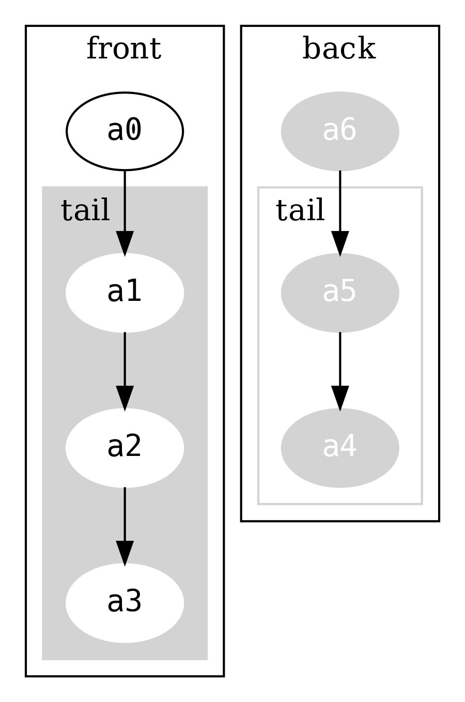

Note that the list holding the `back` is in reverse order.

Reading the `snoc` (final element) is a simple lookup into
`back.head`. Adding an element to the end of the `Dequeue` means
adding a new element to the head of the `back`, and recreating the
`FullDequeue` wrapper (which will increase `backSize` by one). Almost
all of the original structure is shared. Compare to adding a new
element to the end of an `IList`, which would involve recreating the
entire structure.

The `frontSize` and `backSize` are used to re-balance the `front` and
`back` so that they are always approximately the same size.
Re-balancing means that some operations can be slower than others
(e.g. when the entire structure must be rebuilt) but because it
happens only occasionally, we can take the average of the cost and say
that it is constant.

### `DList`

Linked lists have poor performance characteristics when large lists are appended
together. Consider the work that goes into evaluating the following:

{lang="text"}
~~~~~~~~
  ((as ::: bs) ::: (cs ::: ds)) ::: (es ::: (fs ::: gs))
~~~~~~~~

{width=50%}

This creates six intermediate lists, traversing and rebuilding every list three
times (except for `gs` which is shared between all stages).

The `DList` (for *difference list*) is a more efficient solution for this
scenario. Instead of performing the calculations at each stage, it is
represented as a function `IList[A] => IList[A]`

{lang="text"}
~~~~~~~~
  final case class DList[A](f: IList[A] => IList[A]) {
    def toIList: IList[A] = f(IList.empty)
    def ++(as: DList[A]): DList[A] = DList(xs => f(as.f(xs)))
    ...
  }
  object DList {
    def fromIList[A](as: IList[A]): DList[A] = DList(xs => as ::: xs)
  }
~~~~~~~~

A> This is a simplified implementation: it has a stack overflow bug that we will
A> fix in the chapter on Advanced Monads.

The equivalent calculation is (the symbols created via `DList.fromIList`)

{lang="text"}
~~~~~~~~
  (((a ++ b) ++ (c ++ d)) ++ (e ++ (f ++ g))).toIList
~~~~~~~~

which breaks the work into *right-associative* (i.e. fast) appends

{lang="text"}
~~~~~~~~
  (as ::: (bs ::: (cs ::: (ds ::: (es ::: (fs ::: gs))))))
~~~~~~~~

utilising the fast constructor on `IList`.

As always, there is no free lunch. There is a memory allocation overhead that
can slow down code that naturally results in right-associative appends. The
largest speedup is when `IList` operations are *left-associative*, e.g.

{lang="text"}
~~~~~~~~
  ((((((as ::: bs) ::: cs) ::: ds) ::: es) ::: fs) ::: gs)
~~~~~~~~

Difference lists suffer from bad marketing. If they were called a
`ListBuilderFactory` they'd probably be in the standard library.

### `ISet`

Tree structures are excellent for storing ordered data, with every *binary node*
holding elements that are *less than* in one branch, and *greater than* in the
other. However, naive implementations of a tree structure can become
*unbalanced* depending on the insertion order. It is possible to maintain a
perfectly balanced tree, but it is incredibly inefficient as every insertion
effectively rebuilds the entire tree.

`ISet` is an implementation of a tree of *bounded balance*, meaning that it is
approximately balanced, using the `size` of each branch to balance a node.

{lang="text"}
~~~~~~~~
  sealed abstract class ISet[A] {
    val size: Int = this match {
      case Tip()        => 0
      case Bin(_, l, r) => 1 + l.size + r.size
    }
    ...
  }
  object ISet {
    private final case class Tip[A]() extends ISet[A]
    private final case class Bin[A](a: A, l: ISet[A], r: ISet[A]) extends ISet[A]
  
    def empty[A]: ISet[A] = Tip()
    def singleton[A](x: A): ISet[A] = Bin(x, Tip(), Tip())
    def fromFoldable[F[_]: Foldable, A: Order](xs: F[A]): ISet[A] =
      xs.foldLeft(empty[A])((a, b) => a insert b)
    ...
  }
~~~~~~~~

`ISet` requires `A` to have an `Order`. The `Order[A]` instance must remain the
same between calls or internal assumptions will be invalid, leading to data
corruption: i.e. we are assuming typeclass coherence such that `Order[A]` is
unique for any `A`.

The `ISet` ADT unfortunately permits invalid trees. We strive to write ADTs that
fully describe what is and isn't valid through type restrictions, but sometimes
there are situations where it can only be achieved by the inspired touch of an
immortal. Instead, `Tip` / `Bin` are `private`, to stop users from accidentally
constructing invalid trees. `.insert` is the only way to build an `ISet`,
therefore defining what constitutes a valid tree.

{lang="text"}
~~~~~~~~
  sealed abstract class ISet[A] {
    ...
    def contains(x: A)(implicit o: Order[A]): Boolean = ...
    def union(other: ISet[A])(implicit o: Order[A]): ISet[A] = ...
    def delete(x: A)(implicit o: Order[A]): ISet[A] = ...
  
    def insert(x: A)(implicit o: Order[A]): ISet[A] = this match {
      case Tip() => ISet.singleton(x)
      case self @ Bin(y, l, r) => o.order(x, y) match {
        case LT => balanceL(y, l.insert(x), r)
        case GT => balanceR(y, l, r.insert(x))
        case EQ => self
      }
    }
    ...
  }
~~~~~~~~

The internal methods `.balanceL` and `.balanceR` are mirrors of each other, so
we only study `.balanceL`, which is called when the value we are inserting is
*less than* the current node. It is also called by the `.delete` method.

{lang="text"}
~~~~~~~~
  def balanceL[A](y: A, left: ISet[A], right: ISet[A]): ISet[A] = (left, right) match {
  ...
~~~~~~~~

Balancing requires us to classify the scenarios that can occur. We will go
through each possible scenario, visualising the `(y, left, right)` on the left
side of the page, with the balanced structure on the right, also known as the
*rotated tree*.

-   filled circles visualise a `Tip`
-   three columns visualise the `left | value | right` fields of `Bin`
-   diamonds visualise any `ISet`

The first scenario is the trivial case, which is when both the `left` and
`right` are `Tip`. In fact we will never encounter this scenario from `.insert`,
but we hit it in `.delete`

{lang="text"}
~~~~~~~~
  case (Tip(), Tip()) => singleton(y)
~~~~~~~~

{width=50%}
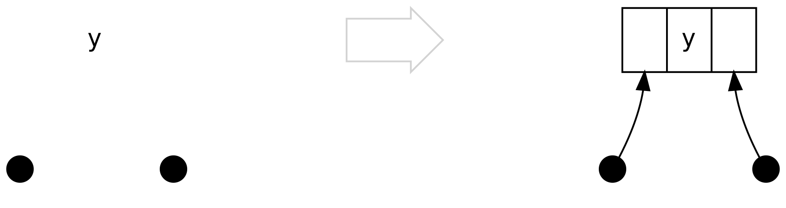

The second case is when `left` is a `Bin` containing only `Tip`, we don't need
to balance anything, we just create the obvious connection:

{lang="text"}
~~~~~~~~
  case (Bin(lx, Tip(), Tip()), Tip()) => Bin(y, left, Tip())
~~~~~~~~

{width=60%}
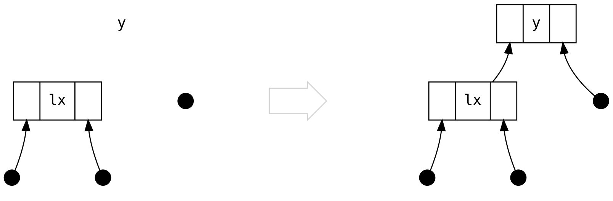

The third case is when it starts to get interesting: `left` is a `Bin`
containing a `Bin` in its `right`

{lang="text"}
~~~~~~~~
  case (Bin(lx, Tip(), Bin(lrx, _, _)), Tip()) =>
    Bin(lrx, singleton(lx), singleton(y))
~~~~~~~~

{width=70%}
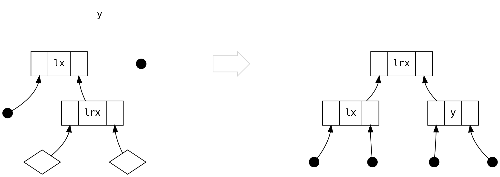

But what happened to the two diamonds sitting below `lrx`? Didn't we just lose
information? No, we didn't lose information, because we can reason (based on
size balancing) that they are always `Tip`! There is no rule in any of the
following scenarios (or in `.balanceR`) that can produce a tree of the shape
where the diamonds are `Bin`.

The fourth case is the opposite of the third case.

{lang="text"}
~~~~~~~~
  case (Bin(lx, ll, Tip()), Tip()) => Bin(lx, ll, singleton(y))
~~~~~~~~

{width=70%}
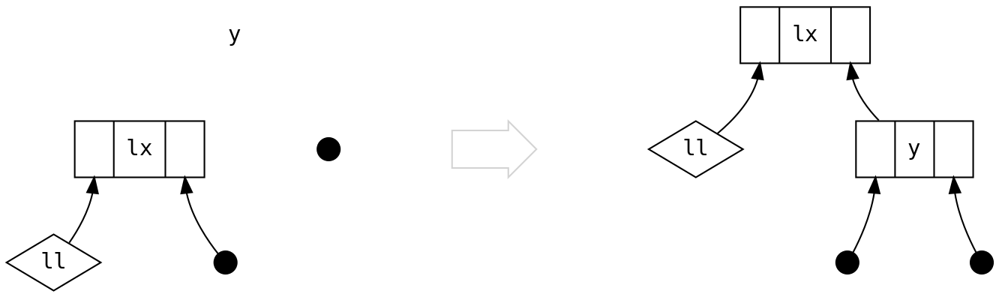

The fifth case is when we have full trees on both sides of the `left` and we
must use their relative sizes to decide on how to re-balance.

{lang="text"}
~~~~~~~~
  case (Bin(lx, ll, lr), Tip()) if (2*ll.size > lr.size) =>
    Bin(lx, ll, Bin(y, lr, Tip()))
  case (Bin(lx, ll, Bin(lrx, lrl, lrr)), Tip()) =>
    Bin(lrx, Bin(lx, ll, lrl), Bin(y, lrr, Tip()))
~~~~~~~~

For the first branch, `2*ll.size > lr.size`

{width=50%}
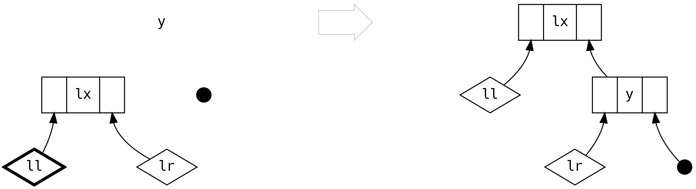

and for the second branch `2*ll.size <= lr.size`

{width=75%}
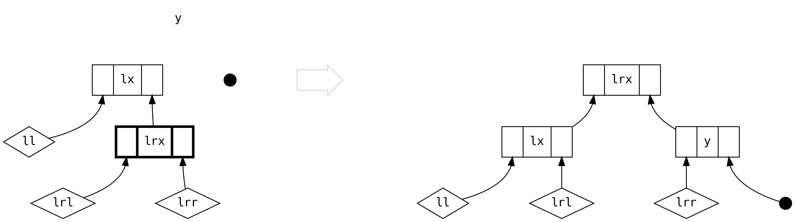

The sixth scenario introduces a tree on the `right`. When the `left` is empty we
create the obvious connection. This scenario never arises from `.insert` because
the `left` is always non-empty:

{lang="text"}
~~~~~~~~
  case (Tip(), r) => Bin(y, Tip(), r)
~~~~~~~~

{width=50%}
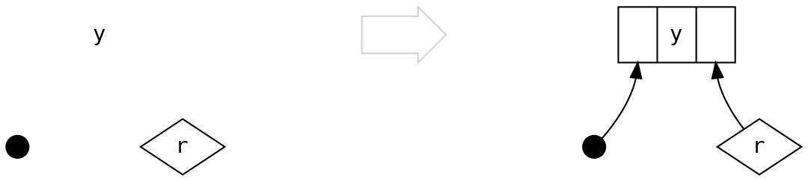

The final scenario is when we have non-empty trees on both sides. Unless the
`left` is three times or more the size of the `right`, we can do the simple
thing and create a new `Bin`

{lang="text"}
~~~~~~~~
  case _ if l.size <= 3 * r.size => Bin(y, l, r)
~~~~~~~~

{width=50%}
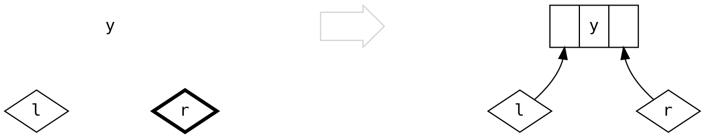

However, should the `left` be more than three times the size of the `right`, we
must balance based on the relative sizes of `ll` and `lr`, like in scenario
five.

{lang="text"}
~~~~~~~~
  case (Bin(lx, ll, lr), r) if (2*ll.size > lr.size) =>
    Bin(lx, ll, Bin(y, lr, r))
  case (Bin(lx, ll, Bin(lrx, lrl, lrr)), r) =>
    Bin(lrx, Bin(lx, ll, lrl), Bin(y, lrr, r))
~~~~~~~~

{width=60%}
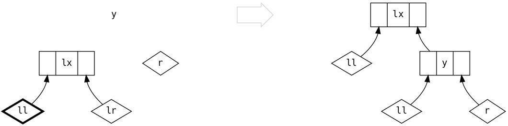

{width=75%}
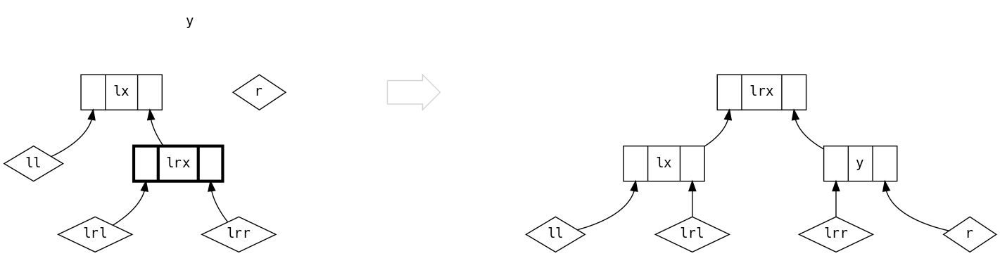

This concludes our study of the `.insert` method and how the `ISet` is
constructed. It should be of no surprise that `Foldable` is implemented in terms
of depth-first search along the `left` or `right`, as appropriate. Methods such
as `.minimum` and `.maximum` are optimal because the data structure already
encodes the ordering.

It is worth noting that some typeclass methods *cannot* be implemented as
efficiently as we would like. Consider the signature of `Foldable.element`

{lang="text"}
~~~~~~~~
  @typeclass trait Foldable[F[_]] {
    ...
    def element[A: Equal](fa: F[A], a: A): Boolean
    ...
  }
~~~~~~~~

The obvious implementation for `.element` is to defer to (almost) binary-search
`ISet.contains`. However, it is not possible because `.element` provides `Equal`
whereas `.contains` requires `Order`.

`ISet` is unable to provide a `Functor` for the same reason. In practice this
turns out to be a sensible constraint: performing a `.map` would involve
rebuilding the entire structure. It is sensible to convert to some other
datatype, such as `IList`, perform the `.map`, and convert back. A consequence
is that it is not possible to have `Traverse[ISet]` or `Applicative[ISet]`.

### `IMap`

{lang="text"}
~~~~~~~~
  sealed abstract class ==>>[A, B] {
    val size: Int = this match {
      case Tip()           => 0
      case Bin(_, _, l, r) => 1 + l.size + r.size
    }
  }
  object ==>> {
    type IMap[A, B] = A ==>> B
  
    private final case class Tip[A, B]() extends (A ==>> B)
    private final case class Bin[A, B](
      key: A,
      value: B,
      left: A ==>> B,
      right: A ==>> B
    ) extends ==>>[A, B]
  
    def apply[A: Order, B](x: (A, B)*): A ==>> B = ...
  
    def empty[A, B]: A ==>> B = Tip[A, B]()
    def singleton[A, B](k: A, x: B): A ==>> B = Bin(k, x, Tip(), Tip())
    def fromFoldable[F[_]: Foldable, A: Order, B](fa: F[(A, B)]): A ==>> B = ...
    ...
  }
~~~~~~~~

This is very familiar! Indeed, `IMap` (an alias to the lightspeed operator
`==>>`) is another size-balanced tree, but with an extra `value: B` field in
each binary branch, allowing it to store key/value pairs. Only the key type `A`
needs an `Order` and a suite of convenient methods are provided to allow easy
entry updating

{lang="text"}
~~~~~~~~
  sealed abstract class ==>>[A, B] {
    ...
    def adjust(k: A, f: B => B)(implicit o: Order[A]): A ==>> B = ...
    def adjustWithKey(k: A, f: (A, B) => B)(implicit o: Order[A]): A ==>> B = ...
    ...
  }
~~~~~~~~

### `StrictTree` and `Tree`

Both `StrictTree` and `Tree` are implementations of a *Rose Tree*, a tree
structure with an unbounded number of branches in every node (unfortunately
built from standard library collections for legacy reasons):

{lang="text"}
~~~~~~~~
  case class StrictTree[A](
    rootLabel: A,
    subForest: Vector[StrictTree[A]]
  )
~~~~~~~~

`Tree` is a *by-need* version of `StrictTree` with convenient constructors

{lang="text"}
~~~~~~~~
  class Tree[A](
    rootc: Need[A],
    forestc: Need[Stream[Tree[A]]]
  ) {
    def rootLabel = rootc.value
    def subForest = forestc.value
  }
  object Tree {
    object Node {
      def apply[A](root: =>A, forest: =>Stream[Tree[A]]): Tree[A] = ...
    }
    object Leaf {
      def apply[A](root: =>A): Tree[A] = ...
    }
  }
~~~~~~~~

The user of a Rose Tree is expected to manually balance it, which makes it
suitable for cases where it is useful to encode domain knowledge of a hierarchy
into the data structure. For example, in artificial intelligence, a Rose Tree
can be used in [clustering algorithms](https://arxiv.org/abs/1203.3468) to organise data into a hierarchy of
increasingly similar things. It is possible to represent XML documents with a
Rose Tree.

If you find yourself working with hierarchical data, consider using a Rose Tree
instead of rolling a custom data structure.

### `FingerTree`

Finger trees are generalised sequences with amortised constant cost lookup and
logarithmic concatenation. `A` is the type of data and it may help to ignore
`V`:

{lang="text"}
~~~~~~~~
  sealed abstract class FingerTree[V, A] {
    def +:(a: A): FingerTree[V, A] = ...
    def :+(a: =>A): FingerTree[V, A] = ...
    def <++>(right: =>FingerTree[V, A]): FingerTree[V, A] = ...
    ...
  }
  object FingerTree {
    private class Empty[V, A]() extends FingerTree[V, A]
    private class Single[V, A](v: V, a: =>A) extends FingerTree[V, A]
    private class Deep[V, A](
      v: V,
      left: Finger[V, A],
      spine: =>FingerTree[V, Node[V, A]],
      right: Finger[V, A]
    ) extends FingerTree[V, A]
  
    sealed abstract class Finger[V, A]
    final case class One[V, A](v: V, a1: A) extends Finger[V, A]
    final case class Two[V, A](v: V, a1: A, a2: A) extends Finger[V, A]
    final case class Three[V, A](v: V, a1: A, a2: A, a3: A) extends Finger[V, A]
    final case class Four[V, A](v: V, a1: A, a2: A, a3: A, a4: A) extends Finger[V, A]
  
    sealed abstract class Node[V, A]
    private class Node2[V, A](v: V, a1: =>A, a2: =>A) extends Node[V, A]
    private class Node3[V, A](v: V, a1: =>A, a2: =>A, a3: =>A) extends Node[V, A]
    ...
  }
~~~~~~~~

A> `<++>` is the TIE Bomber. Admittedly, sending in the proton torpedoes is a bit
A> of an overreaction: it is the same thing as the regular `Monoid` TIE Fighter
A> `|+|`.

Visualising `FingerTree` as dots, `Finger` as boxes and `Node` as boxes within
boxes:

{width=35%}
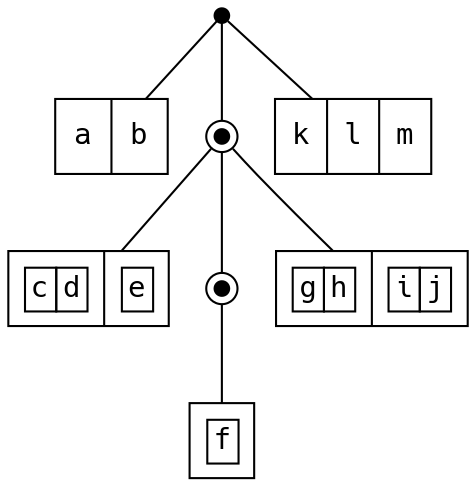

Adding elements to the front of a `FingerTree` with `+:` is efficient because
`Deep` simply adds the new element to its `left` finger. If the finger is a
`Four`, we rebuild the `spine` to take 3 of the elements as a `Node3`. Adding to
the end, `:+`, is the same but in reverse.

Appending `|+|` (also `<++>`) is more efficient than adding one element at a
time because the case of two `Deep` trees can retain the outer branches,
rebuilding the spine based on the 16 possible combinations of the two `Finger`
values in the middle.

In the above we skipped over `V`. Not shown in the ADT description is an
`implicit measurer: Reducer[A, V]` on every element of the ADT.

A> Storing typeclass instances on the ADT is considered bad style and also
A> increases the memory requirement by 64 bits for every entry. The implementation
A> of `FingerTree` is almost a decade old and is due a rewrite.

`Reducer` is an extension of `Monoid` that allows for single elements to be
added to an `M`

{lang="text"}
~~~~~~~~
  class Reducer[C, M: Monoid] {
    def unit(c: C): M
  
    def snoc(m: M, c: C): M = append(m, unit(c))
    def cons(c: C, m: M): M = append(unit(c), m)
  }
~~~~~~~~

For example, `Reducer[A, IList[A]]` can provide an efficient `.cons`

{lang="text"}
~~~~~~~~
  implicit def reducer[A]: Reducer[A, IList[A]] = new Reducer[A, IList[A]] {
    override def unit(a: A): IList[A] = IList.single(a)
    override def cons(a: A, as: IList[A]): IList[A] = a :: as
  }
~~~~~~~~

#### `IndSeq`

If we use `Int` as `V`, we can get an indexed sequence, where the measure is
*size*, allowing us to perform index-based lookup by comparing the desired index
with the size at each branch in the structure:

{lang="text"}
~~~~~~~~
  final class IndSeq[A](val self: FingerTree[Int, A])
  object IndSeq {
    private implicit def sizer[A]: Reducer[A, Int] = _ => 1
    def apply[A](as: A*): IndSeq[A] = ...
  }
~~~~~~~~

Another use of `FingerTree` is as an ordered sequence, where the measure stores
the largest value contained by each branch:

#### `OrdSeq`

{lang="text"}
~~~~~~~~
  final class OrdSeq[A: Order](val self: FingerTree[LastOption[A], A]) {
    def partition(a: A): (OrdSeq[A], OrdSeq[A]) = ...
    def insert(a: A): OrdSeq[A] = ...
    def ++(xs: OrdSeq[A]): OrdSeq[A] = ...
  }
  object OrdSeq {
    private implicit def keyer[A]: Reducer[A, LastOption[A]] = a => Tag(Some(a))
    def apply[A: Order](as: A*): OrdSeq[A] = ...
  }
~~~~~~~~

`OrdSeq` has no typeclass instances so it is only useful for incrementally
building up an ordered sequence, with duplicates. We can access the underlying
`FingerTree` when needed.

#### `Cord`

The most common use of `FingerTree` is as an efficient intermediate holder for
`String` representations in `Show`. Building a single `String` can be thousands
of times faster than the default `case class` implementation of nested
`.toString`, which builds a `String` for every layer in the ADT.

{lang="text"}
~~~~~~~~
  final case class Cord(self: FingerTree[Int, String]) {
    override def toString: String = {
      val sb = new java.lang.StringBuilder(self.measure)
      self.foreach(sb.append) // locally scoped side effect
      sb.toString
    }
    ...
  }
~~~~~~~~

For example, the `Cord[String]` instance returns a `Three` with the string in
the middle and quotes on either side

{lang="text"}
~~~~~~~~
  implicit val show: Show[String] = s => Cord(FingerTree.Three("\"", s, "\""))
~~~~~~~~

Therefore a `String` renders as it is written in source code

{lang="text"}
~~~~~~~~
  scala> val s = "foo"
         s.toString
  res: String = foo
  
  scala> s.show
  res: Cord = "foo"
~~~~~~~~

### `Heap` Priority Queue

A *priority queue* is a data structure that allows fast insertion of ordered
elements, allowing duplicates, with fast access to the *minimum* value (highest
priority). The structure is not required to store the non-minimal elements in
order. A naive implementation of a priority queue could be

{lang="text"}
~~~~~~~~
  final case class Vip[A] private (val peek: Maybe[A], xs: IList[A]) {
    def push(a: A)(implicit O: Order[A]): Vip[A] = peek match {
      case Maybe.Just(min) if a < min => Vip(a.just, min :: xs)
      case _                          => Vip(peek, a :: xs)
    }
  
    def pop(implicit O: Order[A]): Maybe[(A, Vip[A])] = peek strengthR reorder
    private def reorder(implicit O: Order[A]): Vip[A] = xs.sorted match {
      case INil()           => Vip(Maybe.empty, IList.empty)
      case ICons(min, rest) => Vip(min.just, rest)
    }
  }
  object Vip {
    def fromList[A: Order](xs: IList[A]): Vip[A] = Vip(Maybe.empty, xs).reorder
  }
~~~~~~~~

This `push` is a very fast `O(1)`, but `reorder` (and therefore `pop`) relies on
`IList.sorted` costing `O(n log n)`.

Scalaz encodes a priority queue, with a tree structure where every node has a
value less than its children, called a *Heap Priority Queue*. `Heap` has fast
push (`insert`), `union`, `size`, pop (`uncons`) and peek (`minimumO`)
operations:

{lang="text"}
~~~~~~~~
  sealed abstract class Heap[A] {
    def insert(a: A)(implicit O: Order[A]): Heap[A] = ...
    def +(a: A)(implicit O: Order[A]): Heap[A] = insert(a)
  
    def union(as: Heap[A])(implicit O: Order[A]): Heap[A] = ...
  
    def uncons(implicit O: Order[A]): Option[(A, Heap[A])] = minimumO strengthR deleteMin
    def minimumO: Option[A] = ...
    def deleteMin(implicit O: Order[A]): Heap[A] = ...
  
    ...
  }
  object Heap {
    def fromData[F[_]: Foldable, A: Order](as: F[A]): Heap[A] = ...
  
    private final case class Ranked[A](rank: Int, value: A)
  
    private final case class Empty[A]() extends Heap[A]
    private final case class NonEmpty[A](
      size: Int,
      tree: Tree[Ranked[A]]
    ) extends Heap[A]
  
    ...
  }
~~~~~~~~

A> `size` is memoized in the ADT to enable instant calculation of
A> `Foldable.length`, at a cost of 64 bits per entry. A variant of `Heap` could be
A> created with a smaller footprint, but slower `Foldable.length`.

`Heap` is implemented with a Rose `Tree` of `Ranked` values, where the `rank` is
the depth of a subtree, allowing us to depth-balance the tree. We manually
maintain the tree so the `minimum` value is at the top. An advantage of encoding
the minimum value in the data structure is that `minimumO` (also known as
*peek*) is a free lookup:

{lang="text"}
~~~~~~~~
  def minimumO: Option[A] = this match {
    case Empty()                        => None
    case NonEmpty(_, Tree.Node(min, _)) => Some(min.value)
  }
~~~~~~~~

When inserting a new entry, we compare to the current minimum and replace if the
new entry is lower:

{lang="text"}
~~~~~~~~
  def insert(a: A)(implicit O: Order[A]): Heap[A] = this match {
    case Empty() =>
      NonEmpty(1, Tree.Leaf(Ranked(0, a)))
    case NonEmpty(size, tree @ Tree.Node(min, _)) if a <= min.value =>
      NonEmpty(size + 1, Tree.Node(Ranked(0, a), Stream(tree)))
  ...
~~~~~~~~

Insertions of non-minimal values result in an *unordered* structure in the
branches of the minimum. When we encounter two or more subtrees of equal rank,
we optimistically put the minimum to the front:

{lang="text"}
~~~~~~~~
  ...
    case NonEmpty(size, Tree.Node(min,
           (t1 @ Tree.Node(Ranked(r1, x1), xs1)) #::
           (t2 @ Tree.Node(Ranked(r2, x2), xs2)) #:: ts)) if r1 == r2 =>
      lazy val t0 = Tree.Leaf(Ranked(0, a))
      val sub =
        if (x1 <= a && x1 <= x2)
          Tree.Node(Ranked(r1 + 1, x1), t0 #:: t2 #:: xs1)
        else if (x2 <= a && x2 <= x1)
          Tree.Node(Ranked(r2 + 1, x2), t0 #:: t1 #:: xs2)
        else
          Tree.Node(Ranked(r1 + 1, a), t1 #:: t2 #:: Stream())
  
      NonEmpty(size + 1, Tree.Node(Ranked(0, min.value), sub #:: ts))
  
    case NonEmpty(size,  Tree.Node(min, rest)) =>
      val t0 = Tree.Leaf(Ranked(0, a))
      NonEmpty(size + 1, Tree.Node(Ranked(0, min.value), t0 #:: rest))
  }
~~~~~~~~

Avoiding a full ordering of the tree makes `insert` very fast, `O(1)`, such that
producers adding to the queue are not penalised. However, the consumer pays the
cost when calling `uncons`, with `deleteMin` costing `O(log n)` because it must
search for the minimum value, and remove it from the tree by rebuilding. That's
fast when compared to the naive implementation.

The `union` operation also delays ordering allowing it to be `O(1)`.

If the `Order[Foo]` does not correctly capture the priority we want for the
`Heap[Foo]`, we can use `Tag` and provide a custom `Order[Foo @@ Custom]` for a
`Heap[Foo @@ Custom]`.

### `Diev` (Discrete Intervals)

We can efficiently encode the (unordered) integer values 6, 9, 2, 13, 8, 14, 10,
7, 5 as inclusive intervals `[2, 2], [5, 10], [13, 14]`. `Diev` is an efficient
encoding of *intervals* for elements `A` that have an `Enum[A]`, getting more
efficient as the contents become denser.

{lang="text"}
~~~~~~~~
  sealed abstract class Diev[A] {
    def +(interval: (A, A)): Diev[A]
    def +(value: A): Diev[A]
    def ++(other: Diev[A]): Diev[A]
  
    def -(interval: (A, A)): Diev[A]
    def -(value: A): Diev[A]
    def --(other: Diev[A]): Diev[A]
  
    def intervals: Vector[(A, A)]
    def contains(value: A): Boolean
    def contains(interval: (A, A)): Boolean
    ...
  }
  object Diev {
    private final case class DieVector[A: Enum](
      intervals: Vector[(A, A)]
    ) extends Diev[A]
  
    def empty[A: Enum]: Diev[A] = ...
    def fromValuesSeq[A: Enum](values: Seq[A]): Diev[A] = ...
    def fromIntervalsSeq[A: Enum](intervals: Seq[(A, A)]): Diev[A] = ...
  }
~~~~~~~~

When updating the `Diev`, adjacent intervals are merged (and then ordered) such
that there is a unique representation for a given set of values.

{lang="text"}
~~~~~~~~
  scala> Diev.fromValuesSeq(List(6, 9, 2, 13, 8, 14, 10, 7, 5))
  res: Diev[Int] = ((2,2)(5,10)(13,14))
  
  scala> Diev.fromValuesSeq(List(6, 9, 2, 13, 8, 14, 10, 7, 5).reverse)
  res: Diev[Int] = ((2,2)(5,10)(13,14))
~~~~~~~~

A great usecase for `Diev` is for storing time periods. For example, in our
`TradeTemplate` from the previous chapter

{lang="text"}
~~~~~~~~
  final case class TradeTemplate(
    payments: List[java.time.LocalDate],
    ccy: Option[Currency],
    otc: Option[Boolean]
  )
~~~~~~~~

if we find that the `payments` are very dense, we may wish to swap to a `Diev`
representation for performance reasons, without any change in our business logic
because we used `Monoid`, not any `List` specific methods. We would, however,
have to provide an `Enum[LocalDate]`, which is an otherwise useful thing to
have.

### `OneAnd`

Recall that `Foldable` is the scalaz equivalent of a collections API and
`Foldable1` is for non-empty collections. So far we have only seen
`NonEmptyList` to provide a `Foldable1`. The simple data structure `OneAnd`
wraps any other collection to turn it into a `Foldable1`:

{lang="text"}
~~~~~~~~
  final case class OneAnd[F[_], A](head: A, tail: F[A])
~~~~~~~~

`NonEmptyList[A]` could be an alias to `OneAnd[IList, A]`. Similarly, we can
create non-empty `Stream`, `DList` and `Tree` structures. However it may break
ordering and uniqueness characteristics of the underlying structure: a
`OneAnd[ISet, A]` is not a non-empty `ISet`, it is an `ISet` with a guaranteed
first element that may also be in the `ISet`.

## Summary

In this chapter we have skimmed over the data types that scalaz has to offer.

It is not necessary to remember everything in this chapter: think of each
section as having planted the kernel of an idea in your mind. If, in a few
months, you find yourself thinking "I remember reading about a data structure
that might be useful here" and you return to these pages, we have succeeded.

The world of functional data structures is an active area of research. Academic
publications appear regularly with new approaches to old problems. If you are
the kind of person who would like to contribute back to scalaz, finding a
functional data structure to implement would be greatly appreciated.

