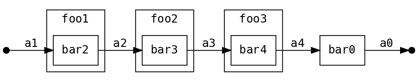
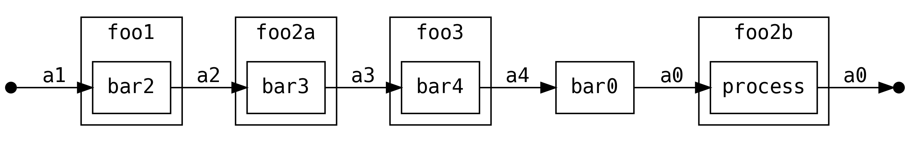
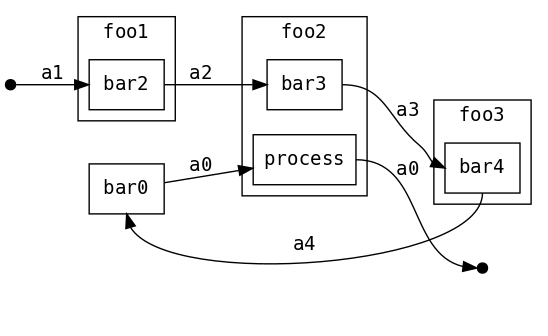
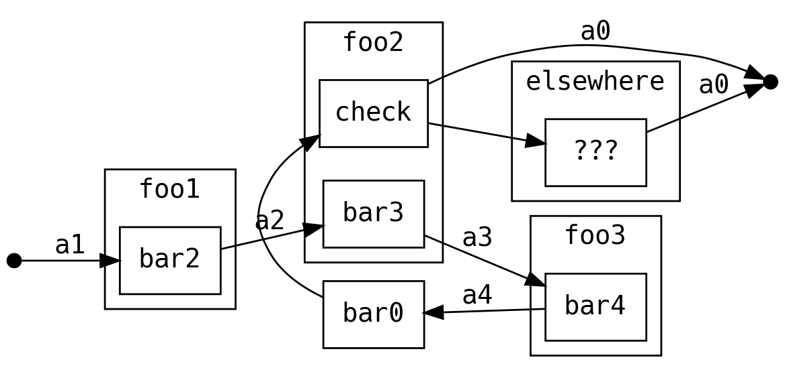
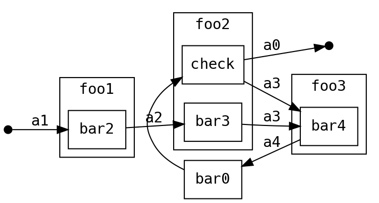
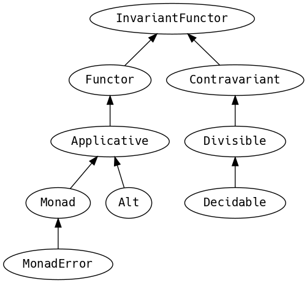
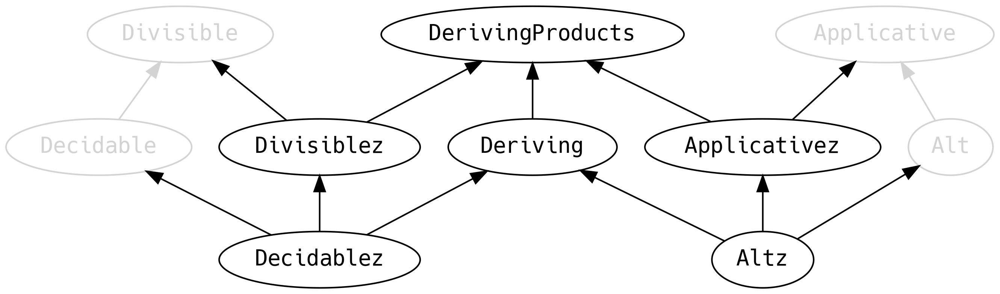

# For Comprehensions

Scala's `for` comprehension is the ideal FP abstraction for sequential
programs that interact with the world. Since we will be using it a lot,
we're going to relearn the principles of `for` and how Scalaz can help
us to write cleaner code.

This chapter doesn't try to write pure programs and the techniques are
applicable to non-FP codebases.

## Syntax Sugar

Scala's `for` is just a simple rewrite rule, also called *syntax
sugar*, that doesn't have any contextual information.

To see what a `for` comprehension is doing, we use the `show` and
`reify` feature in the REPL to print out what code looks like after
type inference.

{lang="text"}
~~~~~~~~
  scala> import scala.reflect.runtime.universe._
  scala> val a, b, c = Option(1)
  scala> show { reify {
           for { i <- a ; j <- b ; k <- c } yield (i + j + k)
         } }
  
  res:
  $read.a.flatMap(
    ((i) => $read.b.flatMap(
      ((j) => $read.c.map(
        ((k) => i.$plus(j).$plus(k)))))))
~~~~~~~~

There is a lot of noise due to additional sugarings (e.g. `+` is
rewritten `$plus`, etc). We will skip the `show` and `reify` for brevity
when the REPL line is `reify>`, and manually clean up the generated
code so that it doesn't become a distraction.

{lang="text"}
~~~~~~~~
  reify> for { i <- a ; j <- b ; k <- c } yield (i + j + k)
  
  a.flatMap {
    i => b.flatMap {
      j => c.map {
        k => i + j + k }}}
~~~~~~~~

The rule of thumb is that every `<-` (called a *generator*) is a
nested `flatMap` call, with the final generator a `map` containing the
`yield` body.

### Assignment

We can assign values inline like `ij = i + j` (a `val` keyword is not
needed).

{lang="text"}
~~~~~~~~
  reify> for {
           i <- a
           j <- b
           ij = i + j
           k <- c
         } yield (ij + k)
  
  a.flatMap {
    i => b.map { j => (j, i + j) }.flatMap {
      case (j, ij) => c.map {
        k => ij + k }}}
~~~~~~~~

A `map` over the `b` introduces the `ij` which is flat-mapped along
with the `j`, then the final `map` for the code in the `yield`.

Unfortunately we cannot assign before any generators. It has been
requested as a language feature but has not been implemented:
<https://github.com/scala/bug/issues/907>

{lang="text"}
~~~~~~~~
  scala> for {
           initial = getDefault
           i <- a
         } yield initial + i
  <console>:1: error: '<-' expected but '=' found.
~~~~~~~~

We can workaround the limitation by defining a `val` outside the `for`

{lang="text"}
~~~~~~~~
  scala> val initial = getDefault
  scala> for { i <- a } yield initial + i
~~~~~~~~

or create an `Option` out of the initial assignment

{lang="text"}
~~~~~~~~
  scala> for {
           initial <- Option(getDefault)
           i <- a
         } yield initial + i
~~~~~~~~

A> `val` doesn't have to assign to a single value, it can be anything
A> that works as a `case` in a pattern match.
A> 
A> {lang="text"}
A> ~~~~~~~~
A>   scala> val (first, second) = ("hello", "world")
A>   first: String = hello
A>   second: String = world
A>   
A>   scala> val list: List[Int] = ...
A>   scala> val head :: tail = list
A>   head: Int = 1
A>   tail: List[Int] = List(2, 3)
A> ~~~~~~~~
A> 
A> The same is true for assignment in `for` comprehensions
A> 
A> {lang="text"}
A> ~~~~~~~~
A>   scala> val maybe = Option(("hello", "world"))
A>   scala> for {
A>            entry <- maybe
A>            (first, _) = entry
A>          } yield first
A>   res: Some(hello)
A> ~~~~~~~~
A> 
A> But be careful not to miss any cases or there will be a runtime exception (a
A> *totality* failure).
A> 
A> {lang="text"}
A> ~~~~~~~~
A>   scala> val a :: tail = list
A>   caught scala.MatchError: List()
A> ~~~~~~~~

### Filter

It is possible to put `if` statements after a generator to filter
values by a predicate

{lang="text"}
~~~~~~~~
  reify> for {
           i  <- a
           j  <- b
           if i > j
           k  <- c
         } yield (i + j + k)
  
  a.flatMap {
    i => b.withFilter {
      j => i > j }.flatMap {
        j => c.map {
          k => i + j + k }}}
~~~~~~~~

Older versions of Scala used `filter`, but `Traversable.filter` creates new
collections for every predicate, so `withFilter` was introduced as the more
performant alternative. We can accidentally trigger a `withFilter` by providing
type information, interpreted as a pattern match.

{lang="text"}
~~~~~~~~
  reify> for { i: Int <- a } yield i
  
  a.withFilter {
    case i: Int => true
    case _      => false
  }.map { case i: Int => i }
~~~~~~~~

Like assignment, a generator can use a pattern match on the left hand side. But
unlike assignment (which throws `MatchError` on failure), generators are
*filtered* and will not fail at runtime. However, there is an inefficient double
application of the pattern.

A> The compiler plugin [`better-monadic-for`](https://github.com/oleg-py/better-monadic-for) produces alternative, **better**,
A> desugarings than the Scala compiler. This example is interpreted as:
A> 
A> {lang="text"}
A> ~~~~~~~~
A>   reify> for { i: Int <- a } yield i
A>   
A>   a.map { (i: Int) => i}
A> ~~~~~~~~
A> 
A> instead of inefficient double matching (in the best case) and silent filtering
A> at runtime (in the worst case). Highly recommended.

### For Each

Finally, if there is no `yield`, the compiler will use `foreach`
instead of `flatMap`, which is only useful for side-effects.

{lang="text"}
~~~~~~~~
  reify> for { i <- a ; j <- b } println(s"$i $j")
  
  a.foreach { i => b.foreach { j => println(s"$i $j") } }
~~~~~~~~

### Summary

The full set of methods supported by `for` comprehensions do not share
a common super type; each generated snippet is independently compiled.
If there were a trait, it would roughly look like:

{lang="text"}
~~~~~~~~
  trait ForComprehensible[C[_]] {
    def map[A, B](f: A => B): C[B]
    def flatMap[A, B](f: A => C[B]): C[B]
    def withFilter[A](p: A => Boolean): C[A]
    def foreach[A](f: A => Unit): Unit
  }
~~~~~~~~

If the context (`C[_]`) of a `for` comprehension doesn't provide its
own `map` and `flatMap`, all is not lost. If an implicit
`scalaz.Bind[T]` is available for `T`, it will provide `map` and
`flatMap`.

A> It often surprises developers when inline `Future` calculations in a
A> `for` comprehension do not run in parallel:
A> 
A> {lang="text"}
A> ~~~~~~~~
A>   import scala.concurrent._
A>   import ExecutionContext.Implicits.global
A>   
A>   for {
A>     i <- Future { expensiveCalc() }
A>     j <- Future { anotherExpensiveCalc() }
A>   } yield (i + j)
A> ~~~~~~~~
A> 
A> This is because the `flatMap` spawning `anotherExpensiveCalc` is
A> strictly **after** `expensiveCalc`. To ensure that two `Future`
A> calculations begin in parallel, start them outside the `for`
A> comprehension.
A> 
A> {lang="text"}
A> ~~~~~~~~
A>   val a = Future { expensiveCalc() }
A>   val b = Future { anotherExpensiveCalc() }
A>   for { i <- a ; j <- b } yield (i + j)
A> ~~~~~~~~
A> 
A> `for` comprehensions are fundamentally for defining sequential
A> programs. We will show a far superior way of defining parallel
A> computations in a later chapter. Spoiler: don't use `Future`.

## Unhappy path

So far we've only looked at the rewrite rules, not what is happening in `map`
and `flatMap`. Consider what happens when the `for` context decides that it
cannot proceed any further.

In the `Option` example, the `yield` is only called when `i,j,k` are
all defined.

{lang="text"}
~~~~~~~~
  for {
    i <- a
    j <- b
    k <- c
  } yield (i + j + k)
~~~~~~~~

If any of `a,b,c` are `None`, the comprehension short-circuits with
`None` but it doesn't tell us what went wrong.

A> There are many functions in the wild that take `Option` parameters but actually
A> require all parameters to exist. An alternative to throwing a runtime exception
A> is to use a `for` comprehension, giving us totality (a return value for every
A> input):
A> 
A> {lang="text"}
A> ~~~~~~~~
A>   def namedThings(
A>     someName  : Option[String],
A>     someNumber: Option[Int]
A>   ): Option[String] = for {
A>     name   <- someName
A>     number <- someNumber
A>   } yield s"$number ${name}s"
A> ~~~~~~~~
A> 
A> but this is verbose, clunky and bad style. If a function requires
A> every input then it should make its requirement explicit, pushing the
A> responsibility of dealing with optional parameters to its caller.
A> 
A> {lang="text"}
A> ~~~~~~~~
A>   def namedThings(name: String, num: Int) = s"$num ${name}s"
A> ~~~~~~~~

If we use `Either`, then a `Left` will cause the `for` comprehension
to short circuit with extra information, much better than `Option` for
error reporting:

{lang="text"}
~~~~~~~~
  scala> val a = Right(1)
  scala> val b = Right(2)
  scala> val c: Either[String, Int] = Left("sorry, no c")
  scala> for { i <- a ; j <- b ; k <- c } yield (i + j + k)
  
  Left(sorry, no c)
~~~~~~~~

And lastly, let's see what happens with a `Future` that fails:

{lang="text"}
~~~~~~~~
  scala> import scala.concurrent._
  scala> import ExecutionContext.Implicits.global
  scala> for {
           i <- Future.failed[Int](new Throwable)
           j <- Future { println("hello") ; 1 }
         } yield (i + j)
  scala> Await.result(f, duration.Duration.Inf)
  caught java.lang.Throwable
~~~~~~~~

The `Future` that prints to the terminal is never called because, like
`Option` and `Either`, the `for` comprehension short circuits.

Short circuiting for the unhappy path is a common and important theme.
`for` comprehensions cannot express resource cleanup: there is no way
to `try` / `finally`. This is good, in FP it puts a clear ownership of
responsibility for unexpected error recovery and resource cleanup onto
the context (which is usually a `Monad` as we will see later), not the
business logic.

## Gymnastics

Although it is easy to rewrite simple sequential code as a `for`
comprehension, sometimes we will want to do something that appears to
require mental summersaults. This section collects some practical
examples and how to deal with them.

### Fallback Logic

Say we are calling out to a method that returns an `Option`. If it is not
successful we want to fallback to another method (and so on and so on), like
when we're using a cache:

{lang="text"}
~~~~~~~~
  def getFromRedis(s: String): Option[String]
  def getFromSql(s: String): Option[String]
  
  getFromRedis(key) orElse getFromSql(key)
~~~~~~~~

If we have to do this for an asynchronous version of the same API

{lang="text"}
~~~~~~~~
  def getFromRedis(s: String): Future[Option[String]]
  def getFromSql(s: String): Future[Option[String]]
~~~~~~~~

then we have to be careful not to do extra work because

{lang="text"}
~~~~~~~~
  for {
    cache <- getFromRedis(key)
    sql   <- getFromSql(key)
  } yield cache orElse sql
~~~~~~~~

will run both queries. We can pattern match on the first result but
the type is wrong

{lang="text"}
~~~~~~~~
  for {
    cache <- getFromRedis(key)
    res   <- cache match {
               case Some(_) => cache !!! wrong type !!!
               case None    => getFromSql(key)
             }
  } yield res
~~~~~~~~

We need to create a `Future` from the `cache`

{lang="text"}
~~~~~~~~
  for {
    cache <- getFromRedis(key)
    res   <- cache match {
               case Some(_) => Future.successful(cache)
               case None    => getFromSql(key)
             }
  } yield res
~~~~~~~~

`Future.successful` creates a new `Future`, much like an `Option` or
`List` constructor.

### Early Exit

Say we have some condition that should exit early with a successful value.

If we want to exit early with an error, it is standard practice in OOP to throw
an exception

{lang="text"}
~~~~~~~~
  def getA: Int = ...
  
  val a = getA
  require(a > 0, s"$a must be positive")
  a * 10
~~~~~~~~

which can be rewritten async

{lang="text"}
~~~~~~~~
  def getA: Future[Int] = ...
  def error(msg: String): Future[Nothing] =
    Future.failed(new RuntimeException(msg))
  
  for {
    a <- getA
    b <- if (a <= 0) error(s"$a must be positive")
         else Future.successful(a)
  } yield b * 10
~~~~~~~~

But if we want to exit early with a successful return value, the simple
synchronous code:

{lang="text"}
~~~~~~~~
  def getB: Int = ...
  
  val a = getA
  if (a <= 0) 0
  else a * getB
~~~~~~~~

translates into a nested `for` comprehension when our dependencies are
asynchronous:

{lang="text"}
~~~~~~~~
  def getB: Future[Int] = ...
  
  for {
    a <- getA
    c <- if (a <= 0) Future.successful(0)
         else for { b <- getB } yield a * b
  } yield c
~~~~~~~~

A> If there is an implicit `Monad[T]` for `T[_]` (i.e. `T` is monadic) then Scalaz
A> lets us create a `T[A]` from a value `a: A` by calling `a.pure[T]`.
A> 
A> Scalaz provides `Monad[Future]`, and `.pure[Future]` calls `Future.successful`.
A> Besides `pure` being slightly shorter to type, it is a general concept that
A> works beyond `Future`, and is therefore recommended.
A> 
A> {lang="text"}
A> ~~~~~~~~
A>   for {
A>     a <- getA
A>     c <- if (a <= 0) 0.pure[Future]
A>          else for { b <- getB } yield a * b
A>   } yield c
A> ~~~~~~~~

## Incomprehensible

The context we're comprehending over must stay the same: we cannot mix
contexts.

{lang="text"}
~~~~~~~~
  scala> def option: Option[Int] = ...
  scala> def future: Future[Int] = ...
  scala> for {
           a <- option
           b <- future
         } yield a * b
  <console>:23: error: type mismatch;
   found   : Future[Int]
   required: Option[?]
           b <- future
                ^
~~~~~~~~

Nothing can help us mix arbitrary contexts in a `for` comprehension
because the meaning is not well defined.

But when we have nested contexts the intention is usually obvious yet
the compiler still doesn't accept our code.

{lang="text"}
~~~~~~~~
  scala> def getA: Future[Option[Int]] = ...
  scala> def getB: Future[Option[Int]] = ...
  scala> for {
           a <- getA
           b <- getB
         } yield a * b
                   ^
  <console>:30: error: value * is not a member of Option[Int]
~~~~~~~~

Here we want `for` to take care of the outer context and let us write
our code on the inner `Option`. Hiding the outer context is exactly
what a *monad transformer* does, and Scalaz provides implementations
for `Option` and `Either` named `OptionT` and `EitherT` respectively.

The outer context can be anything that normally works in a `for`
comprehension, but it needs to stay the same throughout.

We create an `OptionT` from each method call. This changes the context
of the `for` from `Future[Option[_]]` to `OptionT[Future, _]`.

{lang="text"}
~~~~~~~~
  scala> val result = for {
           a <- OptionT(getA)
           b <- OptionT(getB)
         } yield a * b
  result: OptionT[Future, Int] = OptionT(Future(<not completed>))
~~~~~~~~

`.run` returns us to the original context

{lang="text"}
~~~~~~~~
  scala> result.run
  res: Future[Option[Int]] = Future(<not completed>)
~~~~~~~~

The monad transformer also allows us to mix `Future[Option[_]]` calls with
methods that just return plain `Future` via `.liftM[OptionT]` (provided by
scalaz):

{lang="text"}
~~~~~~~~
  scala> def getC: Future[Int] = ...
  scala> val result = for {
           a <- OptionT(getA)
           b <- OptionT(getB)
           c <- getC.liftM[OptionT]
         } yield a * b / c
  result: OptionT[Future, Int] = OptionT(Future(<not completed>))
~~~~~~~~

and we can mix with methods that return plain `Option` by wrapping
them in `Future.successful` (`.pure[Future]`) followed by `OptionT`

{lang="text"}
~~~~~~~~
  scala> def getD: Option[Int] = ...
  scala> val result = for {
           a <- OptionT(getA)
           b <- OptionT(getB)
           c <- getC.liftM[OptionT]
           d <- OptionT(getD.pure[Future])
         } yield (a * b) / (c * d)
  result: OptionT[Future, Int] = OptionT(Future(<not completed>))
~~~~~~~~

It is messy again, but it is better than writing nested `flatMap` and
`map` by hand. We can clean it up with a DSL that handles all the
required conversions into `OptionT[Future, _]`

{lang="text"}
~~~~~~~~
  def liftFutureOption[A](f: Future[Option[A]]) = OptionT(f)
  def liftFuture[A](f: Future[A]) = f.liftM[OptionT]
  def liftOption[A](o: Option[A]) = OptionT(o.pure[Future])
  def lift[A](a: A)               = liftOption(Option(a))
~~~~~~~~

combined with the `|>` operator, which applies the function on the
right to the value on the left, to visually separate the logic from
the transformers

{lang="text"}
~~~~~~~~
  scala> val result = for {
           a <- getA       |> liftFutureOption
           b <- getB       |> liftFutureOption
           c <- getC       |> liftFuture
           d <- getD       |> liftOption
           e <- 10         |> lift
         } yield e * (a * b) / (c * d)
  result: OptionT[Future, Int] = OptionT(Future(<not completed>))
~~~~~~~~

A> `|>` is often called the *thrush operator* because of its uncanny resemblance to
A> the cute bird. Those who do not like symbolic operators can use the alias
A> `.into`.

This approach also works for `EitherT` (and others) as the inner
context, but their lifting methods are more complex and require
parameters. Scalaz provides monad transformers for a lot of its own
types, so it is worth checking if one is available.

# Application Design

In this chapter we will write the business logic and tests for a purely
functional server application. The source code for this application is included
under the `example` directory along with the book's source, however it is
recommended not to read the source code until the final chapter as there will be
significant refactors as we learn more about FP.

## Specification

Our application will manage a just-in-time build farm on a shoestring
budget. It will listen to a [Drone](https://github.com/drone/drone) Continuous Integration server, and
spawn worker agents using [Google Container Engine](https://cloud.google.com/container-engine/) (GKE) to meet the
demand of the work queue.

{width=60%}

Drone receives work when a contributor submits a github pull request
to a managed project. Drone assigns the work to its agents, each
processing one job at a time.

The goal of our app is to ensure that there are enough agents to
complete the work, with a cap on the number of agents, whilst
minimising the total cost. Our app needs to know the number of items
in the *backlog* and the number of available *agents*.

Google can spawn *nodes*, each can host multiple drone agents. When an
agent starts up, it registers itself with drone and drone takes care
of the lifecycle (including keep-alive calls to detect removed
agents).

GKE charges a fee per minute of uptime, rounded up to the nearest hour
for each node. One does not simply spawn a new node for each job in
the work queue, we must re-use nodes and retain them until their 58th
minute to get the most value for money.

Our app needs to be able to start and stop nodes, as well as check
their status (e.g. uptimes, list of inactive nodes) and to know what
time GKE believes it to be.

In addition, there is no API to talk directly to an *agent* so we do
not know if any individual agent is performing any work for the drone
server. If we accidentally stop an agent whilst it is performing work,
it is inconvenient and requires a human to restart the job.

Contributors can manually add agents to the farm, so counting agents
and nodes is not equivalent. We don't need to supply any nodes if
there are agents available.

The failure mode should always be to take the least costly option.

Both Drone and GKE have a JSON over REST API with OAuth 2.0
authentication.

## Interfaces / Algebras

We will now codify the architecture diagram from the previous section. Firstly,
we need to define a simple data type to capture a millisecond timestamp because
such a simple thing does not exist in either the Java or Scala standard
libraries:

{lang="text"}
~~~~~~~~
  import scala.concurrent.duration._
  
  final case class Epoch(millis: Long) extends AnyVal {
    def +(d: FiniteDuration): Epoch = Epoch(millis + d.toMillis)
    def -(e: Epoch): FiniteDuration = (millis - e.millis).millis
  }
~~~~~~~~

In FP, an *algebra* takes the place of an `interface` in Java, or the
set of valid messages for an `Actor` in Akka. This is the layer where
we define all side-effecting interactions of our system.

There is tight iteration between writing the business logic and the
algebra: it is a good level of abstraction to design a system.

{lang="text"}
~~~~~~~~
  trait Drone[F[_]] {
    def getBacklog: F[Int]
    def getAgents: F[Int]
  }
  
  final case class MachineNode(id: String)
  trait Machines[F[_]] {
    def getTime: F[Epoch]
    def getManaged: F[NonEmptyList[MachineNode]]
    def getAlive: F[Map[MachineNode, Epoch]]
    def start(node: MachineNode): F[MachineNode]
    def stop(node: MachineNode): F[MachineNode]
  }
~~~~~~~~

We've used `NonEmptyList`, easily created by calling `.toNel` on the
stdlib's `List` (returning an `Option[NonEmptyList]`), otherwise
everything should be familiar.

A> It is good practice in FP to encode constraints in parameters **and** return types
A> --- it means we never need to handle situations that are impossible. However,
A> this often conflicts with *Postel's law* "be liberal in what you accept from
A> others".
A> 
A> Although we agree that parameters should be as general as possible, we do not
A> agree that a function should take `Seq` unless it can handle empty `Seq`,
A> otherwise the only course of action would be to exception, breaking totality and
A> causing a side effect.
A> 
A> We prefer `NonEmptyList`, not because it is a `List`, but because of its
A> non-empty property. When we learn about Scalaz's typeclass hierarchy, we will
A> see a better way to request non-emptyness.

## Business Logic

Now we write the business logic that defines the application's
behaviour, considering only the happy path.

We need a `WorldView` class to hold a snapshot of our knowledge of the
world. If we were designing this application in Akka, `WorldView`
would probably be a `var` in a stateful `Actor`.

`WorldView` aggregates the return values of all the methods in the
algebras, and adds a *pending* field to track unfulfilled requests.

{lang="text"}
~~~~~~~~
  final case class WorldView(
    backlog: Int,
    agents: Int,
    managed: NonEmptyList[MachineNode],
    alive: Map[MachineNode, Epoch],
    pending: Map[MachineNode, Epoch],
    time: Epoch
  )
~~~~~~~~

Now we are ready to write our business logic, but we need to indicate
that we depend on `Drone` and `Machines`.

We can write the interface for the business logic

{lang="text"}
~~~~~~~~
  trait DynAgents[F[_]] {
    def initial: F[WorldView]
    def update(old: WorldView): F[WorldView]
    def act(world: WorldView): F[WorldView]
  }
~~~~~~~~

and implement it with a *module*. A module depends only on other modules,
algebras and pure functions, and can be abstracted over `F`. If an
implementation of an algebraic interface is tied to a specific type, e.g. `IO`,
it is called an *interpreter*.

{lang="text"}
~~~~~~~~
  final class DynAgentsModule[F[_]: Monad](D: Drone[F], M: Machines[F])
    extends DynAgents[F] {
~~~~~~~~

The `Monad` context bound means that `F` is *monadic*, allowing us to use `map`,
`pure` and, of course, `flatMap` via `for` comprehensions.

We have access to the algebra of `Drone` and `Machines` as `D` and `M`,
respectively. Using a single capital letter name is a common naming convention
for monad and algebra implementations.

Our business logic will run in an infinite loop (pseudocode)

{lang="text"}
~~~~~~~~
  state = initial()
  while True:
    state = update(state)
    state = act(state)
~~~~~~~~

### initial

In `initial` we call all external services and aggregate their results
into a `WorldView`. We default the `pending` field to an empty `Map`.

{lang="text"}
~~~~~~~~
  def initial: F[WorldView] = for {
    db <- D.getBacklog
    da <- D.getAgents
    mm <- M.getManaged
    ma <- M.getAlive
    mt <- M.getTime
  } yield WorldView(db, da, mm, ma, Map.empty, mt)
~~~~~~~~

Recall from Chapter 1 that `flatMap` (i.e. when we use the `<-`
generator) allows us to operate on a value that is computed at
runtime. When we return an `F[_]` we are returning another program to
be interpreted at runtime, that we can then `flatMap`. This is how we
safely chain together sequential side-effecting code, whilst being
able to provide a pure implementation for tests. FP could be described
as Extreme Mocking.

### update

`update` should call `initial` to refresh our world view, preserving
known `pending` actions.

If a node has changed state, we remove it from `pending` and if a
pending action is taking longer than 10 minutes to do anything, we
assume that it failed and forget that we asked to do it.

{lang="text"}
~~~~~~~~
  def update(old: WorldView): F[WorldView] = for {
    snap <- initial
    changed = symdiff(old.alive.keySet, snap.alive.keySet)
    pending = (old.pending -- changed).filterNot {
      case (_, started) => (snap.time - started) >= 10.minutes
    }
    update = snap.copy(pending = pending)
  } yield update
  
  private def symdiff[T](a: Set[T], b: Set[T]): Set[T] =
    (a union b) -- (a intersect b)
~~~~~~~~

Concrete functions like `.symdiff` don't need test interpreters, they have
explicit inputs and outputs, so we could move all pure code into standalone
methods on a stateless `object`, testable in isolation. We're happy testing only
the public methods, preferring that our business logic is easy to read.

### act

The `act` method is slightly more complex, so we will split it into two
parts for clarity: detection of when an action needs to be taken,
followed by taking action. This simplification means that we can only
perform one action per invocation, but that is reasonable because we
can control the invocations and may choose to re-run `act` until no
further action is taken.

We write the scenario detectors as extractors for `WorldView`, which
is nothing more than an expressive way of writing `if` / `else`
conditions.

We need to add agents to the farm if there is a backlog of work, we
have no agents, we have no nodes alive, and there are no pending
actions. We return a candidate node that we would like to start:

{lang="text"}
~~~~~~~~
  private object NeedsAgent {
    def unapply(world: WorldView): Option[MachineNode] = world match {
      case WorldView(backlog, 0, managed, alive, pending, _)
           if backlog > 0 && alive.isEmpty && pending.isEmpty
             => Option(managed.head)
      case _ => None
    }
  }
~~~~~~~~

If there is no backlog, we should stop all nodes that have become stale (they
are not doing any work). However, since Google charge per hour we only shut down
machines in their 58th minute to get the most out of our money. We return the
non-empty list of nodes to stop.

As a financial safety net, all nodes should have a maximum lifetime of
5 hours.

{lang="text"}
~~~~~~~~
  private object Stale {
    def unapply(world: WorldView): Option[NonEmptyList[MachineNode]] = world match {
      case WorldView(backlog, _, _, alive, pending, time) if alive.nonEmpty =>
        (alive -- pending.keys).collect {
          case (n, started) if backlog == 0 && (time - started).toMinutes % 60 >= 58 => n
          case (n, started) if (time - started) >= 5.hours => n
        }.toList.toNel
  
      case _ => None
    }
  }
~~~~~~~~

Now that we have detected the scenarios that can occur, we can write
the `act` method. When we schedule a node to be started or stopped, we
add it to `pending` noting the time that we scheduled the action.

{lang="text"}
~~~~~~~~
  def act(world: WorldView): F[WorldView] = world match {
    case NeedsAgent(node) =>
      for {
        _ <- M.start(node)
        update = world.copy(pending = Map(node -> world.time))
      } yield update
  
    case Stale(nodes) =>
      nodes.foldLeftM(world) { (world, n) =>
        for {
          _ <- M.stop(n)
          update = world.copy(pending = world.pending + (n -> world.time))
        } yield update
      }
  
    case _ => world.pure[F]
  }
~~~~~~~~

Because `NeedsAgent` and `Stale` do not cover all possible situations,
we need a catch-all `case _` to do nothing. Recall from Chapter 2 that
`.pure` creates the `for`'s (monadic) context from a value.

`foldLeftM` is like `foldLeft`, but each iteration of the fold may return a
monadic value. In our case, each iteration of the fold returns `F[WorldView]`.
The `M` is for Monadic. We will find more of these *lifted* methods that behave
as one would expect, taking monadic values in place of values.

## Unit Tests

The FP approach to writing applications is a designer's dream: delegate writing
the implementations of algebras to team members while focusing on making
business logic meet the requirements.

Our application is highly dependent on timing and third party webservices. If
this was a traditional OOP application, we'd create mocks for all the method
calls, or test actors for the outgoing mailboxes. FP mocking is equivalent to
providing an alternative implementation of dependency algebras. The algebras
already isolate the parts of the system that need to be *mocked*, i.e.
interpreted differently in the unit tests.

We will start with some test data

{lang="text"}
~~~~~~~~
  object Data {
    val node1   = MachineNode("1243d1af-828f-4ba3-9fc0-a19d86852b5a")
    val node2   = MachineNode("550c4943-229e-47b0-b6be-3d686c5f013f")
    val managed = NonEmptyList(node1, node2)
  
    val time1: Epoch = epoch"2017-03-03T18:07:00Z"
    val time2: Epoch = epoch"2017-03-03T18:59:00Z" // +52 mins
    val time3: Epoch = epoch"2017-03-03T19:06:00Z" // +59 mins
    val time4: Epoch = epoch"2017-03-03T23:07:00Z" // +5 hours
  
    val needsAgents = WorldView(5, 0, managed, Map.empty, Map.empty, time1)
  }
  import Data._
~~~~~~~~

A> The `epoch` string interpolator is written with Jon Pretty's [contextual](https://github.com/propensive/contextual) library,
A> giving us compiletime safety around string constructors of a type:
A> 
A> {lang="text"}
A> ~~~~~~~~
A>   import java.time.Instant
A>   object EpochInterpolator extends Verifier[Epoch] {
A>     def check(s: String): Either[(Int, String), Epoch] =
A>       try Right(Epoch(Instant.parse(s).toEpochMilli))
A>       catch { case _ => Left((0, "not in ISO-8601 format")) }
A>   }
A>   implicit class EpochMillisStringContext(sc: StringContext) {
A>     val epoch = Prefix(EpochInterpolator, sc)
A>   }
A> ~~~~~~~~

We implement algebras by extending `Drone` and `Machines` with a specific
monadic context, `Id` being the simplest.

Our "mock" implementations simply play back a fixed `WorldView`. We've
isolated the state of our system, so we can use `var` to store the
state:

{lang="text"}
~~~~~~~~
  class Mutable(state: WorldView) {
    var started, stopped: Int = 0
  
    private val D: Drone[Id] = new Drone[Id] {
      def getBacklog: Int = state.backlog
      def getAgents: Int = state.agents
    }
  
    private val M: Machines[Id] = new Machines[Id] {
      def getAlive: Map[MachineNode, Epoch] = state.alive
      def getManaged: NonEmptyList[MachineNode] = state.managed
      def getTime: Epoch = state.time
      def start(node: MachineNode): MachineNode = { started += 1 ; node }
      def stop(node: MachineNode): MachineNode = { stopped += 1 ; node }
    }
  
    val program = new DynAgentsModule[Id](D, M)
  }
~~~~~~~~

A> We will return to this code later on and replace `var` with something safer.

When we write a unit test (here using `FlatSpec` from Scalatest), we create an
instance of `Mutable` and then import all of its members.

Our implicit `drone` and `machines` both use the `Id` execution
context and therefore interpreting this program with them returns an
`Id[WorldView]` that we can assert on.

In this trivial case we just check that the `initial` method returns
the same value that we use in the static implementations:

{lang="text"}
~~~~~~~~
  "Business Logic" should "generate an initial world view" in {
    val mutable = new Mutable(needsAgents)
    import mutable._
  
    program.initial shouldBe needsAgents
  }
~~~~~~~~

We can create more advanced tests of the `update` and `act` methods,
helping us flush out bugs and refine the requirements:

{lang="text"}
~~~~~~~~
  it should "remove changed nodes from pending" in {
    val world = WorldView(0, 0, managed, Map(node1 -> time3), Map.empty, time3)
    val mutable = new Mutable(world)
    import mutable._
  
    val old = world.copy(alive = Map.empty,
                         pending = Map(node1 -> time2),
                         time = time2)
    program.update(old) shouldBe world
  }
  
  it should "request agents when needed" in {
    val mutable = new Mutable(needsAgents)
    import mutable._
  
    val expected = needsAgents.copy(
      pending = Map(node1 -> time1)
    )
  
    program.act(needsAgents) shouldBe expected
  
    mutable.stopped shouldBe 0
    mutable.started shouldBe 1
  }
~~~~~~~~

It would be boring to go through the full test suite. The following tests are
easy to implement using the same approach:

-   not request agents when pending
-   don't shut down agents if nodes are too young
-   shut down agents when there is no backlog and nodes will shortly incur new costs
-   not shut down agents if there are pending actions
-   shut down agents when there is no backlog if they are too old
-   shut down agents, even if they are potentially doing work, if they are too old
-   ignore unresponsive pending actions during update

All of these tests are synchronous and isolated to the test runner's
thread (which could be running tests in parallel). If we'd designed
our test suite in Akka, our tests would be subject to arbitrary
timeouts and failures would be hidden in logfiles.

The productivity boost of simple tests for business logic cannot be
overstated. Consider that 90% of an application developer's time
interacting with the customer is in refining, updating and fixing
these business rules. Everything else is implementation detail.

## Parallel

The application that we have designed runs each of its algebraic
methods sequentially. But there are some obvious places where work can
be performed in parallel.

### initial

In our definition of `initial` we could ask for all the information we
need at the same time instead of one query at a time.

As opposed to `flatMap` for sequential operations, Scalaz uses
`Apply` syntax for parallel operations:

{lang="text"}
~~~~~~~~
  ^^^^(D.getBacklog, D.getAgents, M.getManaged, M.getAlive, M.getTime)
~~~~~~~~

which can also use infix notation:

{lang="text"}
~~~~~~~~
  (D.getBacklog |@| D.getAgents |@| M.getManaged |@| M.getAlive |@| M.getTime)
~~~~~~~~

If each of the parallel operations returns a value in the same monadic
context, we can apply a function to the results when they all return.
Rewriting `update` to take advantage of this:

{lang="text"}
~~~~~~~~
  def initial: F[WorldView] =
    ^^^^(D.getBacklog, D.getAgents, M.getManaged, M.getAlive, M.getTime) {
      case (db, da, mm, ma, mt) => WorldView(db, da, mm, ma, Map.empty, mt)
    }
~~~~~~~~

### act

In the current logic for `act`, we are stopping each node
sequentially, waiting for the result, and then proceeding. But we
could stop all the nodes in parallel and then update our view of the
world.

A disadvantage of doing it this way is that any failures will cause us
to short-circuit before updating the `pending` field. But that is a
reasonable tradeoff since our `update` will gracefully handle the case
where a `node` is shut down unexpectedly.

We need a method that operates on `NonEmptyList` that allows us to
`map` each element into an `F[MachineNode]`, returning an
`F[NonEmptyList[MachineNode]]`. The method is called `traverse`, and
when we `flatMap` over it we get a `NonEmptyList[MachineNode]` that we
can deal with in a simple way:

{lang="text"}
~~~~~~~~
  for {
    stopped <- nodes.traverse(M.stop)
    updates = stopped.map(_ -> world.time).toList.toMap
    update = world.copy(pending = world.pending ++ updates)
  } yield update
~~~~~~~~

Arguably, this is easier to understand than the sequential version.

## Summary

1.  *algebras* define the interface between systems.
2.  *modules* are implementations of an algebra in terms of other algebras.
3.  *interpreters* are concrete implementations of an algebra for a fixed `F[_]`.
4.  Test interpreters can replace the side-effecting parts of the system,
    giving a high amount of test coverage.

# Data and Functionality

From OOP we are used to thinking about data and functionality
together: class hierarchies carry methods, and traits can demand that
data fields exist. Runtime polymorphism of an object is in terms of
"is a" relationships, requiring classes to inherit from common
interfaces. This can get messy as a codebase grows. Simple data types
become obscured by hundreds of lines of methods, trait mixins suffer
from initialisation order errors, and testing / mocking of highly
coupled components becomes a chore.

FP takes a different approach, defining data and functionality
separately. In this chapter, we will cover the basics of data types
and the advantages of constraining ourselves to a subset of the Scala
language. We will also discover *typeclasses* as a way to achieve
compiletime polymorphism: thinking about functionality of a data
structure in terms of "has a" rather than "is a" relationships.

## Data

The fundamental building blocks of data types are

-   `final case class` also known as *products*
-   `sealed abstract class` also known as *coproducts*
-   `case object` and `Int`, `Double`, `String` (etc) *values*

with no methods or fields other than the constructor parameters. We prefer
`abstract class` to `trait` in order to get better binary compatibility and to
discourage trait mixing.

The collective name for *products*, *coproducts* and *values* is
*Algebraic Data Type* (ADT).

We compose data types from the `AND` and `XOR` (exclusive `OR`)
Boolean algebra: a product contains every type that it is composed of,
but a coproduct can be only one. For example

-   product: `ABC = a AND b AND c`
-   coproduct: `XYZ = x XOR y XOR z`

written in Scala

{lang="text"}
~~~~~~~~
  // values
  case object A
  type B = String
  type C = Int
  
  // product
  final case class ABC(a: A.type, b: B, c: C)
  
  // coproduct
  sealed abstract class XYZ
  case object X extends XYZ
  case object Y extends XYZ
  final case class Z(b: B) extends XYZ
~~~~~~~~

### Generalised ADTs

When we introduce a type parameter into an ADT, we call it a
*Generalised Algebraic Data Type* (GADT).

`scalaz.IList`, a safe alternative to the stdlib `List`, is a GADT:

{lang="text"}
~~~~~~~~
  sealed abstract class IList[A]
  final case class INil[A]() extends IList[A]
  final case class ICons[A](head: A, tail: IList[A]) extends IList[A]
~~~~~~~~

If an ADT refers to itself, we call it a *recursive type*. `IList` is
recursive because `ICons` contains a reference to `IList`.

### Functions on ADTs

ADTs can contain *pure functions*

{lang="text"}
~~~~~~~~
  final case class UserConfiguration(accepts: Int => Boolean)
~~~~~~~~

But ADTs that contain functions come with some caveats as they don't
translate perfectly onto the JVM. For example, legacy `Serializable`,
`hashCode`, `equals` and `toString` do not behave as one might
reasonably expect.

Unfortunately, `Serializable` is used by popular frameworks, despite
far superior alternatives. A common pitfall is forgetting that
`Serializable` may attempt to serialise the entire closure of a
function, which can crash production servers. A similar caveat applies
to legacy Java classes such as `Throwable`, which can carry references
to arbitrary objects.

We will explore alternatives to the legacy methods when we discuss the
Scalaz library in the next chapter, at the cost of losing
interoperability with some legacy Java and Scala code.

### Exhaustivity

It is important that we use `sealed abstract class`, not just
`abstract class`, when defining a data type. Sealing a `class` means
that all subtypes must be defined in the same file, allowing the
compiler to know about them in pattern match exhaustivity checks and
in macros that eliminate boilerplate. e.g.

{lang="text"}
~~~~~~~~
  scala> sealed abstract class Foo
         final case class Bar(flag: Boolean) extends Foo
         final case object Baz extends Foo
  
  scala> def thing(foo: Foo) = foo match {
           case Bar(_) => true
         }
  <console>:14: error: match may not be exhaustive.
  It would fail on the following input: Baz
         def thing(foo: Foo) = foo match {
                               ^
~~~~~~~~

This shows the developer what they have broken when they add a new
product to the codebase. We're using `-Xfatal-warnings`, otherwise
this is just a warning.

However, the compiler will not perform exhaustivity checking if the
`class` is not sealed or if there are guards, e.g.

{lang="text"}
~~~~~~~~
  scala> def thing(foo: Foo) = foo match {
           case Bar(flag) if flag => true
         }
  
  scala> thing(Baz)
  scala.MatchError: Baz (of class Baz$)
    at .thing(<console>:15)
~~~~~~~~

To remain safe, don't use guards on `sealed` types.

The [`-Xstrict-patmat-analysis`](https://github.com/scala/scala/pull/5617) flag has been proposed as a language
improvement to perform additional pattern matcher checks.

### Alternative Products and Coproducts

Another form of product is a tuple, which is like an unlabelled `final
case class`.

`(A.type, B, C)` is equivalent to `ABC` in the above example but it is best to
use `final case class` when part of an ADT because the lack of names is awkward
to deal with, and `case class` has much better performance for primitive values.

Another form of coproduct is when we nest `Either` types. e.g.

{lang="text"}
~~~~~~~~
  Either[X.type, Either[Y.type, Z]]
~~~~~~~~

equivalent to the `XYZ` sealed abstract class. A cleaner syntax to define
nested `Either` types is to create an alias type ending with a colon,
allowing infix notation with association from the right:

{lang="text"}
~~~~~~~~
  type |:[L,R] = Either[L, R]
  
  X.type |: Y.type |: Z
~~~~~~~~

This is useful to create anonymous coproducts when we cannot put all
the implementations into the same source file.

{lang="text"}
~~~~~~~~
  type Accepted = String |: Long |: Boolean
~~~~~~~~

Yet another alternative coproduct is to create a custom `sealed abstract class`
with `final case class` definitions that simply wrap the desired type:

{lang="text"}
~~~~~~~~
  sealed abstract class Accepted
  final case class AcceptedString(value: String) extends Accepted
  final case class AcceptedLong(value: Long) extends Accepted
  final case class AcceptedBoolean(value: Boolean) extends Accepted
~~~~~~~~

Pattern matching on these forms of coproduct can be tedious, which is why [Union
Types](https://contributors.scala-lang.org/t/733) are being explored in the Dotty next-generation Scala compiler. Macros
such as [totalitarian](https://github.com/propensive/totalitarian) and [iotaz](https://github.com/frees-io/iota) exist as alternative ways of encoding anonymous
coproducts.

### Convey Information

Besides being a container for necessary business information, data
types can be used to encode constraints. For example,

{lang="text"}
~~~~~~~~
  final case class NonEmptyList[A](head: A, tail: IList[A])
~~~~~~~~

can never be empty. This makes `scalaz.NonEmptyList` a useful data type despite
containing the same information as `IList`.

Product types often contain types that are far more general than is allowed. In
traditional OOP this would be handled with input validation through assertions:

{lang="text"}
~~~~~~~~
  final case class Person(name: String, age: Int) {
    require(name.nonEmpty && age > 0) // breaks Totality, don't do this!
  }
~~~~~~~~

Instead, we can use the `Either` data type to provide `Right[Person]` for valid
instances and protect invalid instances from propagating. Note that the
constructor is `private`:

{lang="text"}
~~~~~~~~
  final case class Person private(name: String, age: Int)
  object Person {
    def apply(name: String, age: Int): Either[String, Person] = {
      if (name.nonEmpty && age > 0) Right(new Person(name, age))
      else Left(s"bad input: $name, $age")
    }
  }
  
  def welcome(person: Person): String =
    s"${person.name} you look wonderful at ${person.age}!"
  
  for {
    person <- Person("", -1)
  } yield welcome(person)
~~~~~~~~

#### Refined Data Types

A clean way to restrict the values of a general type is with the `refined`
library, providing a suite of restrictions to the contents of data. To install
refined, add the following to `build.sbt`

{lang="text"}
~~~~~~~~
  libraryDependencies += "eu.timepit" %% "refined-scalaz" % "0.9.2"
~~~~~~~~

and the following imports

{lang="text"}
~~~~~~~~
  import eu.timepit.refined
  import refined.api.Refined
~~~~~~~~

`Refined` allows us to define `Person` using adhoc refined types to capture
requirements exactly, written `A Refined B`.

A> All types with two parameters can be written *infix* in Scala. For example,
A> `Either[String, Int]` is the same as `String Either Int`. It is conventional for
A> `Refined` to be written infix since `A Refined B` can be read as "an `A` that
A> meets the requirements defined in `B`".

{lang="text"}
~~~~~~~~
  import refined.numeric.Positive
  import refined.collection.NonEmpty
  
  final case class Person(
    name: String Refined NonEmpty,
    age: Int Refined Positive
  )
~~~~~~~~

The underlying value can be obtained with `.value`. We can construct a
value at runtime using `.refineV`, returning an `Either`

{lang="text"}
~~~~~~~~
  scala> import refined.refineV
  scala> refineV[NonEmpty]("")
  Left(Predicate isEmpty() did not fail.)
  
  scala> refineV[NonEmpty]("Sam")
  Right(Sam)
~~~~~~~~

If we add the following import

{lang="text"}
~~~~~~~~
  import refined.auto._
~~~~~~~~

we can construct valid values at compiletime and get an error if the provided
value does not meet the requirements

{lang="text"}
~~~~~~~~
  scala> val sam: String Refined NonEmpty = "Sam"
  Sam
  
  scala> val empty: String Refined NonEmpty = ""
  <console>:21: error: Predicate isEmpty() did not fail.
~~~~~~~~

More complex requirements can be captured, for example we can use the built-in
rule `MaxSize` with the following imports

{lang="text"}
~~~~~~~~
  import refined.W
  import refined.boolean.And
  import refined.collection.MaxSize
~~~~~~~~

capturing the requirement that the `String` must be both non-empty and have a
maximum size of 10 characters:

{lang="text"}
~~~~~~~~
  type Name = NonEmpty And MaxSize[W.`10`.T]
  
  final case class Person(
    name: String Refined Name,
    age: Int Refined Positive
  )
~~~~~~~~

A> The `W` notation is short for "witness". This syntax will be much simpler in
A> Scala 2.13, which has support for *literal types*:
A> 
A> {lang="text"}
A> ~~~~~~~~
A>   type Name = NonEmpty And MaxSize[10]
A> ~~~~~~~~

It is easy to define custom requirements that are not covered by the refined
library. For example in `drone-dynamaic-agents` we will need a way of ensuring
that a `String` contains `application/x-www-form-urlencoded` content. We can
create a `Refined` rule using the Java regular expression library:

{lang="text"}
~~~~~~~~
  sealed abstract class UrlEncoded
  object UrlEncoded {
    private[this] val valid: Pattern =
      Pattern.compile("\\A(\\p{Alnum}++|[-.*_+=&]++|%\\p{XDigit}{2})*\\z")
  
    implicit def urlValidate: Validate.Plain[String, UrlEncoded] =
      Validate.fromPredicate(
        s => valid.matcher(s).find(),
        identity,
        new UrlEncoded {}
      )
  }
~~~~~~~~

### Simple to Share

By not providing any functionality, ADTs can have a minimal set of
dependencies. This makes them easy to publish and share with other
developers. By using a simple data modelling language, it makes it
possible to interact with cross-discipline teams, such as DBAs, UI
developers and business analysts, using the actual code instead of a
hand written document as the source of truth.

Furthermore, tooling can be more easily written to produce or consume
schemas from other programming languages and wire protocols.

### Counting Complexity

The complexity of a data type is the count of values that can exist. A good data
type has the least amount of complexity it needs to hold the information it
conveys, and no more.

Values have a built-in complexity:

-   `Unit` has one value (why it is called "unit")
-   `Boolean` has two values
-   `Int` has 4,294,967,295 values
-   `String` has effectively infinite values

To find the complexity of a product, we multiply the complexity of
each part.

-   `(Boolean, Boolean)` has 4 values (`2*2`)
-   `(Boolean, Boolean, Boolean)` has 8 values (`2*2*2`)

To find the complexity of a coproduct, we add the complexity of each
part.

-   `(Boolean |: Boolean)` has 4 values (`2+2`)
-   `(Boolean |: Boolean |: Boolean)` has 6 values (`2+2+2`)

To find the complexity of a GADT, multiply each part by the complexity
of the type parameter:

-   `Option[Boolean]` has 3 values, `Some[Boolean]` and `None` (`2+1`)

In FP, functions are *total* and must return an value for every
input, no `Exception`. Minimising the complexity of inputs and outputs
is the best way to achieve totality. As a rule of thumb, it is a sign
of a badly designed function when the complexity of a function's
return value is larger than the product of its inputs: it is a source
of entropy.

The complexity of a total function is the number of possible functions that can
satisfy the type signature: the output to the power of the input.

-   `Unit => Boolean` has complexity 2
-   `Boolean => Boolean` has complexity 4
-   `Option[Boolean] => Option[Boolean]` has complexity 27
-   `Boolean => Int` is a mere quintillion going on a sextillion.
-   `Int => Boolean` is so big that if all implementations were assigned a unique
    number, each would require 4 gigabytes to represent.

In reality, `Int => Boolean` will be something simple like `isOdd`, `isEven` or
a sparse `BitSet`. This function, when used in an ADT, could be better replaced
with a coproduct labelling the limited set of functions that are relevant.

When our complexity is "infinity in, infinity out" we should introduce
restrictive data types and validation closer to the point of input with
`Refined` from the previous section.

The ability to count the complexity of a type signature has one other practical
application: we can find simpler type signatures with High School algebra! To go
from a type signature to its algebra of complexity, simply replace

-   `Either[A, B]` with `a + b`
-   `(A, B)` with `a * b`
-   `A => B` with `b ^ a`

do some rearranging, and convert back. For example, say we've designed a
framework based on callbacks and we've managed to work ourselves into the
situation where we have created this type signature:

{lang="text"}
~~~~~~~~
  (A => C) => ((B => C) => C)
~~~~~~~~

We can convert and rearrange

{lang="text"}
~~~~~~~~
  (c ^ (c ^ b)) ^ (c ^ a)
  = c ^ ((c ^ b) * (c ^ a))
  = c ^ (c ^ (a + b))
~~~~~~~~

then convert back to types and get

{lang="text"}
~~~~~~~~
  (Either[A, B] => C) => C
~~~~~~~~

which is much simpler: we only need to ask the users of our framework to provide
a `Either[A, B] => C`.

The same line of reasoning can be used to prove that

{lang="text"}
~~~~~~~~
  A => B => C
~~~~~~~~

is equivalent to

{lang="text"}
~~~~~~~~
  (A, B) => C
~~~~~~~~

also known as *Currying*.

### Prefer Coproduct over Product

An archetypal modelling problem that comes up a lot is when there are
mutually exclusive configuration parameters `a`, `b` and `c`. The
product `(a: Boolean, b: Boolean, c: Boolean)` has complexity 8
whereas the coproduct

{lang="text"}
~~~~~~~~
  sealed abstract class Config
  object Config {
    case object A extends Config
    case object B extends Config
    case object C extends Config
  }
~~~~~~~~

has a complexity of 3. It is better to model these configuration
parameters as a coproduct rather than allowing 5 invalid states to
exist.

The complexity of a data type also has implications on testing. It is
practically impossible to test every possible input to a function, but it is
easy to test a sample of values with the [Scalacheck](https://www.scalacheck.org/) property testing framework.
If a random sample of a data type has a low probability of being valid, it is a
sign that the data is modelled incorrectly.

### Optimisations

A big advantage of using a simplified subset of the Scala language to
represent data types is that tooling can optimise the JVM bytecode
representation.

For example, we could pack `Boolean` and `Option` fields into an `Array[Byte]`,
cache values, memoise `hashCode`, optimise `equals`, use `@switch` statements
when pattern matching, and much more.

These optimisations are not applicable to OOP `class` hierarchies that
may be managing state, throwing exceptions, or providing adhoc method
implementations.

## Functionality

Pure functions are typically defined as methods on an `object`.

{lang="text"}
~~~~~~~~
  package object math {
    def sin(x: Double): Double = java.lang.Math.sin(x)
    ...
  }
  
  math.sin(1.0)
~~~~~~~~

However, it can be clunky to use `object` methods since it reads
inside-out, not left to right. In addition, a function on an `object`
steals the namespace. If we were to define `sin(t: T)` somewhere else
we get *ambiguous reference* errors. This is the same problem as
Java's static methods vs class methods.

W> The sort of developer who puts methods on a `trait`, requiring users to mix it
W> with the *cake pattern*, is going straight to hell. It leaks internal
W> implementation detail to public APIs, bloats bytecode, makes binary
W> compatibility basically impossible, and confuses IDE autocompleters.

With the `implicit class` language feature (also known as *extension
methodology* or *syntax*), and a little boilerplate, we can get the
familiar style:

{lang="text"}
~~~~~~~~
  scala> implicit class DoubleOps(x: Double) {
           def sin: Double = math.sin(x)
         }
  
  scala> (1.0).sin
  res: Double = 0.8414709848078965
~~~~~~~~

Often it is best to just skip the `object` definition and go straight
for an `implicit class`, keeping boilerplate to a minimum:

{lang="text"}
~~~~~~~~
  implicit class DoubleOps(x: Double) {
    def sin: Double = java.lang.Math.sin(x)
  }
~~~~~~~~

A> `implicit class` is syntax sugar for an implicit conversion:
A> 
A> {lang="text"}
A> ~~~~~~~~
A>   implicit def DoubleOps(x: Double): DoubleOps = new DoubleOps(x)
A>   class DoubleOps(x: Double) {
A>     def sin: Double = java.lang.Math.sin(x)
A>   }
A> ~~~~~~~~
A> 
A> Which unfortunately has a runtime cost: each time the extension method
A> is called, an intermediate `DoubleOps` will be constructed and then
A> thrown away. This can contribute to GC pressure in hotspots.
A> 
A> There is a slightly more verbose form of `implicit class` that avoids
A> the allocation and is therefore preferred:
A> 
A> {lang="text"}
A> ~~~~~~~~
A>   implicit final class DoubleOps(private val x: Double) extends AnyVal {
A>     def sin: Double = java.lang.Math.sin(x)
A>   }
A> ~~~~~~~~

### Polymorphic Functions

The more common kind of function is a polymorphic function, which
lives in a *typeclass*. A typeclass is a trait that:

-   holds no state
-   has a type parameter
-   has at least one abstract method (*primitive combinators*)
-   may contain *generalised* methods (*derived combinators*)
-   may extend other typeclasses

There can only be one implementation of a typeclass for any given type
parameter, a property known as *typeclass coherence*. Typeclasses look
superficially similar to algebraic interfaces from the previous chapter, but
algebras do not have to be coherent.

A> Typeclass coherence is primarily about consistency, and the consistency gives us
A> the confidence to use `implicit` parameters. It would be difficult to reason
A> about code that performs differently depending on the implicit imports that are
A> in scope. Typeclass coherence effectively says that imports should not impact
A> the behaviour of the code.
A> 
A> Additionally, typeclass coherence allows us to globally cache implicits at
A> runtime and save memory allocations, gaining performance improvements from
A> reduced pressure on the garbage collector.

Typeclasses are used in the Scala stdlib. We will explore a simplified
version of `scala.math.Numeric` to demonstrate the principle:

{lang="text"}
~~~~~~~~
  trait Ordering[T] {
    def compare(x: T, y: T): Int
  
    def lt(x: T, y: T): Boolean = compare(x, y) < 0
    def gt(x: T, y: T): Boolean = compare(x, y) > 0
  }
  
  trait Numeric[T] extends Ordering[T] {
    def plus(x: T, y: T): T
    def times(x: T, y: T): T
    def negate(x: T): T
    def zero: T
  
    def abs(x: T): T = if (lt(x, zero)) negate(x) else x
  }
~~~~~~~~

We can see all the key features of a typeclass in action:

-   there is no state
-   `Ordering` and `Numeric` have type parameter `T`
-   `Ordering` has abstract `compare` and `Numeric` has abstract `plus`,
    `times`, `negate` and `zero`
-   `Ordering` defines generalised `lt` and `gt` based on `compare`,
    `Numeric` defines `abs` in terms of `lt`, `negate` and `zero`.
-   `Numeric` extends `Ordering`

We can now write functions for types that "have a" `Numeric`
typeclass:

{lang="text"}
~~~~~~~~
  def signOfTheTimes[T](t: T)(implicit N: Numeric[T]): T = {
    import N._
    times(negate(abs(t)), t)
  }
~~~~~~~~

We are no longer dependent on the OOP hierarchy of our input types,
i.e. we don't demand that our input "is a" `Numeric`, which is vitally
important if we want to support a third party class that we cannot
redefine.

Another advantage of typeclasses is that the association of
functionality to data is at compiletime, as opposed to OOP runtime
dynamic dispatch.

For example, whereas the `List` class can only have one implementation
of a method, a typeclass method allows us to have a different
implementation depending on the `List` contents and therefore offload
work to compiletime instead of leaving it to runtime.

### Syntax

The syntax for writing `signOfTheTimes` is clunky, there are some
things we can do to clean it up.

Downstream users will prefer to see our method use *context bounds*,
since the signature reads cleanly as "takes a `T` that has a
`Numeric`"

{lang="text"}
~~~~~~~~
  def signOfTheTimes[T: Numeric](t: T): T = ...
~~~~~~~~

but now we have to use `implicitly[Numeric[T]]` everywhere. By
defining boilerplate on the companion of the typeclass

{lang="text"}
~~~~~~~~
  object Numeric {
    def apply[T](implicit numeric: Numeric[T]): Numeric[T] = numeric
  }
~~~~~~~~

we can obtain the implicit with less noise

{lang="text"}
~~~~~~~~
  def signOfTheTimes[T: Numeric](t: T): T = {
    val N = Numeric[T]
    import N._
    times(negate(abs(t)), t)
  }
~~~~~~~~

But it is still worse for us as the implementors. We have the
syntactic problem of inside-out static methods vs class methods. We
deal with this by introducing `ops` on the typeclass companion:

{lang="text"}
~~~~~~~~
  object Numeric {
    def apply[T](implicit numeric: Numeric[T]): Numeric[T] = numeric
  
    object ops {
      implicit class NumericOps[T](t: T)(implicit N: Numeric[T]) {
        def +(o: T): T = N.plus(t, o)
        def *(o: T): T = N.times(t, o)
        def unary_-: T = N.negate(t)
        def abs: T = N.abs(t)
  
        // duplicated from Ordering.ops
        def <(o: T): T = N.lt(t, o)
        def >(o: T): T = N.gt(t, o)
      }
    }
  }
~~~~~~~~

Note that `-x` is expanded into `x.unary_-` by the compiler's syntax
sugar, which is why we define `unary_-` as an extension method. We can
now write the much cleaner:

{lang="text"}
~~~~~~~~
  import Numeric.ops._
  def signOfTheTimes[T: Numeric](t: T): T = -(t.abs) * t
~~~~~~~~

The good news is that we never need to write this boilerplate because
[Simulacrum](https://github.com/mpilquist/simulacrum) provides a `@typeclass`
macro annotation that automatically generates the `apply` and `ops`. It even
allows us to define alternative (usually symbolic) names for common methods. In
full:

{lang="text"}
~~~~~~~~
  import simulacrum._
  
  @typeclass trait Ordering[T] {
    def compare(x: T, y: T): Int
    @op("<") def lt(x: T, y: T): Boolean = compare(x, y) < 0
    @op(">") def gt(x: T, y: T): Boolean = compare(x, y) > 0
  }
  
  @typeclass trait Numeric[T] extends Ordering[T] {
    @op("+") def plus(x: T, y: T): T
    @op("*") def times(x: T, y: T): T
    @op("unary_-") def negate(x: T): T
    def zero: T
    def abs(x: T): T = if (lt(x, zero)) negate(x) else x
  }
  
  import Numeric.ops._
  def signOfTheTimes[T: Numeric](t: T): T = -(t.abs) * t
~~~~~~~~

When there is a custom symbolic `@op`, it can be pronounced like its method
name. e.g. `<` is pronounced "less than", not "left angle bracket".

### Instances

*Instances* of `Numeric` (which are also instances of `Ordering`) are
defined as an `implicit val` that extends the typeclass, and can
provide optimised implementations for the generalised methods:

{lang="text"}
~~~~~~~~
  implicit val NumericDouble: Numeric[Double] = new Numeric[Double] {
    def plus(x: Double, y: Double): Double = x + y
    def times(x: Double, y: Double): Double = x * y
    def negate(x: Double): Double = -x
    def zero: Double = 0.0
    def compare(x: Double, y: Double): Int = java.lang.Double.compare(x, y)
  
    // optimised
    override def lt(x: Double, y: Double): Boolean = x < y
    override def gt(x: Double, y: Double): Boolean = x > y
    override def abs(x: Double): Double = java.lang.Math.abs(x)
  }
~~~~~~~~

Although we are using `+`, `*`, `unary_-`, `<` and `>` here, which are
the ops (and could be an infinite loop!), these methods exist already
on `Double`. Class methods are always used in preference to extension
methods. Indeed, the Scala compiler performs special handling of
primitives and converts these method calls into raw `dadd`, `dmul`,
`dcmpl` and `dcmpg` bytecode instructions, respectively.

We can also implement `Numeric` for Java's `BigDecimal` class (avoid
`scala.BigDecimal`, [it is fundamentally broken](https://github.com/scala/bug/issues/9670))

{lang="text"}
~~~~~~~~
  import java.math.{ BigDecimal => BD }
  
  implicit val NumericBD: Numeric[BD] = new Numeric[BD] {
    def plus(x: BD, y: BD): BD = x.add(y)
    def times(x: BD, y: BD): BD = x.multiply(y)
    def negate(x: BD): BD = x.negate
    def zero: BD = BD.ZERO
    def compare(x: BD, y: BD): Int = x.compareTo(y)
  }
~~~~~~~~

We could create our own data structure for complex numbers:

{lang="text"}
~~~~~~~~
  final case class Complex[T](r: T, i: T)
~~~~~~~~

And derive a `Numeric[Complex[T]]` if `Numeric[T]` exists. Since these
instances depend on the type parameter, it is a `def`, not a `val`.

{lang="text"}
~~~~~~~~
  implicit def numericComplex[T: Numeric]: Numeric[Complex[T]] =
    new Numeric[Complex[T]] {
      type CT = Complex[T]
      def plus(x: CT, y: CT): CT = Complex(x.r + y.r, x.i + y.i)
      def times(x: CT, y: CT): CT =
        Complex(x.r * y.r + (-x.i * y.i), x.r * y.i + x.i * y.r)
      def negate(x: CT): CT = Complex(-x.r, -x.i)
      def zero: CT = Complex(Numeric[T].zero, Numeric[T].zero)
      def compare(x: CT, y: CT): Int = {
        val real = (Numeric[T].compare(x.r, y.r))
        if (real != 0) real
        else Numeric[T].compare(x.i, y.i)
      }
    }
~~~~~~~~

The observant reader may notice that `abs` is not at all what a
mathematician would expect. The correct return value for `abs` should
be `T`, not `Complex[T]`.

`scala.math.Numeric` tries to do too much and does not generalise
beyond real numbers. This is a good lesson that smaller, well defined,
typeclasses are often better than a monolithic collection of overly
specific features.

### Implicit Resolution

We've discussed implicits a lot: this section is to clarify what
implicits are and how they work.

*Implicit parameters* are when a method requests that a unique
instance of a particular type is in the *implicit scope* of the
caller, with special syntax for typeclass instances. Implicit
parameters are a clean way to thread configuration through an
application.

In this example, `foo` requires that typeclass instances of `Numeric` and
`Typeable` are available for `A`, as well as an implicit `Handler` object that
takes two type parameters

{lang="text"}
~~~~~~~~
  def foo[A: Numeric: Typeable](implicit A: Handler[String, A]) = ...
~~~~~~~~

*Implicit conversion* is when an `implicit def` exists. One such use
of implicit conversions is to enable extension methodology. When the
compiler is resolving a call to a method, it first checks if the
method exists on the type, then its ancestors (Java-like rules). If it
fails to find a match, it will search the *implicit scope* for
conversions to other types, then search for methods on those types.

Another use for implicit conversions is *typeclass derivation*. In the
previous section we wrote an `implicit def` that derived a
`Numeric[Complex[T]]` if a `Numeric[T]` is in the implicit scope. It
is possible to chain together many `implicit def` (including
recursively) which is the basis of *typeful programming*, allowing for
computations to be performed at compiletime rather than runtime.

The glue that combines implicit parameters (receivers) with implicit
conversion (providers) is implicit resolution.

First, the normal variable scope is searched for implicits, in order:

-   local scope, including scoped imports (e.g. the block or method)
-   outer scope, including scoped imports (e.g. members in the class)
-   ancestors (e.g. members in the super class)
-   the current package object
-   ancestor package objects (when using nested packages)
-   the file's imports

If that fails to find a match, the special scope is searched, which
looks for implicit instances inside a type's companion, its package
object, outer objects (if nested), and then repeated for ancestors.
This is performed, in order, for the:

-   given parameter type
-   expected parameter type
-   type parameter (if there is one)

If two matching implicits are found in the same phase of implicit
resolution, an *ambiguous implicit* error is raised.

Implicits are often defined on a `trait`, which is then extended by an
object. This is to try and control the priority of an implicit
relative to another more specific one, to avoid ambiguous implicits.

The Scala Language Specification is rather vague for corner cases, and
the compiler implementation is the *de facto* standard. There are some
rules of thumb that we will use throughout this book, e.g. prefer
`implicit val` over `implicit object` despite the temptation of less
typing. It is a [quirk of implicit resolution](https://github.com/scala/bug/issues/10411) that `implicit object` on
companion objects are not treated the same as `implicit val`.

Implicit resolution falls short when there is a hierarchy of typeclasses, like
`Ordering` and `Numeric`. If we write a function that takes an implicit
`Ordering`, and we call it for a primitive type which has an instance of
`Numeric` defined on the `Numeric` companion, the compiler will fail to find it.

Implicit resolution is particularly hit-or-miss [if type aliases are used](https://github.com/scala/bug/issues/10582) where
the *shape* of the implicit parameters are changed. For example an implicit
parameter using an alias such as `type Values[A] = List[Option[A]]` will
probably fail to find implicits defined as raw `List[Option[A]]` because the
shape is changed from a *thing of things* of `A` to a *thing* of `A`.

## Modelling OAuth2

We will finish this chapter with a practical example of data modelling
and typeclass derivation, combined with algebra / module design from
the previous chapter.

In our `drone-dynamic-agents` application, we must communicate with Drone and
Google Cloud using JSON over REST. Both services use [OAuth2](https://tools.ietf.org/html/rfc6749) for authentication.
There are many ways to interpret OAuth2, but we will focus on the version that
works for Google Cloud (the Drone version is even simpler).

### Description

Every Google Cloud application needs to have an *OAuth 2.0 Client Key*
set up at

{lang="text"}
~~~~~~~~
  https://console.developers.google.com/apis/credentials?project={PROJECT_ID}
~~~~~~~~

Obtaining a *Client ID* and a *Client secret*.

The application can then obtain a one time *code* by making the user
perform an *Authorization Request* in their browser (yes, really, **in
their browser**). We need to make this page open in the browser:

{lang="text"}
~~~~~~~~
  https://accounts.google.com/o/oauth2/v2/auth?\
    redirect_uri={CALLBACK_URI}&\
    prompt=consent&\
    response_type=code&\
    scope={SCOPE}&\
    access_type=offline&\
    client_id={CLIENT_ID}
~~~~~~~~

The *code* is delivered to the `{CALLBACK_URI}` in a `GET` request. To
capture it in our application, we need to have a web server listening
on `localhost`.

Once we have the *code*, we can perform an *Access Token Request*:

{lang="text"}
~~~~~~~~
  POST /oauth2/v4/token HTTP/1.1
  Host: www.googleapis.com
  Content-length: {CONTENT_LENGTH}
  content-type: application/x-www-form-urlencoded
  user-agent: google-oauth-playground
  code={CODE}&\
    redirect_uri={CALLBACK_URI}&\
    client_id={CLIENT_ID}&\
    client_secret={CLIENT_SECRET}&\
    scope={SCOPE}&\
    grant_type=authorization_code
~~~~~~~~

which gives a JSON response payload

{lang="text"}
~~~~~~~~
  {
    "access_token": "BEARER_TOKEN",
    "token_type": "Bearer",
    "expires_in": 3600,
    "refresh_token": "REFRESH_TOKEN"
  }
~~~~~~~~

*Bearer tokens* typically expire after an hour, and can be refreshed
by sending an HTTP request with any valid *refresh token*:

{lang="text"}
~~~~~~~~
  POST /oauth2/v4/token HTTP/1.1
  Host: www.googleapis.com
  Content-length: {CONTENT_LENGTH}
  content-type: application/x-www-form-urlencoded
  user-agent: google-oauth-playground
  client_secret={CLIENT_SECRET}&
    grant_type=refresh_token&
    refresh_token={REFRESH_TOKEN}&
    client_id={CLIENT_ID}
~~~~~~~~

responding with

{lang="text"}
~~~~~~~~
  {
    "access_token": "BEARER_TOKEN",
    "token_type": "Bearer",
    "expires_in": 3600
  }
~~~~~~~~

All userland requests to the server should include the header

{lang="text"}
~~~~~~~~
  Authorization: Bearer BEARER_TOKEN
~~~~~~~~

after substituting the actual `BEARER_TOKEN`.

Google expires all but the most recent 50 *bearer tokens*, so the
expiry times are just guidance. The *refresh tokens* persist between
sessions and can be expired manually by the user. We can therefore
have a one-time setup application to obtain the refresh token and then
include the refresh token as configuration for the user's install of
the headless server.

Drone doesn't implement the `/auth` endpoint, or the refresh, and simply
provides a `BEARER_TOKEN` through their user interface.

### Data

The first step is to model the data needed for OAuth2. We create an ADT with
fields having exactly the same name as required by the OAuth2 server. We will
use `String` and `Long` for brevity, but we could use refined types if they leak
into our business models.

{lang="text"}
~~~~~~~~
  import refined.api.Refined
  import refined.string.Url
  
  final case class AuthRequest(
    redirect_uri: String Refined Url,
    scope: String,
    client_id: String,
    prompt: String = "consent",
    response_type: String = "code",
    access_type: String = "offline"
  )
  final case class AccessRequest(
    code: String,
    redirect_uri: String Refined Url,
    client_id: String,
    client_secret: String,
    scope: String = "",
    grant_type: String = "authorization_code"
  )
  final case class AccessResponse(
    access_token: String,
    token_type: String,
    expires_in: Long,
    refresh_token: String
  )
  final case class RefreshRequest(
    client_secret: String,
    refresh_token: String,
    client_id: String,
    grant_type: String = "refresh_token"
  )
  final case class RefreshResponse(
    access_token: String,
    token_type: String,
    expires_in: Long
  )
~~~~~~~~

W> Avoid using `java.net.URL` at all costs: it uses DNS to resolve the
W> hostname part when performing `toString`, `equals` or `hashCode`.
W> 
W> Apart from being insane, and **very very** slow, these methods can throw
W> I/O exceptions (are not *pure*), and can change depending on the
W> network configuration (are not *deterministic*).
W> 
W> The refined type `String Refined Url` allows us to perform equality checks based
W> on the `String` and we can safely construct a `URL` only if it is needed by a
W> legacy API.
W> 
W> That said, in high performance code we would prefer to skip `java.net.URL`
W> entirely and use a third party URL parser such as [jurl](https://github.com/anthonynsimon/jurl), because even the safe
W> parts of `java.net.*` are extremely slow at scale.

### Functionality

We need to marshal the data classes we defined in the previous section into
JSON, URLs and POST-encoded forms. Since this requires polymorphism, we will
need typeclasses.

[`jsonformat`](https://github.com/scalaz/scalaz-deriving/tree/master/examples/jsonformat/src) is a simple JSON library that we will study in more detail in a
later chapter, as it has been written with principled FP and ease of readability
as its primary design objectives. It consists of a JSON AST and encoder /
decoder typeclasses:

{lang="text"}
~~~~~~~~
  package jsonformat
  
  sealed abstract class JsValue
  final case object JsNull                                    extends JsValue
  final case class JsObject(fields: IList[(String, JsValue)]) extends JsValue
  final case class JsArray(elements: IList[JsValue])          extends JsValue
  final case class JsBoolean(value: Boolean)                  extends JsValue
  final case class JsString(value: String)                    extends JsValue
  final case class JsDouble(value: Double)                    extends JsValue
  final case class JsInteger(value: Long)                     extends JsValue
  
  @typeclass trait JsEncoder[A] {
    def toJson(obj: A): JsValue
  }
  
  @typeclass trait JsDecoder[A] {
    def fromJson(json: JsValue): String \/ A
  }
~~~~~~~~

A> `\/` is Scalaz's `Either` and has a `.flatMap`. We can use it in `for`
A> comprehensions, whereas stdlib `Either` does not support `.flatMap` prior to
A> Scala 2.12. It is spoken as *disjunction*, or *angry rabbit*.
A> 
A> `scala.Either` was [contributed to
A> the Scala standard library](https://issues.scala-lang.org/browse/SI-250) by the creator of Scalaz, Tony Morris, in 2007.
A> `\/` was created when unsafe methods were added to `Either`.

We need instances of `JsDecoder[AccessResponse]` and `JsDecoder[RefreshResponse]`.
We can do this by making use of a helper function:

{lang="text"}
~~~~~~~~
  implicit class JsValueOps(j: JsValue) {
    def getAs[A: JsDecoder](key: String): String \/ A = ...
  }
~~~~~~~~

We put the instances on the companions of our data types, so that they are
always in the implicit scope:

{lang="text"}
~~~~~~~~
  import jsonformat._, JsDecoder.ops._
  
  object AccessResponse {
    implicit val json: JsDecoder[AccessResponse] = j =>
      for {
        acc <- j.getAs[String]("access_token")
        tpe <- j.getAs[String]("token_type")
        exp <- j.getAs[Long]("expires_in")
        ref <- j.getAs[String]("refresh_token")
      } yield AccessResponse(acc, tpe, exp, ref)
  }
  
  object RefreshResponse {
    implicit val json: JsDecoder[RefreshResponse] = j =>
      for {
        acc <- j.getAs[String]("access_token")
        tpe <- j.getAs[String]("token_type")
        exp <- j.getAs[Long]("expires_in")
      } yield RefreshResponse(acc, tpe, exp)
  }
~~~~~~~~

We can then parse a string into an `AccessResponse` or a `RefreshResponse`

{lang="text"}
~~~~~~~~
  scala> import jsonformat._, JsDecoder.ops._
  scala> val json = JsParser("""
                       {
                         "access_token": "BEARER_TOKEN",
                         "token_type": "Bearer",
                         "expires_in": 3600,
                         "refresh_token": "REFRESH_TOKEN"
                       }
                       """)
  
  scala> json.map(_.as[AccessResponse])
  AccessResponse(BEARER_TOKEN,Bearer,3600,REFRESH_TOKEN)
~~~~~~~~

We need to write our own typeclasses for URL and POST encoding. The
following is a reasonable design:

{lang="text"}
~~~~~~~~
  // URL query key=value pairs, in un-encoded form.
  final case class UrlQuery(params: List[(String, String)])
  
  @typeclass trait UrlQueryWriter[A] {
    def toUrlQuery(a: A): UrlQuery
  }
  
  @typeclass trait UrlEncodedWriter[A] {
    def toUrlEncoded(a: A): String Refined UrlEncoded
  }
~~~~~~~~

We need to provide typeclass instances for basic types:

{lang="text"}
~~~~~~~~
  import java.net.URLEncoder
  
  object UrlEncodedWriter {
    implicit val encoded: UrlEncodedWriter[String Refined UrlEncoded] = identity
  
    implicit val string: UrlEncodedWriter[String] =
      (s => Refined.unsafeApply(URLEncoder.encode(s, "UTF-8")))
  
    implicit val long: UrlEncodedWriter[Long] =
      (s => Refined.unsafeApply(s.toString))
  
    implicit def ilist[K: UrlEncodedWriter, V: UrlEncodedWriter]
      : UrlEncodedWriter[IList[(K, V)]] = { m =>
      val raw = m.map {
        case (k, v) => k.toUrlEncoded.value + "=" + v.toUrlEncoded.value
      }.intercalate("&")
      Refined.unsafeApply(raw) // by deduction
    }
  
  }
~~~~~~~~

We use `Refined.unsafeApply` when we can logically deduce that the contents of
the string are already url encoded, bypassing any further checks.

`ilist` is an example of simple typeclass derivation, much as we derived
`Numeric[Complex]` from the underlying numeric representation. The
`.intercalate` method is like `.mkString` but more general.

A> `UrlEncodedWriter` is making use of the *Single Abstract Method* (SAM types)
A> Scala language feature. The full form of the above is
A> 
A> {lang="text"}
A> ~~~~~~~~
A>   implicit val string: UrlEncodedWriter[String] =
A>     new UrlEncodedWriter[String] {
A>       override def toUrlEncoded(s: String): String = ...
A>     }
A> ~~~~~~~~
A> 
A> When the Scala compiler expects a class (which has a single abstract
A> method) but receives a lambda, it fills in the boilerplate
A> automatically.
A> 
A> Prior to SAM types, a common pattern was to define a method named
A> `instance` on the typeclass companion
A> 
A> {lang="text"}
A> ~~~~~~~~
A>   def instance[T](f: T => String): UrlEncodedWriter[T] =
A>     new UrlEncodedWriter[T] {
A>       override def toUrlEncoded(t: T): String = f(t)
A>     }
A> ~~~~~~~~
A> 
A> allowing for
A> 
A> {lang="text"}
A> ~~~~~~~~
A>   implicit val string: UrlEncodedWriter[String] = instance { s => ... }
A> ~~~~~~~~
A> 
A> This pattern is still used in code that must support older versions of
A> Scala, or for typeclasses instances that need to provide more than one
A> method.
A> 
A> Note that there are a lot of bugs around SAM types, as they do not interact with
A> all the language features. Revert to the non-SAM variant if there are any
A> strange compiler crashes.

In a dedicated chapter on *Typeclass Derivation* we will calculate instances of
`UrlQueryWriter` automatically, as well as clean up what
we have already written, but for now we will write the boilerplate for the types
we wish to convert:

{lang="text"}
~~~~~~~~
  import UrlEncodedWriter.ops._
  object AuthRequest {
    implicit val query: UrlQueryWriter[AuthRequest] = { a =>
      UriQuery(List(
        ("redirect_uri"  -> a.redirect_uri.value),
        ("scope"         -> a.scope),
        ("client_id"     -> a.client_id),
        ("prompt"        -> a.prompt),
        ("response_type" -> a.response_type),
        ("access_type"   -> a.access_type))
    }
  }
  object AccessRequest {
    implicit val encoded: UrlEncodedWriter[AccessRequest] = { a =>
      List(
        "code"          -> a.code.toUrlEncoded,
        "redirect_uri"  -> a.redirect_uri.toUrlEncoded,
        "client_id"     -> a.client_id.toUrlEncoded,
        "client_secret" -> a.client_secret.toUrlEncoded,
        "scope"         -> a.scope.toUrlEncoded,
        "grant_type"    -> a.grant_type.toUrlEncoded
      ).toUrlEncoded
    }
  }
  object RefreshRequest {
    implicit val encoded: UrlEncodedWriter[RefreshRequest] = { r =>
      List(
        "client_secret" -> r.client_secret.toUrlEncoded,
        "refresh_token" -> r.refresh_token.toUrlEncoded,
        "client_id"     -> r.client_id.toUrlEncoded,
        "grant_type"    -> r.grant_type.toUrlEncoded
      ).toUrlEncoded
    }
  }
~~~~~~~~

### Module

That concludes the data and functionality modelling required to implement
OAuth2. Recall from the previous chapter that we define components that need to
interact with the world as algebras, and we define business logic in a module,
so it can be thoroughly tested.

We define our dependency algebras, and use context bounds to show that our
responses must have a `JsDecoder` and our `POST` payload must have a
`UrlEncodedWriter`:

{lang="text"}
~~~~~~~~
  trait JsonClient[F[_]] {
    def get[A: JsDecoder](
      uri: String Refined Url,
      headers: IList[(String, String)]
    ): F[A]
  
    def post[P: UrlEncodedWriter, A: JsDecoder](
      uri: String Refined Url,
      payload: P,
      headers: IList[(String, String]
    ): F[A]
  }
~~~~~~~~

Note that we only define the happy path in the `JsonClient` API. We will get
around to error handling in a later chapter.

Obtaining a `CodeToken` from the Google `OAuth2` server involves

1.  starting an HTTP server on the local machine, and obtaining its port number.
2.  making the user open a web page in their browser, which allows them to log in
    with their Google credentials and authorise the application, with a redirect
    back to the local machine.
3.  capturing the code, informing the user of next steps, and closing the HTTP
    server.

We can model this with three methods on a `UserInteraction` algebra.

{lang="text"}
~~~~~~~~
  final case class CodeToken(token: String, redirect_uri: String Refined Url)
  
  trait UserInteraction[F[_]] {
    def start: F[String Refined Url]
    def open(uri: String Refined Url): F[Unit]
    def stop: F[CodeToken]
  }
~~~~~~~~

It almost sounds easy when put like that.

We also need an algebra to abstract over the local system time

{lang="text"}
~~~~~~~~
  trait LocalClock[F[_]] {
    def now: F[Epoch]
  }
~~~~~~~~

And introduce data types that we will use in the refresh logic

{lang="text"}
~~~~~~~~
  final case class ServerConfig(
    auth: String Refined Url,
    access: String Refined Url,
    refresh: String Refined Url,
    scope: String,
    clientId: String,
    clientSecret: String
  )
  final case class RefreshToken(token: String)
  final case class BearerToken(token: String, expires: Epoch)
~~~~~~~~

Now we can write an OAuth2 client module:

{lang="text"}
~~~~~~~~
  import http.encoding.UrlQueryWriter.ops._
  
  class OAuth2Client[F[_]: Monad](
    config: ServerConfig
  )(
    user: UserInteraction[F],
    client: JsonClient[F],
    clock: LocalClock[F]
  ) {
    def authenticate: F[CodeToken] =
      for {
        callback <- user.start
        params   = AuthRequest(callback, config.scope, config.clientId)
        _        <- user.open(params.toUrlQuery.forUrl(config.auth))
        code     <- user.stop
      } yield code
  
    def access(code: CodeToken): F[(RefreshToken, BearerToken)] =
      for {
        request <- AccessRequest(code.token,
                                 code.redirect_uri,
                                 config.clientId,
                                 config.clientSecret).pure[F]
        msg     <- client.post[AccessRequest, AccessResponse](
                     config.access, request)
        time    <- clock.now
        expires = time + msg.expires_in.seconds
        refresh = RefreshToken(msg.refresh_token)
        bearer  = BearerToken(msg.access_token, expires)
      } yield (refresh, bearer)
  
    def bearer(refresh: RefreshToken): F[BearerToken] =
      for {
        request <- RefreshRequest(config.clientSecret,
                                  refresh.token,
                                  config.clientId).pure[F]
        msg     <- client.post[RefreshRequest, RefreshResponse](
                     config.refresh, request)
        time    <- clock.now
        expires = time + msg.expires_in.seconds
        bearer  = BearerToken(msg.access_token, expires)
      } yield bearer
  }
~~~~~~~~

## Summary

-   *algebraic data types* (ADTs) are defined as *products* (`final case class`)
    and *coproducts* (`sealed abstract class`).
-   `Refined` types enforce constraints on values.
-   concrete functions can be defined in an `implicit class` to maintain
    left-to-right flow.
-   polymorphic functions are defined in *typeclasses*. Functionality is provided
    via "has a" *context bounds*, rather than "is a" class hierarchies.
-   typeclass *instances* are implementations of a typeclass.
-   `@simulacrum.typeclass` generates `.ops` on the companion, providing
    convenient syntax for typeclass functions.
-   *typeclass derivation* is compiletime composition of typeclass
    instances.

# Scalaz Typeclasses

In this chapter we will tour most of the typeclasses in `scalaz-core`.
We don't use everything in `drone-dynamic-agents` so we will give
standalone examples when appropriate.

There has been criticism of the naming in Scalaz, and functional programming in
general. Most names follow the conventions introduced in the Haskell programming
language, based on *Category Theory*. Feel free to set up `type` aliases if
verbs based on the primary functionality are easier to remember when learning
(e.g. `Mappable`, `Pureable`, `FlatMappable`).

Before we introduce the typeclass hierarchy, we will peek at the four
most important methods from a control flow perspective: the methods we
will use the most in typical FP applications:

| Typeclass     | Method     | From      | Given       | To        |
|------------- |---------- |--------- |----------- |--------- |
| `Functor`     | `map`      | `F[A]`    | `A => B`    | `F[B]`    |
| `Applicative` | `pure`     | `A`       |             | `F[A]`    |
| `Monad`       | `flatMap`  | `F[A]`    | `A => F[B]` | `F[B]`    |
| `Traverse`    | `sequence` | `F[G[A]]` |             | `G[F[A]]` |

We know that operations which return a `F[_]` can be run sequentially
in a `for` comprehension by `.flatMap`, defined on its `Monad[F]`. The
context `F[_]` can be thought of as a container for an intentional
*effect* with `A` as the output: `flatMap` allows us to generate new
effects `F[B]` at runtime based on the results of evaluating previous
effects.

Of course, not all type constructors `F[_]` are effectful, even if
they have a `Monad[F]`. Often they are data structures. By using the
least specific abstraction, we can reuse code for `List`, `Either`,
`Future` and more.

If we only need to transform the output from an `F[_]`, that is just
`map`, introduced by `Functor`. In Chapter 3, we ran effects in
parallel by creating a product and mapping over them. In Functional
Programming, parallelisable computations are considered **less**
powerful than sequential ones.

In between `Monad` and `Functor` is `Applicative`, defining `pure`
that lets us lift a value into an effect, or create a data structure
from a single value.

`.sequence` is useful for rearranging type constructors. If we have an `F[G[_]]`
but need a `G[F[_]]`, e.g. `List[Future[Int]]` but need a `Future[List[Int]]`,
that is `.sequence`.

## Agenda

This chapter is longer than usual and jam-packed with information: it is
perfectly reasonable to attack it over several sittings. Remembering everything
would require super-human powers, so treat this chapter as a way of knowing
where to look for more information.

Notably absent are typeclasses that extend `Monad`. They get their own chapter
later.

Scalaz uses code generation, not simulacrum. However, for brevity, we present
code snippets with `@typeclass`. Equivalent syntax is available when we `import
scalaz._, Scalaz._` and is available under the `scalaz.syntax` package in the
scalaz source code.

{width=100%}

{width=60%}

{width=60%}

## Appendable Things

{width=25%}

{lang="text"}
~~~~~~~~
  @typeclass trait Semigroup[A] {
    @op("|+|") def append(x: A, y: =>A): A
  
    def multiply1(value: F, n: Int): F = ...
  }
  
  @typeclass trait Monoid[A] extends Semigroup[A] {
    def zero: A
  
    def multiply(value: F, n: Int): F =
      if (n <= 0) zero else multiply1(value, n - 1)
  }
  
  @typeclass trait Band[A] extends Semigroup[A]
~~~~~~~~

A> `|+|` is known as the TIE Fighter operator. There is an Advanced TIE
A> Fighter in an upcoming section, which is very exciting.

A `Semigroup` can be defined for a type if two values can be combined. The
operation must be *associative*, meaning that the order of nested operations
should not matter, i.e.

{lang="text"}
~~~~~~~~
  (a |+| b) |+| c == a |+| (b |+| c)
  
  (1 |+| 2) |+| 3 == 1 |+| (2 |+| 3)
~~~~~~~~

A `Monoid` is a `Semigroup` with a *zero* element (also called *empty*
or *identity*). Combining `zero` with any other `a` should give `a`.

{lang="text"}
~~~~~~~~
  a |+| zero == a
  
  a |+| 0 == a
~~~~~~~~

This is probably bringing back memories of `Numeric` from Chapter 4. There are
implementations of `Monoid` for all the primitive numbers, but the concept of
*appendable* things is useful beyond numbers.

{lang="text"}
~~~~~~~~
  scala> "hello" |+| " " |+| "world!"
  res: String = "hello world!"
  
  scala> List(1, 2) |+| List(3, 4)
  res: List[Int] = List(1, 2, 3, 4)
~~~~~~~~

`Band` has the law that the `append` operation of the same two
elements is *idempotent*, i.e. gives the same value. Examples are
anything that can only be one value, such as `Unit`, least upper
bounds, or a `Set`. `Band` provides no further methods yet users can
make use of the guarantees for performance optimisation.

A> Viktor Klang, of Lightbend fame, lays claim to the phrase
A> [effectively-once delivery](https://twitter.com/viktorklang/status/789036133434978304) for message processing with idempotent
A> operations, i.e. `Band.append`.

As a realistic example for `Monoid`, consider a trading system that has a large
database of reusable trade templates. Populating the default values for a new
trade involves selecting and combining multiple templates, with a "last rule
wins" merge policy if two templates provide a value for the same field. The
"selecting" work is already done for us by another system, it is our job to
combine the templates in order.

We will create a simple template schema to demonstrate the principle,
but keep in mind that a realistic system would have a more complicated
ADT.

{lang="text"}
~~~~~~~~
  sealed abstract class Currency
  case object EUR extends Currency
  case object USD extends Currency
  
  final case class TradeTemplate(
    payments: List[java.time.LocalDate],
    ccy: Option[Currency],
    otc: Option[Boolean]
  )
~~~~~~~~

If we write a method that takes `templates: List[TradeTemplate]`, we
only need to call

{lang="text"}
~~~~~~~~
  val zero = Monoid[TradeTemplate].zero
  templates.foldLeft(zero)(_ |+| _)
~~~~~~~~

and our job is done!

But to get `zero` or call `|+|` we must have an instance of
`Monoid[TradeTemplate]`. Although we will generically derive this in a
later chapter, for now we will create an instance on the companion:

{lang="text"}
~~~~~~~~
  object TradeTemplate {
    implicit val monoid: Monoid[TradeTemplate] = Monoid.instance(
      (a, b) => TradeTemplate(a.payments |+| b.payments,
                              a.ccy |+| b.ccy,
                              a.otc |+| b.otc),
      TradeTemplate(Nil, None, None)
    )
  }
~~~~~~~~

However, this doesn't do what we want because `Monoid[Option[A]]` will append
its contents, e.g.

{lang="text"}
~~~~~~~~
  scala> Option(2) |+| None
  res: Option[Int] = Some(2)
  scala> Option(2) |+| Option(1)
  res: Option[Int] = Some(3)
~~~~~~~~

whereas we want "last rule wins". We can override the default
`Monoid[Option[A]]` with our own:

{lang="text"}
~~~~~~~~
  implicit def lastWins[A]: Monoid[Option[A]] = Monoid.instance(
    {
      case (None, None)   => None
      case (only, None)   => only
      case (None, only)   => only
      case (_   , winner) => winner
    },
    None
  )
~~~~~~~~

Now everything compiles, let's try it out...

{lang="text"}
~~~~~~~~
  scala> import java.time.{LocalDate => LD}
  scala> val templates = List(
           TradeTemplate(Nil,                     None,      None),
           TradeTemplate(Nil,                     Some(EUR), None),
           TradeTemplate(List(LD.of(2017, 8, 5)), Some(USD), None),
           TradeTemplate(List(LD.of(2017, 9, 5)), None,      Some(true)),
           TradeTemplate(Nil,                     None,      Some(false))
         )
  
  scala> templates.foldLeft(zero)(_ |+| _)
  res: TradeTemplate = TradeTemplate(
                         List(2017-08-05,2017-09-05),
                         Some(USD),
                         Some(false))
~~~~~~~~

All we needed to do was implement one piece of business logic and
`Monoid` took care of everything else for us!

Note that the list of `payments` are concatenated. This is because the
default `Monoid[List]` uses concatenation of elements and happens to
be the desired behaviour. If the business requirement was different,
it would be a simple case of providing a custom
`Monoid[List[LocalDate]]`. Recall from Chapter 4 that with compiletime
polymorphism we can have a different implementation of `append`
depending on the `E` in `List[E]`, not just the base runtime class
`List`.

A> When we introduced typeclasses in Chapter 4 we said that there can only be one
A> implementation of a typeclass for a given type parameter, e.g. there is only one
A> `Monoid[Option[Boolean]]` in the application. *Orphan instances* such as
A> `lastWins` are the easiest way to break coherence.
A> 
A> We could try to justify locally breaking typeclass coherence by making
A> `lastWins` private, but when we get to the `Plus` typeclass we will see a better
A> way to implement our `Monoid`. When we get to tagged types, we will see an even
A> better way: using `LastOption` instead of `Option` in our data model.
A> 
A> Please don't break typeclass coherence at home, kids.

## Objecty Things

In the chapter on Data and Functionality we said that the JVM's notion
of equality breaks down for many things that we can put into an ADT.
The problem is that the JVM was designed for Java, and `equals` is
defined on `java.lang.Object` whether it makes sense or not. There is
no way to remove `equals` and no way to guarantee that it is
implemented.

However, in FP we prefer typeclasses for polymorphic functionality and even the
concept of equality is captured at compiletime.

{width=20%}

{lang="text"}
~~~~~~~~
  @typeclass trait Equal[F]  {
    @op("===") def equal(a1: F, a2: F): Boolean
    @op("/==") def notEqual(a1: F, a2: F): Boolean = !equal(a1, a2)
  }
~~~~~~~~

Indeed `===` (*triple equals*) is more typesafe than `==` (*double
equals*) because it can only be compiled when the types are the same
on both sides of the comparison. This catches a lot of bugs.

`equal` has the same implementation requirements as `Object.equals`

-   *commutative* `f1 === f2` implies `f2 === f1`
-   *reflexive* `f === f`
-   *transitive* `f1 === f2 && f2 === f3` implies `f1 === f3`

By throwing away the universal concept of `Object.equals` we don't
take equality for granted when we construct an ADT, stopping us at
compiletime from expecting equality when there is none.

Continuing the trend of replacing old Java concepts, rather than data
*being a* `java.lang.Comparable`, they now *have an* `Order` according
to:

{lang="text"}
~~~~~~~~
  @typeclass trait Order[F] extends Equal[F] {
    @op("?|?") def order(x: F, y: F): Ordering
  
    override  def equal(x: F, y: F): Boolean = order(x, y) == Ordering.EQ
    @op("<" ) def lt(x: F, y: F): Boolean = ...
    @op("<=") def lte(x: F, y: F): Boolean = ...
    @op(">" ) def gt(x: F, y: F): Boolean = ...
    @op(">=") def gte(x: F, y: F): Boolean = ...
  
    def max(x: F, y: F): F = ...
    def min(x: F, y: F): F = ...
    def sort(x: F, y: F): (F, F) = ...
  }
  
  sealed abstract class Ordering
  object Ordering {
    case object LT extends Ordering
    case object EQ extends Ordering
    case object GT extends Ordering
  }
~~~~~~~~

`Order` implements `.equal` in terms of the new primitive `.order`. When a
typeclass implements a parent's *primitive combinator* with a *derived
combinator*, an **implied law of substitution** for the typeclass is added. If an
instance of `Order` were to override `.equal` for performance reasons, it must
behave identically the same as the original.

Things that have an order may also be discrete, allowing us to walk
successors and predecessors:

{lang="text"}
~~~~~~~~
  @typeclass trait Enum[F] extends Order[F] {
    def succ(a: F): F
    def pred(a: F): F
    def min: Option[F]
    def max: Option[F]
  
    @op("-+-") def succn(n: Int, a: F): F = ...
    @op("---") def predn(n: Int, a: F): F = ...
  
    @op("|->" ) def fromToL(from: F, to: F): List[F] = ...
    @op("|-->") def fromStepToL(from: F, step: Int, to: F): List[F] = ...
    @op("|=>" ) def fromTo(from: F, to: F): EphemeralStream[F] = ...
    @op("|==>") def fromStepTo(from: F, step: Int, to: F): EphemeralStream[F] = ...
  }
~~~~~~~~

{lang="text"}
~~~~~~~~
  scala> 10 |--> (2, 20)
  res: List[Int] = List(10, 12, 14, 16, 18, 20)
  
  scala> 'm' |-> 'u'
  res: List[Char] = List(m, n, o, p, q, r, s, t, u)
~~~~~~~~

A> `|-->` is Scalaz's Lightsaber. This is the syntax of a Functional
A> Programmer. Not as clumsy or random as `fromStepToL`. An elegant
A> syntax... for a more civilised age.

We will discuss `EphemeralStream` in the next chapter, for now we just need to
know that it is a potentially infinite data structure that avoids the memory
retention problems in the stdlib `Stream`.

Similarly to `Object.equals`, the concept of `.toString` on every `class` does
not make sense in Java. We would like to enforce stringyness at compiletime and
this is exactly what `Show` achieves:

{lang="text"}
~~~~~~~~
  trait Show[F] {
    def show(f: F): Cord = ...
    def shows(f: F): String = ...
  }
~~~~~~~~

We will explore `Cord` in more detail in the chapter on data types, we need only
know that it is an efficient data structure for storing and manipulating
`String`.

## Mappable Things

We're focusing on things that can be mapped over, or traversed, in
some sense:

{width=100%}

### Functor

{lang="text"}
~~~~~~~~
  @typeclass trait Functor[F[_]] {
    def map[A, B](fa: F[A])(f: A => B): F[B]
  
    def void[A](fa: F[A]): F[Unit] = map(fa)(_ => ())
    def fproduct[A, B](fa: F[A])(f: A => B): F[(A, B)] = map(fa)(a => (a, f(a)))
  
    def fpair[A](fa: F[A]): F[(A, A)] = map(fa)(a => (a, a))
    def strengthL[A, B](a: A, f: F[B]): F[(A, B)] = map(f)(b => (a, b))
    def strengthR[A, B](f: F[A], b: B): F[(A, B)] = map(f)(a => (a, b))
  
    def lift[A, B](f: A => B): F[A] => F[B] = map(_)(f)
    def mapply[A, B](a: A)(f: F[A => B]): F[B] = map(f)((ff: A => B) => ff(a))
  }
~~~~~~~~

The only abstract method is `map`, and it must *compose*, i.e. mapping
with `f` and then again with `g` is the same as mapping once with the
composition of `f` and `g`:

{lang="text"}
~~~~~~~~
  fa.map(f).map(g) == fa.map(f.andThen(g))
~~~~~~~~

The `map` should also perform a no-op if the provided function is
`identity` (i.e. `x => x`)

{lang="text"}
~~~~~~~~
  fa.map(identity) == fa
  
  fa.map(x => x) == fa
~~~~~~~~

`Functor` defines some convenience methods around `map` that can be optimised by
specific instances. The documentation has been intentionally omitted in the
above definitions to encourage guessing what a method does before looking at the
implementation. Please spend a moment studying only the type signature of the
following before reading further:

{lang="text"}
~~~~~~~~
  def void[A](fa: F[A]): F[Unit]
  def fproduct[A, B](fa: F[A])(f: A => B): F[(A, B)]
  
  def fpair[A](fa: F[A]): F[(A, A)]
  def strengthL[A, B](a: A, f: F[B]): F[(A, B)]
  def strengthR[A, B](f: F[A], b: B): F[(A, B)]
  
  // harder
  def lift[A, B](f: A => B): F[A] => F[B]
  def mapply[A, B](a: A)(f: F[A => B]): F[B]
~~~~~~~~

1.  `void` takes an instance of the `F[A]` and always returns an
    `F[Unit]`, it forgets all the values whilst preserving the
    structure.
2.  `fproduct` takes the same input as `map` but returns `F[(A, B)]`,
    i.e. it tuples the contents with the result of applying the
    function. This is useful when we wish to retain the input.
3.  `fpair` twins all the elements of `A` into a tuple `F[(A, A)]`
4.  `strengthL` pairs the contents of an `F[B]` with a constant `A` on
    the left.
5.  `strengthR` pairs the contents of an `F[A]` with a constant `B` on
    the right.
6.  `lift` takes a function `A => B` and returns a `F[A] => F[B]`. In
    other words, it takes a function over the contents of an `F[A]` and
    returns a function that operates **on** the `F[A]` directly.
7.  `mapply` is a mind bender. Say we have an `F[_]` of functions `A
       => B` and a value `A`, then we can get an `F[B]`. It has a similar
    signature to `pure` but requires the caller to provide the `F[A =>
       B]`.

`fpair`, `strengthL` and `strengthR` look pretty useless, but they are
useful when we wish to retain some information that would otherwise be
lost to scope.

`Functor` has some special syntax:

{lang="text"}
~~~~~~~~
  implicit class FunctorOps[F[_]: Functor, A](self: F[A]) {
    def as[B](b: =>B): F[B] = Functor[F].map(self)(_ => b)
    def >|[B](b: =>B): F[B] = as(b)
  }
~~~~~~~~

`.as` and `>|` are a way of replacing the output with a constant.

A> When Scalaz provides additional functionality as syntax, rather than on the
A> typeclass itself, it is because of binary compatibility.
A> 
A> When a `X.Y.0` version of Scalaz is released, it is not possible to add methods
A> to typeclasses in that release series for Scala 2.10 and 2.11. It is therefore
A> worth reading both the typeclass source and its syntax.

In our example application, as a nasty hack (which we didn't even
admit to until now), we defined `start` and `stop` to return their
input:

{lang="text"}
~~~~~~~~
  def start(node: MachineNode): F[MachineNode]
  def stop (node: MachineNode): F[MachineNode]
~~~~~~~~

This allowed us to write terse business logic such as

{lang="text"}
~~~~~~~~
  for {
    _      <- m.start(node)
    update = world.copy(pending = Map(node -> world.time))
  } yield update
~~~~~~~~

and

{lang="text"}
~~~~~~~~
  for {
    stopped <- nodes.traverse(m.stop)
    updates = stopped.map(_ -> world.time).toList.toMap
    update  = world.copy(pending = world.pending ++ updates)
  } yield update
~~~~~~~~

But this hack pushes unnecessary complexity into the implementations. It is
better if we let our algebras return `F[Unit]` and use `as`:

{lang="text"}
~~~~~~~~
  m.start(node) as world.copy(pending = Map(node -> world.time))
~~~~~~~~

and

{lang="text"}
~~~~~~~~
  for {
    stopped <- nodes.traverse(a => m.stop(a) as a)
    updates = stopped.map(_ -> world.time).toList.toMap
    update  = world.copy(pending = world.pending ++ updates)
  } yield update
~~~~~~~~

### Foldable

Technically, `Foldable` is for data structures that can be walked to produce a
summary value. However, this undersells the fact that it is a one-typeclass army
that can provide most of what we would expect to see in a Collections API.

There are so many methods we are going to have to split them out,
beginning with the abstract methods:

{lang="text"}
~~~~~~~~
  @typeclass trait Foldable[F[_]] {
    def foldMap[A, B: Monoid](fa: F[A])(f: A => B): B
    def foldRight[A, B](fa: F[A], z: =>B)(f: (A, =>B) => B): B
    def foldLeft[A, B](fa: F[A], z: B)(f: (B, A) => B): B = ...
~~~~~~~~

An instance of `Foldable` need only implement `foldMap` and
`foldRight` to get all of the functionality in this typeclass,
although methods are typically optimised for specific data structures.

`.foldMap` has a marketing buzzword name: **MapReduce**. Given an `F[A]`, a
function from `A` to `B`, and a way to combine `B` (provided by the `Monoid`,
along with a zero `B`), we can produce a summary value of type `B`. There is no
enforced operation order, allowing for parallel computation.

`foldRight` does not require its parameters to have a `Monoid`,
meaning that it needs a starting value `z` and a way to combine each
element of the data structure with the summary value. The order for
traversing the elements is from right to left and therefore it cannot
be parallelised.

A> `foldRight` is conceptually the same as the `foldRight` in the Scala
A> stdlib. However, there is a problem with the stdlib `foldRight`
A> signature, solved in Scalaz: very large data structures can stack
A> overflow. `List.foldRight` cheats by implementing `foldRight` as a
A> reversed `foldLeft`
A> 
A> {lang="text"}
A> ~~~~~~~~
A>   override def foldRight[B](z: B)(op: (A, B) => B): B =
A>     reverse.foldLeft(z)((right, left) => op(left, right))
A> ~~~~~~~~
A> 
A> but the concept of reversing is not universal and this workaround cannot be used
A> for all data structures. Say we want to find a small number in a `Stream`, with
A> an early exit:
A> 
A> {lang="text"}
A> ~~~~~~~~
A>   scala> def isSmall(i: Int): Boolean = i < 10
A>   scala> (1 until 100000).toStream.foldRight(false) {
A>            (el, acc) => isSmall(el) || acc
A>          }
A>   java.lang.StackOverflowError
A>     at scala.collection.Iterator.toStream(Iterator.scala:1403)
A>     ...
A> ~~~~~~~~
A> 
A> Scalaz solves the problem by taking a *byname* parameter for the
A> aggregate value
A> 
A> {lang="text"}
A> ~~~~~~~~
A>   scala> (1 |=> 100000).foldRight(false)(el => acc => isSmall(el) || acc )
A>   res: Boolean = true
A> ~~~~~~~~
A> 
A> which means that the `acc` is not evaluated unless it is needed.
A> 
A> It is worth baring in mind that not all operations are stack safe in
A> `foldRight`. If we were to require evaluation of all elements, we can
A> also get a `StackOverflowError` with Scalaz's `EphemeralStream`
A> 
A> {lang="text"}
A> ~~~~~~~~
A>   scala> (1L |=> 100000L).foldRight(0L)(el => acc => el |+| acc )
A>   java.lang.StackOverflowError
A>     at scalaz.Foldable.$anonfun$foldr$1(Foldable.scala:100)
A>     ...
A> ~~~~~~~~

`foldLeft` traverses elements from left to right. `foldLeft` can be
implemented in terms of `foldMap`, but most instances choose to
implement it because it is such a basic operation. Since it is usually
implemented with tail recursion, there are no *byname* parameters.

The only law for `Foldable` is that `foldLeft` and `foldRight` should
each be consistent with `foldMap` for monoidal operations. e.g.
appending an element to a list for `foldLeft` and prepending an
element to a list for `foldRight`. However, `foldLeft` and `foldRight`
do not need to be consistent with each other: in fact they often
produce the reverse of each other.

The simplest thing to do with `foldMap` is to use the `identity`
function, giving `fold` (the natural sum of the monoidal elements),
with left/right variants to allow choosing based on performance
criteria:

{lang="text"}
~~~~~~~~
  def fold[A: Monoid](t: F[A]): A = ...
  def sumr[A: Monoid](fa: F[A]): A = ...
  def suml[A: Monoid](fa: F[A]): A = ...
~~~~~~~~

Recall that when we learnt about `Monoid`, we wrote this:

{lang="text"}
~~~~~~~~
  scala> templates.foldLeft(Monoid[TradeTemplate].zero)(_ |+| _)
~~~~~~~~

We now know this is silly and we should have written:

{lang="text"}
~~~~~~~~
  scala> templates.toIList.fold
  res: TradeTemplate = TradeTemplate(
                         List(2017-08-05,2017-09-05),
                         Some(USD),
                         Some(false))
~~~~~~~~

`.fold` doesn't work on stdlib `List` because it already has a method
called `fold` that does it is own thing in its own special way.

The strangely named `intercalate` inserts a specific `A` between each
element before performing the `fold`

{lang="text"}
~~~~~~~~
  def intercalate[A: Monoid](fa: F[A], a: A): A = ...
~~~~~~~~

which is a generalised version of the stdlib's `mkString`:

{lang="text"}
~~~~~~~~
  scala> List("foo", "bar").intercalate(",")
  res: String = "foo,bar"
~~~~~~~~

The `foldLeft` provides the means to obtain any element by traversal
index, including a bunch of other related methods:

{lang="text"}
~~~~~~~~
  def index[A](fa: F[A], i: Int): Option[A] = ...
  def indexOr[A](fa: F[A], default: =>A, i: Int): A = ...
  def length[A](fa: F[A]): Int = ...
  def count[A](fa: F[A]): Int = length(fa)
  def empty[A](fa: F[A]): Boolean = ...
  def element[A: Equal](fa: F[A], a: A): Boolean = ...
~~~~~~~~

Scalaz is a pure library of only *total functions*. Whereas `List(0)` can throw
an exception, `Foldable.index` returns an `Option[A]` with the convenient
`.indexOr` returning an `A` when a default value is provided. `.element` is
similar to the stdlib `.contains` but uses `Equal` rather than ill-defined JVM
equality.

These methods *really* sound like a collections API. And, of course,
anything with a `Foldable` can be converted into a `List`

{lang="text"}
~~~~~~~~
  def toList[A](fa: F[A]): List[A] = ...
~~~~~~~~

There are also conversions to other stdlib and Scalaz data types such
as `.toSet`, `.toVector`, `.toStream`, `.to[T <: TraversableLike]`,
`.toIList` and so on.

There are useful predicate checks

{lang="text"}
~~~~~~~~
  def filterLength[A](fa: F[A])(f: A => Boolean): Int = ...
  def all[A](fa: F[A])(p: A => Boolean): Boolean = ...
  def any[A](fa: F[A])(p: A => Boolean): Boolean = ...
~~~~~~~~

`filterLength` is a way of counting how many elements are `true` for a
predicate, `all` and `any` return `true` if all (or any) element meets
the predicate, and may exit early.

A> We've seen the `NonEmptyList` in previous chapters. For the sake of
A> brevity we use a type alias `Nel` in place of `NonEmptyList`.
A> 
A> We've also seen `IList` in previous chapters, recall that it is an
A> alternative to stdlib `List` with impure methods, like `apply`,
A> removed.

We can split an `F[A]` into parts that result in the same `B` with
`splitBy`

{lang="text"}
~~~~~~~~
  def splitBy[A, B: Equal](fa: F[A])(f: A => B): IList[(B, Nel[A])] = ...
  def splitByRelation[A](fa: F[A])(r: (A, A) => Boolean): IList[Nel[A]] = ...
  def splitWith[A](fa: F[A])(p: A => Boolean): List[Nel[A]] = ...
  def selectSplit[A](fa: F[A])(p: A => Boolean): List[Nel[A]] = ...
  
  def findLeft[A](fa: F[A])(f: A => Boolean): Option[A] = ...
  def findRight[A](fa: F[A])(f: A => Boolean): Option[A] = ...
~~~~~~~~

for example

{lang="text"}
~~~~~~~~
  scala> IList("foo", "bar", "bar", "faz", "gaz", "baz").splitBy(_.charAt(0))
  res = [(f, [foo]), (b, [bar, bar]), (f, [faz]), (g, [gaz]), (b, [baz])]
~~~~~~~~

noting that there are two values indexed by `'b'`.

`splitByRelation` avoids the need for an `Equal` but we must provide
the comparison operator.

`splitWith` splits the elements into groups that alternatively satisfy
and don't satisfy the predicate. `selectSplit` selects groups of
elements that satisfy the predicate, discarding others. This is one of
those rare occasions when two methods share the same type signature
but have different meanings.

`findLeft` and `findRight` are for extracting the first element (from
the left, or right, respectively) that matches a predicate.

Making further use of `Equal` and `Order`, we have the `distinct`
methods which return groupings.

{lang="text"}
~~~~~~~~
  def distinct[A: Order](fa: F[A]): IList[A] = ...
  def distinctE[A: Equal](fa: F[A]): IList[A] = ...
  def distinctBy[A, B: Equal](fa: F[A])(f: A => B): IList[A] =
~~~~~~~~

`distinct` is implemented more efficiently than `distinctE` because it
can make use of ordering and therefore use a quicksort-esque algorithm
that is much faster than the stdlib's naive `List.distinct`. Data
structures (such as sets) can implement `distinct` in their `Foldable`
without doing any work.

`distinctBy` allows grouping by the result of applying a function to
the elements. For example, grouping names by their first letter.

We can make further use of `Order` by extracting the minimum or
maximum element (or both extrema) including variations using the `Of`
or `By` pattern to first map to another type or to use a different
type to do the order comparison.

{lang="text"}
~~~~~~~~
  def maximum[A: Order](fa: F[A]): Option[A] = ...
  def maximumOf[A, B: Order](fa: F[A])(f: A => B): Option[B] = ...
  def maximumBy[A, B: Order](fa: F[A])(f: A => B): Option[A] = ...
  
  def minimum[A: Order](fa: F[A]): Option[A] = ...
  def minimumOf[A, B: Order](fa: F[A])(f: A => B): Option[B] = ...
  def minimumBy[A, B: Order](fa: F[A])(f: A => B): Option[A] = ...
  
  def extrema[A: Order](fa: F[A]): Option[(A, A)] = ...
  def extremaOf[A, B: Order](fa: F[A])(f: A => B): Option[(B, B)] = ...
  def extremaBy[A, B: Order](fa: F[A])(f: A => B): Option[(A, A)] =
~~~~~~~~

For example we can ask which `String` is maximum `By` length, or what
is the maximum length `Of` the elements.

{lang="text"}
~~~~~~~~
  scala> List("foo", "fazz").maximumBy(_.length)
  res: Option[String] = Some(fazz)
  
  scala> List("foo", "fazz").maximumOf(_.length)
  res: Option[Int] = Some(4)
~~~~~~~~

This concludes the key features of `Foldable`. The takeaway is that anything
we'd expect to find in a collection library is probably on `Foldable` and if it
isn't already, it probably should be.

We will conclude with some variations of the methods we've already seen.
First there are methods that take a `Semigroup` instead of a `Monoid`:

{lang="text"}
~~~~~~~~
  def fold1Opt[A: Semigroup](fa: F[A]): Option[A] = ...
  def foldMap1Opt[A, B: Semigroup](fa: F[A])(f: A => B): Option[B] = ...
  def sumr1Opt[A: Semigroup](fa: F[A]): Option[A] = ...
  def suml1Opt[A: Semigroup](fa: F[A]): Option[A] = ...
  ...
~~~~~~~~

returning `Option` to account for empty data structures (recall that
`Semigroup` does not have a `zero`).

A> The methods read "one-Option", not `10 pt` as in typesetting.

The typeclass `Foldable1` contains a lot more `Semigroup` variants of
the `Monoid` methods shown here (all suffixed `1`) and makes sense for
data structures which are never empty, without requiring a `Monoid` on
the elements.

Importantly, there are variants that take monadic return values. We already used
`foldLeftM` when we first wrote the business logic of our application, now we
know that it is from `Foldable`:

{lang="text"}
~~~~~~~~
  def foldLeftM[G[_]: Monad, A, B](fa: F[A], z: B)(f: (B, A) => G[B]): G[B] = ...
  def foldRightM[G[_]: Monad, A, B](fa: F[A], z: =>B)(f: (A, =>B) => G[B]): G[B] = ...
  def foldMapM[G[_]: Monad, A, B: Monoid](fa: F[A])(f: A => G[B]): G[B] = ...
  def findMapM[M[_]: Monad, A, B](fa: F[A])(f: A => M[Option[B]]): M[Option[B]] = ...
  def allM[G[_]: Monad, A](fa: F[A])(p: A => G[Boolean]): G[Boolean] = ...
  def anyM[G[_]: Monad, A](fa: F[A])(p: A => G[Boolean]): G[Boolean] = ...
  ...
~~~~~~~~

### Traverse

`Traverse` is what happens when we cross a `Functor` with a `Foldable`

{lang="text"}
~~~~~~~~
  trait Traverse[F[_]] extends Functor[F] with Foldable[F] {
    def traverse[G[_]: Applicative, A, B](fa: F[A])(f: A => G[B]): G[F[B]]
    def sequence[G[_]: Applicative, A](fga: F[G[A]]): G[F[A]] = ...
  
    def reverse[A](fa: F[A]): F[A] = ...
  
    def zipL[A, B](fa: F[A], fb: F[B]): F[(A, Option[B])] = ...
    def zipR[A, B](fa: F[A], fb: F[B]): F[(Option[A], B)] = ...
    def indexed[A](fa: F[A]): F[(Int, A)] = ...
    def zipWithL[A, B, C](fa: F[A], fb: F[B])(f: (A, Option[B]) => C): F[C] = ...
    def zipWithR[A, B, C](fa: F[A], fb: F[B])(f: (Option[A], B) => C): F[C] = ...
  
    def mapAccumL[S, A, B](fa: F[A], z: S)(f: (S, A) => (S, B)): (S, F[B]) = ...
    def mapAccumR[S, A, B](fa: F[A], z: S)(f: (S, A) => (S, B)): (S, F[B]) = ...
  }
~~~~~~~~

At the beginning of the chapter we showed the importance of `traverse`
and `sequence` for swapping around type constructors to fit a
requirement (e.g. `List[Future[_]]` to `Future[List[_]]`).

In `Foldable` we weren't able to assume that `reverse` was a universal
concept, but now we can reverse a thing.

We can also `zip` together two things that have a `Traverse`, getting
back `None` when one side runs out of elements, using `zipL` or `zipR`
to decide which side to truncate when the lengths don't match. A
special case of `zip` is to add an index to every entry with
`indexed`.

`zipWithL` and `zipWithR` allow combining the two sides of a `zip`
into a new type, and then returning just an `F[C]`.

`mapAccumL` and `mapAccumR` are regular `map` combined with an accumulator. If
we find our old Java ways make us want to reach for a `var`, and refer to it
from a `map`, we should be using `mapAccumL`.

For example, let's say we have a list of words and we want to blank
out words we've already seen. The filtering algorithm is not allowed
to process the list of words a second time so it can be scaled to an
infinite stream:

{lang="text"}
~~~~~~~~
  scala> val freedom =
  """We campaign for these freedoms because everyone deserves them.
     With these freedoms, the users (both individually and collectively)
     control the program and what it does for them."""
     .split("\\s+")
     .toList
  
  scala> def clean(s: String): String = s.toLowerCase.replaceAll("[,.()]+", "")
  
  scala> freedom
         .mapAccumL(Set.empty[String]) { (seen, word) =>
           val cleaned = clean(word)
           (seen + cleaned, if (seen(cleaned)) "_" else word)
         }
         ._2
         .intercalate(" ")
  
  res: String =
  """We campaign for these freedoms because everyone deserves them.
     With _ _ the users (both individually and collectively)
     control _ program _ what it does _ _"""
~~~~~~~~

Finally `Traverse1`, like `Foldable1`, provides variants of these methods for
data structures that cannot be empty, accepting the weaker `Semigroup` instead
of a `Monoid`, and an `Apply` instead of an `Applicative`. Recall that
`Semigroup` does not have to provide an `.empty`, and `Apply` does not have to
provide a `.point`.

### Align

`Align` is about merging and padding anything with a `Functor`. Before
looking at `Align`, meet the `\&/` data type (spoken as *These*, or
*hurray!*).

{lang="text"}
~~~~~~~~
  sealed abstract class \&/[+A, +B]
  final case class This[A](aa: A) extends (A \&/ Nothing)
  final case class That[B](bb: B) extends (Nothing \&/ B)
  final case class Both[A, B](aa: A, bb: B) extends (A \&/ B)
~~~~~~~~

i.e. it is a data encoding of inclusive logical `OR`. `A` or `B` or both `A` and
`B`.

{lang="text"}
~~~~~~~~
  @typeclass trait Align[F[_]] extends Functor[F] {
    def alignWith[A, B, C](f: A \&/ B => C): (F[A], F[B]) => F[C]
    def align[A, B](a: F[A], b: F[B]): F[A \&/ B] = ...
  
    def merge[A: Semigroup](a1: F[A], a2: F[A]): F[A] = ...
  
    def pad[A, B]: (F[A], F[B]) => F[(Option[A], Option[B])] = ...
    def padWith[A, B, C](f: (Option[A], Option[B]) => C): (F[A], F[B]) => F[C] = ...
~~~~~~~~

`alignWith` takes a function from either an `A` or a `B` (or both) to
a `C` and returns a lifted function from a tuple of `F[A]` and `F[B]`
to an `F[C]`. `align` constructs a `\&/` out of two `F[_]`.

`merge` allows us to combine two `F[A]` when `A` has a `Semigroup`. For example,
the implementation of `Semigroup[Map[K, V]]` defers to `Semigroup[V]`, combining
two entries results in combining their values, having the consequence that
`Map[K, List[A]]` behaves like a multimap:

{lang="text"}
~~~~~~~~
  scala> Map("foo" -> List(1)) merge Map("foo" -> List(1), "bar" -> List(2))
  res = Map(foo -> List(1, 1), bar -> List(2))
~~~~~~~~

and a `Map[K, Int]` simply tally their contents when merging:

{lang="text"}
~~~~~~~~
  scala> Map("foo" -> 1) merge Map("foo" -> 1, "bar" -> 2)
  res = Map(foo -> 2, bar -> 2)
~~~~~~~~

`.pad` and `.padWith` are for partially merging two data structures that might
be missing values on one side. For example if we wanted to aggregate independent
votes and retain the knowledge of where the votes came from

{lang="text"}
~~~~~~~~
  scala> Map("foo" -> 1) pad Map("foo" -> 1, "bar" -> 2)
  res = Map(foo -> (Some(1),Some(1)), bar -> (None,Some(2)))
  
  scala> Map("foo" -> 1, "bar" -> 2) pad Map("foo" -> 1)
  res = Map(foo -> (Some(1),Some(1)), bar -> (Some(2),None))
~~~~~~~~

There are convenient variants of `align` that make use of the
structure of `\&/`

{lang="text"}
~~~~~~~~
  ...
    def alignSwap[A, B](a: F[A], b: F[B]): F[B \&/ A] = ...
    def alignA[A, B](a: F[A], b: F[B]): F[Option[A]] = ...
    def alignB[A, B](a: F[A], b: F[B]): F[Option[B]] = ...
    def alignThis[A, B](a: F[A], b: F[B]): F[Option[A]] = ...
    def alignThat[A, B](a: F[A], b: F[B]): F[Option[B]] = ...
    def alignBoth[A, B](a: F[A], b: F[B]): F[Option[(A, B)]] = ...
  }
~~~~~~~~

which should make sense from their type signatures. Examples:

{lang="text"}
~~~~~~~~
  scala> List(1,2,3) alignSwap List(4,5)
  res = List(Both(4,1), Both(5,2), That(3))
  
  scala> List(1,2,3) alignA List(4,5)
  res = List(Some(1), Some(2), Some(3))
  
  scala> List(1,2,3) alignB List(4,5)
  res = List(Some(4), Some(5), None)
  
  scala> List(1,2,3) alignThis List(4,5)
  res = List(None, None, Some(3))
  
  scala> List(1,2,3) alignThat List(4,5)
  res = List(None, None, None)
  
  scala> List(1,2,3) alignBoth List(4,5)
  res = List(Some((1,4)), Some((2,5)), None)
~~~~~~~~

Note that the `A` and `B` variants use inclusive `OR`, whereas the
`This` and `That` variants are exclusive, returning `None` if there is
a value in both sides, or no value on either side.

## Variance

We must return to `Functor` for a moment and discuss an ancestor that
we previously ignored:

{width=100%}

`InvariantFunctor`, also known as the *exponential functor*, has a
method `xmap` which says that given a function from `A` to `B`, and a
function from `B` to `A`, then we can convert `F[A]` to `F[B]`.

`Functor` is a short name for what should be *covariant functor*. But
since `Functor` is so popular it gets the nickname. Likewise
`Contravariant` should really be *contravariant functor*.

`Functor` implements `xmap` with `map` and ignores the function from
`B` to `A`. `Contravariant`, on the other hand, implements `xmap` with
`contramap` and ignores the function from `A` to `B`:

{lang="text"}
~~~~~~~~
  @typeclass trait InvariantFunctor[F[_]] {
    def xmap[A, B](fa: F[A], f: A => B, g: B => A): F[B]
    ...
  }
  
  @typeclass trait Functor[F[_]] extends InvariantFunctor[F] {
    def map[A, B](fa: F[A])(f: A => B): F[B]
    def xmap[A, B](fa: F[A], f: A => B, g: B => A): F[B] = map(fa)(f)
    ...
  }
  
  @typeclass trait Contravariant[F[_]] extends InvariantFunctor[F] {
    def contramap[A, B](fa: F[A])(f: B => A): F[B]
    def xmap[A, B](fa: F[A], f: A => B, g: B => A): F[B] = contramap(fa)(g)
    ...
  }
~~~~~~~~

It is important to note that, although related at a theoretical level,
the words *covariant*, *contravariant* and *invariant* do not directly
refer to Scala type variance (i.e. `+` and `-` prefixes that may be
written in type signatures). *Invariance* here means that it is
possible to map the contents of a structure `F[A]` into `F[B]`. Using
`identity` we can see that `A` can be safely downcast (or upcast) into
`B` depending on the variance of the functor.

`.map` may be understand by its contract "if you give me an `F` of `A` and a way
to turn an `A` into a `B`, then I can give you an `F` of `B`".

Likewise, `.contramap` reads as "if you give me an `F` of `A` and a way to turn
a `B` into a `A`, then I can give you an `F` of `B`".

We will consider an example: in our application we introduce domain specific
types `Alpha`, `Beta`, `Gamma`, etc, to ensure that we don't mix up numbers in a
financial calculation:

{lang="text"}
~~~~~~~~
  final case class Alpha(value: Double)
~~~~~~~~

but now we're faced with the problem that we don't have any typeclasses for
these new types. If we use the values in JSON documents, we have to write
instances of `JsEncoder` and `JsDecoder`.

However, `JsEncoder` has a `Contravariant` and `JsDecoder` has a `Functor`, so
we can derive instances. Filling in the contract:

-   "if you give me a `JsDecoder` for a `Double`, and a way to go from a `Double`
    to an `Alpha`, then I can give you a `JsDecoder` for an `Alpha`".
-   "if you give me a `JsEncoder` for a `Double`, and a way to go from an `Alpha`
    to a `Double`, then I can give you a `JsEncoder` for an `Alpha`".

{lang="text"}
~~~~~~~~
  object Alpha {
    implicit val decoder: JsDecoder[Alpha] = JsEncoder[Double].map(_.value)
    implicit val encoder: JsEncoder[Alpha] = JsEncoder[Double].contramap(_.value)
  }
~~~~~~~~

Methods on a typeclass can have their type parameters in *contravariant
position* (method parameters) or in *covariant position* (return type). If a
typeclass has a combination of covariant and contravariant positions, it might
have an *invariant functor*. For example, `Semigroup` and `Monoid` have an
`InvariantFunctor`, but not a `Functor` or a `Contravariant`.

## Apply and Bind

Consider this the warm-up act to `Applicative` and `Monad`

{width=100%}

### Apply

`Apply` extends `Functor` by adding a method named `ap` which is
similar to `map` in that it applies a function to values. However,
with `ap`, the function is in the same context as the values.

{lang="text"}
~~~~~~~~
  @typeclass trait Apply[F[_]] extends Functor[F] {
    @op("<*>") def ap[A, B](fa: =>F[A])(f: =>F[A => B]): F[B]
    ...
~~~~~~~~

A> `<*>` is the Advanced TIE Fighter, as flown by Darth Vader. Appropriate since it
A> looks like an angry parent. Or a sad Pikachu.

It is worth taking a moment to consider what that means for a simple data
structure like `Option[A]`, having the following implementation of `.ap`

{lang="text"}
~~~~~~~~
  implicit def option[A]: Apply[Option[A]] = new Apply[Option[A]] {
    override def ap[A, B](fa: =>Option[A])(f: =>Option[A => B]) = f match {
      case Some(ff) => fa.map(ff)
      case None    => None
    }
    ...
  }
~~~~~~~~

To implement `.ap`, we must first extract the function `ff: A => B` from `f:
Option[A => B]`, then we can map over `fa`. The extraction of the function from
the context is the important power that `Apply` brings, allowing multiple
function to be combined inside the context.

Returning to `Apply`, we find `.applyX` boilerplate that allows us to combine
parallel functions and then map over their combined output:

{lang="text"}
~~~~~~~~
  @typeclass trait Apply[F[_]] extends Functor[F] {
    ...
    def apply2[A,B,C](fa: =>F[A], fb: =>F[B])(f: (A, B) => C): F[C] = ...
    def apply3[A,B,C,D](fa: =>F[A],fb: =>F[B],fc: =>F[C])(f: (A,B,C) =>D): F[D] = ...
    ...
    def apply12[...]
~~~~~~~~

Read `.apply2` as a contract promising: "if you give me an `F` of `A` and an `F`
of `B`, with a way of combining `A` and `B` into a `C`, then I can give you an
`F` of `C`". There are many uses for this contract and the two most important are:

-   constructing some typeclasses for a product type `C` from its constituents `A`
    and `B`
-   performing *effects* in parallel, like the drone and google algebras we
    created in Chapter 3, and then combining their results.

Indeed, `Apply` is so useful that it has special syntax:

{lang="text"}
~~~~~~~~
  implicit class ApplyOps[F[_]: Apply, A](self: F[A]) {
    def *>[B](fb: F[B]): F[B] = Apply[F].apply2(self,fb)((_,b) => b)
    def <*[B](fb: F[B]): F[A] = Apply[F].apply2(self,fb)((a,_) => a)
    def |@|[B](fb: F[B]): ApplicativeBuilder[F, A, B] = ...
  }
  
  class ApplicativeBuilder[F[_]: Apply, A, B](a: F[A], b: F[B]) {
    def tupled: F[(A, B)] = Apply[F].apply2(a, b)(Tuple2(_))
    def |@|[C](cc: F[C]): ApplicativeBuilder3[C] = ...
  
    sealed abstract class ApplicativeBuilder3[C](c: F[C]) {
      ..ApplicativeBuilder4
        ...
          ..ApplicativeBuilder12
  }
~~~~~~~~

which is exactly what we used in Chapter 3:

{lang="text"}
~~~~~~~~
  (d.getBacklog |@| d.getAgents |@| m.getManaged |@| m.getAlive |@| m.getTime)
~~~~~~~~

A> The `|@|` operator has many names. Some call it the *Cartesian Product Syntax*,
A> others call it the *Cinnamon Bun*, the *Admiral Ackbar* or the *Macaulay
A> Culkin*. We prefer to call it *The Scream* operator, after the Munch painting,
A> because it is also the sound our CPU makes when it is parallelising All The
A> Things.

The syntax `<*` and `*>` (left bird and right bird) offer a convenient way to
ignore the output from one of two parallel effects.

Unfortunately, although the `|@|` syntax is clear, there is a problem
in that a new `ApplicativeBuilder` object is allocated for each
additional effect. If the work is I/O-bound, the memory allocation
cost is insignificant. However, when performing CPU-bound work, use
the alternative *lifting with arity* syntax, which does not produce
any intermediate objects:

{lang="text"}
~~~~~~~~
  def ^[F[_]: Apply,A,B,C](fa: =>F[A],fb: =>F[B])(f: (A,B) =>C): F[C] = ...
  def ^^[F[_]: Apply,A,B,C,D](fa: =>F[A],fb: =>F[B],fc: =>F[C])(f: (A,B,C) =>D): F[D] = ...
  ...
  def ^^^^^^[F[_]: Apply, ...]
~~~~~~~~

used like

{lang="text"}
~~~~~~~~
  ^^^^(d.getBacklog, d.getAgents, m.getManaged, m.getAlive, m.getTime)
~~~~~~~~

or directly call `applyX`

{lang="text"}
~~~~~~~~
  Apply[F].apply5(d.getBacklog, d.getAgents, m.getManaged, m.getAlive, m.getTime)
~~~~~~~~

Despite being more commonly used with effects, `Apply` works just as well with
data structures. Consider rewriting

{lang="text"}
~~~~~~~~
  for {
    foo <- data.foo: Option[String]
    bar <- data.bar: Option[Int]
  } yield foo + bar.shows
~~~~~~~~

as

{lang="text"}
~~~~~~~~
  (data.foo |@| data.bar)(_ + _.shows)
~~~~~~~~

If we only want the combined output as a tuple, methods exist to do
just that:

{lang="text"}
~~~~~~~~
  @op("tuple") def tuple2[A,B](fa: =>F[A],fb: =>F[B]): F[(A,B)] = ...
  def tuple3[A,B,C](fa: =>F[A],fb: =>F[B],fc: =>F[C]): F[(A,B,C)] = ...
  ...
  def tuple12[...]
~~~~~~~~

{lang="text"}
~~~~~~~~
  (data.foo tuple data.bar) : Option[(String, Int)]
~~~~~~~~

There are also the generalised versions of `ap` for more than two
parameters:

{lang="text"}
~~~~~~~~
  def ap2[A,B,C](fa: =>F[A],fb: =>F[B])(f: F[(A,B) => C]): F[C] = ...
  def ap3[A,B,C,D](fa: =>F[A],fb: =>F[B],fc: =>F[C])(f: F[(A,B,C) => D]): F[D] = ...
  ...
  def ap12[...]
~~~~~~~~

along with `.lift` methods that take normal functions and lift them into the
`F[_]` context, the generalisation of `Functor.lift`

{lang="text"}
~~~~~~~~
  def lift2[A,B,C](f: (A,B) => C): (F[A],F[B]) => F[C] = ...
  def lift3[A,B,C,D](f: (A,B,C) => D): (F[A],F[B],F[C]) => F[D] = ...
  ...
  def lift12[...]
~~~~~~~~

and `.apF`, a partially applied syntax for `ap`

{lang="text"}
~~~~~~~~
  def apF[A,B](f: =>F[A => B]): F[A] => F[B] = ...
~~~~~~~~

Finally `.forever`

{lang="text"}
~~~~~~~~
  def forever[A, B](fa: F[A]): F[B] = ...
~~~~~~~~

repeating an effect without stopping. The instance of `Apply` must be
stack safe or we will get `StackOverflowError`.

### Bind

`Bind` introduces `.bind`, synonymous with `.flatMap`, which allows functions
over the result of an effect to return a new effect, or for functions over the
values of a data structure to return new data structures that are then joined.

{lang="text"}
~~~~~~~~
  @typeclass trait Bind[F[_]] extends Apply[F] {
  
    @op(">>=") def bind[A, B](fa: F[A])(f: A => F[B]): F[B]
    def flatMap[A, B](fa: F[A])(f: A => F[B]): F[B] = bind(fa)(f)
  
    override def ap[A, B](fa: =>F[A])(f: =>F[A => B]): F[B] =
      bind(f)(x => map(fa)(x))
    override def apply2[A, B, C](fa: =>F[A], fb: =>F[B])(f: (A, B) => C): F[C] =
      bind(fa)(a => map(fb)(b => f(a, b)))
  
    def join[A](ffa: F[F[A]]): F[A] = bind(ffa)(identity)
  
    def mproduct[A, B](fa: F[A])(f: A => F[B]): F[(A, B)] = ...
    def ifM[B](value: F[Boolean], t: =>F[B], f: =>F[B]): F[B] = ...
  
  }
~~~~~~~~

The `.join` may be familiar to users of `.flatten` in the stdlib, it takes a
nested context and squashes it into one.

Derived combinators are introduced for `.ap` and `.apply2` that require
consistency with `.bind`. We will see later that this law has consequences for
parallelisation strategies.

`mproduct` is like `Functor.fproduct` and pairs the function's input
with its output, inside the `F`.

`ifM` is a way to construct a conditional data structure or effect:

{lang="text"}
~~~~~~~~
  scala> List(true, false, true).ifM(List(0), List(1, 1))
  res: List[Int] = List(0, 1, 1, 0)
~~~~~~~~

`ifM` and `ap` are optimised to cache and reuse code branches, compare
to the longer form

{lang="text"}
~~~~~~~~
  scala> List(true, false, true).flatMap { b => if (b) List(0) else List(1, 1) }
~~~~~~~~

which produces a fresh `List(0)` or `List(1, 1)` every time the branch
is invoked.

A> These kinds of optimisations are possible in FP because all methods
A> are deterministic, also known as *referentially transparent*.
A> 
A> If a method returns a different value every time it is called, it is
A> *impure* and breaks the reasoning and optimisations that we can
A> otherwise make.
A> 
A> If the `F` is an effect, perhaps one of our drone or Google algebras,
A> it does not mean that the output of the call to the algebra is cached.
A> Rather the reference to the operation is cached. The performance
A> optimisation of `ifM` is only noticeable for data structures, and more
A> pronounced with the difficulty of the work in each branch.
A> 
A> We will explore the concept of determinism and value caching in more
A> detail in the next chapter.

`Bind` also has some special syntax

{lang="text"}
~~~~~~~~
  implicit class BindOps[F[_]: Bind, A] (self: F[A]) {
    def >>[B](b: =>F[B]): F[B] = Bind[F].bind(self)(_ => b)
    def >>: F[A] = Bind[F].bind(self)(a => f(a).map(_ => a))
  }
~~~~~~~~

`>>` is when we wish to discard the input to `bind` and `>>!` is when
we want to run an effect but discard its output.

## Applicative and Monad

From a functionality point of view, `Applicative` is `Apply` with a
`pure` method, and `Monad` extends `Applicative` with `Bind`.

{width=100%}

{lang="text"}
~~~~~~~~
  @typeclass trait Applicative[F[_]] extends Apply[F] {
    def point[A](a: =>A): F[A]
    def pure[A](a: =>A): F[A] = point(a)
  }
  
  @typeclass trait Monad[F[_]] extends Applicative[F] with Bind[F]
~~~~~~~~

In many ways, `Applicative` and `Monad` are the culmination of everything we've
seen in this chapter. `.pure` (or `.point` as it is more commonly known for data
structures) allows us to create effects or data structures from values.

Instances of `Applicative` must meet some laws, effectively asserting
that all the methods are consistent:

-   **Identity**: `fa <*> pure(identity) === fa`, (where `fa` is an `F[A]`) i.e.
    applying `pure(identity)` does nothing.
-   **Homomorphism**: `pure(a) <*> pure(ab) === pure(ab(a))` (where `ab` is an `A =>
      B`), i.e. applying a `pure` function to a `pure` value is the same as applying
    the function to the value and then using `pure` on the result.
-   **Interchange**: `pure(a) <*> fab === fab <*> pure(f => f(a))`, (where `fab` is
    an `F[A => B]`), i.e. `pure` is a left and right identity
-   **Mappy**: `map(fa)(f) === fa <*> pure(f)`

`Monad` adds additional laws:

-   **Left Identity**: `pure(a).bind(f) === f(a)`
-   **Right Identity**: `a.bind(pure(_)) === a`
-   **Associativity**: `fa.bind(f).bind(g) === fa.bind(a => f(a).bind(g))` where
    `fa` is an `F[A]`, `f` is an `A => F[B]` and `g` is a `B => F[C]`.

Associativity says that chained `bind` calls must agree with nested
`bind`. However, it does not mean that we can rearrange the order,
which would be *commutativity*. For example, recalling that `flatMap`
is an alias to `bind`, we cannot rearrange

{lang="text"}
~~~~~~~~
  for {
    _ <- machine.start(node1)
    _ <- machine.stop(node1)
  } yield true
~~~~~~~~

as

{lang="text"}
~~~~~~~~
  for {
    _ <- machine.stop(node1)
    _ <- machine.start(node1)
  } yield true
~~~~~~~~

`start` and `stop` are **non**-*commutative*, because the intended
effect of starting then stopping a node is different to stopping then
starting it!

But `start` is commutative with itself, and `stop` is commutative with
itself, so we can rewrite

{lang="text"}
~~~~~~~~
  for {
    _ <- machine.start(node1)
    _ <- machine.start(node2)
  } yield true
~~~~~~~~

as

{lang="text"}
~~~~~~~~
  for {
    _ <- machine.start(node2)
    _ <- machine.start(node1)
  } yield true
~~~~~~~~

which are equivalent for our algebra, but not in general. We're making a lot of
assumptions about the Google Container API here, but this is a reasonable choice
to make.

A practical consequence is that a `Monad` must be *commutative* if its
`applyX` methods can be allowed to run in parallel. We cheated in
Chapter 3 when we ran these effects in parallel

{lang="text"}
~~~~~~~~
  (d.getBacklog |@| d.getAgents |@| m.getManaged |@| m.getAlive |@| m.getTime)
~~~~~~~~

because we know that they are commutative among themselves. When it comes to
interpreting our application, later in the book, we will have to provide
evidence that these effects are in fact commutative, or an asynchronous
implementation may choose to sequence the operations to be on the safe side.

The subtleties of how we deal with (re)-ordering of effects, and what
those effects are, deserves a dedicated chapter on Advanced Monads.

## Divide and Conquer

{width=100%}

`Divide` is the `Contravariant` analogue of `Apply`

{lang="text"}
~~~~~~~~
  @typeclass trait Divide[F[_]] extends Contravariant[F] {
    def divide[A, B, C](fa: F[A], fb: F[B])(f: C => (A, B)): F[C] = divide2(fa, fb)(f)
  
    def divide1[A1, Z](a1: F[A1])(f: Z => A1): F[Z] = ...
    def divide2[A, B, C](fa: F[A], fb: F[B])(f: C => (A, B)): F[C] = ...
    ...
    def divide22[...] = ...
~~~~~~~~

`divide` says that if we can break a `C` into an `A` and a `B`, and
we're given an `F[A]` and an `F[B]`, then we can get an `F[C]`. Hence,
*divide and conquer*.

This is a great way to generate contravariant typeclass instances for
product types by breaking the products into their parts. Scalaz has an
instance of `Divide[Equal]`, let's construct an `Equal` for a new
product type `Foo`

{lang="text"}
~~~~~~~~
  scala> case class Foo(s: String, i: Int)
  scala> implicit val fooEqual: Equal[Foo] =
           Divide[Equal].divide2(Equal[String], Equal[Int]) {
             (foo: Foo) => (foo.s, foo.i)
           }
  scala> Foo("foo", 1) === Foo("bar", 1)
  res: Boolean = false
~~~~~~~~

Mirroring `Apply`, `Divide` also has terse syntax for tuples. A softer
*divide so that we may reign* approach to world domination:

{lang="text"}
~~~~~~~~
  ...
    def tuple2[A1, A2](a1: F[A1], a2: F[A2]): F[(A1, A2)] = ...
    ...
    def tuple22[...] = ...
  }
~~~~~~~~

Generally, if encoder typeclasses can provide an instance of `Divide`,
rather than stopping at `Contravariant`, it makes it possible to
derive instances for any `case class`. Similarly, decoder typeclasses
can provide an `Apply` instance. We will explore this in a dedicated
chapter on Typeclass Derivation.

`Divisible` is the `Contravariant` analogue of `Applicative` and introduces
`.conquer`, the equivalent of `.pure`

{lang="text"}
~~~~~~~~
  @typeclass trait Divisible[F[_]] extends Divide[F] {
    def conquer[A]: F[A]
  }
~~~~~~~~

`.conquer` allows creating trivial implementations where the type parameter is
ignored. Such values are called *universally quantified*. For example, the
`Divisible[Equal].conquer[INil[String]]` returns an implementation of `Equal`
for an empty list of `String` which is always `true`.

## Plus

{width=100%}

`Plus` is `Semigroup` but for type constructors, and `PlusEmpty` is
the equivalent of `Monoid` (they even have the same laws) whereas
`IsEmpty` is novel and allows us to query if an `F[A]` is empty:

{lang="text"}
~~~~~~~~
  @typeclass trait Plus[F[_]] {
    @op("<+>") def plus[A](a: F[A], b: =>F[A]): F[A]
  }
  @typeclass trait PlusEmpty[F[_]] extends Plus[F] {
    def empty[A]: F[A]
  }
  @typeclass trait IsEmpty[F[_]] extends PlusEmpty[F] {
    def isEmpty[A](fa: F[A]): Boolean
  }
~~~~~~~~

A> `<+>` is the TIE Interceptor, and now we're almost out of TIE
A> Fighters...

Although it may look on the surface as if `<+>` behaves like `|+|`

{lang="text"}
~~~~~~~~
  scala> List(2,3) |+| List(7)
  res = List(2, 3, 7)
  
  scala> List(2,3) <+> List(7)
  res = List(2, 3, 7)
~~~~~~~~

it is best to think of it as operating only at the `F[_]` level, never looking
into the contents. `Plus` has the convention that it should ignore failures and
"pick the first winner". `<+>` can therefore be used as a mechanism for early
exit (losing information) and failure-handling via fallbacks:

{lang="text"}
~~~~~~~~
  scala> Option(1) |+| Option(2)
  res = Some(3)
  
  scala> Option(1) <+> Option(2)
  res = Some(1)
  
  scala> Option.empty[Int] <+> Option(1)
  res = Some(1)
~~~~~~~~

For example, if we have a `NonEmptyList[Option[Int]]` and we want to ignore
`None` values (failures) and pick the first winner (`Some`), we can call `<+>`
from `Foldable1.foldRight1`:

{lang="text"}
~~~~~~~~
  scala> NonEmptyList(None, None, Some(1), Some(2), None)
         .foldRight1(_ <+> _)
  res: Option[Int] = Some(1)
~~~~~~~~

In fact, now that we know about `Plus`, we realise that we didn't need to break
typeclass coherence (when we defined a locally scoped `Monoid[Option[A]]`) in
the section on Appendable Things. Our objective was to "pick the last winner",
which is the same as "pick the winner" if the arguments are swapped. Note the
use of the TIE Interceptor for `ccy` and `otc` with arguments swapped.

{lang="text"}
~~~~~~~~
  implicit val monoid: Monoid[TradeTemplate] = Monoid.instance(
    (a, b) => TradeTemplate(a.payments |+| b.payments,
                            b.ccy <+> a.ccy,
                            b.otc <+> a.otc),
    TradeTemplate(Nil, None, None)
  )
~~~~~~~~

`Applicative` and `Monad` have specialised versions of `PlusEmpty`

{lang="text"}
~~~~~~~~
  @typeclass trait ApplicativePlus[F[_]] extends Applicative[F] with PlusEmpty[F]
  
  @typeclass trait MonadPlus[F[_]] extends Monad[F] with ApplicativePlus[F] {
    def unite[T[_]: Foldable, A](ts: F[T[A]]): F[A] = ...
  
    def withFilter[A](fa: F[A])(f: A => Boolean): F[A] = ...
  }
~~~~~~~~

`.unite` lets us fold a data structure using the outer container's
`PlusEmpty[F].monoid` rather than the inner content's `Monoid`. For
`List[Either[String, Int]]` this means `Left[String]` values are converted into
`.empty`, then everything is concatenated. A convenient way to discard errors:

{lang="text"}
~~~~~~~~
  scala> List(Right(1), Left("boo"), Right(2)).unite
  res: List[Int] = List(1, 2)
  
  scala> val boo: Either[String, Int] = Left("boo")
         boo.foldMap(a => a.pure[List])
  res: List[String] = List()
  
  scala> val n: Either[String, Int] = Right(1)
         n.foldMap(a => a.pure[List])
  res: List[Int] = List(1)
~~~~~~~~

`withFilter` allows us to make use of `for` comprehension language
support as discussed in Chapter 2. It is fair to say that the Scala
language has built-in language support for `MonadPlus`, not just
`Monad`!

Returning to `Foldable` for a moment, we can reveal some methods that
we did not discuss earlier

{lang="text"}
~~~~~~~~
  @typeclass trait Foldable[F[_]] {
    ...
    def msuml[G[_]: PlusEmpty, A](fa: F[G[A]]): G[A] = ...
    def collapse[X[_]: ApplicativePlus, A](x: F[A]): X[A] = ...
    ...
  }
~~~~~~~~

`msuml` does a `fold` using the `Monoid` from the `PlusEmpty[G]` and
`collapse` does a `foldRight` using the `PlusEmpty` of the target
type:

{lang="text"}
~~~~~~~~
  scala> IList(Option(1), Option.empty[Int], Option(2)).fold
  res: Option[Int] = Some(3) // uses Monoid[Option[Int]]
  
  scala> IList(Option(1), Option.empty[Int], Option(2)).msuml
  res: Option[Int] = Some(1) // uses PlusEmpty[Option].monoid
  
  scala> IList(1, 2).collapse[Option]
  res: Option[Int] = Some(1)
~~~~~~~~

## Lone Wolves

Some of the typeclasses in Scalaz are stand-alone and not part of the
larger hierarchy.

{width=80%}

### Zippy

{lang="text"}
~~~~~~~~
  @typeclass trait Zip[F[_]]  {
    def zip[A, B](a: =>F[A], b: =>F[B]): F[(A, B)]
  
    def zipWith[A, B, C](fa: =>F[A], fb: =>F[B])(f: (A, B) => C)
                        (implicit F: Functor[F]): F[C] = ...
  
    def ap(implicit F: Functor[F]): Apply[F] = ...
  
    @op("<*|*>") def apzip[A, B](f: =>F[A] => F[B], a: =>F[A]): F[(A, B)] = ...
  
  }
~~~~~~~~

The core method is `zip` which is a less powerful version of
`Divide.tuple2`, and if a `Functor[F]` is provided then `zipWith` can
behave like `Apply.apply2`. Indeed, an `Apply[F]` can be created from
a `Zip[F]` and a `Functor[F]` by calling `ap`.

`apzip` takes an `F[A]` and a lifted function from `F[A] => F[B]`,
producing an `F[(A, B)]` similar to `Functor.fproduct`.

A> `<*|*>` is the creepy Jawa operator.

{lang="text"}
~~~~~~~~
  @typeclass trait Unzip[F[_]]  {
    @op("unfzip") def unzip[A, B](a: F[(A, B)]): (F[A], F[B])
  
    def firsts[A, B](a: F[(A, B)]): F[A] = ...
    def seconds[A, B](a: F[(A, B)]): F[B] = ...
  
    def unzip3[A, B, C](x: F[(A, (B, C))]): (F[A], F[B], F[C]) = ...
    ...
    def unzip7[A ... H](x: F[(A, (B, ... H))]): ...
  }
~~~~~~~~

The core method is `unzip` with `firsts` and `seconds` allowing for
selecting either the first or second element of a tuple in the `F`.
Importantly, `unzip` is the opposite of `zip`.

The methods `unzip3` to `unzip7` are repeated applications of `unzip`
to save on boilerplate. For example, if handed a bunch of nested
tuples, the `Unzip[Id]` is a handy way to flatten them:

{lang="text"}
~~~~~~~~
  scala> Unzip[Id].unzip7((1, (2, (3, (4, (5, (6, 7)))))))
  res = (1,2,3,4,5,6,7)
~~~~~~~~

In a nutshell, `Zip` and `Unzip` are less powerful versions of
`Divide` and `Apply`, providing useful features without requiring the
`F` to make too many promises.

### Optional

`Optional` is a generalisation of data structures that can optionally
contain a value, like `Option` and `Either`.

Recall that `\/` (*disjunction*) is Scalaz's improvement of
`scala.Either`. We will also see `Maybe`, Scalaz's improvement of
`scala.Option`

{lang="text"}
~~~~~~~~
  sealed abstract class Maybe[A]
  final case class Empty[A]()    extends Maybe[A]
  final case class Just[A](a: A) extends Maybe[A]
~~~~~~~~

{lang="text"}
~~~~~~~~
  @typeclass trait Optional[F[_]] {
    def pextract[B, A](fa: F[A]): F[B] \/ A
  
    def getOrElse[A](fa: F[A])(default: =>A): A = ...
    def orElse[A](fa: F[A])(alt: =>F[A]): F[A] = ...
  
    def isDefined[A](fa: F[A]): Boolean = ...
    def nonEmpty[A](fa: F[A]): Boolean = ...
    def isEmpty[A](fa: F[A]): Boolean = ...
  
    def toOption[A](fa: F[A]): Option[A] = ...
    def toMaybe[A](fa: F[A]): Maybe[A] = ...
  }
~~~~~~~~

These are methods that should be familiar, except perhaps `pextract`,
which is a way of letting the `F[_]` return some implementation
specific `F[B]` or the value. For example, `Optional[Option].pextract`
returns `Option[Nothing] \/ A`, i.e. `None \/ A`.

Scalaz gives a ternary operator to things that have an `Optional`

{lang="text"}
~~~~~~~~
  implicit class OptionalOps[F[_]: Optional, A](fa: F[A]) {
    def ?[X](some: =>X): Conditional[X] = new Conditional[X](some)
    final class Conditional[X](some: =>X) {
      def |(none: =>X): X = if (Optional[F].isDefined(fa)) some else none
    }
  }
~~~~~~~~

for example

{lang="text"}
~~~~~~~~
  scala> val knock_knock: Option[String] = ...
         knock_knock ? "who's there?" | "<tumbleweed>"
~~~~~~~~

## Co-things

A *co-thing* typically has some opposite type signature to whatever
*thing* does, but is not necessarily its inverse. To highlight the
relationship between *thing* and *co-thing*, we will include the type
signature of *thing* wherever we can.

{width=100%}

{width=80%}

### Cobind

{lang="text"}
~~~~~~~~
  @typeclass trait Cobind[F[_]] extends Functor[F] {
    def cobind[A, B](fa: F[A])(f: F[A] => B): F[B]
  //def   bind[A, B](fa: F[A])(f: A => F[B]): F[B]
  
    def cojoin[A](fa: F[A]): F[F[A]] = ...
  //def   join[A](ffa: F[F[A]]): F[A] = ...
  }
~~~~~~~~

`cobind` (also known as `coflatmap`) takes an `F[A] => B` that acts on
an `F[A]` rather than its elements. But this is not necessarily the
full `fa`, it is usually some substructure as defined by `cojoin`
(also known as `coflatten`) which expands a data structure.

Compelling use-cases for `Cobind` are rare, although when shown in the
`Functor` permutation table (for `F[_]`, `A` and `B`) it is difficult
to argue why any method should be less important than the others:

| method      | parameter          |
|----------- |------------------ |
| `map`       | `A => B`           |
| `contramap` | `B => A`           |
| `xmap`      | `(A => B, B => A)` |
| `ap`        | `F[A => B]`        |
| `bind`      | `A => F[B]`        |
| `cobind`    | `F[A] => B`        |

### Comonad

{lang="text"}
~~~~~~~~
  @typeclass trait Comonad[F[_]] extends Cobind[F] {
    def copoint[A](p: F[A]): A
  //def   point[A](a: =>A): F[A]
  }
~~~~~~~~

`.copoint` (also `.copure`) unwraps an element from its context. Effects do not
typically have an instance of `Comonad` since would break referential
transparency to interpret an `IO[A]` into an `A`. But for collection-like *data
structures*, it is a way to construct a view of all elements alongside their
neighbours.

Consider a *neighbourhood* (`Hood` for short) for a list containing all the
elements to the left of an element (`lefts`), the element itself (the `focus`),
and all the elements to its right (`rights`).

{lang="text"}
~~~~~~~~
  final case class Hood[A](lefts: IList[A], focus: A, rights: IList[A])
~~~~~~~~

The `lefts` and `rights` should each be ordered with the nearest to
the `focus` at the head, such that we can recover the original `IList`
via `.toIList`

{lang="text"}
~~~~~~~~
  object Hood {
    implicit class Ops[A](hood: Hood[A]) {
      def toIList: IList[A] = hood.lefts.reverse ::: hood.focus :: hood.rights
~~~~~~~~

We can write methods that let us move the focus one to the left
(`previous`) and one to the right (`next`)

{lang="text"}
~~~~~~~~
  ...
      def previous: Maybe[Hood[A]] = hood.lefts match {
        case INil() => Empty()
        case ICons(head, tail) =>
          Just(Hood(tail, head, hood.focus :: hood.rights))
      }
      def next: Maybe[Hood[A]] = hood.rights match {
        case INil() => Empty()
        case ICons(head, tail) =>
          Just(Hood(hood.focus :: hood.lefts, head, tail))
      }
~~~~~~~~

By introducing `more` to repeatedly apply an optional function to
`Hood` we can calculate *all* the `positions` that `Hood` can take in
the list

{lang="text"}
~~~~~~~~
  ...
      def more(f: Hood[A] => Maybe[Hood[A]]): IList[Hood[A]] =
        f(hood) match {
          case Empty() => INil()
          case Just(r) => ICons(r, r.more(f))
        }
      def positions: Hood[Hood[A]] = {
        val left  = hood.more(_.previous)
        val right = hood.more(_.next)
        Hood(left, hood, right)
      }
    }
~~~~~~~~

We can now implement `Comonad[Hood]`

{lang="text"}
~~~~~~~~
  ...
    implicit val comonad: Comonad[Hood] = new Comonad[Hood] {
      def map[A, B](fa: Hood[A])(f: A => B): Hood[B] =
        Hood(fa.lefts.map(f), f(fa.focus), fa.rights.map(f))
      def cobind[A, B](fa: Hood[A])(f: Hood[A] => B): Hood[B] =
        fa.positions.map(f)
      def copoint[A](fa: Hood[A]): A = fa.focus
    }
  }
~~~~~~~~

`cojoin` gives us a `Hood[Hood[IList]]` containing all the possible
neighbourhoods in our initial `IList`

{lang="text"}
~~~~~~~~
  scala> val middle = Hood(IList(4, 3, 2, 1), 5, IList(6, 7, 8, 9))
  scala> middle.cojoin
  res = Hood(
          [Hood([3,2,1],4,[5,6,7,8,9]),
           Hood([2,1],3,[4,5,6,7,8,9]),
           Hood([1],2,[3,4,5,6,7,8,9]),
           Hood([],1,[2,3,4,5,6,7,8,9])],
          Hood([4,3,2,1],5,[6,7,8,9]),
          [Hood([5,4,3,2,1],6,[7,8,9]),
           Hood([6,5,4,3,2,1],7,[8,9]),
           Hood([7,6,5,4,3,2,1],8,[9]),
           Hood([8,7,6,5,4,3,2,1],9,[])])
~~~~~~~~

Indeed, `cojoin` is just `positions`! We can `override` it with a more
direct (and performant) implementation

{lang="text"}
~~~~~~~~
  override def cojoin[A](fa: Hood[A]): Hood[Hood[A]] = fa.positions
~~~~~~~~

`Comonad` generalises the concept of `Hood` to arbitrary data
structures. `Hood` is an example of a *zipper* (unrelated to `Zip`).
Scalaz comes with a `Zipper` data type for streams (i.e. infinite 1D
data structures), which we will discuss in the next chapter.

One application of a zipper is for *cellular automata*, which compute
the value of each cell in the next generation by performing a
computation based on the neighbourhood of that cell.

### Cozip

{lang="text"}
~~~~~~~~
  @typeclass trait Cozip[F[_]] {
    def cozip[A, B](x: F[A \/ B]): F[A] \/ F[B]
  //def   zip[A, B](a: =>F[A], b: =>F[B]): F[(A, B)]
  //def unzip[A, B](a: F[(A, B)]): (F[A], F[B])
  
    def cozip3[A, B, C](x: F[A \/ (B \/ C)]): F[A] \/ (F[B] \/ F[C]) = ...
    ...
    def cozip7[A ... H](x: F[(A \/ (... H))]): F[A] \/ (... F[H]) = ...
  }
~~~~~~~~

Although named `cozip`, it is perhaps more appropriate to talk about
its symmetry with `unzip`. Whereas `unzip` splits `F[_]` of tuples
(products) into tuples of `F[_]`, `cozip` splits `F[_]` of
disjunctions (coproducts) into disjunctions of `F[_]`.

## Bi-things

Sometimes we may find ourselves with a thing that has two type holes
and we want to `map` over both sides. For example we might be tracking
failures in the left of an `Either` and we want to do something with the
failure messages.

The `Functor` / `Foldable` / `Traverse` typeclasses have bizarro
relatives that allow us to map both ways.

{width=30%}

{lang="text"}
~~~~~~~~
  @typeclass trait Bifunctor[F[_, _]] {
    def bimap[A, B, C, D](fab: F[A, B])(f: A => C, g: B => D): F[C, D]
  
    @op("<-:") def leftMap[A, B, C](fab: F[A, B])(f: A => C): F[C, B] = ...
    @op(":->") def rightMap[A, B, D](fab: F[A, B])(g: B => D): F[A, D] = ...
    @op("<:>") def umap[A, B](faa: F[A, A])(f: A => B): F[B, B] = ...
  }
  
  @typeclass trait Bifoldable[F[_, _]] {
    def bifoldMap[A, B, M: Monoid](fa: F[A, B])(f: A => M)(g: B => M): M
  
    def bifoldRight[A,B,C](fa: F[A, B], z: =>C)(f: (A, =>C) => C)(g: (B, =>C) => C): C
    def bifoldLeft[A,B,C](fa: F[A, B], z: C)(f: (C, A) => C)(g: (C, B) => C): C = ...
  
    def bifoldMap1[A, B, M: Semigroup](fa: F[A,B])(f: A => M)(g: B => M): Option[M] = ...
  }
  
  @typeclass trait Bitraverse[F[_, _]] extends Bifunctor[F] with Bifoldable[F] {
    def bitraverse[G[_]: Applicative, A, B, C, D](fab: F[A, B])
                                                 (f: A => G[C])
                                                 (g: B => G[D]): G[F[C, D]]
  
    def bisequence[G[_]: Applicative, A, B](x: F[G[A], G[B]]): G[F[A, B]] = ...
  }
~~~~~~~~

A> `<-:` and `:->` are the happy operators!

Although the type signatures are verbose, these are nothing more than
the core methods of `Functor`, `Foldable` and `Bitraverse` taking two
functions instead of one, often requiring both functions to return the
same type so that their results can be combined with a `Monoid` or
`Semigroup`.

{lang="text"}
~~~~~~~~
  scala> val a: Either[String, Int] = Left("fail")
         val b: Either[String, Int] = Right(13)
  
  scala> b.bimap(_.toUpperCase, _ * 2)
  res: Either[String, Int] = Right(26)
  
  scala> a.bimap(_.toUpperCase, _ * 2)
  res: Either[String, Int] = Left(FAIL)
  
  scala> b :-> (_ * 2)
  res: Either[String,Int] = Right(26)
  
  scala> a :-> (_ * 2)
  res: Either[String, Int] = Left(fail)
  
  scala> { s: String => s.length } <-: a
  res: Either[Int, Int] = Left(4)
  
  scala> a.bifoldMap(_.length)(identity)
  res: Int = 4
  
  scala> b.bitraverse(s => Future(s.length), i => Future(i))
  res: Future[Either[Int, Int]] = Future(<not completed>)
~~~~~~~~

In addition, we can revisit `MonadPlus` (recall it is `Monad` with the
ability to `filterWith` and `unite`) and see that it can `separate`
`Bifoldable` contents of a `Monad`

{lang="text"}
~~~~~~~~
  @typeclass trait MonadPlus[F[_]] {
    ...
    def separate[G[_, _]: Bifoldable, A, B](value: F[G[A, B]]): (F[A], F[B]) = ...
    ...
  }
~~~~~~~~

This is very useful if we have a collection of bi-things and we want
to reorganise them into a collection of `A` and a collection of `B`

{lang="text"}
~~~~~~~~
  scala> val list: List[Either[Int, String]] =
           List(Right("hello"), Left(1), Left(2), Right("world"))
  
  scala> list.separate
  res: (List[Int], List[String]) = (List(1, 2), List(hello, world))
~~~~~~~~

## Summary

That was a lot of material! We have just explored a standard library
of polymorphic functionality. But to put it into perspective: there
are more traits in the Scala stdlib Collections API than typeclasses
in Scalaz.

It is normal for an FP application to only touch a small percentage of the
typeclass hierarchy, with most functionality coming from domain-specific
algebras and typeclasses. Even if the domain-specific typeclasses are just
specialised clones of something in Scalaz, it is OK to refactor it later.

To help, we have included a cheat-sheet of the typeclasses and their
primary methods in the Appendix, inspired by Adam Rosien's [Scalaz
Cheatsheet](http://arosien.github.io/scalaz-cheatsheets/typeclasses.pdf).

To help further, Valentin Kasas explains how to [combine `N` things](https://twitter.com/ValentinKasas/status/879414703340081156):

{width=70%}

# Scalaz Data Types

Who doesn't love a good data structure? The answer is *nobody*, because data
structures are awesome.

In this chapter we will explore the *collection-like* data types in Scalaz, as
well as data types that augment the Scala language with useful semantics and
additional type safety.

The primary reason we care about having lots of collections at our disposal is
performance. A vector and a list can do the same things, but their performance
characteristics are different: a vector has constant lookup cost whereas a list
must be traversed.

W> Performance estimates - including claims in this chapter - should be taken with
W> a pinch of salt. Modern processor design, memory pipelining, and JVM garbage
W> collection can invalidate intuitive reasoning based on operation counting.
W> 
W> A hard truth of modern computers is that empirical performance tests, for a
W> specific task, can shock and surprise: e.g. lookup in a `List` is often faster
W> in practice than in a `Vector`. Use a tool such as [JMH](http://openjdk.java.net/projects/code-tools/jmh/) when performance testing.

All of the collections presented here are *persistent*: if we add or remove an
element we can still use the old version. Structural sharing is essential to the
performance of persistent data structures, otherwise the entire collection is
rebuilt with every operation.

Unlike the Java and Scala collections, there is no hierarchy to the data types
in Scalaz: these collections are much simpler to understand. Polymorphic
functionality is provided by optimised instances of the typeclasses we studied
in the previous chapter. This makes it a lot easier to swap implementations for
performance reasons, and to provide our own.

## Type Variance

Many of Scalaz's data types are *invariant* in their type parameters.
For example, `IList[A]` is **not** a subtype of `IList[B]` when `A <:
B`.

### Covariance

The problem with *covariant* type parameters, such as `class
List[+A]`, is that `List[A]` is a subtype of `List[Any]` and it is
easy to accidentally lose type information.

{lang="text"}
~~~~~~~~
  scala> List("hello") ++ List(' ') ++ List("world!")
  res: List[Any] = List(hello,  , world!)
~~~~~~~~

Note that the second list is a `List[Char]` and the compiler has
unhelpfully inferred the *Least Upper Bound* (LUB) to be `Any`.
Compare to `IList`, which requires explicit `.widen[Any]` to permit
the heinous crime:

{lang="text"}
~~~~~~~~
  scala> IList("hello") ++ IList(' ') ++ IList("world!")
  <console>:35: error: type mismatch;
   found   : Char(' ')
   required: String
  
  scala> IList("hello").widen[Any]
           ++ IList(' ').widen[Any]
           ++ IList("world!").widen[Any]
  res: IList[Any] = [hello, ,world!]
~~~~~~~~

Similarly, when the compiler infers a type `with Product with
Serializable` it is a strong indicator that accidental widening has
occurred due to covariance.

Unfortunately we must be careful when constructing invariant data
types because LUB calculations are performed on the parameters:

{lang="text"}
~~~~~~~~
  scala> IList("hello", ' ', "world")
  res: IList[Any] = [hello, ,world]
~~~~~~~~

Another similar problem arises from Scala's `Nothing` type, which is a subtype
of all other types, including `sealed` ADTs, `final` classes, primitives and
`null`.

There are no values of type `Nothing`: functions that take a `Nothing` as a
parameter cannot be run and functions that return `Nothing` will never return.
`Nothing` was introduced as a mechanism to enable covariant type parameters, but
a consequence is that we can write un-runnable code, by accident. Scalaz says we
do not need covariant type parameters which means that we are limiting ourselves
to writing practical code that can be run.

### Contrarivariance

On the other hand, *contravariant* type parameters, such as `trait
Thing[-A]`, can expose devastating [bugs in the compiler](https://issues.scala-lang.org/browse/SI-2509). Consider Paul
Phillips' (ex-`scalac` team) demonstration of what he calls
*contrarivariance*:

{lang="text"}
~~~~~~~~
  scala> :paste
         trait Thing[-A]
         def f(x: Thing[ Seq[Int]]): Byte   = 1
         def f(x: Thing[List[Int]]): Short  = 2
  
  scala> f(new Thing[ Seq[Int]] { })
         f(new Thing[List[Int]] { })
  
  res = 1
  res = 2
~~~~~~~~

As expected, the compiler is finding the most specific argument in
each call to `f`. However, implicit resolution gives unexpected
results:

{lang="text"}
~~~~~~~~
  scala> :paste
         implicit val t1: Thing[ Seq[Int]] =
           new Thing[ Seq[Int]] { override def toString = "1" }
         implicit val t2: Thing[List[Int]] =
           new Thing[List[Int]] { override def toString = "2" }
  
  scala> implicitly[Thing[ Seq[Int]]]
         implicitly[Thing[List[Int]]]
  
  res = 1
  res = 1
~~~~~~~~

Implicit resolution flips its definition of "most specific" for contravariant
types, rendering them useless for typeclasses or anything that requires
polymorphic functionality. The behaviour is fixed in Dotty.

### Limitations of subtyping

`scala.Option` has a method `.flatten` which will convert
`Option[Option[B]]` into an `Option[B]`. However, Scala's type system
is unable to let us write the required type signature. Consider the
following that appears correct, but has a subtle bug:

{lang="text"}
~~~~~~~~
  sealed abstract class Option[+A] {
    def flatten[B, A <: Option[B]]: Option[B] = ...
  }
~~~~~~~~

The `A` introduced on `.flatten` is shadowing the `A` introduced on
the class. It is equivalent to writing

{lang="text"}
~~~~~~~~
  sealed abstract class Option[+A] {
    def flatten[B, C <: Option[B]]: Option[B] = ...
  }
~~~~~~~~

which is not the constraint we want.

To workaround this limitation, Scala defines infix classes `<:<` and
`=:=` along with implicit evidence that always creates a *witness*

{lang="text"}
~~~~~~~~
  sealed abstract class <:<[-From, +To] extends (From => To)
  implicit def conforms[A]: A <:< A = new <:<[A, A] { def apply(x: A): A = x }
  
  sealed abstract class =:=[ From,  To] extends (From => To)
  implicit def tpEquals[A]: A =:= A = new =:=[A, A] { def apply(x: A): A = x }
~~~~~~~~

`=:=` can be used to require that two type parameters are exactly the
same and `<:<` is used to describe subtype relationships, letting us
implement `.flatten` as

{lang="text"}
~~~~~~~~
  sealed abstract class Option[+A] {
    def flatten[B](implicit ev: A <:< Option[B]): Option[B] = this match {
      case None        => None
      case Some(value) => ev(value)
    }
  }
  final case class Some[+A](value: A) extends Option[A]
  case object None                    extends Option[Nothing]
~~~~~~~~

Scalaz improves on `<:<` and `=:=` with *Liskov* (aliased to `<~<`)
and *Leibniz* (`===`).

{lang="text"}
~~~~~~~~
  sealed abstract class Liskov[-A, +B] {
    def apply(a: A): B = ...
    def subst[F[-_]](p: F[B]): F[A]
  
    def andThen[C](that: Liskov[B, C]): Liskov[A, C] = ...
    def onF[X](fa: X => A): X => B = ...
    ...
  }
  object Liskov {
    type <~<[-A, +B] = Liskov[A, B]
    type >~>[+B, -A] = Liskov[A, B]
  
    implicit def refl[A]: (A <~< A) = ...
    implicit def isa[A, B >: A]: A <~< B = ...
  
    implicit def witness[A, B](lt: A <~< B): A => B = ...
    ...
  }
  
  // type signatures have been simplified
  sealed abstract class Leibniz[A, B] {
    def apply(a: A): B = ...
    def subst[F[_]](p: F[A]): F[B]
  
    def flip: Leibniz[B, A] = ...
    def andThen[C](that: Leibniz[B, C]): Leibniz[A, C] = ...
    def onF[X](fa: X => A): X => B = ...
    ...
  }
  object Leibniz {
    type ===[A, B] = Leibniz[A, B]
  
    implicit def refl[A]: Leibniz[A, A] = ...
  
    implicit def subst[A, B](a: A)(implicit f: A === B): B = ...
    implicit def witness[A, B](f: A === B): A => B = ...
    ...
  }
~~~~~~~~

Other than generally useful methods and implicit conversions, the
Scalaz `<~<` and `===` evidence is more principled than in the stdlib.

A> Liskov is named after Barbara Liskov of *Liskov substitution
A> principle* fame, the foundation of Object Oriented Programming.
A> 
A> Gottfried Wilhelm Leibniz basically invented *everything* in the 17th
A> century. He believed in a [God called Monad](https://en.wikipedia.org/wiki/Monad_(philosophy)). Eugenio Moggi later reused
A> the name for what we know as `scalaz.Monad`. Not a God, just a mere
A> mortal.

## Evaluation

Java is a *strict* evaluation language: all the parameters to a method
must be evaluated to a *value* before the method is called. Scala
introduces the notion of *by-name* parameters on methods with `a: =>A`
syntax. These parameters are wrapped up as a zero argument function
which is called every time the `a` is referenced. We seen *by-name* a
lot in the typeclasses.

Scala also has *by-need* evaluation of values, with the `lazy`
keyword: the computation is evaluated at most once to produce the
value. Unfortunately, Scala does not support *by-need* evaluation of
method parameters.

A> If the calculation of a `lazy val` throws an exception, it is retried
A> every time it is accessed. Because exceptions can break referential
A> transparency, we limit our discussion to `lazy val` calculations that
A> do not throw exceptions.

Scalaz formalises the three evaluation strategies with an ADT

{lang="text"}
~~~~~~~~
  sealed abstract class Name[A] {
    def value: A
  }
  object Name {
    def apply[A](a: =>A) = new Name[A] { def value = a }
    ...
  }
  
  sealed abstract class Need[A] extends Name[A]
  object Need {
    def apply[A](a: =>A): Need[A] = new Need[A] {
      private lazy val value0: A = a
      def value = value0
    }
    ...
  }
  
  final case class Value[A](value: A) extends Need[A]
~~~~~~~~

The weakest form of evaluation is `Name`, giving no computational
guarantees. Next is `Need`, guaranteeing *at most once* evaluation,
whereas `Value` is pre-computed and therefore *exactly once*
evaluation.

If we wanted to be super-pedantic we could go back to all the
typeclasses and make their methods take `Name`, `Need` or `Value`
parameters. Instead we can assume that normal parameters can always be
wrapped in a `Value`, and *by-name* parameters can be wrapped with
`Name`.

When we write *pure programs*, we are free to replace any `Name` with
`Need` or `Value`, and vice versa, with no change to the correctness
of the program. This is the essence of *referential transparency*: the
ability to replace a computation by its value, or a value by its
computation.

In functional programming we almost always want `Value` or `Need`
(also known as *strict* and *lazy*): there is little value in `Name`.
Because there is no language level support for lazy method parameters,
methods typically ask for a *by-name* parameter and then convert it
into a `Need` internally, getting a boost to performance.

A> `Lazy` (with a capital `L`) is often used in core Scala libraries for
A> data types with *by-name* semantics: a misnomer that has stuck.
A> 
A> More generally, we're all pretty lazy about how we talk about laziness: it can
A> be good to seek clarification about what kind of laziness is being discussed. Or
A> don't. Because, lazy.

`Name` provides instances of the following typeclasses

-   `Monad`
-   `Comonad`
-   `Traverse1`
-   `Align`
-   `Zip` / `Unzip` / `Cozip`

A> *by-name* and *lazy* are not the free lunch they appear to be. When
A> Scala converts *by-name* parameters and `lazy val` into bytecode,
A> there is an object allocation overhead.
A> 
A> Before rewriting everything to use *by-name* parameters, ensure that
A> the cost of the overhead does not eclipse the saving. There is no
A> benefit unless there is the possibility of **not** evaluating. High
A> performance code that runs in a tight loop and always evaluates will
A> suffer.

## Memoisation

Scalaz has the capability to memoise functions, formalised by `Memo`,
which doesn't make any guarantees about evaluation because of the
diversity of implementations:

{lang="text"}
~~~~~~~~
  sealed abstract class Memo[K, V] {
    def apply(z: K => V): K => V
  }
  object Memo {
    def memo[K, V](f: (K => V) => K => V): Memo[K, V]
  
    def nilMemo[K, V]: Memo[K, V] = memo[K, V](identity)
  
    def arrayMemo[V >: Null : ClassTag](n: Int): Memo[Int, V] = ...
    def doubleArrayMemo(n: Int, sentinel: Double = 0.0): Memo[Int, Double] = ...
  
    def immutableHashMapMemo[K, V]: Memo[K, V] = ...
    def immutableTreeMapMemo[K: scala.Ordering, V]: Memo[K, V] = ...
  }
~~~~~~~~

`memo` allows us to create custom implementations of `Memo`, `nilMemo`
doesn't memoise, evaluating the function normally. The remaining
implementations intercept calls to the function and cache results
backed by stdlib collection implementations.

To use `Memo` we simply wrap a function with a `Memo` implementation
and then call the memoised function:

{lang="text"}
~~~~~~~~
  scala> def foo(n: Int): String = {
           println("running")
           if (n > 10) "wibble" else "wobble"
         }
  
  scala> val mem = Memo.arrayMemo[String](100)
         val mfoo = mem(foo)
  
  scala> mfoo(1)
  running // evaluated
  res: String = wobble
  
  scala> mfoo(1)
  res: String = wobble // memoised
~~~~~~~~

If the function takes more than one parameter, we must `tupled` the
method, with the memoised version taking a tuple.

{lang="text"}
~~~~~~~~
  scala> def bar(n: Int, m: Int): String = "hello"
         val mem = Memo.immutableHashMapMemo[(Int, Int), String]
         val mbar = mem((bar _).tupled)
  
  scala> mbar((1, 2))
  res: String = "hello"
~~~~~~~~

`Memo` is typically treated as a special construct and the usual rule
about *purity* is relaxed for implementations. To be pure only
requires that our implementations of `Memo` are referential
transparent in the evaluation of `K => V`. We may use mutable data and
perform I/O in the implementation of `Memo`, e.g. with an LRU or
distributed cache, without having to declare an effect in the type
signature. Other functional programming languages have automatic
memoisation managed by their runtime environment and `Memo` is our way
of extending the JVM to have similar support, unfortunately only on an
opt-in basis.

## Tagging

In the section introducing `Monoid` we built a `Monoid[TradeTemplate]` and
realised that Scalaz does not do what we wanted with `Monoid[Option[A]]`. This
is not an oversight of Scalaz: often we find that a data type can implement a
fundamental typeclass in multiple valid ways and that the default implementation
doesn't do what we want, or simply isn't defined.

Basic examples are `Monoid[Boolean]` (conjunction `&&` vs disjunction `||`) and
`Monoid[Int]` (multiplication vs addition).

To implement `Monoid[TradeTemplate]` we found ourselves either breaking
typeclass coherency, or using a different typeclass.

`scalaz.Tag` is designed to address the multiple typeclass implementation
problem without breaking typeclass coherency.

The definition is quite contorted, but the syntax to use it is very clean. This
is how we trick the compiler into allowing us to define an infix type `A @@ T`
that is erased to `A` at runtime:

{lang="text"}
~~~~~~~~
  type @@[A, T] = Tag.k.@@[A, T]
  
  object Tag {
    @inline val k: TagKind = IdTagKind
    @inline def apply[A, T](a: A): A @@ T = k(a)
    ...
  
    final class TagOf[T] private[Tag]() { ... }
    def of[T]: TagOf[T] = new TagOf[T]
  }
  sealed abstract class TagKind {
    type @@[A, T]
    def apply[A, T](a: A): A @@ T
    ...
  }
  private[scalaz] object IdTagKind extends TagKind {
    type @@[A, T] = A
    @inline override def apply[A, T](a: A): A = a
    ...
  }
~~~~~~~~

A> i.e. we tag things with Princess Leia hair buns `@@`.

Some useful tags are provided in the `Tags` object

{lang="text"}
~~~~~~~~
  object Tags {
    sealed trait First
    val First = Tag.of[First]
  
    sealed trait Last
    val Last = Tag.of[Last]
  
    sealed trait Multiplication
    val Multiplication = Tag.of[Multiplication]
  
    sealed trait Disjunction
    val Disjunction = Tag.of[Disjunction]
  
    sealed trait Conjunction
    val Conjunction = Tag.of[Conjunction]
  
    ...
  }
~~~~~~~~

`First` / `Last` are used to select `Monoid` instances that pick the first or
last non-zero operand. `Multiplication` is for numeric multiplication instead of
addition. `Disjunction` / `Conjunction` are to select `&&` or `||`,
respectively.

In our `TradeTemplate`, instead of using `Option[Currency]` we can use
`Option[Currency] @@ Tags.Last`. Indeed this is so common that we can use the
built-in alias, `LastOption`

{lang="text"}
~~~~~~~~
  type LastOption[A] = Option[A] @@ Tags.Last
~~~~~~~~

letting us write a much cleaner `Monoid[TradeTemplate]`

{lang="text"}
~~~~~~~~
  final case class TradeTemplate(
    payments: List[java.time.LocalDate],
    ccy: LastOption[Currency],
    otc: LastOption[Boolean]
  )
  object TradeTemplate {
    implicit val monoid: Monoid[TradeTemplate] = Monoid.instance(
      (a, b) =>
        TradeTemplate(a.payments |+| b.payments,
                      a.ccy |+| b.ccy,
                      a.otc |+| b.otc),
        TradeTemplate(Nil, Tag(None), Tag(None))
    )
  }
~~~~~~~~

To create a raw value of type `LastOption`, we apply `Tag` to an `Option`. Here
we are calling `Tag(None)`.

In the chapter on typeclass derivation, we will go one step further and
automatically derive the `monoid`.

It is tempting to use `Tag` to markup data types for some form of validation
(e.g. `String @@ PersonName`), but this should be avoided because there are no
checks on the content of the runtime value. `Tag` should only be used for
typeclass selection purposes. Prefer the `Refined` library, introduced in
Chapter 4, to constrain values.

## Natural Transformations

A function from one type to another is written as `A => B` in Scala, which is
syntax sugar for a `Function1[A, B]`. Scalaz provides similar syntax sugar `F ~>
G` for functions over type constructors `F[_]` to `G[_]`.

These `F ~> G` are called *natural transformations* and are *universally
quantified* because they don't care about the contents of `F[_]`.

{lang="text"}
~~~~~~~~
  type ~>[-F[_], +G[_]] = NaturalTransformation[F, G]
  trait NaturalTransformation[-F[_], +G[_]] {
    def apply[A](fa: F[A]): G[A]
  
    def compose[E[_]](f: E ~> F): E ~> G = ...
    def andThen[H[_]](f: G ~> H): F ~> H = ...
  }
~~~~~~~~

An example of a natural transformation is a function that converts an `IList`
into a `List`

{lang="text"}
~~~~~~~~
  scala> val convert = new (IList ~> List) {
           def apply[A](fa: IList[A]): List[A] = fa.toList
         }
  
  scala> convert(IList(1, 2, 3))
  res: List[Int] = List(1, 2, 3)
~~~~~~~~

Or, more concisely, making use of `kind-projector`'s syntax sugar:

{lang="text"}
~~~~~~~~
  scala> val convert = λ[IList ~> List](_.toList)
  
  scala> val convert = Lambda[IList ~> List](_.toList)
~~~~~~~~

However, in day-to-day development, it is far more likely that we will use a
natural transformation to map between algebras. For example, in
`drone-dynamic-agents` we may want to implement our Google Container Engine
`Machines` algebra with an off-the-shelf algebra, `BigMachines`. Instead of
changing all our business logic and tests to use this new `BigMachines`
interface, we may be able to write a transformation from `Machines ~>
BigMachines`. We will return to this idea in the chapter on Advanced Monads.

## `Isomorphism`

Sometimes we have two types that are really the same thing, causing
compatibility problems because the compiler doesn't know what we know. This
typically happens when we use third party code that is the same as something we
already have.

This is when `Isomorphism` can help us out. An isomorphism defines a formal "is
equivalent to" relationship between two types. There are three variants, to
account for types of different shapes:

{lang="text"}
~~~~~~~~
  object Isomorphism {
    trait Iso[Arr[_, _], A, B] {
      def to: Arr[A, B]
      def from: Arr[B, A]
    }
    type IsoSet[A, B] = Iso[Function1, A, B]
    type <=>[A, B] = IsoSet[A, B]
    object IsoSet {
      def apply[A, B](to: A => B, from: B => A): A <=> B = ...
    }
  
    trait Iso2[Arr[_[_], _[_]], F[_], G[_]] {
      def to: Arr[F, G]
      def from: Arr[G, F]
    }
    type IsoFunctor[F[_], G[_]] = Iso2[NaturalTransformation, F, G]
    type <~>[F[_], G[_]] = IsoFunctor[F, G]
    object IsoFunctor {
      def apply[F[_], G[_]](to: F ~> G, from: G ~> F): F <~> G = ...
    }
  
    trait Iso3[Arr[_[_, _], _[_, _]], F[_, _], G[_, _]] {
      def to: Arr[F, G]
      def from: Arr[G, F]
    }
    type IsoBifunctor[F[_, _], G[_, _]] = Iso3[~~>, F, G]
    type <~~>[F[_, _], G[_, _]] = IsoBifunctor[F, G]
  
    ...
  }
~~~~~~~~

The type aliases `IsoSet`, `IsoFunctor` and `IsoBifunctor` cover the common
cases: a regular function, natural transformation and binatural. Convenience
functions allow us to generate instances from existing functions or natural
transformations. However, it is often easier to use one of the abstract
`Template` classes to define an isomorphism. For example:

{lang="text"}
~~~~~~~~
  val listIListIso: List <~> IList =
    new IsoFunctorTemplate[List, IList] {
      def to[A](fa: List[A]) = fromList(fa)
      def from[A](fa: IList[A]) = fa.toList
    }
~~~~~~~~

If we introduce an isomorphism, we can generate many of the standard
typeclasses. For example

{lang="text"}
~~~~~~~~
  trait IsomorphismSemigroup[F, G] extends Semigroup[F] {
    implicit def G: Semigroup[G]
    def iso: F <=> G
    def append(f1: F, f2: =>F): F = iso.from(G.append(iso.to(f1), iso.to(f2)))
  }
~~~~~~~~

allows us to derive a `Semigroup[F]` for a type `F` if we have an `F <=> G` and
a `Semigroup[G]`. Almost all the typeclasses in the hierarchy provide an
isomorphic variant. If we find ourselves copying and pasting a typeclass
implementation, it is worth considering if `Isomorphism` is the better solution.

## Containers

### Maybe

We have already encountered Scalaz's improvement over `scala.Option`, called
`Maybe`. It is an improvement because it is invariant and does not have any
unsafe methods like `Option.get`, which can throw an exception.

It is typically used to represent when a thing may be
present or not without giving any extra context as to why it may be
missing.

{lang="text"}
~~~~~~~~
  sealed abstract class Maybe[A] { ... }
  object Maybe {
    final case class Empty[A]()    extends Maybe[A]
    final case class Just[A](a: A) extends Maybe[A]
  
    def empty[A]: Maybe[A] = Empty()
    def just[A](a: A): Maybe[A] = Just(a)
  
    def fromOption[A](oa: Option[A]): Maybe[A] = ...
    def fromNullable[A](a: A): Maybe[A] = if (null == a) empty else just(a)
    ...
  }
~~~~~~~~

The `.empty` and `.just` companion methods are preferred to creating
raw `Empty` or `Just` instances because they return a `Maybe`, helping
with type inference. This pattern is often referred to as returning a
*sum type*, which is when we have multiple implementations of a
`sealed trait` but never use a specific subtype in a method signature.

A convenient `implicit class` allows us to call `.just` on any value
and receive a `Maybe`

{lang="text"}
~~~~~~~~
  implicit class MaybeOps[A](self: A) {
    def just: Maybe[A] = Maybe.just(self)
  }
~~~~~~~~

`Maybe` has a typeclass instance for all the things

-   `Align`
-   `Traverse`
-   `MonadPlus` / `IsEmpty`
-   `Cobind`
-   `Cozip` / `Zip` / `Unzip`
-   `Optional`

and delegate instances depending on `A`

-   `Monoid` / `Band`
-   `Equal` / `Order` / `Show`

In addition to the above, `Maybe` has functionality that is not supported by a
polymorphic typeclass.

{lang="text"}
~~~~~~~~
  sealed abstract class Maybe[A] {
    def cata[B](f: A => B, b: =>B): B = this match {
      case Just(a) => f(a)
      case Empty() => b
    }
  
    def |(a: =>A): A = cata(identity, a)
    def toLeft[B](b: =>B): A \/ B = cata(\/.left, \/-(b))
    def toRight[B](b: =>B): B \/ A = cata(\/.right, -\/(b))
    def <\/[B](b: =>B): A \/ B = toLeft(b)
    def \/>[B](b: =>B): B \/ A = toRight(b)
  
    def orZero(implicit A: Monoid[A]): A = getOrElse(A.zero)
    def orEmpty[F[_]: Applicative: PlusEmpty]: F[A] =
      cata(Applicative[F].point(_), PlusEmpty[F].empty)
    ...
  }
~~~~~~~~

`.cata` is a terser alternative to `.map(f).getOrElse(b)` and has the
simpler form `|` if the map is `identity` (i.e. just `.getOrElse`).

`.toLeft` and `.toRight`, and their symbolic aliases, create a disjunction
(explained in the next section) by taking a fallback for the `Empty` case.

`.orZero` takes a `Monoid` to define the default value.

`.orEmpty` uses an `ApplicativePlus` to create a single element or
empty container, not forgetting that we already get support for stdlib
collections from the `Foldable` instance's `.to` method.

{lang="text"}
~~~~~~~~
  scala> 1.just.orZero
  res: Int = 1
  
  scala> Maybe.empty[Int].orZero
  res: Int = 0
  
  scala> Maybe.empty[Int].orEmpty[IList]
  res: IList[Int] = []
  
  scala> 1.just.orEmpty[IList]
  res: IList[Int] = [1]
  
  scala> 1.just.to[List] // from Foldable
  res: List[Int] = List(1)
~~~~~~~~

A> Methods are defined in OOP style on `Maybe`, contrary to our Chapter 4
A> lesson to use an `object` or `implicit class`. This is a common theme
A> in Scalaz and the reason is largely historical:
A> 
A> -   text editors failed to find extension methods, but this now works
A>     seamlessly in IntelliJ, ENSIME and ScalaIDE.
A> -   there are corner cases where the compiler would fail to infer the
A>     types and not be able to find the extension method.
A> -   the stdlib defines some `implicit class` instances that add methods
A>     to all values, with conflicting method names. `+` is the most
A>     prominent example, turning everything into a concatenated `String`.
A> 
A> The same is true for functionality that is provided by typeclass
A> instances, such as these methods which are otherwise provided by
A> `Optional`
A> 
A> {lang="text"}
A> ~~~~~~~~
A>   sealed abstract class Maybe[A] {
A>     def getOrElse(a: =>A): A = ...
A>     ...
A>   }
A> ~~~~~~~~
A> 
A> However, recent versions of Scala have addressed many bugs and we are
A> now less likely to encounter problems.

### Either

Scalaz's improvement over `scala.Either` is symbolic, but it is common
to speak about it as *either* or `Disjunction`

{lang="text"}
~~~~~~~~
  sealed abstract class \/[+A, +B] { ... }
  final case class -\/[+A](a: A) extends (A \/ Nothing)
  final case class \/-[+B](b: B) extends (Nothing \/ B)
  
  type Disjunction[+A, +B] = \/[A, B]
  
  object \/ {
    def left [A, B]: A => A \/ B = -\/(_)
    def right[A, B]: B => A \/ B = \/-(_)
  
    def fromEither[A, B](e: Either[A, B]): A \/ B = ...
    ...
  }
~~~~~~~~

with corresponding syntax

{lang="text"}
~~~~~~~~
  implicit class EitherOps[A](val self: A) {
    final def left [B]: (A \/ B) = -\/(self)
    final def right[B]: (B \/ A) = \/-(self)
  }
~~~~~~~~

allowing for easy construction of values. Note that the extension
method takes the type of the *other side*. So if we wish to create a
`String \/ Int` and we have an `Int`, we must pass `String` when
calling `.right`

{lang="text"}
~~~~~~~~
  scala> 1.right[String]
  res: String \/ Int = \/-(1)
  
  scala> "hello".left[Int]
  res: String \/ Int = -\/(hello)
~~~~~~~~

The symbolic nature of `\/` makes it read well in type signatures when
shown infix. Note that symbolic types in Scala associate from the left
and nested `\/` must have parentheses, e.g. `(A \/ (B \/ (C \/ D))`.

`\/` has right-biased (i.e. `flatMap` applies to `\/-`) typeclass
instances for:

-   `Monad` / `MonadError`
-   `Traverse` / `Bitraverse`
-   `Plus`
-   `Optional`
-   `Cozip`

and depending on the contents

-   `Equal` / `Order`
-   `Semigroup` / `Monoid` / `Band`

In addition, there are custom methods

{lang="text"}
~~~~~~~~
  sealed abstract class \/[+A, +B] { self =>
    def fold[X](l: A => X, r: B => X): X = self match {
      case -\/(a) => l(a)
      case \/-(b) => r(b)
    }
  
    def swap: (B \/ A) = self match {
      case -\/(a) => \/-(a)
      case \/-(b) => -\/(b)
    }
  
    def |[BB >: B](x: =>BB): BB = getOrElse(x) // Optional[_]
    def |||[C, BB >: B](x: =>C \/ BB): C \/ BB = orElse(x) // Optional[_]
  
    def +++[AA >: A: Semigroup, BB >: B: Semigroup](x: =>AA \/ BB): AA \/ BB = ...
  
    def toEither: Either[A, B] = ...
  
    final class SwitchingDisjunction[X](right: =>X) {
      def <<?:(left: =>X): X = ...
    }
    def :?>>[X](right: =>X) = new SwitchingDisjunction[X](right)
    ...
  }
~~~~~~~~

`.fold` is similar to `Maybe.cata` and requires that both the left and
right sides are mapped to the same type.

`.swap` swaps a left into a right and a right into a left.

The `|` alias to `getOrElse` appears similarly to `Maybe`. We also get
`|||` as an alias to `orElse`.

`+++` is for combining disjunctions with lefts taking preference over
right:

-   `right(v1) +++ right(v2)` gives `right(v1 |+| v2)`
-   `right(v1) +++ left (v2)` gives `left (v2)`
-   `left (v1) +++ right(v2)` gives `left (v1)`
-   `left (v1) +++ left (v2)` gives `left (v1 |+| v2)`

`.toEither` is provided for backwards compatibility with the Scala
stdlib.

The combination of `:?>>` and `<<?:` allow for a convenient syntax to
ignore the contents of an `\/`, but pick a default based on its type

{lang="text"}
~~~~~~~~
  scala> 1 <<?: foo :?>> 2
  res: Int = 2 // foo is a \/-
  
  scala> 1 <<?: foo.swap :?>> 2
  res: Int = 1
~~~~~~~~

### Validation

At first sight, `Validation` (aliased with `\?/`, *happy Elvis*)
appears to be a clone of `Disjunction`:

{lang="text"}
~~~~~~~~
  sealed abstract class Validation[+E, +A] { ... }
  final case class Success[A](a: A) extends Validation[Nothing, A]
  final case class Failure[E](e: E) extends Validation[E, Nothing]
  
  type ValidationNel[E, +X] = Validation[NonEmptyList[E], X]
  
  object Validation {
    type \?/[+E, +A] = Validation[E, A]
  
    def success[E, A]: A => Validation[E, A] = Success(_)
    def failure[E, A]: E => Validation[E, A] = Failure(_)
    def failureNel[E, A](e: E): ValidationNel[E, A] = Failure(NonEmptyList(e))
  
    def lift[E, A](a: A)(f: A => Boolean, fail: E): Validation[E, A] = ...
    def liftNel[E, A](a: A)(f: A => Boolean, fail: E): ValidationNel[E, A] = ...
    def fromEither[E, A](e: Either[E, A]): Validation[E, A] = ...
    ...
  }
~~~~~~~~

With convenient syntax

{lang="text"}
~~~~~~~~
  implicit class ValidationOps[A](self: A) {
    def success[X]: Validation[X, A] = Validation.success[X, A](self)
    def successNel[X]: ValidationNel[X, A] = success
    def failure[X]: Validation[A, X] = Validation.failure[A, X](self)
    def failureNel[X]: ValidationNel[A, X] = Validation.failureNel[A, X](self)
  }
~~~~~~~~

However, the data structure itself is not the complete story.
`Validation` intentionally does not have an instance of any `Monad`,
restricting itself to success-biased versions of:

-   `Applicative`
-   `Traverse` / `Bitraverse`
-   `Cozip`
-   `Plus`
-   `Optional`

and depending on the contents

-   `Equal` / `Order`
-   `Show`
-   `Semigroup` / `Monoid`

The big advantage of restricting to `Applicative` is that `Validation`
is explicitly for situations where we wish to report all failures,
whereas `Disjunction` is used to stop at the first failure. To
accommodate failure accumulation, a popular form of `Validation` is
`ValidationNel`, having a `NonEmptyList[E]` in the failure position.

Consider performing input validation of data provided by a user using
`Disjunction` and `flatMap`:

{lang="text"}
~~~~~~~~
  scala> :paste
         final case class Credentials(user: Username, name: Fullname)
         final case class Username(value: String) extends AnyVal
         final case class Fullname(value: String) extends AnyVal
  
         def username(in: String): String \/ Username =
           if (in.isEmpty) "empty username".left
           else if (in.contains(" ")) "username contains spaces".left
           else Username(in).right
  
         def realname(in: String): String \/ Fullname =
           if (in.isEmpty) "empty real name".left
           else Fullname(in).right
  
  scala> for {
           u <- username("sam halliday")
           r <- realname("")
         } yield Credentials(u, r)
  res = -\/(username contains spaces)
~~~~~~~~

If we use `|@|` syntax

{lang="text"}
~~~~~~~~
  scala> (username("sam halliday") |@| realname("")) (Credentials.apply)
  res = -\/(username contains spaces)
~~~~~~~~

we still get back the first failure. This is because `Disjunction` is
a `Monad`, its `.applyX` methods must be consistent with `.flatMap`
and not assume that any operations can be performed out of order.
Compare to:

{lang="text"}
~~~~~~~~
  scala> :paste
         def username(in: String): ValidationNel[String, Username] =
           if (in.isEmpty) "empty username".failureNel
           else if (in.contains(" ")) "username contains spaces".failureNel
           else Username(in).success
  
         def realname(in: String): ValidationNel[String, Fullname] =
           if (in.isEmpty) "empty real name".failureNel
           else Fullname(in).success
  
  scala> (username("sam halliday") |@| realname("")) (Credentials.apply)
  res = Failure(NonEmpty[username contains spaces,empty real name])
~~~~~~~~

This time, we get back all the failures!

`Validation` has many of the same methods as `Disjunction`, such as
`.fold`, `.swap` and `+++`, plus some extra:

{lang="text"}
~~~~~~~~
  sealed abstract class Validation[+E, +A] {
    def append[F >: E: Semigroup, B >: A: Semigroup](x: F \?/ B]): F \?/ B = ...
  
    def disjunction: (E \/ A) = ...
    ...
  }
~~~~~~~~

`.append` (aliased by `+|+`) has the same type signature as `+++` but
prefers the `success` case

-   `failure(v1) +|+ failure(v2)` gives `failure(v1 |+| v2)`
-   `failure(v1) +|+ success(v2)` gives `success(v2)`
-   `success(v1) +|+ failure(v2)` gives `success(v1)`
-   `success(v1) +|+ success(v2)` gives `success(v1 |+| v2)`

A> `+|+` the surprised c3p0 operator.

`.disjunction` converts a `Validated[A, B]` into an `A \/ B`.
Disjunction has the mirror `.validation` and `.validationNel` to
convert into `Validation`, allowing for easy conversion between
sequential and parallel failure accumulation.

`\/` and `Validation` are the more performant FP equivalent of a checked
exception for input validation, avoiding both a stacktrace and requiring the
caller to deal with the failure resulting in more robust systems.

A> One of the slowest things on the JVM is to create an exception, due to the
A> resources required to construct the stacktrace. It is traditional to use
A> exceptions for input validation and parsing, which can be thousands of times
A> slower than the equivalent functions written with `\/` or `Validation`.
A> 
A> Some people claim that predictable exceptions for input validation are
A> referentially transparent because they will occur every time. However, the
A> stacktrace inside the exception depends on the call chain, giving a different
A> value depending on who calls it, thus breaking referential transparency.
A> Regardless, throwing an exception is not pure because it means the function is
A> not *Total*.

### These

We encountered `These`, a data encoding of inclusive logical `OR`,
when we learnt about `Align`.

{lang="text"}
~~~~~~~~
  sealed abstract class \&/[+A, +B] { ... }
  object \&/ {
    type These[A, B] = A \&/ B
  
    final case class This[A](aa: A) extends (A \&/ Nothing)
    final case class That[B](bb: B) extends (Nothing \&/ B)
    final case class Both[A, B](aa: A, bb: B) extends (A \&/ B)
  
    def apply[A, B](a: A, b: B): These[A, B] = Both(a, b)
  }
~~~~~~~~

with convenient construction syntax

{lang="text"}
~~~~~~~~
  implicit class TheseOps[A](self: A) {
    final def wrapThis[B]: A \&/ B = \&/.This(self)
    final def wrapThat[B]: B \&/ A = \&/.That(self)
  }
  implicit class ThesePairOps[A, B](self: (A, B)) {
    final def both: A \&/ B = \&/.Both(self._1, self._2)
  }
~~~~~~~~

`These` has typeclass instances for

-   `Monad`
-   `Bitraverse`
-   `Traverse`
-   `Cobind`

and depending on contents

-   `Semigroup` / `Monoid` / `Band`
-   `Equal` / `Order`
-   `Show`

`These` (`\&/`) has many of the methods we have come to expect of
`Disjunction` (`\/`) and `Validation` (`\?/`)

{lang="text"}
~~~~~~~~
  sealed abstract class \&/[+A, +B] {
    def fold[X](s: A => X, t: B => X, q: (A, B) => X): X = ...
    def swap: (B \&/ A) = ...
  
    def append[X >: A: Semigroup, Y >: B: Semigroup](o: =>(X \&/ Y)): X \&/ Y = ...
  
    def &&&[X >: A: Semigroup, C](t: X \&/ C): X \&/ (B, C) = ...
    ...
  }
~~~~~~~~

`.append` has 9 possible arrangements and data is never thrown away
because cases of `This` and `That` can always be converted into a
`Both`.

`.flatMap` is right-biased (`Both` and `That`), taking a `Semigroup`
of the left content (`This`) to combine rather than break early. `&&&`
is a convenient way of binding over two of *these*, creating a tuple
on the right and dropping data if it is not present in each of
*these*.

Although it is tempting to use `\&/` in return types, overuse is an
anti-pattern. The main reason to use `\&/` is to combine or split
potentially infinite *streams* of data in finite memory. Convenient
functions exist on the companion to deal with `EphemeralStream`
(aliased here to fit in a single line) or anything with a `MonadPlus`

{lang="text"}
~~~~~~~~
  type EStream[A] = EphemeralStream[A]
  
  object \&/ {
    def concatThisStream[A, B](x: EStream[A \&/ B]): EStream[A] = ...
    def concatThis[F[_]: MonadPlus, A, B](x: F[A \&/ B]): F[A] = ...
  
    def concatThatStream[A, B](x: EStream[A \&/ B]): EStream[B] = ...
    def concatThat[F[_]: MonadPlus, A, B](x: F[A \&/ B]): F[B] = ...
  
    def unalignStream[A, B](x: EStream[A \&/ B]): (EStream[A], EStream[B]) = ...
    def unalign[F[_]: MonadPlus, A, B](x: F[A \&/ B]): (F[A], F[B]) = ...
  
    def merge[A: Semigroup](t: A \&/ A): A = ...
    ...
  }
~~~~~~~~

### Higher Kinded Either

The `Coproduct` data type (not to be confused with the more general concept of a
*coproduct* in an ADT) wraps `Disjunction` for type constructors:

{lang="text"}
~~~~~~~~
  final case class Coproduct[F[_], G[_], A](run: F[A] \/ G[A]) { ... }
  object Coproduct {
    def leftc[F[_], G[_], A](x: F[A]): Coproduct[F, G, A] = Coproduct(-\/(x))
    def rightc[F[_], G[_], A](x: G[A]): Coproduct[F, G, A] = Coproduct(\/-(x))
    ...
  }
~~~~~~~~

Typeclass instances simply delegate to those of the `F[_]` and `G[_]`.

The most popular use case for `Coproduct` is when we want to create an anonymous
coproduct for a GADT.

### Not So Eager

Built-in Scala tuples, and basic data types like `Maybe` and
`Disjunction` are eagerly-evaluated value types.

For convenience, *by-name* alternatives to `Name` are provided, having
the expected typeclass instances:

{lang="text"}
~~~~~~~~
  sealed abstract class LazyTuple2[A, B] {
    def _1: A
    def _2: B
  }
  ...
  sealed abstract class LazyTuple4[A, B, C, D] {
    def _1: A
    def _2: B
    def _3: C
    def _4: D
  }
  
  sealed abstract class LazyOption[+A] { ... }
  private final case class LazySome[A](a: () => A) extends LazyOption[A]
  private case object LazyNone extends LazyOption[Nothing]
  
  sealed abstract class LazyEither[+A, +B] { ... }
  private case class LazyLeft[A, B](a: () => A) extends LazyEither[A, B]
  private case class LazyRight[A, B](b: () => B) extends LazyEither[A, B]
~~~~~~~~

The astute reader will note that `Lazy*` is a misnomer, and these data
types should perhaps be: `ByNameTupleX`, `ByNameOption` and
`ByNameEither`.

### Const

`Const`, for *constant*, is a wrapper for a value of type `A`, along with a
spare type parameter `B`.

{lang="text"}
~~~~~~~~
  final case class Const[A, B](getConst: A)
~~~~~~~~

`Const` provides an instance of `Applicative[Const[A, ?]]` if there is a
`Monoid[A]` available:

{lang="text"}
~~~~~~~~
  implicit def applicative[A: Monoid]: Applicative[Const[A, ?]] =
    new Applicative[Const[A, ?]] {
      def point[B](b: =>B): Const[A, B] =
        Const(Monoid[A].zero)
      def ap[B, C](fa: =>Const[A, B])(fbc: =>Const[A, B => C]): Const[A, C] =
        Const(fbc.getConst |+| fa.getConst)
    }
~~~~~~~~

The most important thing about this `Applicative` is that it ignores the `B`
parameters, continuing on without failing and only combining the constant values
that it encounters.

Going back to our example application `drone-dynamic-agents`, we should first
refactor our `logic.scala` file to use `Applicative` instead of `Monad`. We
wrote `logic.scala` before we learnt about `Applicative` and now we know better:

{lang="text"}
~~~~~~~~
  final class DynAgentsModule[F[_]: Applicative](D: Drone[F], M: Machines[F])
    extends DynAgents[F] {
    ...
    def act(world: WorldView): F[WorldView] = world match {
      case NeedsAgent(node) =>
        M.start(node) >| world.copy(pending = Map(node -> world.time))
  
      case Stale(nodes) =>
        nodes.traverse { node =>
          M.stop(node) >| node
        }.map { stopped =>
          val updates = stopped.strengthR(world.time).toList.toMap
          world.copy(pending = world.pending ++ updates)
        }
  
      case _ => world.pure[F]
    }
    ...
  }
~~~~~~~~

Since our business logic only requires an `Applicative`, we can write mock
implementations with `F[a]` as `Const[String, a]`. In each case, we return the
name of the function that is called:

{lang="text"}
~~~~~~~~
  object ConstImpl {
    type F[a] = Const[String, a]
  
    private val D = new Drone[F] {
      def getBacklog: F[Int] = Const("backlog")
      def getAgents: F[Int]  = Const("agents")
    }
  
    private val M = new Machines[F] {
      def getAlive: F[Map[MachineNode, Epoch]]     = Const("alive")
      def getManaged: F[NonEmptyList[MachineNode]] = Const("managed")
      def getTime: F[Epoch]                        = Const("time")
      def start(node: MachineNode): F[Unit]        = Const("start")
      def stop(node: MachineNode): F[Unit]         = Const("stop")
    }
  
    val program = new DynAgentsModule[F](D, M)
  }
~~~~~~~~

With this interpretation of our program, we can assert on the methods that are
called:

{lang="text"}
~~~~~~~~
  it should "call the expected methods" in {
    import ConstImpl._
  
    val alive    = Map(node1 -> time1, node2 -> time1)
    val world    = WorldView(1, 1, managed, alive, Map.empty, time4)
  
    program.act(world).getConst shouldBe "stopstop"
  }
~~~~~~~~

Alternatively, we could have counted total method calls by using `Const[Int, ?]`
or an `IMap[String, Int]`.

With this test, we've gone beyond traditional *Mock* testing with a `Const` test
that asserts on *what is called* without having to provide implementations. This
is useful if our specification demands that we make certain calls for certain
input, e.g. for accounting purposes. Furthermore, we've achieved this with
compiletime safety.

Taking this line of thinking a little further, say we want to monitor (in
production) the nodes that we are stopping in `act`. We can create
implementations of `Drone` and `Machines` with `Const`, calling it from our
wrapped version of `act`

{lang="text"}
~~~~~~~~
  final class Monitored[U[_]: Functor](program: DynAgents[U]) {
    type F[a] = Const[Set[MachineNode], a]
    private val D = new Drone[F] {
      def getBacklog: F[Int] = Const(Set.empty)
      def getAgents: F[Int]  = Const(Set.empty)
    }
    private val M = new Machines[F] {
      def getAlive: F[Map[MachineNode, Epoch]]     = Const(Set.empty)
      def getManaged: F[NonEmptyList[MachineNode]] = Const(Set.empty)
      def getTime: F[Epoch]                        = Const(Set.empty)
      def start(node: MachineNode): F[Unit]        = Const(Set.empty)
      def stop(node: MachineNode): F[Unit]         = Const(Set(node))
    }
    val monitor = new DynAgentsModule[F](D, M)
  
    def act(world: WorldView): U[(WorldView, Set[MachineNode])] = {
      val stopped = monitor.act(world).getConst
      program.act(world).strengthR(stopped)
    }
  }
~~~~~~~~

We can do this because `monitor` is *pure* and running it produces no side
effects.

This runs the program with `ConstImpl`, extracting all the calls to
`Machines.stop`, then returning it alongside the `WorldView`. We can unit test
this:

{lang="text"}
~~~~~~~~
  it should "monitor stopped nodes" in {
    val underlying = new Mutable(needsAgents).program
  
    val alive = Map(node1 -> time1, node2 -> time1)
    val world = WorldView(1, 1, managed, alive, Map.empty, time4)
    val expected = world.copy(pending = Map(node1 -> time4, node2 -> time4))
  
    val monitored = new Monitored(underlying)
    monitored.act(world) shouldBe (expected -> Set(node1, node2))
  }
~~~~~~~~

We have used `Const` to do something that looks like *Aspect Oriented
Programming*, once popular in Java. We built on top of our business logic to
support a monitoring concern, without having to complicate the business logic.

It gets even better. We can run `ConstImpl` in production to gather what we want
to `stop`, and then provide an **optimised** implementation of `act` that can make
use of implementation-specific batched calls.

The silent hero of this story is `Applicative`. `Const` lets us show off what is
possible. If we need to change our program to require a `Monad`, we can no
longer use `Const` and must write full mocks to be able to assert on what is
called under certain inputs. The *Rule of Least Power* demands that we use
`Applicative` instead of `Monad` wherever we can.

## Collections

Unlike the stdlib Collections API, the Scalaz approach describes collection
behaviours in the typeclass hierarchy, e.g. `Foldable`, `Traverse`, `Monoid`.
What remains to be studied are the implementations in terms of data structures,
which have different performance characteristics and niche methods.

This section goes into the implementation details for each data type. It is not
essential to remember everything presented here: the goal is to gain a high
level understanding of how each data structure works.

Because all the collection data types provide more or less the same list of
typeclass instances, we shall avoid repeating the list, which is often some
variation of:

-   `Monoid`
-   `Traverse` / `Foldable`
-   `MonadPlus` / `IsEmpty`
-   `Cobind` / `Comonad`
-   `Zip` / `Unzip`
-   `Align`
-   `Equal` / `Order`
-   `Show`

Data structures that are provably non-empty are able to provide

-   `Traverse1` / `Foldable1`

and provide `Semigroup` instead of `Monoid`, `Plus` instead of `IsEmpty`.

### Lists

We have used `IList[A]` and `NonEmptyList[A]` so many times by now that they
should be familiar. They codify a classic linked list data structure:

{lang="text"}
~~~~~~~~
  sealed abstract class IList[A] {
    def ::(a: A): IList[A] = ...
    def :::(as: IList[A]): IList[A] = ...
    def toList: List[A] = ...
    def toNel: Option[NonEmptyList[A]] = ...
    ...
  }
  final case class INil[A]() extends IList[A]
  final case class ICons[A](head: A, tail: IList[A]) extends IList[A]
  
  final case class NonEmptyList[A](head: A, tail: IList[A]) {
    def <::(b: A): NonEmptyList[A] = nel(b, head :: tail)
    def <:::(bs: IList[A]): NonEmptyList[A] = ...
    ...
  }
~~~~~~~~

A> The source code for Scalaz 7.3 reveals that `INil` is implemented as
A> 
A> {lang="text"}
A> ~~~~~~~~
A>   sealed abstract case class INil[A] private() extends IList[A]
A>   object INil {
A>     private[this] val value: INil[Nothing] = new INil[Nothing]{}
A>     def apply[A](): IList[A] = value.asInstanceOf[IList[A]]
A>   }
A> ~~~~~~~~
A> 
A> which exploits JVM implementation details to avoid an object allocation when
A> creating an `INil`.
A> 
A> This optimisation is manually applied to all zero-parameter classes. Indeed,
A> Scalaz is full of many optimisations of this nature: debated and accepted only
A> when presented with evidence of a significant performance boost and no risk of a
A> semantic change.

The main advantage of `IList` over stdlib `List` is that there are no
unsafe methods, like `.head` which throws an exception on an empty
list.

In addition, `IList` is a **lot** simpler, having no hierarchy and a
much smaller bytecode footprint. Furthermore, the stdlib `List` has a
terrifying implementation that uses `var` to workaround performance
problems in the stdlib collection design:

{lang="text"}
~~~~~~~~
  package scala.collection.immutable
  
  sealed abstract class List[+A]
    extends AbstractSeq[A]
    with LinearSeq[A]
    with GenericTraversableTemplate[A, List]
    with LinearSeqOptimized[A, List[A]] { ... }
  case object Nil extends List[Nothing] { ... }
  final case class ::[B](
    override val head: B,
    private[scala] var tl: List[B]
  ) extends List[B] { ... }
~~~~~~~~

`List` creation requires careful, and slow, `Thread` synchronisation
to ensure safe publishing. `IList` requires no such hacks and can
therefore outperform `List`.

A> Isn't `NonEmptyList` just the same as `ICons`? Yes, at a data structure level.
A> But the difference is that `ICons` is part of the `IList` ADT whereas
A> `NonEmptyList` is outside it. Typeclass instances should always be provided at
A> the level of an ADT, not for each entry, to avoid complexity.

### `EphemeralStream`

The stdlib `Stream` is a lazy version of `List`, but is riddled with
memory leaks and unsafe methods. `EphemeralStream` does not keep
references to computed values, helping to alleviate the memory
retention problem, and removing unsafe methods in the same spirit as
`IList`.

{lang="text"}
~~~~~~~~
  sealed abstract class EphemeralStream[A] {
    def headOption: Option[A]
    def tailOption: Option[EphemeralStream[A]]
    ...
  }
  // private implementations
  object EphemeralStream extends EphemeralStreamInstances {
    type EStream[A] = EphemeralStream[A]
  
    def emptyEphemeralStream[A]: EStream[A] = ...
    def cons[A](a: =>A, as: =>EStream[A]): EStream[A] = ...
    def unfold[A, B](start: =>B)(f: B => Option[(A, B)]): EStream[A] = ...
    def iterate[A](start: A)(f: A => A): EStream[A] = ...
  
    implicit class ConsWrap[A](e: =>EStream[A]) {
      def ##::(h: A): EStream[A] = cons(h, e)
    }
    object ##:: {
      def unapply[A](xs: EStream[A]): Option[(A, EStream[A])] =
        if (xs.isEmpty) None
        else Some((xs.head(), xs.tail()))
    }
    ...
  }
~~~~~~~~

A> The use of the word *stream* for a data structure of this nature comes down to
A> legacy. *Stream* is now used by marketing departments alongside the ✨ *Reactive
A> Manifesto* ✨ and implementing frameworks like Akka Streams.

`.cons`, `.unfold` and `.iterate` are mechanisms for creating streams, and the
convenient syntax `##::` puts a new element at the head of a by-name `EStream`
reference. `.unfold` is for creating a finite (but possibly infinite) stream by
repeatedly applying a function `f` to get the next value and input for the
following `f`. `.iterate` creates an infinite stream by repeating a function `f`
on the previous element.

`EStream` may appear in pattern matches with the symbol `##::`,
matching the syntax for `.cons`.

A> `##::` sort of looks like an Exogorth: a giant space worm that lives
A> on an asteroid.

Although `EStream` addresses the value memory retention problem, it is
still possible to suffer from *slow memory leaks* if a live reference
points to the head of an infinite stream. Problems of this nature, as
well as the need to compose effectful streams, are why fs2 exists.

### `CorecursiveList`

*Corecursion* is when we start from a base state and produce subsequent steps
deterministically, like the `EphemeralStream.unfold` method that we just
studied:

{lang="text"}
~~~~~~~~
  def unfold[A, B](b: =>B)(f: B => Option[(A, B)]): EStream[A] = ...
~~~~~~~~

Contrast to *recursion*, which breaks data into a base state and then
terminates.

A `CorecursiveList` is a data encoding of `EphemeralStream.unfold`, offering an
alternative to `EStream` that may perform better in some circumstances:

{lang="text"}
~~~~~~~~
  sealed abstract class CorecursiveList[A] {
    type S
    def init: S
    def step: S => Maybe[(S, A)]
  }
  
  object CorecursiveList {
    private final case class CorecursiveListImpl[S0, A](
      init: S0,
      step: S0 => Maybe[(S0, A)]
    ) extends CorecursiveList[A] { type S = S0 }
  
    def apply[S, A](init: S)(step: S => Maybe[(S, A)]): CorecursiveList[A] =
      CorecursiveListImpl(init, step)
  
    ...
  }
~~~~~~~~

Corecursion is useful when implementing `Comonad.cojoin`, like our `Hood`
example. `CorecursiveList` is a good way to codify non-linear recurrence
equations like those used in biology population models, control systems, macro
economics, and investment banking models.

### `ImmutableArray`

A simple wrapper around mutable stdlib `Array`, with primitive
specialisations:

{lang="text"}
~~~~~~~~
  sealed abstract class ImmutableArray[+A] {
    def ++[B >: A: ClassTag](o: ImmutableArray[B]): ImmutableArray[B]
    ...
  }
  object ImmutableArray {
    final class StringArray(s: String) extends ImmutableArray[Char] { ... }
    sealed class ImmutableArray1[+A](as: Array[A]) extends ImmutableArray[A] { ... }
    final class ofRef[A <: AnyRef](as: Array[A]) extends ImmutableArray1[A](as)
    ...
    final class ofLong(as: Array[Long]) extends ImmutableArray1[Long](as)
  
    def fromArray[A](x: Array[A]): ImmutableArray[A] = ...
    def fromString(str: String): ImmutableArray[Char] = ...
    ...
  }
~~~~~~~~

`Array` is unrivalled in terms of read performance and heap size.
However, there is zero structural sharing when creating new arrays,
therefore arrays are typically used only when their contents are not
expected to change, or as a way of safely wrapping raw data from a
legacy system.

### `Dequeue`

A `Dequeue` (pronounced like a "deck" of cards) is a linked list that
allows items to be put onto or retrieved from the front (`cons`) or
the back (`snoc`) in constant time. Removing an element from either
end is constant time on average.

{lang="text"}
~~~~~~~~
  sealed abstract class Dequeue[A] {
    def frontMaybe: Maybe[A]
    def backMaybe: Maybe[A]
  
    def ++(o: Dequeue[A]): Dequeue[A] = ...
    def +:(a: A): Dequeue[A] = cons(a)
    def :+(a: A): Dequeue[A] = snoc(a)
    def cons(a: A): Dequeue[A] = ...
    def snoc(a: A): Dequeue[A] = ...
    def uncons: Maybe[(A, Dequeue[A])] = ...
    def unsnoc: Maybe[(A, Dequeue[A])] = ...
    ...
  }
  private final case class SingletonDequeue[A](single: A) extends Dequeue[A] { ... }
  private final case class FullDequeue[A](
    front: NonEmptyList[A],
    fsize: Int,
    back: NonEmptyList[A],
    backSize: Int) extends Dequeue[A] { ... }
  private final case object EmptyDequeue extends Dequeue[Nothing] { ... }
  
  object Dequeue {
    def empty[A]: Dequeue[A] = EmptyDequeue()
    def apply[A](as: A*): Dequeue[A] = ...
    def fromFoldable[F[_]: Foldable, A](fa: F[A]): Dequeue[A] = ...
    ...
  }
~~~~~~~~

The way it works is that there are two lists, one for the front data
and another for the back. Consider an instance holding symbols `a0,
a1, a2, a3, a4, a5, a6`

{lang="text"}
~~~~~~~~
  FullDequeue(
    NonEmptyList('a0, IList('a1, 'a2, 'a3)), 4,
    NonEmptyList('a6, IList('a5, 'a4)), 3)
~~~~~~~~

which can be visualised as

{width=30%}

Note that the list holding the `back` is in reverse order.

Reading the `snoc` (final element) is a simple lookup into
`back.head`. Adding an element to the end of the `Dequeue` means
adding a new element to the head of the `back`, and recreating the
`FullDequeue` wrapper (which will increase `backSize` by one). Almost
all of the original structure is shared. Compare to adding a new
element to the end of an `IList`, which would involve recreating the
entire structure.

The `frontSize` and `backSize` are used to re-balance the `front` and
`back` so that they are always approximately the same size.
Re-balancing means that some operations can be slower than others
(e.g. when the entire structure must be rebuilt) but because it
happens only occasionally, we can take the average of the cost and say
that it is constant.

### `DList`

Linked lists have poor performance characteristics when large lists are appended
together. Consider the work that goes into evaluating the following:

{lang="text"}
~~~~~~~~
  ((as ::: bs) ::: (cs ::: ds)) ::: (es ::: (fs ::: gs))
~~~~~~~~

{width=50%}

This creates six intermediate lists, traversing and rebuilding every list three
times (except for `gs` which is shared between all stages).

The `DList` (for *difference list*) is a more efficient solution for this
scenario. Instead of performing the calculations at each stage, it is
represented as a function `IList[A] => IList[A]`

{lang="text"}
~~~~~~~~
  final case class DList[A](f: IList[A] => IList[A]) {
    def toIList: IList[A] = f(IList.empty)
    def ++(as: DList[A]): DList[A] = DList(xs => f(as.f(xs)))
    ...
  }
  object DList {
    def fromIList[A](as: IList[A]): DList[A] = DList(xs => as ::: xs)
  }
~~~~~~~~

A> This is a simplified implementation: it has a stack overflow bug that we will
A> fix in the chapter on Advanced Monads.

The equivalent calculation is (the symbols created via `DList.fromIList`)

{lang="text"}
~~~~~~~~
  (((a ++ b) ++ (c ++ d)) ++ (e ++ (f ++ g))).toIList
~~~~~~~~

which breaks the work into *right-associative* (i.e. fast) appends

{lang="text"}
~~~~~~~~
  (as ::: (bs ::: (cs ::: (ds ::: (es ::: (fs ::: gs))))))
~~~~~~~~

utilising the fast constructor on `IList`.

As always, there is no free lunch. There is a memory allocation overhead that
can slow down code that naturally results in right-associative appends. The
largest speedup is when `IList` operations are *left-associative*, e.g.

{lang="text"}
~~~~~~~~
  ((((((as ::: bs) ::: cs) ::: ds) ::: es) ::: fs) ::: gs)
~~~~~~~~

Difference lists suffer from bad marketing. If they were called a
`ListBuilderFactory` they'd probably be in the standard library.

### `ISet`

Tree structures are excellent for storing ordered data, with every *binary node*
holding elements that are *less than* in one branch, and *greater than* in the
other. However, naive implementations of a tree structure can become
*unbalanced* depending on the insertion order. It is possible to maintain a
perfectly balanced tree, but it is incredibly inefficient as every insertion
effectively rebuilds the entire tree.

`ISet` is an implementation of a tree of *bounded balance*, meaning that it is
approximately balanced, using the `size` of each branch to balance a node.

{lang="text"}
~~~~~~~~
  sealed abstract class ISet[A] {
    val size: Int = this match {
      case Tip()        => 0
      case Bin(_, l, r) => 1 + l.size + r.size
    }
    ...
  }
  object ISet {
    private final case class Tip[A]() extends ISet[A]
    private final case class Bin[A](a: A, l: ISet[A], r: ISet[A]) extends ISet[A]
  
    def empty[A]: ISet[A] = Tip()
    def singleton[A](x: A): ISet[A] = Bin(x, Tip(), Tip())
    def fromFoldable[F[_]: Foldable, A: Order](xs: F[A]): ISet[A] =
      xs.foldLeft(empty[A])((a, b) => a insert b)
    ...
  }
~~~~~~~~

`ISet` requires `A` to have an `Order`. The `Order[A]` instance must remain the
same between calls or internal assumptions will be invalid, leading to data
corruption: i.e. we are assuming typeclass coherence such that `Order[A]` is
unique for any `A`.

The `ISet` ADT unfortunately permits invalid trees. We strive to write ADTs that
fully describe what is and isn't valid through type restrictions, but sometimes
there are situations where it can only be achieved by the inspired touch of an
immortal. Instead, `Tip` / `Bin` are `private`, to stop users from accidentally
constructing invalid trees. `.insert` is the only way to build an `ISet`,
therefore defining what constitutes a valid tree.

{lang="text"}
~~~~~~~~
  sealed abstract class ISet[A] {
    ...
    def contains(x: A)(implicit o: Order[A]): Boolean = ...
    def union(other: ISet[A])(implicit o: Order[A]): ISet[A] = ...
    def delete(x: A)(implicit o: Order[A]): ISet[A] = ...
  
    def insert(x: A)(implicit o: Order[A]): ISet[A] = this match {
      case Tip() => ISet.singleton(x)
      case self @ Bin(y, l, r) => o.order(x, y) match {
        case LT => balanceL(y, l.insert(x), r)
        case GT => balanceR(y, l, r.insert(x))
        case EQ => self
      }
    }
    ...
  }
~~~~~~~~

The internal methods `.balanceL` and `.balanceR` are mirrors of each other, so
we only study `.balanceL`, which is called when the value we are inserting is
*less than* the current node. It is also called by the `.delete` method.

{lang="text"}
~~~~~~~~
  def balanceL[A](y: A, left: ISet[A], right: ISet[A]): ISet[A] = (left, right) match {
  ...
~~~~~~~~

Balancing requires us to classify the scenarios that can occur. We will go
through each possible scenario, visualising the `(y, left, right)` on the left
side of the page, with the balanced structure on the right, also known as the
*rotated tree*.

-   filled circles visualise a `Tip`
-   three columns visualise the `left | value | right` fields of `Bin`
-   diamonds visualise any `ISet`

The first scenario is the trivial case, which is when both the `left` and
`right` are `Tip`. In fact we will never encounter this scenario from `.insert`,
but we hit it in `.delete`

{lang="text"}
~~~~~~~~
  case (Tip(), Tip()) => singleton(y)
~~~~~~~~

{width=50%}

The second case is when `left` is a `Bin` containing only `Tip`, we don't need
to balance anything, we just create the obvious connection:

{lang="text"}
~~~~~~~~
  case (Bin(lx, Tip(), Tip()), Tip()) => Bin(y, left, Tip())
~~~~~~~~

{width=60%}

The third case is when it starts to get interesting: `left` is a `Bin`
containing a `Bin` in its `right`

{lang="text"}
~~~~~~~~
  case (Bin(lx, Tip(), Bin(lrx, _, _)), Tip()) =>
    Bin(lrx, singleton(lx), singleton(y))
~~~~~~~~

{width=70%}

But what happened to the two diamonds sitting below `lrx`? Didn't we just lose
information? No, we didn't lose information, because we can reason (based on
size balancing) that they are always `Tip`! There is no rule in any of the
following scenarios (or in `.balanceR`) that can produce a tree of the shape
where the diamonds are `Bin`.

The fourth case is the opposite of the third case.

{lang="text"}
~~~~~~~~
  case (Bin(lx, ll, Tip()), Tip()) => Bin(lx, ll, singleton(y))
~~~~~~~~

{width=70%}

The fifth case is when we have full trees on both sides of the `left` and we
must use their relative sizes to decide on how to re-balance.

{lang="text"}
~~~~~~~~
  case (Bin(lx, ll, lr), Tip()) if (2*ll.size > lr.size) =>
    Bin(lx, ll, Bin(y, lr, Tip()))
  case (Bin(lx, ll, Bin(lrx, lrl, lrr)), Tip()) =>
    Bin(lrx, Bin(lx, ll, lrl), Bin(y, lrr, Tip()))
~~~~~~~~

For the first branch, `2*ll.size > lr.size`

{width=50%}

and for the second branch `2*ll.size <= lr.size`

{width=75%}

The sixth scenario introduces a tree on the `right`. When the `left` is empty we
create the obvious connection. This scenario never arises from `.insert` because
the `left` is always non-empty:

{lang="text"}
~~~~~~~~
  case (Tip(), r) => Bin(y, Tip(), r)
~~~~~~~~

{width=50%}

The final scenario is when we have non-empty trees on both sides. Unless the
`left` is three times or more the size of the `right`, we can do the simple
thing and create a new `Bin`

{lang="text"}
~~~~~~~~
  case _ if l.size <= 3 * r.size => Bin(y, l, r)
~~~~~~~~

{width=50%}

However, should the `left` be more than three times the size of the `right`, we
must balance based on the relative sizes of `ll` and `lr`, like in scenario
five.

{lang="text"}
~~~~~~~~
  case (Bin(lx, ll, lr), r) if (2*ll.size > lr.size) =>
    Bin(lx, ll, Bin(y, lr, r))
  case (Bin(lx, ll, Bin(lrx, lrl, lrr)), r) =>
    Bin(lrx, Bin(lx, ll, lrl), Bin(y, lrr, r))
~~~~~~~~

{width=60%}

{width=75%}

This concludes our study of the `.insert` method and how the `ISet` is
constructed. It should be of no surprise that `Foldable` is implemented in terms
of depth-first search along the `left` or `right`, as appropriate. Methods such
as `.minimum` and `.maximum` are optimal because the data structure already
encodes the ordering.

It is worth noting that some typeclass methods *cannot* be implemented as
efficiently as we would like. Consider the signature of `Foldable.element`

{lang="text"}
~~~~~~~~
  @typeclass trait Foldable[F[_]] {
    ...
    def element[A: Equal](fa: F[A], a: A): Boolean
    ...
  }
~~~~~~~~

The obvious implementation for `.element` is to defer to (almost) binary-search
`ISet.contains`. However, it is not possible because `.element` provides `Equal`
whereas `.contains` requires `Order`.

`ISet` is unable to provide a `Functor` for the same reason. In practice this
turns out to be a sensible constraint: performing a `.map` would involve
rebuilding the entire structure. It is sensible to convert to some other
datatype, such as `IList`, perform the `.map`, and convert back. A consequence
is that it is not possible to have `Traverse[ISet]` or `Applicative[ISet]`.

### `IMap`

{lang="text"}
~~~~~~~~
  sealed abstract class ==>>[A, B] {
    val size: Int = this match {
      case Tip()           => 0
      case Bin(_, _, l, r) => 1 + l.size + r.size
    }
  }
  object ==>> {
    type IMap[A, B] = A ==>> B
  
    private final case class Tip[A, B]() extends (A ==>> B)
    private final case class Bin[A, B](
      key: A,
      value: B,
      left: A ==>> B,
      right: A ==>> B
    ) extends ==>>[A, B]
  
    def apply[A: Order, B](x: (A, B)*): A ==>> B = ...
  
    def empty[A, B]: A ==>> B = Tip[A, B]()
    def singleton[A, B](k: A, x: B): A ==>> B = Bin(k, x, Tip(), Tip())
    def fromFoldable[F[_]: Foldable, A: Order, B](fa: F[(A, B)]): A ==>> B = ...
    ...
  }
~~~~~~~~

This is very familiar! Indeed, `IMap` (an alias to the lightspeed operator
`==>>`) is another size-balanced tree, but with an extra `value: B` field in
each binary branch, allowing it to store key/value pairs. Only the key type `A`
needs an `Order` and a suite of convenient methods are provided to allow easy
entry updating

{lang="text"}
~~~~~~~~
  sealed abstract class ==>>[A, B] {
    ...
    def adjust(k: A, f: B => B)(implicit o: Order[A]): A ==>> B = ...
    def adjustWithKey(k: A, f: (A, B) => B)(implicit o: Order[A]): A ==>> B = ...
    ...
  }
~~~~~~~~

### `StrictTree` and `Tree`

Both `StrictTree` and `Tree` are implementations of a *Rose Tree*, a tree
structure with an unbounded number of branches in every node (unfortunately
built from standard library collections for legacy reasons):

{lang="text"}
~~~~~~~~
  case class StrictTree[A](
    rootLabel: A,
    subForest: Vector[StrictTree[A]]
  )
~~~~~~~~

`Tree` is a *by-need* version of `StrictTree` with convenient constructors

{lang="text"}
~~~~~~~~
  class Tree[A](
    rootc: Need[A],
    forestc: Need[Stream[Tree[A]]]
  ) {
    def rootLabel = rootc.value
    def subForest = forestc.value
  }
  object Tree {
    object Node {
      def apply[A](root: =>A, forest: =>Stream[Tree[A]]): Tree[A] = ...
    }
    object Leaf {
      def apply[A](root: =>A): Tree[A] = ...
    }
  }
~~~~~~~~

The user of a Rose Tree is expected to manually balance it, which makes it
suitable for cases where it is useful to encode domain knowledge of a hierarchy
into the data structure. For example, in artificial intelligence, a Rose Tree
can be used in [clustering algorithms](https://arxiv.org/abs/1203.3468) to organise data into a hierarchy of
increasingly similar things. It is possible to represent XML documents with a
Rose Tree.

When working with hierarchical data, consider using a Rose Tree instead of
rolling a custom data structure.

### `FingerTree`

Finger trees are generalised sequences with amortised constant cost lookup and
logarithmic concatenation. `A` is the type of data, ignore `V` for now:

{lang="text"}
~~~~~~~~
  sealed abstract class FingerTree[V, A] {
    def +:(a: A): FingerTree[V, A] = ...
    def :+(a: =>A): FingerTree[V, A] = ...
    def <++>(right: =>FingerTree[V, A]): FingerTree[V, A] = ...
    ...
  }
  object FingerTree {
    private class Empty[V, A]() extends FingerTree[V, A]
    private class Single[V, A](v: V, a: =>A) extends FingerTree[V, A]
    private class Deep[V, A](
      v: V,
      left: Finger[V, A],
      spine: =>FingerTree[V, Node[V, A]],
      right: Finger[V, A]
    ) extends FingerTree[V, A]
  
    sealed abstract class Finger[V, A]
    final case class One[V, A](v: V, a1: A) extends Finger[V, A]
    final case class Two[V, A](v: V, a1: A, a2: A) extends Finger[V, A]
    final case class Three[V, A](v: V, a1: A, a2: A, a3: A) extends Finger[V, A]
    final case class Four[V, A](v: V, a1: A, a2: A, a3: A, a4: A) extends Finger[V, A]
  
    sealed abstract class Node[V, A]
    private class Node2[V, A](v: V, a1: =>A, a2: =>A) extends Node[V, A]
    private class Node3[V, A](v: V, a1: =>A, a2: =>A, a3: =>A) extends Node[V, A]
    ...
  }
~~~~~~~~

A> `<++>` is the TIE Bomber. Admittedly, sending in the proton torpedoes is a bit
A> of an overreaction: it is the same thing as the regular `Monoid` TIE Fighter
A> `|+|`.

Visualising `FingerTree` as dots, `Finger` as boxes and `Node` as boxes within
boxes:

{width=35%}

Adding elements to the front of a `FingerTree` with `+:` is efficient because
`Deep` simply adds the new element to its `left` finger. If the finger is a
`Four`, we rebuild the `spine` to take 3 of the elements as a `Node3`. Adding to
the end, `:+`, is the same but in reverse.

Appending `|+|` (also `<++>`) is more efficient than adding one element at a
time because the case of two `Deep` trees can retain the outer branches,
rebuilding the spine based on the 16 possible combinations of the two `Finger`
values in the middle.

In the above we skipped over `V`. Not shown in the ADT description is an
`implicit measurer: Reducer[A, V]` on every element of the ADT.

A> Storing typeclass instances on the ADT is considered bad style and also
A> increases the memory requirement by 64 bits for every entry. The implementation
A> of `FingerTree` is almost a decade old and is due a rewrite.

`Reducer` is an extension of `Monoid` that allows for single elements to be
added to an `M`

{lang="text"}
~~~~~~~~
  class Reducer[C, M: Monoid] {
    def unit(c: C): M
  
    def snoc(m: M, c: C): M = append(m, unit(c))
    def cons(c: C, m: M): M = append(unit(c), m)
  }
~~~~~~~~

For example, `Reducer[A, IList[A]]` can provide an efficient `.cons`

{lang="text"}
~~~~~~~~
  implicit def reducer[A]: Reducer[A, IList[A]] = new Reducer[A, IList[A]] {
    override def unit(a: A): IList[A] = IList.single(a)
    override def cons(a: A, as: IList[A]): IList[A] = a :: as
  }
~~~~~~~~

A> `Reducer` should have been called `CanActuallyBuildFrom`, in honour of the
A> similarly named stdlib `class`, since it is effectively a collection builder.

#### `IndSeq`

If we use `Int` as `V`, we can get an indexed sequence, where the measure is
*size*, allowing us to perform index-based lookup by comparing the desired index
with the size at each branch in the structure:

{lang="text"}
~~~~~~~~
  final class IndSeq[A](val self: FingerTree[Int, A])
  object IndSeq {
    private implicit def sizer[A]: Reducer[A, Int] = _ => 1
    def apply[A](as: A*): IndSeq[A] = ...
  }
~~~~~~~~

Another use of `FingerTree` is as an ordered sequence, where the measure stores
the largest value contained by each branch:

#### `OrdSeq`

{lang="text"}
~~~~~~~~
  final class OrdSeq[A: Order](val self: FingerTree[LastOption[A], A]) {
    def partition(a: A): (OrdSeq[A], OrdSeq[A]) = ...
    def insert(a: A): OrdSeq[A] = ...
    def ++(xs: OrdSeq[A]): OrdSeq[A] = ...
  }
  object OrdSeq {
    private implicit def keyer[A]: Reducer[A, LastOption[A]] = a => Tag(Some(a))
    def apply[A: Order](as: A*): OrdSeq[A] = ...
  }
~~~~~~~~

`OrdSeq` has no typeclass instances so it is only useful for incrementally
building up an ordered sequence, with duplicates. We can access the underlying
`FingerTree` when needed.

#### `Cord`

The most common use of `FingerTree` is as an intermediate holder for `String`
representations in `Show`. Building a single `String` can be thousands of times
faster than the default `case class` implementation of nested `.toString`, which
builds a `String` for every layer in the ADT.

{lang="text"}
~~~~~~~~
  final case class Cord(self: FingerTree[Int, String]) {
    override def toString: String = {
      val sb = new java.lang.StringBuilder(self.measure)
      self.foreach(sb.append) // locally scoped side effect
      sb.toString
    }
    ...
  }
~~~~~~~~

For example, the `Cord[String]` instance returns a `Three` with the string in
the middle and quotes on either side

{lang="text"}
~~~~~~~~
  implicit val show: Show[String] = s => Cord(FingerTree.Three("\"", s, "\""))
~~~~~~~~

Therefore a `String` renders as it is written in source code

{lang="text"}
~~~~~~~~
  scala> val s = "foo"
         s.toString
  res: String = foo
  
  scala> s.show
  res: Cord = "foo"
~~~~~~~~

A> The `Cord` in Scalaz 7.2 is unfortunately not as efficient as it could be. This
A> has been fixed in Scalaz 7.3 by a [custom data structure optimised for `String`
A> concatenation](https://github.com/scalaz/scalaz/pull/1793).

### `Heap` Priority Queue

A *priority queue* is a data structure that allows fast insertion of ordered
elements, allowing duplicates, with fast access to the *minimum* value (highest
priority). The structure is not required to store the non-minimal elements in
order. A naive implementation of a priority queue could be

{lang="text"}
~~~~~~~~
  final case class Vip[A] private (val peek: Maybe[A], xs: IList[A]) {
    def push(a: A)(implicit O: Order[A]): Vip[A] = peek match {
      case Maybe.Just(min) if a < min => Vip(a.just, min :: xs)
      case _                          => Vip(peek, a :: xs)
    }
  
    def pop(implicit O: Order[A]): Maybe[(A, Vip[A])] = peek strengthR reorder
    private def reorder(implicit O: Order[A]): Vip[A] = xs.sorted match {
      case INil()           => Vip(Maybe.empty, IList.empty)
      case ICons(min, rest) => Vip(min.just, rest)
    }
  }
  object Vip {
    def fromList[A: Order](xs: IList[A]): Vip[A] = Vip(Maybe.empty, xs).reorder
  }
~~~~~~~~

This `push` is a very fast `O(1)`, but `reorder` (and therefore `pop`) relies on
`IList.sorted` costing `O(n log n)`.

Scalaz encodes a priority queue with a tree structure where every node has a
value less than its children. `Heap` has fast push (`insert`), `union`, `size`,
pop (`uncons`) and peek (`minimumO`) operations:

{lang="text"}
~~~~~~~~
  sealed abstract class Heap[A] {
    def insert(a: A)(implicit O: Order[A]): Heap[A] = ...
    def +(a: A)(implicit O: Order[A]): Heap[A] = insert(a)
  
    def union(as: Heap[A])(implicit O: Order[A]): Heap[A] = ...
  
    def uncons(implicit O: Order[A]): Option[(A, Heap[A])] = minimumO strengthR deleteMin
    def minimumO: Option[A] = ...
    def deleteMin(implicit O: Order[A]): Heap[A] = ...
  
    ...
  }
  object Heap {
    def fromData[F[_]: Foldable, A: Order](as: F[A]): Heap[A] = ...
  
    private final case class Ranked[A](rank: Int, value: A)
  
    private final case class Empty[A]() extends Heap[A]
    private final case class NonEmpty[A](
      size: Int,
      tree: Tree[Ranked[A]]
    ) extends Heap[A]
  
    ...
  }
~~~~~~~~

A> `size` is memoized in the ADT to enable instant calculation of
A> `Foldable.length`, at a cost of 64 bits per entry. A variant of `Heap` could be
A> created with a smaller footprint, but slower `Foldable.length`.

`Heap` is implemented with a Rose `Tree` of `Ranked` values, where the `rank` is
the depth of a subtree, allowing us to depth-balance the tree. We manually
maintain the tree so the `minimum` value is at the top. An advantage of encoding
the minimum value in the data structure is that `minimumO` (also known as
*peek*) is a free lookup:

{lang="text"}
~~~~~~~~
  def minimumO: Option[A] = this match {
    case Empty()                        => None
    case NonEmpty(_, Tree.Node(min, _)) => Some(min.value)
  }
~~~~~~~~

When inserting a new entry, we compare to the current minimum and replace if the
new entry is lower:

{lang="text"}
~~~~~~~~
  def insert(a: A)(implicit O: Order[A]): Heap[A] = this match {
    case Empty() =>
      NonEmpty(1, Tree.Leaf(Ranked(0, a)))
    case NonEmpty(size, tree @ Tree.Node(min, _)) if a <= min.value =>
      NonEmpty(size + 1, Tree.Node(Ranked(0, a), Stream(tree)))
  ...
~~~~~~~~

Insertions of non-minimal values result in an *unordered* structure in the
branches of the minimum. When we encounter two or more subtrees of equal rank,
we optimistically put the minimum to the front:

{lang="text"}
~~~~~~~~
  ...
    case NonEmpty(size, Tree.Node(min,
           (t1 @ Tree.Node(Ranked(r1, x1), xs1)) #::
           (t2 @ Tree.Node(Ranked(r2, x2), xs2)) #:: ts)) if r1 == r2 =>
      lazy val t0 = Tree.Leaf(Ranked(0, a))
      val sub =
        if (x1 <= a && x1 <= x2)
          Tree.Node(Ranked(r1 + 1, x1), t0 #:: t2 #:: xs1)
        else if (x2 <= a && x2 <= x1)
          Tree.Node(Ranked(r2 + 1, x2), t0 #:: t1 #:: xs2)
        else
          Tree.Node(Ranked(r1 + 1, a), t1 #:: t2 #:: Stream())
  
      NonEmpty(size + 1, Tree.Node(Ranked(0, min.value), sub #:: ts))
  
    case NonEmpty(size,  Tree.Node(min, rest)) =>
      val t0 = Tree.Leaf(Ranked(0, a))
      NonEmpty(size + 1, Tree.Node(Ranked(0, min.value), t0 #:: rest))
  }
~~~~~~~~

Avoiding a full ordering of the tree makes `insert` very fast, `O(1)`, such that
producers adding to the queue are not penalised. However, the consumer pays the
cost when calling `uncons`, with `deleteMin` costing `O(log n)` because it must
search for the minimum value, and remove it from the tree by rebuilding. That Is
fast when compared to the naive implementation.

The `union` operation also delays ordering allowing it to be `O(1)`.

If the `Order[Foo]` does not correctly capture the priority we want for the
`Heap[Foo]`, we can use `Tag` and provide a custom `Order[Foo @@ Custom]` for a
`Heap[Foo @@ Custom]`.

### `Diev` (Discrete Intervals)

We can efficiently encode the (unordered) integer values 6, 9, 2, 13, 8, 14, 10,
7, 5 as inclusive intervals `[2, 2], [5, 10], [13, 14]`. `Diev` is an efficient
encoding of *intervals* for elements `A` that have an `Enum[A]`, getting more
efficient as the contents become denser.

{lang="text"}
~~~~~~~~
  sealed abstract class Diev[A] {
    def +(interval: (A, A)): Diev[A]
    def +(value: A): Diev[A]
    def ++(other: Diev[A]): Diev[A]
  
    def -(interval: (A, A)): Diev[A]
    def -(value: A): Diev[A]
    def --(other: Diev[A]): Diev[A]
  
    def intervals: Vector[(A, A)]
    def contains(value: A): Boolean
    def contains(interval: (A, A)): Boolean
    ...
  }
  object Diev {
    private final case class DieVector[A: Enum](
      intervals: Vector[(A, A)]
    ) extends Diev[A]
  
    def empty[A: Enum]: Diev[A] = ...
    def fromValuesSeq[A: Enum](values: Seq[A]): Diev[A] = ...
    def fromIntervalsSeq[A: Enum](intervals: Seq[(A, A)]): Diev[A] = ...
  }
~~~~~~~~

When updating the `Diev`, adjacent intervals are merged (and then ordered) such
that there is a unique representation for a given set of values.

{lang="text"}
~~~~~~~~
  scala> Diev.fromValuesSeq(List(6, 9, 2, 13, 8, 14, 10, 7, 5))
  res: Diev[Int] = ((2,2)(5,10)(13,14))
  
  scala> Diev.fromValuesSeq(List(6, 9, 2, 13, 8, 14, 10, 7, 5).reverse)
  res: Diev[Int] = ((2,2)(5,10)(13,14))
~~~~~~~~

A great usecase for `Diev` is for storing time periods. For example, in our
`TradeTemplate` from the previous chapter

{lang="text"}
~~~~~~~~
  final case class TradeTemplate(
    payments: List[java.time.LocalDate],
    ccy: Option[Currency],
    otc: Option[Boolean]
  )
~~~~~~~~

if we find that the `payments` are very dense, we may wish to swap to a `Diev`
representation for performance reasons, without any change in our business logic
because we used `Monoid`, not any `List` specific methods. We would, however,
have to provide an `Enum[LocalDate]`, which is an otherwise useful thing to
have.

### `OneAnd`

Recall that `Foldable` is the Scalaz equivalent of a collections API and
`Foldable1` is for non-empty collections. So far we have only seen
`NonEmptyList` to provide a `Foldable1`. The simple data structure `OneAnd`
wraps any other collection to turn it into a `Foldable1`:

{lang="text"}
~~~~~~~~
  final case class OneAnd[F[_], A](head: A, tail: F[A])
~~~~~~~~

`NonEmptyList[A]` could be an alias to `OneAnd[IList, A]`. Similarly, we can
create non-empty `Stream`, `DList` and `Tree` structures. However it may break
ordering and uniqueness characteristics of the underlying structure: a
`OneAnd[ISet, A]` is not a non-empty `ISet`, it is an `ISet` with a guaranteed
first element that may also be in the `ISet`.

## Summary

In this chapter we have skimmed over the data types that Scalaz has to offer.

It is not necessary to remember everything from this chapter: think of each
section as having planted the kernel of an idea.

The world of functional data structures is an active area of research. Academic
publications appear regularly with new approaches to old problems. Implementing
a functional data structure from the literature is a good contribution to the
Scalaz ecosystem.

# Advanced Monads

You have to know things like Advanced Monads in order to be an advanced
functional programmer.

However, we are developers yearning for a simple life, and our idea of
"advanced" is modest. To put it into context: `scala.concurrent.Future` is more
complicated and nuanced than any `Monad` in this chapter.

In this chapter we will study some of the most important implementations of
`Monad`.

## Always in motion is the `Future`

The biggest problem with `Future` is that it eagerly schedules work during
construction. As we discovered in the introduction, `Future` conflates the
definition of a program with *interpreting* it (i.e. running it).

`Future` is also bad from a performance perspective: every time `.flatMap` is
called, a closure is submitted to an `Executor`, resulting in unnecessary thread
scheduling and context switching. It is not unusual to see 50% of our CPU power
dealing with thread scheduling, instead of doing the work. So much so that
parallelising work with `Future` can often make it *slower*.

Combined, eager evaluation and executor submission means that it is impossible
to know when a job started, when it finished, or the sub-tasks that were spawned
to calculate the final result. It should not surprise us that performance
monitoring "solutions" for `Future` based frameworks are a solid earner for the
modern day snake oil merchant.

Furthermore, `Future.flatMap` requires an `ExecutionContext` to be in implicit
scope: users are forced to think about business logic and execution semantics at
the same time.

A> If `Future` was a Star Wars character, it would be Anakin Skywalker: the fallen
A> chosen one, rushing in and breaking things without thinking.

## Effects and Side Effects

If we cannot call side-effecting methods in our business logic, or in `Future`
(or `Id`, or `Either`, or `Const`, etc), **when can** we write them? The answer
is: in a `Monad` that delays execution until it is interpreted at the
application's entrypoint. We can now refer to I/O and mutation as an *effect* on
the world, captured by the type system, as opposed to having a hidden
*side-effect*.

The simplest implementation of such a `Monad` is `IO`, formalising the version
we wrote in the introduction:

{lang="text"}
~~~~~~~~
  final class IO[A](val interpret: () => A)
  object IO {
    def apply[A](a: =>A): IO[A] = new IO(() => a)
  
    implicit val monad: Monad[IO] = new Monad[IO] {
      def point[A](a: =>A): IO[A] = IO(a)
      def bind[A, B](fa: IO[A])(f: A => IO[B]): IO[B] = IO(f(fa.interpret()).interpret())
    }
  }
~~~~~~~~

The `.interpret` method is only called once, in the entrypoint of an
application:

{lang="text"}
~~~~~~~~
  def main(args: Array[String]): Unit = program.interpret()
~~~~~~~~

However, there are two big problems with this simple `IO`:

1.  it can stack overflow
2.  it doesn't support parallel computations

Both of these problems will be overcome in this chapter. However, no matter how
complicated the internal implementation of a `Monad`, the principles described
here remain true: we're modularising the definition of a program and its
execution, such that we can capture effects in type signatures, allowing us to
reason about them, and reuse more code.

A> The Scala compiler will happily allow us to call side-effecting methods from
A> unsafe code blocks. The [Scalafix](https://scalacenter.github.io/scalafix/) linting tool can ban side-effecting methods at
A> compiletime, unless called from inside a deferred `Monad` like `IO`.

## Stack Safety

On the JVM, every method call adds an entry to the call stack of the `Thread`,
like adding to the front of a `List`. When the method completes, the method at
the `head` is thrown away. The maximum length of the call stack is determined by
the `-Xss` flag when starting up `java`. Tail recursive methods are detected by
the Scala compiler and do not add an entry. If we hit the limit, by calling too
many chained methods, we get a `StackOverflowError`.

Unfortunately, every nested call to our `IO`'s `.flatMap` adds another method
call to the stack. The easiest way to see this is to repeat an action forever,
and see if it survives for longer than a few seconds. We can use `.forever`,
from `Apply` (a parent of `Monad`):

{lang="text"}
~~~~~~~~
  scala> val hello = IO { println("hello") }
  scala> Apply[IO].forever(hello).interpret()
  
  hello
  hello
  hello
  ...
  hello
  java.lang.StackOverflowError
      at java.io.FileOutputStream.write(FileOutputStream.java:326)
      at ...
      at monadio.IO$$anon$1.$anonfun$bind$1(monadio.scala:18)
      at monadio.IO$$anon$1.$anonfun$bind$1(monadio.scala:18)
      at ...
~~~~~~~~

Scalaz has a typeclass that `Monad` instances can implement if they are stack
safe: `BindRec` requires a constant stack space for recursive `bind`:

{lang="text"}
~~~~~~~~
  @typeclass trait BindRec[F[_]] extends Bind[F] {
    def tailrecM[A, B](f: A => F[A \/ B])(a: A): F[B]
  
    override def forever[A, B](fa: F[A]): F[B] = ...
  }
~~~~~~~~

We don't need `BindRec` for all programs, but it is essential for a general
purpose `Monad` implementation.

The way to achieve stack safety is to convert method calls into references to an
ADT, the `Free` monad:

{lang="text"}
~~~~~~~~
  sealed abstract class Free[S[_], A]
  object Free {
    private final case class Return[S[_], A](a: A)     extends Free[S, A]
    private final case class Suspend[S[_], A](a: S[A]) extends Free[S, A]
    private final case class Gosub[S[_], A0, B](
      a: Free[S, A0],
      f: A0 => Free[S, B]
    ) extends Free[S, B] { type A = A0 }
    ...
  }
~~~~~~~~

A> `SUSPEND`, `RETURN` and `GOSUB` are a tip of the hat to the `BASIC` commands of
A> the same name: pausing, completing, and continuing a subroutine, respectively.

The `Free` ADT is a natural data type representation of the `Monad` interface:

1.  `Return` represents `.point`
2.  `Gosub` represents `.bind` / `.flatMap`

When an ADT mirrors the arguments of related functions, it is called a *Church
encoding*.

`Free` is named because it can be *generated for free* for any `S[_]`. For
example, we could set `S` to be the `Drone` or `Machines` algebras from Chapter
3 and generate a data structure representation of our program. We will return to
why this is useful at the end of this chapter.

### `Trampoline`

`Free` is more general than we need for now. Setting the algebra `S[_]` to `()
=> ?`, a deferred calculation or *thunk*, we get `Trampoline` and can implement
a stack safe `Monad`

{lang="text"}
~~~~~~~~
  object Free {
    type Trampoline[A] = Free[() => ?, A]
    implicit val trampoline: Monad[Trampoline] with BindRec[Trampoline] =
      new Monad[Trampoline] with BindRec[Trampoline] {
        def point[A](a: =>A): Trampoline[A] = Return(a)
        def bind[A, B](fa: Trampoline[A])(f: A => Trampoline[B]): Trampoline[B] =
          Gosub(fa, f)
  
        def tailrecM[A, B](f: A => Trampoline[A \/ B])(a: A): Trampoline[B] =
          bind(f(a)) {
            case -\/(a) => tailrecM(f)(a)
            case \/-(b) => point(b)
          }
      }
    ...
  }
~~~~~~~~

The `BindRec` implementation, `.tailrecM`, runs `.bind` until we get a `B`.
Although this is not technically a `@tailrec` implementation, it uses constant
stack space because each call returns a heap object, with delayed recursion.

A> Called `Trampoline` because every time we `.bind` on the stack, we *bounce* back
A> to the heap.
A> 
A> The only Star Wars reference involving bouncing is Yoda's duel with Dooku. We
A> shall not speak of this again.

Convenient functions are provided to create a `Trampoline` eagerly (`.done`) or
by-name (`.delay`). We can also create a `Trampoline` from a by-name
`Trampoline` (`.suspend`):

{lang="text"}
~~~~~~~~
  object Trampoline {
    def done[A](a: A): Trampoline[A]                  = Return(a)
    def delay[A](a: =>A): Trampoline[A]               = suspend(done(a))
    def suspend[A](a: =>Trampoline[A]): Trampoline[A] = unit >> a
  
    private val unit: Trampoline[Unit] = Suspend(() => done(()))
  }
~~~~~~~~

When we see `Trampoline[A]` in a codebase we can always mentally substitute it
with `A`, because it is simply adding stack safety to the pure computation. We
get the `A` by interpreting `Free`, provided by `.run`.

A> It is instructive, although not necessary, to understand how `Free.run` is
A> implemented: `.resume` evaluates a single layer of the `Free`, and `go` runs it
A> to completion.
A> 
A> In the following `Trampoline[A]` is used as a synonym for `Free[() => ?, A]` to
A> make the code easier to read.
A> 
A> {lang="text"}
A> ~~~~~~~~
A>   sealed abstract class Trampoline[A] {
A>     def run: A = go(f => f())
A>   
A>     def go(f: () => Trampoline[A] => Trampoline[A]): A = {
A>       @tailrec def go2(t: Trampoline[A]): A = t.resume match {
A>         case -\/(s) => go2(f(s))
A>         case \/-(r) => r
A>       }
A>       go2(this)
A>     }
A>   
A>     @tailrec def resume: () => Trampoline[A] \/ A = this match {
A>       case Return(a) => \/-(a)
A>       case Suspend(t) => -\/(t.map(Return(_)))
A>       case Gosub(Return(a), f) => f(a).resume
A>       case Gosub(Suspend(t), f) => -\/(t.map(f))
A>       case Gosub(Gosub(a, g), f) => a >>= (z => g(z) >>= f).resume
A>     }
A>     ...
A>   }
A> ~~~~~~~~
A> 
A> The case that is most likely to cause confusion is when we have nested `Gosub`:
A> apply the inner function `g` then pass it to the outer one `f`, it is just
A> function composition.

### Example: Stack Safe `DList`

In the previous chapter we described the data type `DList` as

{lang="text"}
~~~~~~~~
  final case class DList[A](f: IList[A] => IList[A]) {
    def toIList: IList[A] = f(IList.empty)
    def ++(as: DList[A]): DList[A] = DList(xs => f(as.f(xs)))
    ...
  }
~~~~~~~~

However, the actual implementation looks more like:

{lang="text"}
~~~~~~~~
  final case class DList[A](f: IList[A] => Trampoline[IList[A]]) {
    def toIList: IList[A] = f(IList.empty).run
    def ++(as: =>DList[A]): DList[A] = DList(xs => suspend(as.f(xs) >>= f))
    ...
  }
~~~~~~~~

Instead of applying nested calls to `f` we use a suspended `Trampoline`. We
interpret the trampoline with `.run` only when needed, e.g. in `toIList`. The
changes are minimal, but we now have a stack safe `DList` that can rearrange the
concatenation of a large number lists without blowing the stack!

### Stack Safe `IO`

Similarly, our `IO` can be made stack safe thanks to `Trampoline`:

{lang="text"}
~~~~~~~~
  final class IO[A](val tramp: Trampoline[A]) {
    def unsafePerformIO(): A = tramp.run
  }
  object IO {
    def apply[A](a: =>A): IO[A] = new IO(Trampoline.delay(a))
  
    implicit val Monad: Monad[IO] with BindRec[IO] =
      new Monad[IO] with BindRec[IO] {
        def point[A](a: =>A): IO[A] = IO(a)
        def bind[A, B](fa: IO[A])(f: A => IO[B]): IO[B] =
          new IO(fa.tramp >>= (a => f(a).tramp))
        def tailrecM[A, B](f: A => IO[A \/ B])(a: A): IO[B] = ...
      }
  }
~~~~~~~~

A> We heard you like `Monad`, so we made you a `Monad` out of a `Monad`, so you can
A> monadically bind when you are monadically binding.

The interpreter, `.unsafePerformIO()`, has an intentionally scary name to
discourage using it except in the entrypoint of the application.

This time, we don't get a stack overflow error:

{lang="text"}
~~~~~~~~
  scala> val hello = IO { println("hello") }
  scala> Apply[IO].forever(hello).unsafePerformIO()
  
  hello
  hello
  hello
  ...
  hello
~~~~~~~~

Using a `Trampoline` typically introduces a performance regression vs a regular
reference. It is `Free` in the sense of *freely generated*, not *free as in
beer*.

A> Always benchmark instead of accepting sweeping statements about performance: it
A> may well be the case that the garbage collector performs better for an
A> application when using `Free` because of the reduced size of retained objects in
A> the stack.

## Monad Transformer Library

Monad transformers are data structures that wrap an underlying value and provide
a monadic *effect*.

For example, in Chapter 2 we used `OptionT` to let us use `F[Option[A]]` in a
`for` comprehension as if it was just a `F[A]`. This gave our program the effect
of an *optional* value. Alternatively, we can get the effect of optionality if
we have a `MonadPlus`.

This subset of data types and extensions to `Monad` are often referred to as the
*Monad Transformer Library* (MTL), summarised below. In this section, we will
explain each of the transformers, why they are useful, and how they work.

| Effect               | Underlying            | Transformer | Typeclass     |
|-------------------- |--------------------- |----------- |------------- |
| optionality          | `F[Maybe[A]]`         | `MaybeT`    | `MonadPlus`   |
| errors               | `F[E \/ A]`           | `EitherT`   | `MonadError`  |
| a runtime value      | `A => F[B]`           | `ReaderT`   | `MonadReader` |
| journal / multitask  | `F[(W, A)]`           | `WriterT`   | `MonadTell`   |
| evolving state       | `S => F[(S, A)]`      | `StateT`    | `MonadState`  |
| keep calm & carry on | `F[E \&/ A]`          | `TheseT`    |               |
| control flow         | `(A => F[B]) => F[B]` | `ContT`     |               |

### `MonadTrans`

Each transformer has the general shape `T[F[_], A]`, providing at least an
instance of `Monad` and `Hoist` (and therefore `MonadTrans`):

{lang="text"}
~~~~~~~~
  @typeclass trait MonadTrans[T[_[_], _]] {
    def liftM[F[_]: Monad, A](a: F[A]): T[F, A]
  }
  
  @typeclass trait Hoist[F[_[_], _]] extends MonadTrans[F] {
    def hoist[M[_]: Monad, N[_]](f: M ~> N): F[M, ?] ~> F[N, ?]
  }
~~~~~~~~

A> `T[_[_], _]` is another example of a higher kinded type. It says that `T` takes
A> two type parameters: the first also takes a type parameter, written `_[_]`, and
A> the second does not take any type parameters, written `_`.

`.liftM` lets us create a monad transformer if we have an `F[A]`. For example,
we can create an `OptionT[IO, String]` by calling `.liftM[OptionT]` on an
`IO[String]`.

`.hoist` is the same idea, but for natural transformations.

Generally, there are three ways to create a monad transformer:

-   from the underlying, using the transformer's constructor
-   from a single value `A`, using `.pure` from the `Monad` syntax
-   from an `F[A]`, using `.liftM` from the `MonadTrans` syntax

Due to the way that type inference works in Scala, this often means that a
complex type parameter must be explicitly written. As a workaround, transformers
provide convenient constructors on their companion that are easier to use.

### `MaybeT`

`OptionT`, `MaybeT` and `LazyOptionT` have similar implementations, providing
optionality through `Option`, `Maybe` and `LazyOption`, respectively. We will
focus on `MaybeT` to avoid repetition.

{lang="text"}
~~~~~~~~
  final case class MaybeT[F[_], A](run: F[Maybe[A]])
  object MaybeT {
    def just[F[_]: Applicative, A](v: =>A): MaybeT[F, A] =
      MaybeT(Maybe.just(v).pure[F])
    def empty[F[_]: Applicative, A]: MaybeT[F, A] =
      MaybeT(Maybe.empty.pure[F])
    ...
  }
~~~~~~~~

providing a `MonadPlus`

{lang="text"}
~~~~~~~~
  implicit def monad[F[_]: Monad] = new MonadPlus[MaybeT[F, ?]] {
    def point[A](a: =>A): MaybeT[F, A] = MaybeT.just(a)
    def bind[A, B](fa: MaybeT[F, A])(f: A => MaybeT[F, B]): MaybeT[F, B] =
      MaybeT(fa.run >>= (_.cata(f(_).run, Maybe.empty.pure[F])))
  
    def empty[A]: MaybeT[F, A] = MaybeT.empty
    def plus[A](a: MaybeT[F, A], b: =>MaybeT[F, A]): MaybeT[F, A] = a orElse b
  }
~~~~~~~~

This monad looks fiddly, but it is just delegating everything to the `Monad[F]`
and then re-wrapping with a `MaybeT`. It is plumbing.

With this monad we can write logic that handles optionality in the `F[_]`
context, rather than carrying around `Option` or `Maybe`.

For example, say we are interfacing with a social media website to count the
number of stars a user has, and we start with a `String` that may or may not
correspond to a user. We have this algebra:

{lang="text"}
~~~~~~~~
  trait Twitter[F[_]] {
    def getUser(name: String): F[Maybe[User]]
    def getStars(user: User): F[Int]
  }
  def T[F[_]](implicit t: Twitter[F]): Twitter[F] = t
~~~~~~~~

We need to call `getUser` followed by `getStars`. If we use `Monad` as our
context, our function is difficult because we have to handle the `Empty` case:

{lang="text"}
~~~~~~~~
  def stars[F[_]: Monad: Twitter](name: String): F[Maybe[Int]] = for {
    maybeUser  <- T.getUser(name)
    maybeStars <- maybeUser.traverse(T.getStars)
  } yield maybeStars
~~~~~~~~

However, if we have a `MonadPlus` as our context, we can suck `Maybe` into the
`F[_]` with `.orEmpty`, and forget about it:

{lang="text"}
~~~~~~~~
  def stars[F[_]: MonadPlus: Twitter](name: String): F[Int] = for {
    user  <- T.getUser(name) >>= (_.orEmpty[F])
    stars <- T.getStars(user)
  } yield stars
~~~~~~~~

However adding a `MonadPlus` requirement can cause problems downstream if the
context does not have one. The solution is to either change the context of the
program to `MaybeT[F, ?]` (lifting the `Monad[F]` into a `MonadPlus`), or to
explicitly use `MaybeT` in the return type, at the cost of slightly more code:

{lang="text"}
~~~~~~~~
  def stars[F[_]: Monad: Twitter](name: String): MaybeT[F, Int] = for {
    user  <- MaybeT(T.getUser(name))
    stars <- T.getStars(user).liftM[MaybeT]
  } yield stars
~~~~~~~~

The decision to require a more powerful `Monad` vs returning a transformer is
something that each team can decide for themselves based on the interpreters
that they plan on using for their program.

### `EitherT`

An optional value is a special case of a value that may be an error, but we
don't know anything about the error. `EitherT` (and the lazy variant
`LazyEitherT`) allows us to use any type we want as the error value, providing
contextual information about what went wrong.

`EitherT` is a wrapper around an `F[A \/ B]`

{lang="text"}
~~~~~~~~
  final case class EitherT[F[_], A, B](run: F[A \/ B])
  object EitherT {
    def either[F[_]: Applicative, A, B](d: A \/ B): EitherT[F, A, B] = ...
    def leftT[F[_]: Functor, A, B](fa: F[A]): EitherT[F, A, B] = ...
    def rightT[F[_]: Functor, A, B](fb: F[B]): EitherT[F, A, B] = ...
    def pureLeft[F[_]: Applicative, A, B](a: A): EitherT[F, A, B] = ...
    def pure[F[_]: Applicative, A, B](b: B): EitherT[F, A, B] = ...
    ...
  }
~~~~~~~~

The `Monad` is a `MonadError`

{lang="text"}
~~~~~~~~
  @typeclass trait MonadError[F[_], E] extends Monad[F] {
    def raiseError[A](e: E): F[A]
    def handleError[A](fa: F[A])(f: E => F[A]): F[A]
  }
~~~~~~~~

`.raiseError` and `.handleError` are self-descriptive: the equivalent of `throw`
and `catch` an exception, respectively.

`MonadError` has some addition syntax for dealing with common problems:

{lang="text"}
~~~~~~~~
  implicit final class MonadErrorOps[F[_], E, A](self: F[A])(implicit val F: MonadError[F, E]) {
    def attempt: F[E \/ A] = ...
    def recover(f: E => A): F[A] = ...
    def emap[B](f: A => E \/ B): F[B] = ...
  }
~~~~~~~~

`.attempt` brings errors into the value, which is useful for exposing errors in
subsystems as first class values.

`.recover` is for turning an error into a value for all cases, as opposed to
`.handleError` which takes an `F[A]` and therefore allows partial recovery.

`.emap`, *either* map, is to apply transformations that can fail.

The `MonadError` for `EitherT` is:

{lang="text"}
~~~~~~~~
  implicit def monad[F[_]: Monad, E] = new MonadError[EitherT[F, E, ?], E] {
    def monad[F[_]: Monad, E] = new MonadError[EitherT[F, E, ?], E] {
    def bind[A, B](fa: EitherT[F, E, A])
                  (f: A => EitherT[F, E, B]): EitherT[F, E, B] =
      EitherT(fa.run >>= (_.fold(_.left[B].pure[F], b => f(b).run)))
    def point[A](a: =>A): EitherT[F, E, A] = EitherT.pure(a)
  
    def raiseError[A](e: E): EitherT[F, E, A] = EitherT.pureLeft(e)
    def handleError[A](fa: EitherT[F, E, A])
                      (f: E => EitherT[F, E, A]): EitherT[F, E, A] =
      EitherT(fa.run >>= {
        case -\/(e) => f(e).run
        case right => right.pure[F]
      })
  }
~~~~~~~~

It should be of no surprise that we can rewrite the `MonadPlus` example with
`MonadError`, inserting informative error messages:

{lang="text"}
~~~~~~~~
  def stars[F[_]: Twitter](name: String)
                          (implicit F: MonadError[F, String]): F[Int] = for {
    user  <- T.getUser(name) >>= (_.orError(s"user '$name' not found")(F))
    stars <- T.getStars(user)
  } yield stars
~~~~~~~~

where `.orError` is a convenience method on `Maybe`

{lang="text"}
~~~~~~~~
  sealed abstract class Maybe[A] {
    ...
    def orError[F[_], E](e: E)(implicit F: MonadError[F, E]): F[A] =
      cata(F.point(_), F.raiseError(e))
  }
~~~~~~~~

A> It is common to use `implicit` parameter blocks instead of context bounds when
A> the signature of the typeclass has more than one parameter.
A> 
A> It is also common practice to name the implicit parameter after the primary
A> type, in this case `F`.

The version using `EitherT` directly looks like

{lang="text"}
~~~~~~~~
  def stars[F[_]: Monad: Twitter](name: String): EitherT[F, String, Int] = for {
    user <- EitherT(T.getUser(name).map(_ \/> s"user '$name' not found"))
    stars <- EitherT.rightT(T.getStars(user))
  } yield stars
~~~~~~~~

The simplest instance of `MonadError` is for `\/`, perfect for testing business
logic that requires a `MonadError`. For example,

{lang="text"}
~~~~~~~~
  final class MockTwitter extends Twitter[String \/ ?] {
    def getUser(name: String): String \/ Maybe[User] =
      if (name.contains(" ")) Maybe.empty.right
      else if (name === "wobble") "connection error".left
      else User(name).just.right
  
    def getStars(user: User): String \/ Int =
      if (user.name.startsWith("w")) 10.right
      else "stars have been replaced by hearts".left
  }
~~~~~~~~

Our unit tests for `.stars` might cover these cases:

{lang="text"}
~~~~~~~~
  scala> stars("wibble")
  \/-(10)
  
  scala> stars("wobble")
  -\/(connection error)
  
  scala> stars("i'm a fish")
  -\/(user 'i'm a fish' not found)
  
  scala> stars("fommil")
  -\/(stars have been replaced by hearts)
~~~~~~~~

As we've now seen several times, we can focus on testing the pure business logic
without distraction.

Finally, if we return to our `JsonClient` algebra from Chapter 4.3

{lang="text"}
~~~~~~~~
  trait JsonClient[F[_]] {
    def get[A: JsDecoder](
      uri: String Refined Url,
      headers: IList[(String, String)]
    ): F[A]
    ...
  }
~~~~~~~~

recall that we only coded the happy path into the API. If our interpreter for
this algebra only works for an `F` having a `MonadError` we get to define the
kinds of errors as a tangential concern. Indeed, we can have **two** layers of
error if we define the interpreter for a `EitherT[IO, JsonClient.Error, ?]`

{lang="text"}
~~~~~~~~
  object JsonClient {
    sealed abstract class Error
    final case class ServerError(status: Int)       extends Error
    final case class DecodingError(message: String) extends Error
  }
~~~~~~~~

which cover I/O (network) problems, server status problems, and issues with our
modelling of the server's JSON payloads.

#### Choosing an error type

The community is undecided on the best strategy for the error type `E` in
`MonadError`.

One school of thought says that we should pick something general, like a
`String`. The other school says that an application should have an ADT of
errors, allowing different errors to be reported or handled differently. An
unprincipled gang prefers using `Throwable` for maximum JVM compatibility.

There are two problems with an ADT of errors on the application level:

-   it is very awkward to create a new error. One file becomes a monolithic
    repository of errors, aggregating the ADTs of individual subsystems.
-   no matter how granular the errors are, the resolution is often the same: log
    it and try it again, or give up. We don't need an ADT for this.

An error ADT is of value if every entry allows a different kind of recovery to
be performed.

A compromise between an error ADT and a `String` is an intermediary format. JSON
is a good choice as it can be understood by most logging and monitoring
frameworks.

A problem with not having a stacktrace is that it can be hard to localise which
piece of code was the source of an error. With [`sourcecode` by Li Haoyi](https://github.com/lihaoyi/sourcecode/), we can
include contextual information as metadata in our errors:

{lang="text"}
~~~~~~~~
  final case class Meta(fqn: String, file: String, line: Int)
  object Meta {
    implicit def gen(implicit fqn: sourcecode.FullName,
                              file: sourcecode.File,
                              line: sourcecode.Line): Meta =
      new Meta(fqn.value, file.value, line.value)
  }
  
  final case class Err(msg: String)(implicit val meta: Meta)
~~~~~~~~

Although `Err` is referentially transparent, the implicit construction of a
`Meta` does **not** appear to be referentially transparent from a natural reading:
two calls to `Meta.gen` (invoked implicitly when creating an `Err`) will produce
different values because the location in the source code impacts the returned
value:

{lang="text"}
~~~~~~~~
  scala> println(Err("hello world").meta)
  Meta(com.acme,<console>,10)
  
  scala> println(Err("hello world").meta)
  Meta(com.acme,<console>,11)
~~~~~~~~

To understand this, we have to appreciate that `sourcecode.*` methods are macros
that are generating source code for us. If we were to write the above explicitly
it is clear what is happening:

{lang="text"}
~~~~~~~~
  scala> println(Err("hello world")(Meta("com.acme", "<console>", 10)).meta)
  Meta(com.acme,<console>,10)
  
  scala> println(Err("hello world")(Meta("com.acme", "<console>", 11)).meta)
  Meta(com.acme,<console>,11)
~~~~~~~~

Yes, we've made a deal with the macro devil, but we could also write the `Meta`
manually and have it go out of date quicker than our documentation.

### `ReaderT`

The reader monad wraps `A => F[B]` allowing a program `F[B]` to depend on a
runtime value `A`. For those familiar with dependency injection, the reader
monad is the FP equivalent of Spring or Guice's `@Inject`, without the XML and
reflection.

`ReaderT` is just an alias to another more generally useful data type named
after the mathematician *Heinrich Kleisli*.

{lang="text"}
~~~~~~~~
  type ReaderT[F[_], A, B] = Kleisli[F, A, B]
  
  final case class Kleisli[F[_], A, B](run: A => F[B]) {
    def dimap[C, D](f: C => A, g: B => D)(implicit F: Functor[F]): Kleisli[F, C, D] =
      Kleisli(c => run(f(c)).map(g))
  
    def >=>[C](k: Kleisli[F, B, C])(implicit F: Bind[F]): Kleisli[F, A, C] = ...
    def >==>[C](k: B => F[C])(implicit F: Bind[F]): Kleisli[F, A, C] = this >=> Kleisli(k)
    ...
  }
  object Kleisli {
    implicit def kleisliFn[F[_], A, B](k: Kleisli[F, A, B]): A => F[B] = k.run
    ...
  }
~~~~~~~~

A> Some people call `>=>` the *fish operator*. There's always a bigger fish, hence
A> `>==>`. They are also called *Kleisli arrows*.

An `implicit` conversion on the companion allows us to use a `Kleisli` in place
of a function, so we can provide it as the parameter to a monad's `.bind`, or
`>>=`.

The most common use for `ReaderT` is to provide environment information to a
program. In `drone-dynamic-agents` we need access to the user's Oauth 2.0
Refresh Token to be able to contact Google. The obvious thing is to load the
`RefreshTokens` from disk on startup, and make every method take a
`RefreshToken` parameter. In fact, this is such a common requirement that Martin
Odersky has proposed [implicit functions](https://www.scala-lang.org/blog/2016/12/07/implicit-function-types.html).

A better solution is for our program to have an algebra that provides the
configuration when needed, e.g.

{lang="text"}
~~~~~~~~
  trait ConfigReader[F[_]] {
    def token: F[RefreshToken]
  }
~~~~~~~~

We have reinvented `MonadReader`, the typeclass associated to `ReaderT`, where
`.ask` is the same as our `.token`, and `S` is `RefreshToken`:

{lang="text"}
~~~~~~~~
  @typeclass trait MonadReader[F[_], S] extends Monad[F] {
    def ask: F[S]
  
    def local[A](f: S => S)(fa: F[A]): F[A]
  }
~~~~~~~~

with the implementation

{lang="text"}
~~~~~~~~
  implicit def monad[F[_]: Monad, R] = new MonadReader[Kleisli[F, R, ?], R] {
    def point[A](a: =>A): Kleisli[F, R, A] = Kleisli(_ => F.point(a))
    def bind[A, B](fa: Kleisli[F, R, A])(f: A => Kleisli[F, R, B]) =
      Kleisli(a => Monad[F].bind(fa.run(a))(f))
  
    def ask: Kleisli[F, R, R] = Kleisli(_.pure[F])
    def local[A](f: R => R)(fa: Kleisli[F, R, A]): Kleisli[F, R, A] =
      Kleisli(f andThen fa.run)
  }
~~~~~~~~

A law of `MonadReader` is that the `S` cannot change between invocations, i.e.
`ask >> ask === ask`. For our usecase, this is to say that the configuration is
read once. If we decide later that we want to reload configuration every time we
need it, e.g. allowing us to change the token without restarting the
application, we can reintroduce `ConfigReader` which has no such law.

In our OAuth 2.0 implementation we could first move the `Monad` evidence onto the
methods:

{lang="text"}
~~~~~~~~
  def bearer(refresh: RefreshToken)(implicit F: Monad[F]): F[BearerToken] =
    for { ...
~~~~~~~~

and then refactor the `refresh` parameter to be part of the `Monad`

{lang="text"}
~~~~~~~~
  def bearer(implicit F: MonadReader[F, RefreshToken]): F[BearerToken] =
    for {
      refresh <- F.ask
~~~~~~~~

Any parameter can be moved into the `MonadReader`. This is of most value to
immediate callers when they simply want to thread through this information from
above. With `ReaderT`, we can reserve `implicit` parameter blocks entirely for
the use of typeclasses, reducing the mental burden of using Scala.

The other method in `MonadReader` is `.local`

{lang="text"}
~~~~~~~~
  def local[A](f: S => S)(fa: F[A]): F[A]
~~~~~~~~

We can change `S` and run a program `fa` within that local context, returning to
the original `S`. A use case for `.local` is to generate a "stack trace" that
makes sense to our domain. giving us nested logging! Leaning on the `Meta` data
structure from the previous section, we define a function to checkpoint:

{lang="text"}
~~~~~~~~
  def traced[A](fa: F[A])(implicit F: MonadReader[F, IList[Meta]]): F[A] =
    F.local(Meta.gen :: _)(fa)
~~~~~~~~

and we can use it to wrap functions that operate in this context.

{lang="text"}
~~~~~~~~
  def foo: F[Foo] = traced(getBar) >>= barToFoo
~~~~~~~~

automatically passing through anything that is not explicitly traced. A compiler
plugin or macro could do the opposite, opting everything in by default.

If we access `.ask` we can see the breadcrumb trail of exactly how we were
called, without the distraction of bytecode implementation details. A
referentially transparent stacktrace!

A defensive programmer may wish to truncate the `IList[Meta]` at a certain
length to avoid the equivalent of a stack overflow. Indeed, a more appropriate
data structure is `Dequeue`.

`.local` can also be used to keep track of contextual information that is
directly relevant to the task at hand, like the number of spaces that must
indent a line when pretty printing a human readable file format, bumping it by
two spaces when we enter a nested structure.

A> Not four spaces. Not eight spaces. Not a TAB.
A> 
A> Two spaces. Exactly two spaces. This is a magic number we can hardcode, because
A> every other number is **wrong**.

Finally, if we cannot request a `MonadReader` because our application does not
provide one, we can always return a `ReaderT`

{lang="text"}
~~~~~~~~
  def bearer(implicit F: Monad[F]): ReaderT[F, RefreshToken, BearerToken] =
    ReaderT( token => for {
    ...
~~~~~~~~

If a caller receives a `ReaderT`, and they have the `token` parameter to hand,
they can call `access.run(token)` and get back an `F[BearerToken]`.

Admittedly, since we don't have many callers, we should just revert to a regular
function parameter. `MonadReader` is of most use when:

1.  we may wish to refactor the code later to reload config
2.  the value is not needed by intermediate callers
3.  or, we want to locally scope some variable

Dotty can keep its implicit functions... we already have `ReaderT` and
`MonadReader`.

### `WriterT`

The opposite to reading is writing. The `WriterT` monad transformer is typically
for writing to a journal.

{lang="text"}
~~~~~~~~
  final case class WriterT[F[_], W, A](run: F[(W, A)])
  object WriterT {
    def put[F[_]: Functor, W, A](value: F[A])(w: W): WriterT[F, W, A] = ...
    def putWith[F[_]: Functor, W, A](value: F[A])(w: A => W): WriterT[F, W, A] = ...
    ...
  }
~~~~~~~~

The wrapped type is `F[(W, A)]` with the journal accumulated in `W`.

There is not just one associated monad, but two! `MonadTell` and `MonadListen`

{lang="text"}
~~~~~~~~
  @typeclass trait MonadTell[F[_], W] extends Monad[F] {
    def writer[A](w: W, v: A): F[A]
    def tell(w: W): F[Unit] = ...
  
    def :++>[A](fa: F[A])(w: =>W): F[A] = ...
    def :++>>[A](fa: F[A])(f: A => W): F[A] = ...
  }
  
  @typeclass trait MonadListen[F[_], W] extends MonadTell[F, W] {
    def listen[A](fa: F[A]): F[(A, W)]
  
    def written[A](fa: F[A]): F[W] = ...
  }
~~~~~~~~

`MonadTell` is for writing to the journal and `MonadListen` is to recover it.
The `WriterT` implementation is

{lang="text"}
~~~~~~~~
  implicit def monad[F[_]: Monad, W: Monoid] = new MonadListen[WriterT[F, W, ?], W] {
    def point[A](a: =>A) = WriterT((Monoid[W].zero, a).point)
    def bind[A, B](fa: WriterT[F, W, A])(f: A => WriterT[F, W, B]) = WriterT(
      fa.run >>= { case (wa, a) => f(a).run.map { case (wb, b) => (wa |+| wb, b) } })
  
    def writer[A](w: W, v: A) = WriterT((w -> v).point)
    def listen[A](fa: WriterT[F, W, A]) = WriterT(
      fa.run.map { case (w, a) => (w, (a, w)) })
  }
~~~~~~~~

The most obvious example is to use `MonadTell` for logging, or audit reporting.
Reusing `Meta` from our error reporting we could imagine creating a log
structure like

{lang="text"}
~~~~~~~~
  sealed trait Log
  final case class Debug(msg: String)(implicit m: Meta)   extends Log
  final case class Info(msg: String)(implicit m: Meta)    extends Log
  final case class Warning(msg: String)(implicit m: Meta) extends Log
~~~~~~~~

and use `Dequeue[Log]` as our journal type. We could change our OAuth2
`authenticate` method to

{lang="text"}
~~~~~~~~
  def debug(msg: String)(implicit m: Meta): Dequeue[Log] = Dequeue(Debug(msg))
  
  def authenticate: F[CodeToken] =
    for {
      callback <- user.start :++> debug("started the webserver")
      params   = AuthRequest(callback, config.scope, config.clientId)
      url      = config.auth.withQuery(params.toUrlQuery)
      _        <- user.open(url) :++> debug(s"user visiting $url")
      code     <- user.stop :++> debug("stopped the webserver")
    } yield code
~~~~~~~~

We could even combine this with the `ReaderT` traces and get structured logs.

The caller can recover the logs with `.written` and do something with them.

However, there is a strong argument that logging deserves its own algebra. The
log level is often needed at the point of creation for performance reasons and
writing out the logs is typically managed at the application level rather than
something each component needs to be concerned about.

The `W` in `WriterT` has a `Monoid`, allowing us to journal any kind of
*monoidic* calculation as a secondary value along with our primary program. For
example, counting the number of times we do something, building up an
explanation of a calculation, or building up a `TradeTemplate` for a new trade
while we price it.

A popular specialisation of `WriterT` is when the monad is `Id`, meaning the
underlying `run` value is just a simple tuple `(W, A)`.

{lang="text"}
~~~~~~~~
  type Writer[W, A] = WriterT[Id, W, A]
  object WriterT {
    def writer[W, A](v: (W, A)): Writer[W, A] = WriterT[Id, W, A](v)
    def tell[W](w: W): Writer[W, Unit] = WriterT((w, ()))
    ...
  }
  final implicit class WriterOps[A](self: A) {
    def set[W](w: W): Writer[W, A] = WriterT(w -> self)
    def tell: Writer[A, Unit] = WriterT.tell(self)
  }
~~~~~~~~

which allows us to let any value carry around a secondary monoidal calculation,
without needing a context `F[_]`.

In a nutshell, `WriterT` / `MonadTell` is how to multi-task in FP.

### `StateT`

`StateT` lets us `.put`, `.get` and `.modify` a value that is handled by the
monadic context. It is the FP replacement of `var`.

If we were to write an impure method that has access to some mutable state, held
in a `var`, it might have the signature `() => F[A]` and return a different
value on every call, breaking referential transparency. With pure FP the
function takes the state as input and returns the updated state as output, which
is why the underlying type of `StateT` is `S => F[(S, A)]`.

The associated monad is `MonadState`

{lang="text"}
~~~~~~~~
  @typeclass trait MonadState[F[_], S] extends Monad[F] {
    def put(s: S): F[Unit]
    def get: F[S]
  
    def modify(f: S => S): F[Unit] = get >>= (s => put(f(s)))
    ...
  }
~~~~~~~~

A> `S` must be an immutable type: `.modify` is not an escape hatch to update a
A> mutable data structure. Mutability is impure and is only allowed within an `IO`
A> block.

`StateT` is implemented slightly differently than the monad transformers we have
studied so far. Instead of being a `case class` it is an ADT with two members:

{lang="text"}
~~~~~~~~
  sealed abstract class StateT[F[_], S, A]
  object StateT {
    def apply[F[_], S, A](f: S => F[(S, A)]): StateT[F, S, A] = Point(f)
  
    private final case class Point[F[_], S, A](
      run: S => F[(S, A)]
    ) extends StateT[F, S, A]
    private final case class FlatMap[F[_], S, A, B](
      a: StateT[F, S, A],
      f: (S, A) => StateT[F, S, B]
    ) extends StateT[F, S, B]
    ...
  }
~~~~~~~~

which are a specialised form of `Trampoline`, giving us stack safety when we
want to recover the underlying data structure, `.run`:

{lang="text"}
~~~~~~~~
  sealed abstract class StateT[F[_], S, A] {
    def run(initial: S)(implicit F: Monad[F]): F[(S, A)] = this match {
      case Point(f) => f(initial)
      case FlatMap(Point(f), g) =>
        f(initial) >>= { case (s, x) => g(s, x).run(s) }
      case FlatMap(FlatMap(f, g), h) =>
        FlatMap(f, (s, x) => FlatMap(g(s, x), h)).run(initial)
    }
    ...
  }
~~~~~~~~

`StateT` can straightforwardly implement `MonadState` with its ADT:

{lang="text"}
~~~~~~~~
  implicit def monad[F[_]: Applicative, S] = new MonadState[StateT[F, S, ?], S] {
    def point[A](a: =>A) = Point(s => (s, a).point[F])
    def bind[A, B](fa: StateT[F, S, A])(f: A => StateT[F, S, B]) =
      FlatMap(fa, (_, a: A) => f(a))
  
    def get       = Point(s => (s, s).point[F])
    def put(s: S) = Point(_ => (s, ()).point[F])
  }
~~~~~~~~

With `.pure` mirrored on the companion as `.stateT`:

{lang="text"}
~~~~~~~~
  object StateT {
    def stateT[F[_]: Applicative, S, A](a: A): StateT[F, S, A] = ...
    ...
  }
~~~~~~~~

and `MonadTrans.liftM` providing the `F[A] => StateT[F, S, A]` constructor as
usual.

A common variant of `StateT` is when `F = Id`, giving the underlying type
signature `S => (S, A)`. Scalaz provides a type alias and convenience functions
for interacting with the `State` monad transformer directly, and mirroring
`MonadState`:

{lang="text"}
~~~~~~~~
  type State[a] = StateT[Id, a]
  object State {
    def apply[S, A](f: S => (S, A)): State[S, A] = StateT[Id, S, A](f)
    def state[S, A](a: A): State[S, A] = State((_, a))
  
    def get[S]: State[S, S] = State(s => (s, s))
    def put[S](s: S): State[S, Unit] = State(_ => (s, ()))
    def modify[S](f: S => S): State[S, Unit] = ...
    ...
  }
~~~~~~~~

For an example we can return to the business logic tests of
`drone-dynamic-agents`. Recall from Chapter 3 that we created `Mutable` as test
interpreters for our application and we stored the number of `started` and
`stoped` nodes in `var`.

{lang="text"}
~~~~~~~~
  class Mutable(state: WorldView) {
    var started, stopped: Int = 0
  
    implicit val drone: Drone[Id] = new Drone[Id] { ... }
    implicit val machines: Machines[Id] = new Machines[Id] { ... }
    val program = new DynAgentsModule[Id]
  }
~~~~~~~~

We now know that we can write a much better test simulator with `State`. We will
take the opportunity to upgrade the accuracy of the simulation at the same time.
Recall that a core domain object is our application's view of the world:

{lang="text"}
~~~~~~~~
  final case class WorldView(
    backlog: Int,
    agents: Int,
    managed: NonEmptyList[MachineNode],
    alive: Map[MachineNode, Epoch],
    pending: Map[MachineNode, Epoch],
    time: Epoch
  )
~~~~~~~~

Since we're writing a simulation of the world for our tests, we can create a
data type that captures the ground truth of everything

{lang="text"}
~~~~~~~~
  final case class World(
    backlog: Int,
    agents: Int,
    managed: NonEmptyList[MachineNode],
    alive: Map[MachineNode, Epoch],
    started: Set[MachineNode],
    stopped: Set[MachineNode],
    time: Epoch
  )
~~~~~~~~

A> We have not yet rewritten the application to fully make use Scalaz data types
A> and typeclasses, and we are still relying on stdlib collections. There is no
A> urgency to update as this is straightforward and these types can be used in a
A> pure FP manner.

The key difference being that the `started` and `stopped` nodes can be separated
out. Our interpreter can be implemented in terms of `State[World, a]` and we can
write our tests to assert on what both the `World` and `WorldView` looks like
after the business logic has run.

The interpreters, which are mocking out contacting external Drone and Google
services, may be implemented like this:

{lang="text"}
~~~~~~~~
  import State.{ get, modify }
  object StateImpl {
    type F[a] = State[World, a]
  
    private val D = new Drone[F] {
      def getBacklog: F[Int] = get.map(_.backlog)
      def getAgents: F[Int]  = get.map(_.agents)
    }
  
    private val M = new Machines[F] {
      def getAlive: F[Map[MachineNode, Epoch]]   = get.map(_.alive)
      def getManaged: F[NonEmptyList[MachineNode]] = get.map(_.managed)
      def getTime: F[Epoch]                      = get.map(_.time)
  
      def start(node: MachineNode): F[Unit] =
        modify(w => w.copy(started = w.started + node))
      def stop(node: MachineNode): F[Unit] =
        modify(w => w.copy(stopped = w.stopped + node))
    }
  
    val program = new DynAgentsModule[F](D, M)
  }
~~~~~~~~

and we can rewrite our tests to follow a convention where:

-   `world1` is the state of the world before running the program
-   `view1` is the application's belief about the world
-   `world2` is the state of the world after running the program
-   `view2` is the application's belief after running the program

For example,

{lang="text"}
~~~~~~~~
  it should "request agents when needed" in {
    val world1          = World(5, 0, managed, Map(), Set(), Set(), time1)
    val view1           = WorldView(5, 0, managed, Map(), Map(), time1)
  
    val (world2, view2) = StateImpl.program.act(view1).run(world1)
  
    view2.shouldBe(view1.copy(pending = Map(node1 -> time1)))
    world2.stopped.shouldBe(world1.stopped)
    world2.started.shouldBe(Set(node1))
  }
~~~~~~~~

We would be forgiven for looking back to our business logic loop

{lang="text"}
~~~~~~~~
  state = initial()
  while True:
    state = update(state)
    state = act(state)
~~~~~~~~

and use `StateT` to manage the `state`. However, our `DynAgents` business logic
requires only `Applicative` and we would be violating the *Rule of Least Power*
to require the more powerful `MonadState`. It is therefore entirely reasonable
to handle the state manually by passing it in to `update` and `act`, and let
whoever calls us use a `StateT` if they wish.

### `IndexedStateT`

The code that we have studied thus far is not how Scalaz implements `StateT`.
Instead, a type alias points to `IndexedStateT`

{lang="text"}
~~~~~~~~
  type StateT[F[_], S, A] = IndexedStateT[F, S, S, A]
~~~~~~~~

The implementation of `IndexedStateT` is much as we have studied, with an extra
type parameter allowing the input state `S1` and output state `S2` to differ:

{lang="text"}
~~~~~~~~
  sealed abstract class IndexedStateT[F[_], -S1, S2, A] {
    def run(initial: S1)(implicit F: Bind[F]): F[(S2, A)] = ...
    ...
  }
  object IndexedStateT {
    def apply[F[_], S1, S2, A](
      f: S1 => F[(S2, A)]
    ): IndexedStateT[F, S1, S2, A] = Wrap(f)
  
    private final case class Wrap[F[_], S1, S2, A](
      run: S1 => F[(S2, A)]
    ) extends IndexedStateT[F, S1, S2, A]
    private final case class FlatMap[F[_], S1, S2, S3, A, B](
      a: IndexedStateT[F, S1, S2, A],
      f: (S2, A) => IndexedStateT[F, S2, S3, B]
    ) extends IndexedStateT[F, S1, S3, B]
    ...
  }
~~~~~~~~

`IndexedStateT` does not have a `MonadState` when `S1 != S2`, although it has a
`Monad`.

The following example is adapted from [Index your State](https://www.youtube.com/watch?v=JPVagd9W4Lo) by Vincent Marquez.
Consider the scenario where we must design an algebraic interface for an `Int`
to `String` lookup. This may have a networked implementation and the order of
calls is essential. Our first attempt at the API may look something like:

{lang="text"}
~~~~~~~~
  trait Cache[F[_]] {
    def read(k: Int): F[Maybe[String]]
  
    def lock: F[Unit]
    def update(k: Int, v: String): F[Unit]
    def commit: F[Unit]
  }
~~~~~~~~

with runtime errors if `.update` or `.commit` is called without a `.lock`. A
more complex design may involve multiple traits and a custom DSL that nobody
remembers how to use.

Instead, we can use `IndexedStateT` to require that the caller is in the correct
state. First we define our possible states as an ADT

{lang="text"}
~~~~~~~~
  sealed abstract class Status
  final case class Ready()                          extends Status
  final case class Locked(on: ISet[Int])            extends Status
  final case class Updated(values: Int ==>> String) extends Status
~~~~~~~~

and then revisit our algebra

{lang="text"}
~~~~~~~~
  trait Cache[M[_]] {
    type F[in, out, a] = IndexedStateT[M, in, out, a]
  
    def read(k: Int): F[Ready, Ready, Maybe[String]]
    def readLocked(k: Int): F[Locked, Locked, Maybe[String]]
    def readUncommitted(k: Int): F[Updated, Updated, Maybe[String]]
  
    def lock: F[Ready, Locked, Unit]
    def update(k: Int, v: String): F[Locked, Updated, Unit]
    def commit: F[Updated, Ready, Unit]
  }
~~~~~~~~

which will give a compiletime error if we try to `.update` without a `.lock`

{lang="text"}
~~~~~~~~
  for {
        a1 <- C.read(13)
        _  <- C.update(13, "wibble")
        _  <- C.commit
      } yield a1
  
  [error]  found   : IndexedStateT[M,Locked,Ready,Maybe[String]]
  [error]  required: IndexedStateT[M,Ready,?,?]
  [error]       _  <- C.update(13, "wibble")
  [error]          ^
~~~~~~~~

but allowing us to construct functions that can be composed by explicitly
including their state:

{lang="text"}
~~~~~~~~
  def wibbleise[M[_]: Monad](C: Cache[M]): F[Ready, Ready, String] =
    for {
      _  <- C.lock
      a1 <- C.readLocked(13)
      a2 = a1.cata(_ + "'", "wibble")
      _  <- C.update(13, a2)
      _  <- C.commit
    } yield a2
~~~~~~~~

A> We introduced code duplication in our API when we defined multiple `.read`
A> operations
A> 
A> {lang="text"}
A> ~~~~~~~~
A>   def read(k: Int): F[Ready, Ready, Maybe[String]]
A>   def readLocked(k: Int): F[Locked, Locked, Maybe[String]]
A>   def readUncommitted(k: Int): F[Updated, Updated, Maybe[String]]
A> ~~~~~~~~
A> 
A> Instead of
A> 
A> {lang="text"}
A> ~~~~~~~~
A>   def read[S <: Status](k: Int): F[S, S, Maybe[String]]
A> ~~~~~~~~
A> 
A> The reason we didn't do this is, *because subtyping*. This (broken) code would
A> compile with the inferred type signature `F[Nothing, Ready, Maybe[String]]`
A> 
A> {lang="text"}
A> ~~~~~~~~
A>   for {
A>     a1 <- C.read(13)
A>     _  <- C.update(13, "wibble")
A>     _  <- C.commit
A>   } yield a1
A> ~~~~~~~~
A> 
A> Scala has a `Nothing` type which is the subtype of all other types. Thankfully,
A> this code can not make it to runtime, as it would be impossible to call it, but
A> it is a bad API since users need to remember to add type ascriptions.
A> 
A> Another approach would be to stop the compiler from inferring `Nothing`. Scalaz
A> provides implicit evidence to assert that a type is not inferred as `Nothing`
A> and we can use it instead:
A> 
A> {lang="text"}
A> ~~~~~~~~
A>   def read[S <: Status](k: Int)(implicit NN: NotNothing[S]): F[S, S, Maybe[String]]
A> ~~~~~~~~
A> 
A> The choice of which of the three alternative APIs to prefer is left to the
A> personal taste of the API designer.

### `IndexedReaderWriterStateT`

Those wanting to have a combination of `ReaderT`, `WriterT` and `IndexedStateT`
will not be disappointed. The transformer `IndexedReaderWriterStateT` wraps `(R,
S1) => F[(W, A, S2)]` with `R` having `Reader` semantics, `W` for monoidic
writes, and the `S` parameters for indexed state updates.

{lang="text"}
~~~~~~~~
  sealed abstract class IndexedReaderWriterStateT[F[_], -R, W, -S1, S2, A] {
    def run(r: R, s: S1)(implicit F: Monad[F]): F[(W, A, S2)] = ...
    ...
  }
  object IndexedReaderWriterStateT {
    def apply[F[_], R, W, S1, S2, A](f: (R, S1) => F[(W, A, S2)]) = ...
  }
  
  type ReaderWriterStateT[F[_], -R, W, S, A] = IndexedReaderWriterStateT[F, R, W, S, S, A]
  object ReaderWriterStateT {
    def apply[F[_], R, W, S, A](f: (R, S) => F[(W, A, S)]) = ...
  }
~~~~~~~~

Abbreviations are provided because otherwise, let's be honest, these types are
so long they look like they are part of a J2EE API:

{lang="text"}
~~~~~~~~
  type IRWST[F[_], -R, W, -S1, S2, A] = IndexedReaderWriterStateT[F, R, W, S1, S2, A]
  val IRWST = IndexedReaderWriterStateT
  type RWST[F[_], -R, W, S, A] = ReaderWriterStateT[F, R, W, S, A]
  val RWST = ReaderWriterStateT
~~~~~~~~

`IRWST` is a more efficient implementation than a manually created transformer
*stack* of `ReaderT[WriterT[IndexedStateT[F, ...], ...], ...]`.

### `TheseT`

`TheseT` allows errors to either abort the calculation or to be accumulated if
there is some partial success. Hence *keep calm and carry on*.

The underlying data type is `F[A \&/ B]` with `A` being the error type,
requiring a `Semigroup` to enable the accumulation of errors.

{lang="text"}
~~~~~~~~
  final case class TheseT[F[_], A, B](run: F[A \&/ B])
  object TheseT {
    def `this`[F[_]: Functor, A, B](a: F[A]): TheseT[F, A, B] = ...
    def that[F[_]: Functor, A, B](b: F[B]): TheseT[F, A, B] = ...
    def both[F[_]: Functor, A, B](ab: F[(A, B)]): TheseT[F, A, B] = ...
  
    implicit def monad[F[_]: Monad, A: Semigroup] = new Monad[TheseT[F, A, ?]] {
      def bind[B, C](fa: TheseT[F, A, B])(f: B => TheseT[F, A, C]) =
        TheseT(fa.run >>= {
          case This(a) => a.wrapThis[C].point[F]
          case That(b) => f(b).run
          case Both(a, b) =>
            f(b).run.map {
              case This(a_)     => (a |+| a_).wrapThis[C]
              case That(c_)     => Both(a, c_)
              case Both(a_, c_) => Both(a |+| a_, c_)
            }
        })
  
      def point[B](b: =>B) = TheseT(b.wrapThat.point[F])
    }
  }
~~~~~~~~

There is no special monad associated with `TheseT`, it is just a regular
`Monad`. If we wish to abort a calculation we can return a `This` value, but we
accumulate errors when we return a `Both` which also contains a successful part
of the calculation.

`TheseT` can also be thought of from a different angle: `A` does not need to be
an *error*. Similarly to `WriterT`, the `A` may be a secondary calculation that
we are computing along with the primary calculation `B`. `TheseT` allows early
exit when something special about `A` demands it, like when Charlie Bucket found
the last golden ticket (`A`) he threw away his chocolate bar (`B`).

### `ContT`

*Continuation Passing Style* (CPS) is a style of programming where functions
never return, instead *continuing* to the next computation. CPS is popular in
Javascript and Lisp as they allow non-blocking I/O via callbacks when data is
available. A direct translation of the pattern into impure Scala looks like

{lang="text"}
~~~~~~~~
  def foo[I, A](input: I)(next: A => Unit): Unit = next(doSomeStuff(input))
~~~~~~~~

We can make this pure by introducing an `F[_]` context

{lang="text"}
~~~~~~~~
  def foo[F[_], I, A](input: I)(next: A => F[Unit]): F[Unit]
~~~~~~~~

and refactor to return a function for the provided input

{lang="text"}
~~~~~~~~
  def foo[F[_], I, A](input: I): (A => F[Unit]) => F[Unit]
~~~~~~~~

`ContT` is just a container for this signature, with a `Monad` instance

{lang="text"}
~~~~~~~~
  final case class ContT[F[_], B, A](_run: (A => F[B]) => F[B]) {
    def run(f: A => F[B]): F[B] = _run(f)
  }
  object IndexedContT {
    implicit def monad[F[_], B] = new Monad[ContT[F, B, ?]] {
      def point[A](a: =>A) = ContT(_(a))
      def bind[A, C](fa: ContT[F, B, A])(f: A => ContT[F, B, C]) =
        ContT(c_fb => fa.run(a => f(a).run(c_fb)))
    }
  }
~~~~~~~~

and convenient syntax to create a `ContT` from a monadic value:

{lang="text"}
~~~~~~~~
  implicit class ContTOps[F[_]: Monad, A](self: F[A]) {
    def cps[B]: ContT[F, B, A] = ContT(a_fb => self >>= a_fb)
  }
~~~~~~~~

However, the simple callback use of continuations brings nothing to pure
functional programming because we already know how to sequence non-blocking,
potentially distributed, computations: that is what `Monad` is for and we can do
this with `.bind` or a `Kleisli` arrow. To see why continuations are useful we
need to consider a more complex example under a rigid design constraint.

#### Control Flow

Say we have modularised our application into components that can perform I/O,
with each component owned by a different development team:

{lang="text"}
~~~~~~~~
  final case class A0()
  final case class A1()
  final case class A2()
  final case class A3()
  final case class A4()
  
  def bar0(a4: A4): IO[A0] = ...
  def bar2(a1: A1): IO[A2] = ...
  def bar3(a2: A2): IO[A3] = ...
  def bar4(a3: A3): IO[A4] = ...
~~~~~~~~

Our goal is to produce an `A0` given an `A1`. Whereas Javascript and Lisp would
reach for continuations to solve this problem (because the I/O could block) we
can just chain the functions

{lang="text"}
~~~~~~~~
  def simple(a: A1): IO[A0] = bar2(a) >>= bar3 >>= bar4 >>= bar0
~~~~~~~~

We can lift `.simple` into its continuation form by using the convenient `.cps`
syntax and a little bit of extra boilerplate for each step:

{lang="text"}
~~~~~~~~
  def foo1(a: A1): ContT[IO, A0, A2] = bar2(a).cps
  def foo2(a: A2): ContT[IO, A0, A3] = bar3(a).cps
  def foo3(a: A3): ContT[IO, A0, A4] = bar4(a).cps
  
  def flow(a: A1): IO[A0]  = (foo1(a) >>= foo2 >>= foo3).run(bar0)
~~~~~~~~

So what does this buy us? Firstly, it is worth noting that the control flow of
this application is left to right

{width=60%}

What if we are the authors of `foo2` and we want to post-process the `a0` that
we receive from the right (downstream), i.e. we want to split our `foo2` into
`foo2a` and `foo2b`

{width=75%}

Add the constraint that we cannot change the definition of `flow` or `bar0`.
Perhaps it is not our code and is defined by the framework we are using.

It is not possible to process the output of `a0` by modifying any of the
remaining `barX` methods. However, with `ContT` we can modify `foo2` to process
the result of the `next` continuation:

{width=45%}

Which can be defined with

{lang="text"}
~~~~~~~~
  def foo2(a: A2): ContT[IO, A0, A3] = ContT { next =>
    for {
      a3  <- bar3(a)
      a0  <- next(a3)
    } yield process(a0)
  }
~~~~~~~~

We are not limited to `.map` over the return value, we can `.bind` into another
control flow turning the linear flow into a graph!

{width=50%}

{lang="text"}
~~~~~~~~
  def elsewhere: ContT[IO, A0, A4] = ???
  def foo2(a: A2): ContT[IO, A0, A3] = ContT { next =>
    for {
      a3  <- bar3(a)
      a0  <- next(a3)
      a0_ <- if (check(a0)) a0.pure[IO]
             else elsewhere.run(bar0)
    } yield a0_
  }
~~~~~~~~

Or we can stay within the original flow and retry everything downstream

{width=45%}

{lang="text"}
~~~~~~~~
  def foo2(a: A2): ContT[IO, A0, A3] = ContT { next =>
    for {
      a3  <- bar3(a)
      a0  <- next(a3)
      a0_ <- if (check(a0)) a0.pure[IO]
             else next(a3)
    } yield a0_
  }
~~~~~~~~

This is just one retry, not an infinite loop. For example, we might want
downstream to reconfirm a potentially dangerous action.

Finally, we can perform actions that are specific to the context of the `ContT`,
in this case `IO` which lets us do error handling and resource cleanup:

{lang="text"}
~~~~~~~~
  def foo2(a: A2): ContT[IO, A0, A3] = bar3(a).ensuring(cleanup).cps
~~~~~~~~

#### When to Order Spaghetti

It is not an accident that these diagrams look like spaghetti, that is just what
happens when we start messing with control flow. All the mechanisms we've
discussed in this section are simple to implement directly if we can edit the
definition of `flow`, therefore we do not typically need to use `ContT`.

However, if we are designing a framework, we should consider exposing the plugin
system as `ContT` callbacks to allow our users more power over their control
flow. Sometimes the customer just really wants the spaghetti.

For example, if the Scala compiler was written using CPS, it would allow for a
principled approach to communication between compiler phases. A compiler plugin
would be able to perform some action based on the inferred type of an
expression, computed at a later stage in the compile. Similarly, continuations
would be a good API for an extensible build tool or text editor.

A caveat with `ContT` is that it is not stack safe, so cannot be used for
programs that run forever.

#### Great, kid. Don't get `ContT`.

A more complex variant of `ContT` called `IndexedContT` wraps `(A => F[B]) =>
F[C]`. The new type parameter `C` allows the return type of the entire
computation to be different to the return type between each component. But if
`B` is not equal to `C` then there is no `Monad`.

Not missing an opportunity to generalise as much as possible, `IndexedContT` is
actually implemented in terms of an even more general structure (note the extra
`s` before the `T`)

{lang="text"}
~~~~~~~~
  final case class IndexedContsT[W[_], F[_], C, B, A](_run: W[A => F[B]] => F[C])
  
  type IndexedContT[f[_], c, b, a] = IndexedContsT[Id, f, c, b, a]
  type ContT[f[_], b, a]           = IndexedContsT[Id, f, b, b, a]
  type ContsT[w[_], f[_], b, a]    = IndexedContsT[w, f, b, b, a]
  type Cont[b, a]                  = IndexedContsT[Id, Id, b, b, a]
~~~~~~~~

where `W[_]` has a `Comonad`, and `ContT` is actually implemented as a type
alias. Companion objects exist for these type aliases with convenient
constructors.

Admittedly, five type parameters is perhaps a generalisation too far. But then
again, over-generalisation is consistent with the sensibilities of
continuations.

### Transformer Stacks and Ambiguous Implicits

This concludes our tour of the monad transformers in Scalaz.

When multiple transformers are combined, we call this a *transformer stack* and
although it is verbose, it is possible to read off the features by reading the
transformers. For example if we construct an `F[_]` context which is a set of
composed transformers, such as

{lang="text"}
~~~~~~~~
  type Ctx[A] = StateT[EitherT[IO, E, ?], S, A]
~~~~~~~~

we know that we are adding error handling with error type `E` (there is a
`MonadError[Ctx, E]`) and we are managing state `A` (there is a `MonadState[Ctx,
S]`).

But there are unfortunately practical drawbacks to using monad transformers and
their companion `Monad` typeclasses:

1.  Multiple implicit `Monad` parameters mean that the compiler cannot find the
    correct syntax to use for the context.

2.  Monads do not compose in the general case, which means that the order of
    nesting of the transformers is important.

3.  All the interpreters must be lifted into the common context. For example, we
    might have an implementation of some algebra that uses for `IO` and now we
    need to wrap it with `StateT` and `EitherT` even though they are unused
    inside the interpreter.

4.  There is a performance cost associated to each layer. And some monad
    transformers are worse than others. `StateT` is particularly bad but even
    `EitherT` can cause memory allocation problems for high throughput
    applications.

We need to talk about workarounds.

#### No Syntax

Say we have an algebra

{lang="text"}
~~~~~~~~
  trait Lookup[F[_]] {
    def look: F[Int]
  }
~~~~~~~~

and some data types

{lang="text"}
~~~~~~~~
  final case class Problem(bad: Int)
  final case class Table(last: Int)
~~~~~~~~

that we want to use in our business logic

{lang="text"}
~~~~~~~~
  def foo[F[_]](L: Lookup[F])(
    implicit
      E: MonadError[F, Problem],
      S: MonadState[F, Table]
  ): F[Int] = for {
    old <- S.get
    i   <- L.look
    _   <- if (i === old.last) E.raiseError(Problem(i))
           else ().pure[F]
  } yield i
~~~~~~~~

The first problem we encounter is that this fails to compile

{lang="text"}
~~~~~~~~
  [error] value flatMap is not a member of type parameter F[Table]
  [error]     old <- S.get
  [error]              ^
~~~~~~~~

There are some tactical solutions to this problem. The most obvious is to make
all the parameters explicit

{lang="text"}
~~~~~~~~
  def foo1[F[_]: Monad](
    L: Lookup[F],
    E: MonadError[F, Problem],
    S: MonadState[F, Table]
  ): F[Int] = ...
~~~~~~~~

and require only `Monad` to be passed implicitly via context bounds. However,
this means that we must manually wire up the `MonadError` and `MonadState` when
calling `foo1` and when calling out to another method that requires an
`implicit`.

A second solution is to leave the parameters `implicit` and use name shadowing
to make all but one of the parameters explicit. This allows upstream to use
implicit resolution when calling us but we still need to pass parameters
explicitly if we call out.

{lang="text"}
~~~~~~~~
  @inline final def shadow[A, B, C](a: A, b: B)(f: (A, B) => C): C = f(a, b)
  
  def foo2a[F[_]: Monad](L: Lookup[F])(
    implicit
    E: MonadError[F, Problem],
    S: MonadState[F, Table]
  ): F[Int] = shadow(E, S) { (E, S) => ...
~~~~~~~~

or we could shadow just one `Monad`, leaving the other one to provide our syntax
and to be available for when we call out to other methods

{lang="text"}
~~~~~~~~
  @inline final def shadow[A, B](a: A)(f: A => B): B = f(a)
  ...
  
  def foo2b[F[_]](L: Lookup[F])(
    implicit
    E: MonadError[F, Problem],
    S: MonadState[F, Table]
  ): F[Int] = shadow(E) { E => ...
~~~~~~~~

A third option, with a higher up-front cost, is to create a custom `Monad`
typeclass that holds `implicit` references to the two `Monad` classes that we
care about

{lang="text"}
~~~~~~~~
  trait MonadErrorState[F[_], E, S] {
    implicit def E: MonadError[F, E]
    implicit def S: MonadState[F, S]
  }
~~~~~~~~

and a derivation of the typeclass given a `MonadError` and `MonadState`

{lang="text"}
~~~~~~~~
  object MonadErrorState {
    implicit def create[F[_], E, S](
      implicit
        E0: MonadError[F, E],
        S0: MonadState[F, S]
    ) = new MonadErrorState[F, E, S] {
      def E: MonadError[F, E] = E0
      def S: MonadState[F, S] = S0
    }
  }
~~~~~~~~

Now if we want access to `S` or `E` we get them via `F.S` or `F.E`

{lang="text"}
~~~~~~~~
  def foo3a[F[_]: Monad](L: Lookup[F])(
    implicit F: MonadErrorState[F, Problem, Table]
  ): F[Int] =
    for {
      old <- F.S.get
      i   <- L.look
      _ <- if (i === old.last) F.E.raiseError(Problem(i))
      else ().pure[F]
    } yield i
~~~~~~~~

Like the second solution, we can choose one of the `Monad` instances to be
`implicit` within the block, achieved by importing it

{lang="text"}
~~~~~~~~
  def foo3b[F[_]](L: Lookup[F])(
    implicit F: MonadErrorState[F, Problem, Table]
  ): F[Int] = {
    import F.E
    ...
  }
~~~~~~~~

#### Composing Transformers

An `EitherT[StateT[...], ...]` has a `MonadError` but does not have a
`MonadState`, whereas `StateT[EitherT[...], ...]` can provide both.

The workaround is to study the implicit derivations on the companion of the
transformers and to make sure that the outer most transformer provides
everything we need.

A rule of thumb is that more complex transformers go on the outside, with this
chapter presenting transformers in increasing order of complex.

#### Lifting Interpreters

Continuing the same example, let's say our `Lookup` algebra has an `IO`
interpreter

{lang="text"}
~~~~~~~~
  object LookupRandom extends Lookup[IO] {
    def look: IO[Int] = IO { util.Random.nextInt }
  }
~~~~~~~~

but we want our context to be

{lang="text"}
~~~~~~~~
  type Ctx[A] = StateT[EitherT[IO, Problem, ?], Table, A]
~~~~~~~~

to give us a `MonadError` and a `MonadState`. This means we need to wrap
`LookupRandom` to operate over `Ctx`.

A> The odds of getting the types correct on the first attempt are approximately
A> 3,720 to one.

Firstly, we want to make use of the `.liftM` syntax on `Monad`, which uses
`MonadTrans` to lift from our starting `F[A]` into `G[F, A]`

{lang="text"}
~~~~~~~~
  final class MonadOps[F[_]: Monad, A](fa: F[A]) {
    def liftM[G[_[_], _]: MonadTrans]: G[F, A] = ...
    ...
  }
~~~~~~~~

It is important to realise that the type parameters to `.liftM` have two type
holes, one of shape `_[_]` and another of shape `_`. If we create type aliases
of this shape

{lang="text"}
~~~~~~~~
  type Ctx0[F[_], A] = StateT[EitherT[F, Problem, ?], Table, A]
  type Ctx1[F[_], A] = EitherT[F, Problem, A]
  type Ctx2[F[_], A] = StateT[F, Table, A]
~~~~~~~~

We can abstract over `MonadTrans` to lift a `Lookup[F]` to any `Lookup[G[F, ?]]`
where `G` is a Monad Transformer:

{lang="text"}
~~~~~~~~
  def liftM[F[_]: Monad, G[_[_], _]: MonadTrans](f: Lookup[F]) =
    new Lookup[G[F, ?]] {
      def look: G[F, Int] = f.look.liftM[G]
    }
~~~~~~~~

Allowing us to wrap once for `EitherT`, and then again for `StateT`

{lang="text"}
~~~~~~~~
  val wrap1 = Lookup.liftM[IO, Ctx1](LookupRandom)
  val wrap2: Lookup[Ctx] = Lookup.liftM[EitherT[IO, Problem, ?], Ctx2](wrap1)
~~~~~~~~

Another way to achieve this, in a single step, is to use `MonadIO` which enables
lifting an `IO` into a transformer stack:

{lang="text"}
~~~~~~~~
  @typeclass trait MonadIO[F[_]] extends Monad[F] {
    def liftIO[A](ioa: IO[A]): F[A]
  }
~~~~~~~~

with `MonadIO` instances for all the common combinations of transformers.

The boilerplate overhead to lift an `IO` interpreter to anything with a
`MonadIO` instance is therefore two lines of code (for the interpreter
definition), plus one line per element of the algebra, and a final line to call
it:

{lang="text"}
~~~~~~~~
  def liftIO[F[_]: MonadIO](io: Lookup[IO]) = new Lookup[F] {
    def look: F[Int] = io.look.liftIO[F]
  }
  
  val L: Lookup[Ctx] = Lookup.liftIO(LookupRandom)
~~~~~~~~

A> A compiler plugin that automatically produces `.liftM`, `.liftIO`, and
A> additional boilerplate that arises in this chapter, would be a great
A> contribution to the ecosystem!

#### Performance

The biggest problem with Monad Transformers is their performance overhead.
`EitherT` has a reasonably low overhead, with every `.flatMap` call generating a
handful of objects, but this can impact high throughput applications where every
object allocation matters. Other transformers, such as `StateT`, effectively add
a trampoline, and `ContT` keeps the entire call-chain retained in memory.

A> Some applications do not care about allocations if they are bounded by network
A> or I/O. Always measure.

If performance becomes a problem, the solution is to not use Monad Transformers.
At least not the transformer data structures. A big advantage of the `Monad`
typeclasses, like `MonadState` is that we can create an optimised `F[_]` for our
application that provides the typeclasses naturally. We will learn how to create
an optimal `F[_]` over the next two chapters, when we deep dive into two
structures which we have already seen: `Free` and `IO`.

## A Free Lunch

Our industry craves safe high-level languages, trading developer efficiency and
reliability for reduced runtime performance.

The Just In Time (JIT) compiler on the JVM performs so well that simple
functions can have comparable performance to their C or C++ equivalents,
ignoring the cost of garbage collection. However, the JIT only performs *low
level optimisations*: branch prediction, inlining methods, unrolling loops, and
so on.

The JIT does not perform optimisations of our business logic, for example
batching network calls or parallelising independent tasks. The developer is
responsible for writing the business logic and optimisations at the same time,
reducing readability and making it harder to maintain. It would be good if
optimisation was a tangential concern.

If instead, we have a data structure that describes our business logic in terms
of high level concepts, not machine instructions, we can perform *high level
optimisation*. Data structures of this nature are typically called *Free*
structures and can be generated for free for the members of the algebraic
interfaces of our program. For example, a *Free Applicative* can be generated
that allows us to batch or de-duplicate expensive network I/O.

In this section we will learn how to create free structures, and how they can be
used.

### `Free` (`Monad`)

Fundamentally, a monad describes a sequential program where every step depends
on the previous one. We are therefore limited to modifications that only know
about things that we've already run and the next thing we are going to run.

A> It was trendy, circa 2015, to write FP programs in terms of `Free` so this is as
A> much an exercise in how to understand `Free` code as it is to be able to write
A> or use it.
A> 
A> There is a lot of boilerplate to create a free structure. We shall use this
A> study of `Free` to learn how to generate the boilerplate.

As a refresher, `Free` is the data structure representation of a `Monad` and is
defined by three members

{lang="text"}
~~~~~~~~
  sealed abstract class Free[S[_], A] {
    def mapSuspension[T[_]](f: S ~> T): Free[T, A] = ...
    def foldMap[M[_]: Monad](f: S ~> M): M[A] = ...
    ...
  }
  object Free {
    implicit def monad[S[_], A]: Monad[Free[S, A]] = ...
  
    private final case class Suspend[S[_], A](a: S[A]) extends Free[S, A]
    private final case class Return[S[_], A](a: A)     extends Free[S, A]
    private final case class Gosub[S[_], A0, B](
      a: Free[S, A0],
      f: A0 => Free[S, B]
    ) extends Free[S, B] { type A = A0 }
  
    def liftF[S[_], A](value: S[A]): Free[S, A] = Suspend(value)
    ...
  }
~~~~~~~~

-   `Suspend` represents a program that has not yet been interpreted
-   `Return` is `.pure`
-   `Gosub` is `.bind`

A `Free[S, A]` can be *freely generated* for any algebra `S`. To make this
explicit, consider our application's `Machines` algebra

{lang="text"}
~~~~~~~~
  trait Machines[F[_]] {
    def getTime: F[Epoch]
    def getManaged: F[NonEmptyList[MachineNode]]
    def getAlive: F[Map[MachineNode, Epoch]]
    def start(node: MachineNode): F[Unit]
    def stop(node: MachineNode): F[Unit]
  }
~~~~~~~~

We define a freely generated `Free` for `Machines` by creating a GADT with a
data type for each element of the algebra. Each data type has the same input
parameters as its corresponding element, is parameterised over the return type,
and has the same name:

{lang="text"}
~~~~~~~~
  object Machines {
    sealed abstract class Ast[A]
    final case class GetTime()                extends Ast[Epoch]
    final case class GetManaged()             extends Ast[NonEmptyList[MachineNode]]
    final case class GetAlive()               extends Ast[Map[MachineNode, Epoch]]
    final case class Start(node: MachineNode) extends Ast[Unit]
    final case class Stop(node: MachineNode)  extends Ast[Unit]
    ...
~~~~~~~~

The GADT defines an Abstract Syntax Tree (AST) because each member is
representing a computation in a program.

W> The freely generated `Free` for `Machines` is `Free[Machines.Ast, ?]`, i.e. for
W> the AST, not `Free[Machines, ?]`. It is easy to make a mistake, since the latter
W> will compile, but is meaningless.

We then define `.liftF`, an implementation of `Machines`, with `Free[Ast, ?]` as
the context. Every method simply delegates to `Free.liftT` to create a `Suspend`

{lang="text"}
~~~~~~~~
  ...
    def liftF = new Machines[Free[Ast, ?]] {
      def getTime = Free.liftF(GetTime())
      def getManaged = Free.liftF(GetManaged())
      def getAlive = Free.liftF(GetAlive())
      def start(node: MachineNode) = Free.liftF(Start(node))
      def stop(node: MachineNode) = Free.liftF(Stop(node))
    }
  }
~~~~~~~~

When we construct our program, parameterised over a `Free`, we run it by
providing an *interpreter* (a natural transformation `Ast ~> M`) to the
`.foldMap` method. For example, if we could provide an interpreter that maps to
`IO` we can construct an `IO[Unit]` program via the free AST

{lang="text"}
~~~~~~~~
  def program[F[_]: Monad](M: Machines[F]): F[Unit] = ...
  
  val interpreter: Machines.Ast ~> IO = ...
  
  val app: IO[Unit] = program[Free[Machines.Ast, ?]](Machines.liftF)
                        .foldMap(interpreter)
~~~~~~~~

For completeness, an interpreter that delegates to a direct implementation is
easy to write. This might be useful if the rest of the application is using
`Free` as the context and we already have an `IO` implementation that we want to
use:

{lang="text"}
~~~~~~~~
  def interpreter[F[_]](f: Machines[F]): Ast ~> F = λ[Ast ~> F] {
    case GetTime()    => f.getTime
    case GetManaged() => f.getManaged
    case GetAlive()   => f.getAlive
    case Start(node)  => f.start(node)
    case Stop(node)   => f.stop(node)
  }
~~~~~~~~

But our business logic needs more than just `Machines`, we also need access to
the `Drone` algebra, recall defined as

{lang="text"}
~~~~~~~~
  trait Drone[F[_]] {
    def getBacklog: F[Int]
    def getAgents: F[Int]
  }
  object Drone {
    sealed abstract class Ast[A]
    ...
    def liftF = ...
    def interpreter = ...
  }
~~~~~~~~

What we want is for our AST to be a combination of the `Machines` and `Drone`
ASTs. We studied `Coproduct` in Chapter 6, a higher kinded disjunction:

{lang="text"}
~~~~~~~~
  final case class Coproduct[F[_], G[_], A](run: F[A] \/ G[A])
~~~~~~~~

We can use the context `Free[Coproduct[Machines.Ast, Drone.Ast, ?], ?]`.

We could manually create the coproduct but we would be swimming in boilerplate,
and we'd have to do it all again if we wanted to add a third algebra.

The `scalaz.Inject` typeclass helps:

{lang="text"}
~~~~~~~~
  type :<:[F[_], G[_]] = Inject[F, G]
  sealed abstract class Inject[F[_], G[_]] {
    def inj[A](fa: F[A]): G[A]
    def prj[A](ga: G[A]): Option[F[A]]
  }
  object Inject {
    implicit def left[F[_], G[_]]: F :<: Coproduct[F, G, ?]] = ...
    ...
  }
~~~~~~~~

The `implicit` derivations generate `Inject` instances when we need them,
letting us rewrite our `liftF` to work for any combination of ASTs:

{lang="text"}
~~~~~~~~
  def liftF[F[_]](implicit I: Ast :<: F) = new Machines[Free[F, ?]] {
    def getTime                  = Free.liftF(I.inj(GetTime()))
    def getManaged               = Free.liftF(I.inj(GetManaged()))
    def getAlive                 = Free.liftF(I.inj(GetAlive()))
    def start(node: MachineNode) = Free.liftF(I.inj(Start(node)))
    def stop(node: MachineNode)  = Free.liftF(I.inj(Stop(node)))
  }
~~~~~~~~

It is nice that `F :<: G` reads as if our `Ast` is a member of the complete `F`
instruction set: this syntax is intentional.

A> A compiler plugin that automatically produces the `scalaz.Free` boilerplate
A> would be a great contribution to the ecosystem! Not only is it painful to write
A> the boilerplate, but there is the potential for a typo to ruin our day: if two
A> members of the algebra have the same type signature, we might not notice.

Putting it all together, lets say we have a program that we wrote abstracting over `Monad`

{lang="text"}
~~~~~~~~
  def program[F[_]: Monad](M: Machines[F], D: Drone[F]): F[Unit] = ...
~~~~~~~~

and we have some existing implementations of `Machines` and `Drone`, we can
create interpreters from them:

{lang="text"}
~~~~~~~~
  val MachinesIO: Machines[IO] = ...
  val DroneIO: Drone[IO]       = ...
  
  val M: Machines.Ast ~> IO = Machines.interpreter(MachinesIO)
  val D: Drone.Ast ~> IO    = Drone.interpreter(DroneIO)
~~~~~~~~

and combine them into the larger instruction set using a convenience method from
the `NaturalTransformation` companion

{lang="text"}
~~~~~~~~
  object NaturalTransformation {
    def or[F[_], G[_], H[_]](fg: F ~> G, hg: H ~> G): Coproduct[F, H, ?] ~> G = ...
    ...
  }
  
  type Ast[a] = Coproduct[Machines.Ast, Drone.Ast, a]
  
  val interpreter: Ast ~> IO = NaturalTransformation.or(M, D)
~~~~~~~~

Then use it to produce an `IO`

{lang="text"}
~~~~~~~~
  val app: IO[Unit] = program[Free[Ast, ?]](Machines.liftF, Drone.liftF)
                        .foldMap(interpreter)
~~~~~~~~

But we've gone in circles! We could have used `IO` as the context for our
program in the first place and avoided `Free`. So why did we put ourselves
through all this pain? Here are some examples of where `Free` might be useful.

#### Testing: Mocks and Stubs

It might sound hypocritical to propose that `Free` can be used to reduce
boilerplate, given how much code we have written. However, there is a tipping
point where the `Ast` pays for itself when we have many tests that require stub
implementations.

If the `.Ast` and `.liftF` is defined for an algebra, we can create *partial
interpreters*

{lang="text"}
~~~~~~~~
  val M: Machines.Ast ~> Id = stub[Map[MachineNode, Epoch]] {
    case Machines.GetAlive() => Map.empty
  }
  val D: Drone.Ast ~> Id = stub[Int] {
    case Drone.GetBacklog() => 1
  }
~~~~~~~~

which can be used to test our `program`

{lang="text"}
~~~~~~~~
  program[Free[Ast, ?]](Machines.liftF, Drone.liftF)
    .foldMap(or(M, D))
    .shouldBe(1)
~~~~~~~~

By using partial functions, and not total functions, we are exposing ourselves
to runtime errors. Many teams are happy to accept this risk in their unit tests
since the test would fail if there is a programmer error.

Arguably we could also achieve the same thing with implementations of our
algebras that implement every method with `???`, overriding what we need on a
case by case basis.

A> The library [smock](https://github.com/djspiewak/smock) is more powerful, but for the purposes of this short example
A> we can define `stub` ourselves using a type inference trick that can be found
A> all over the Scalaz source code. The reason for `Stub` being a separate class is
A> so that we only need to provide the `A` type parameter, with `F` and `G`
A> inferred from the left hand side of the expression:
A> 
A> {lang="text"}
A> ~~~~~~~~
A>   object Mocker {
A>     final class Stub[A] {
A>       def apply[F[_], G[_]](pf: PartialFunction[F[A], G[A]]): F ~> G = new (F ~> G) {
A>         def apply[α](fa: F[α]) = pf.asInstanceOf[PartialFunction[F[α], G[α]]](fa)
A>       }
A>     }
A>     def stub[A]: Stub[A] = new Stub[A]
A>   }
A> ~~~~~~~~

#### Monitoring

It is typical for server applications to be monitored by runtime agents that
manipulate bytecode to insert profilers and extract various kinds of usage or
performance information.

If our application's context is `Free`, we do not need to resort to bytecode
manipulation, we can instead implement a side-effecting monitor as an
interpreter that we have complete control over.

A> Runtime introspection is one of the few cases that can justify use of a
A> side-effect. If the monitoring is not visible to the program itself, referential
A> transparency will still hold. This is also the argument used by teams that use
A> side-effecting debug logging, and our argument for allowing mutation in the
A> implementation of `Memo`.

For example, consider using this `Ast ~> Ast` "agent"

{lang="text"}
~~~~~~~~
  val Monitor = λ[Demo.Ast ~> Demo.Ast](
    _.run match {
      case \/-(m @ Drone.GetBacklog()) =>
        JmxAbstractFactoryBeanSingletonProviderUtilImpl.count("backlog")
        Coproduct.rightc(m)
      case other =>
        Coproduct(other)
    }
  )
~~~~~~~~

which records method invocations: we would use a vendor-specific routine in real
code. We could also watch for specific messages of interest and log them as a
debugging aid.

We can attach `Monitor` to our production `Free` application with

{lang="text"}
~~~~~~~~
  .mapSuspension(Monitor).foldMap(interpreter)
~~~~~~~~

or combine the natural transformations and run with a single

{lang="text"}
~~~~~~~~
  .foldMap(Monitor.andThen(interpreter))
~~~~~~~~

#### Monkey Patching

As engineers, we are used to requests for bizarre workarounds to be added to the
core logic of the application. We might want to codify such corner cases as
*exceptions to the rule* and handle them tangentially to our core logic.

For example, suppose we get a memo from accounting telling us

> *URGENT: Bob is using node `#c0ffee` to run the year end. DO NOT STOP THIS
> MACHINE!1!*

There is no possibility to discuss why Bob shouldn't be using our machines for
his super-important accounts, so we have to hack our business logic and put out
a release to production as soon as possible.

Our monkey patch can map into a `Free` structure, allowing us to return a
pre-canned result (`Free.pure`) instead of scheduling the instruction. We
special case the instruction in a custom natural transformation with its return
value:

{lang="text"}
~~~~~~~~
  val monkey = λ[Machines.Ast ~> Free[Machines.Ast, ?]] {
    case Machines.Stop(MachineNode("#c0ffee")) => Free.pure(())
    case other                                 => Free.liftF(other)
  }
~~~~~~~~

eyeball that it works, push it to prod, and set an alarm for next week to remind
us to remove it, and revoke Bob's access to our servers.

Our unit test could use `State` as the target context, so we can keep track of
all the nodes we stopped:

{lang="text"}
~~~~~~~~
  type S = Set[MachineNode]
  val M: Machines.Ast ~> State[S, ?] = Mocker.stub[Unit] {
    case Machines.Stop(node) => State.modify[S](_ + node)
  }
  
  Machines
    .liftF[Machines.Ast]
    .stop(MachineNode("#c0ffee"))
    .foldMap(monkey)
    .foldMap(M)
    .exec(Set.empty)
    .shouldBe(Set.empty)
~~~~~~~~

along with a test that "normal" nodes are not affected.

An advantage of using `Free` to avoid stopping the `#c0ffee` nodes is that we
can be sure to catch all the usages instead of having to go through the business
logic and look for all usages of `.stop`. If our application context is just an
`IO` we could, of course, implement this logic in the `Machines[IO]`
implementation but an advantage of using `Free` is that we don't need to touch
the existing code and can instead isolate and test this (temporary) behaviour,
without being tied to the `IO` implementations.

### `FreeAp` (`Applicative`)

Despite this chapter being called **Advanced Monads**, the takeaway is: *we
shouldn't use monads unless we really **really** have to*. In this section, we
will see why `FreeAp` (free applicative) is preferable to `Free` monads.

`FreeAp` is defined as the data structure representation of the `ap` and `pure`
methods from the `Applicative` typeclass:

{lang="text"}
~~~~~~~~
  sealed abstract class FreeAp[S[_], A] {
    def hoist[G[_]](f: S ~> G): FreeAp[G,A] = ...
    def foldMap[G[_]: Applicative](f: S ~> G): G[A] = ...
    def monadic: Free[S, A] = ...
    def analyze[M:Monoid](f: F ~> λ[α => M]): M = ...
    ...
  }
  object FreeAp {
    implicit def applicative[S[_], A]: Applicative[FreeAp[S, A]] = ...
  
    private final case class Pure[S[_], A](a: A) extends FreeAp[S, A]
    private final case class Ap[S[_], A, B](
      value: () => S[B],
      function: () => FreeAp[S, B => A]
    ) extends FreeAp[S, A]
  
    def pure[S[_], A](a: A): FreeAp[S, A] = Pure(a)
    def lift[S[_], A](x: =>S[A]): FreeAp[S, A] = ...
    ...
  }
~~~~~~~~

The methods `.hoist` and `.foldMap` are like their `Free` analogues
`.mapSuspension` and `.foldMap`.

As a convenience, we can generate a `Free[S, A]` from our `FreeAp[S, A]` with
`.monadic`. This is especially useful to optimise smaller `Applicative`
subsystems yet use them as part of a larger `Free` program.

Like `Free`, we must create a `FreeAp` for our ASTs, more boilerplate...

{lang="text"}
~~~~~~~~
  def liftA[F[_]](implicit I: Ast :<: F) = new Machines[FreeAp[F, ?]] {
    def getTime = FreeAp.lift(I.inj(GetTime()))
    ...
  }
~~~~~~~~

#### Batching Network Calls

We opened this chapter with grand claims about performance. Time to deliver.

[Philip Stark](https://gist.github.com/hellerbarde/2843375#file-latency_humanized-markdown)'s Humanised version of [Peter Norvig's Latency Numbers](http://norvig.com/21-days.html#answers) serve as
motivation for why we should focus on reducing network calls to optimise an
application:

| Computer                          | Human Timescale | Human Analogy                  |
|--------------------------------- |--------------- |------------------------------ |
| L1 cache reference                | 0.5 secs        | One heart beat                 |
| Branch mispredict                 | 5 secs          | Yawn                           |
| L2 cache reference                | 7 secs          | Long yawn                      |
| Mutex lock/unlock                 | 25 secs         | Making a cup of tea            |
| Main memory reference             | 100 secs        | Brushing your teeth            |
| Compress 1K bytes with Zippy      | 50 min          | Scala compiler CI pipeline     |
| Send 2K bytes over 1Gbps network  | 5.5 hr          | Train London to Edinburgh      |
| SSD random read                   | 1.7 days        | Weekend                        |
| Read 1MB sequentially from memory | 2.9 days        | Long weekend                   |
| Round trip within same datacenter | 5.8 days        | Long US Vacation               |
| Read 1MB sequentially from SSD    | 11.6 days       | Short EU Holiday               |
| Disk seek                         | 16.5 weeks      | Term of university             |
| Read 1MB sequentially from disk   | 7.8 months      | Fully paid maternity in Norway |
| Send packet CA->Netherlands->CA   | 4.8 years       | Government's term              |

Although `Free` and `FreeAp` incur a memory allocation overhead, the equivalent
of 100 seconds in the humanised chart, every time we can turn two sequential
network calls into one batch call, we save nearly 5 years.

When we are in a `Applicative` context, we can safely optimise our application
without breaking any of the expectations of the original program, and without
cluttering the business logic.

Luckily, our main business logic only requires an `Applicative`, recall

{lang="text"}
~~~~~~~~
  final class DynAgentsModule[F[_]: Applicative](D: Drone[F], M: Machines[F])
      extends DynAgents[F] {
    def act(world: WorldView): F[WorldView] = ...
    ...
  }
~~~~~~~~

To begin, we create the `lift` boilerplate for a new `Batch` algebra

{lang="text"}
~~~~~~~~
  trait Batch[F[_]] {
    def start(nodes: NonEmptyList[MachineNode]): F[Unit]
  }
  object Batch {
    sealed abstract class Ast[A]
    final case class Start(nodes: NonEmptyList[MachineNode]) extends Ast[Unit]
  
    def liftA[F[_]](implicit I: Ast :<: F) = new Batch[FreeAp[F, ?]] {
      def start(nodes: NonEmptyList[MachineNode]) = FreeAp.lift(I.inj(Start(nodes)))
    }
  }
~~~~~~~~

and then we will create an instance of `DynAgentsModule` with `FreeAp` as the context

{lang="text"}
~~~~~~~~
  type Orig[a] = Coproduct[Machines.Ast, Drone.Ast, a]
  
  val world: WorldView = ...
  val program = new DynAgentsModule(Drone.liftA[Orig], Machines.liftA[Orig])
  val freeap  = program.act(world)
~~~~~~~~

In Chapter 6, we studied the `Const` data type, which allows us to analyse a
program. It should not be surprising that `FreeAp.analyze` is implemented in
terms of `Const`:

{lang="text"}
~~~~~~~~
  sealed abstract class FreeAp[S[_], A] {
    ...
    def analyze[M: Monoid](f: S ~> λ[α => M]): M =
      foldMap(λ[S ~> Const[M, ?]](x => Const(f(x)))).getConst
  }
~~~~~~~~

We provide a natural transformation to record all node starts and `.analyze` our
program to get all the nodes that need to be started:

{lang="text"}
~~~~~~~~
  val gather = λ[Orig ~> λ[α => IList[MachineNode]]] {
    case Coproduct(-\/(Machines.Start(node))) => IList.single(node)
    case _                                    => IList.empty
  }
  val gathered: IList[MachineNode] = freeap.analyze(gather)
~~~~~~~~

The next step is to extend the instruction set from `Orig` to `Extended`, which
includes the `Batch.Ast` and write a `FreeAp` program that starts all our
`gathered` nodes in a single network call

{lang="text"}
~~~~~~~~
  type Extended[a] = Coproduct[Batch.Ast, Orig, a]
  def batch(nodes: IList[MachineNode]): FreeAp[Extended, Unit] =
    nodes.toNel match {
      case None        => FreeAp.pure(())
      case Some(nodes) => FreeAp.lift(Coproduct.leftc(Batch.Start(nodes)))
    }
~~~~~~~~

We also need to remove all the calls to `Machines.Start`, which we can do with a natural transformation

{lang="text"}
~~~~~~~~
  val nostart = λ[Orig ~> FreeAp[Extended, ?]] {
    case Coproduct(-\/(Machines.Start(_))) => FreeAp.pure(())
    case other                             => FreeAp.lift(Coproduct.rightc(other))
  }
~~~~~~~~

Now we have two programs, and need to combine them. Recall the `*>` syntax from
`Apply`

{lang="text"}
~~~~~~~~
  val patched = batch(gathered) *> freeap.foldMap(nostart)
~~~~~~~~

Putting it all together under a single method:

{lang="text"}
~~~~~~~~
  def optimise[A](orig: FreeAp[Orig, A]): FreeAp[Extended, A] =
    (batch(orig.analyze(gather)) *> orig.foldMap(nostart))
~~~~~~~~

That Is it! We `.optimise` every time we call `act` in our main loop, which is
just a matter of plumbing.

### `Coyoneda` (`Functor`)

Named after mathematician Nobuo Yoneda, we can freely generate a `Functor` data
structure for any algebra `S[_]`

{lang="text"}
~~~~~~~~
  sealed abstract class Coyoneda[S[_], A] {
    def run(implicit S: Functor[S]): S[A] = ...
    def trans[G[_]](f: F ~> G): Coyoneda[G, A] = ...
    ...
  }
  object Coyoneda {
    implicit def functor[S[_], A]: Functor[Coyoneda[S, A]] = ...
  
    private final case class Map[F[_], A, B](fa: F[A], f: A => B) extends Coyoneda[F, A]
    def apply[S[_], A, B](sa: S[A])(f: A => B) = Map[S, A, B](sa, f)
    def lift[S[_], A](sa: S[A]) = Map[S, A, A](sa, identity)
    ...
  }
~~~~~~~~

and there is also a contravariant version

{lang="text"}
~~~~~~~~
  sealed abstract class ContravariantCoyoneda[S[_], A] {
    def run(implicit S: Contravariant[S]): S[A] = ...
    def trans[G[_]](f: F ~> G): ContravariantCoyoneda[G, A] = ...
    ...
  }
  object ContravariantCoyoneda {
    implicit def contravariant[S[_], A]: Contravariant[ContravariantCoyoneda[S, A]] = ...
  
    private final case class Contramap[F[_], A, B](fa: F[A], f: B => A)
      extends ContravariantCoyoneda[F, A]
    def apply[S[_], A, B](sa: S[A])(f: B => A) = Contramap[S, A, B](sa, f)
    def lift[S[_], A](sa: S[A]) = Contramap[S, A, A](sa, identity)
    ...
  }
~~~~~~~~

A> The colloquial for `Coyoneda` is *coyo* and `ContravariantCoyoneda` is *cocoyo*.
A> Just some Free Fun.

The API is somewhat simpler than `Free` and `FreeAp`, allowing a natural
transformation with `.trans` and a `.run` (taking an actual `Functor` or
`Contravariant`, respectively) to escape the free structure.

Coyo and cocoyo can be a useful utility if we want to `.map` or `.contramap`
over a type, and we know that we can convert into a data type that has a Functor
but we don't want to commit to the final data structure too early. For example,
we create a `Coyoneda[ISet, ?]` (recall `ISet` does not have a `Functor`) to use
methods that require a `Functor`, then convert into `IList` later on.

If we want to optimise a program with coyo or cocoyo we have to provide the
expected boilerplate for each algebra:

{lang="text"}
~~~~~~~~
  def liftCoyo[F[_]](implicit I: Ast :<: F) = new Machines[Coyoneda[F, ?]] {
    def getTime = Coyoneda.lift(I.inj(GetTime()))
    ...
  }
  def liftCocoyo[F[_]](implicit I: Ast :<: F) = new Machines[ContravariantCoyoneda[F, ?]] {
    def getTime = ContravariantCoyoneda.lift(I.inj(GetTime()))
    ...
  }
~~~~~~~~

An optimisation we get by using `Coyoneda` is *map fusion* (and *contramap
fusion*), which allows us to rewrite

{lang="text"}
~~~~~~~~
  xs.map(a).map(b).map(c)
~~~~~~~~

into

{lang="text"}
~~~~~~~~
  xs.map(x => c(b(a(x))))
~~~~~~~~

avoiding intermediate representations. For example, if `xs` is a `List` of a
thousand elements, we save two thousand object allocations because we only map
over the data structure once.

However it is arguably a lot easier to just make this kind of change in the
original function by hand, or to wait for the [`scalaz-plugin`](https://github.com/scalaz/scalaz-plugin) project to be
released and automatically perform these sorts of optimisations.

### Extensible Effects

Programs are just data: free structures help to make this explicit and give us
the ability to rearrange and optimise that data.

`Free` is more special than it appears: it can sequence arbitrary algebras and
typeclasses.

For example, a free structure for `MonadState` is available. The `Ast` and
`.liftF` are more complicated than usual because we have to account for the `S`
type parameter on `MonadState`, and the inheritance from `Monad`:

{lang="text"}
~~~~~~~~
  object MonadState {
    sealed abstract class Ast[S, A]
    final case class Get[S]()     extends Ast[S, S]
    final case class Put[S](s: S) extends Ast[S, Unit]
  
    def liftF[F[_], S](implicit I: Ast[S, ?] :<: F) =
      new MonadState[Free[F, ?], S] with BindRec[Free[F, ?]] {
        def get       = Free.liftF(I.inj(Get[S]()))
        def put(s: S) = Free.liftF(I.inj(Put[S](s)))
  
        val delegate         = Free.freeMonad[F]
        def point[A](a: =>A) = delegate.point(a)
        ...
      }
    ...
  }
~~~~~~~~

This gives us the opportunity to use optimised interpreters. For example, we
could store the `S` in an atomic field instead of building up a nested `StateT`
trampoline.

We can create an `Ast` and `.liftF` for almost any algebra or typeclass! The
only restriction is that the `F[_]` does not appear as a parameter to any of the
instructions, i.e. it must be possible for the algebra to have an instance of
`Functor`. This unfortunately rules out `MonadError` and `Monoid`.

A> The reason why free encodings do not work for all algebras and typeclasses is
A> quite subtle.
A> 
A> Consider what happens if we create an Ast for `MonadError`, with `F[_]` in
A> contravariant position, i.e. as a parameter.
A> 
A> {lang="text"}
A> ~~~~~~~~
A>   object MonadError {
A>     sealed abstract class Ast[F[_], E, A]
A>     final case class RaiseError[E, A](e: E) extends Ast[E, A]
A>     final case class HandleError[F[_], E, A](fa: F[A], f: E => F[A]) extends Ast[E, A]
A>   
A>     def liftF[F[_], E](implicit I: Ast[F, E, ?] :<: F): MonadError[F, E] = ...
A>     ...
A>   }
A> ~~~~~~~~
A> 
A> When we come to interpret a program that uses `MonadError.Ast` we must construct
A> the coproduct of instructions. Say we extend a `Drone` program:
A> 
A> {lang="text"}
A> ~~~~~~~~
A>   type Ast[a] = Coproduct[MonadError.Ast[Ast, String, ?], Drone.Ast, a]
A> ~~~~~~~~
A> 
A> This fails to compile because `Ast` refers to itself!
A> 
A> Algebras that are not entirely made of covariant functor signatures, i.e. `F[_]`
A> in return position, are impossible to interpret because the resulting type of
A> the program is self-referential. Indeed the name *algebra* that we have been
A> using has its roots in [F-Algebras](https://en.wikipedia.org/wiki/F-algebra), where the F is for Functor.
A> 
A> *Thanks to Edmund Noble for initiating this discussion.*

As the AST of a free program grows, performance degrades because the interpreter
must match over instruction sets with an `O(n)` cost. An alternative to
`scalaz.Coproduct` is [iotaz](https://github.com/frees-io/iota)'s encoding, which uses an optimised data structure
to perform `O(1)` dynamic dispatch (using integers that are assigned to each
coproduct at compiletime).

For historical reasons a free AST for an algebra or typeclass is called *Initial
Encoding*, and a direct implementation (e.g. with `IO`) is called *Finally
Tagless*. Although we have explored interesting ideas with `Free`, it is
generally accepted that finally tagless is superior. But to use finally tagless
style, we need a high performance effect type that provides all the monad
typeclasses we've covered in this chapter. We also still need to be able to run
our `Applicative` code in parallel. This is exactly what we will cover next.

## `Parallel`

There are two effectful operations that we almost always want to run in
parallel:

1.  `.map` over a collection of effects, returning a single effect. This is
    achieved by `.traverse`, which delegates to the effect's `.apply2`.
2.  running a fixed number of effects with the *scream operator* `|@|`, and
    combining their output, again delegating to `.apply2`.

However, in practice, neither of these operations execute in parallel by
default. The reason is that if our `F[_]` is implemented by a `Monad`, then the
derived combinator laws for `.apply2` must be satisfied, which say

{lang="text"}
~~~~~~~~
  @typeclass trait Bind[F[_]] extends Apply[F] {
    ...
    override def apply2[A, B, C](fa: =>F[A], fb: =>F[B])(f: (A, B) => C): F[C] =
      bind(fa)(a => map(fb)(b => f(a, b)))
    ...
  }
~~~~~~~~

In other words, **`Monad` is explicitly forbidden from running effects in
parallel.**

However, if we have an `F[_]` that is **not** monadic, then it may implement
`.apply2` in parallel. We can use the `@@` (tag) mechanism to create an instance
of `Applicative` for `F[_] @@ Parallel`, which is conveniently assigned to the
type alias `Applicative.Par`

{lang="text"}
~~~~~~~~
  object Applicative {
    type Par[F[_]] = Applicative[λ[α => F[α] @@ Tags.Parallel]]
    ...
  }
~~~~~~~~

Monadic programs can then request an implicit `Par` in addition to their `Monad`

{lang="text"}
~~~~~~~~
  def foo[F[_]: Monad: Applicative.Par]: F[Unit] = ...
~~~~~~~~

Scalaz's `Traverse` syntax supports parallelism:

{lang="text"}
~~~~~~~~
  implicit class TraverseSyntax[F[_], A](self: F[A]) {
    ...
    def parTraverse[G[_], B](f: A => G[B])(
      implicit F: Traverse[F], G: Applicative.Par[G]
    ): G[F[B]] = Tag.unwrap(F.traverse(self)(a => Tag(f(a))))
  }
~~~~~~~~

If the implicit `Applicative.Par[IO]` is in scope, we can choose between
sequential and parallel traversal:

{lang="text"}
~~~~~~~~
  val input: IList[String] = ...
  def network(in: String): IO[Int] = ...
  
  input.traverse(network): IO[IList[Int]] // one at a time
  input.parTraverse(network): IO[IList[Int]] // all in parallel
~~~~~~~~

Similarly, we can call `.parApply` or `.parTupled` after using scream operators

{lang="text"}
~~~~~~~~
  val fa: IO[String] = ...
  val fb: IO[String] = ...
  val fc: IO[String] = ...
  
  (fa |@| fb).parTupled: IO[(String, String)]
  
  (fa |@| fb |@| fc).parApply { case (a, b, c) => a + b + c }: IO[String]
~~~~~~~~

It is worth nothing that when we have `Applicative` programs, such as

{lang="text"}
~~~~~~~~
  def foo[F[_]: Applicative]: F[Unit] = ...
~~~~~~~~

we can use `F[A] @@ Parallel` as our program's context and get parallelism as
the default on `.traverse` and `|@|`. Converting between the raw and `@@
Parallel` versions of `F[_]` must be handled manually in the glue code, which
can be painful. Therefore it is often easier to simply request both forms of
`Applicative`

{lang="text"}
~~~~~~~~
  def foo[F[_]: Applicative: Applicative.Par]: F[Unit] = ...
~~~~~~~~

### Breaking the Law

We can take a more daring approach to parallelism: opt-out of the law that
`.apply2` must be sequential for `Monad`. This is highly controversial, but
works well for the majority of real world applications. we must first audit our
codebase (including third party dependencies) to ensure that nothing is making
use of the `.apply2` implied law.

We wrap `IO`

{lang="text"}
~~~~~~~~
  final class MyIO[A](val io: IO[A]) extends AnyVal
~~~~~~~~

and provide our own implementation of `Monad` which runs `.apply2` in parallel
by delegating to a `@@ Parallel` instance

{lang="text"}
~~~~~~~~
  object MyIO {
    implicit val monad: Monad[MyIO] = new Monad[MyIO] {
      override def apply2[A, B, C](fa: MyIO[A], fb: MyIO[B])(f: (A, B) => C): MyIO[C] =
        Applicative[IO.Par].apply2(fa.io, fb.io)(f)
      ...
    }
  }
~~~~~~~~

We can now use `MyIO` as our application's context instead of `IO`, and **get
parallelism by default**.

A> Wrapping an existing type and providing custom typeclass instances is known as
A> *newtyping*.
A> 
A> `@@` and newtyping are complementary: `@@` allows us to request specific
A> typeclass variants on our domain model, whereas newtyping allow us to define the
A> instances on the implementation. Same thing, different insertion points.
A> 
A> The `@newtype` macro [by Cary Robbins](https://github.com/estatico/scala-newtype) has an optimised runtime representation
A> (more efficient than `extends AnyVal`), that makes it easy to delegate
A> typeclasses that we do not wish to customise. For example, we can customise
A> `Monad` but delegate the `Plus`:
A> 
A> {lang="text"}
A> ~~~~~~~~
A>   @newtype class MyIO[A](io: IO[A])
A>   object MyIO {
A>     implicit val monad: Monad[MyIO] = ...
A>     implicit val plus: Plus[MyIO] = derived
A>   }
A> ~~~~~~~~

For completeness: a naive and inefficient implementation of `Applicative.Par`
for our toy `IO` could use `Future`:

{lang="text"}
~~~~~~~~
  object IO {
    ...
    type Par[a] = IO[a] @@ Parallel
    implicit val ParApplicative = new Applicative[Par] {
      override def apply2[A, B, C](fa: =>Par[A], fb: =>Par[B])(f: (A, B) => C): Par[C] =
        Tag(
          IO {
            val forked = Future { Tag.unwrap(fa).interpret() }
            val b      = Tag.unwrap(fb).interpret()
            val a      = Await.result(forked, Duration.Inf)
            f(a, b)
          }
        )
  }
~~~~~~~~

and due to [a bug in the Scala compiler](https://github.com/scala/bug/issues/10954) that treats all `@@` instances as
orphans, we must explicitly import the implicit:

{lang="text"}
~~~~~~~~
  import IO.ParApplicative
~~~~~~~~

In the final section of this chapter we will see how Scalaz's `IO` is actually
implemented.

## `IO`

Scalaz's `IO` is the fastest asynchronous programming construct in the Scala
ecosystem: up to 50 times faster than `Future`. `IO` is a free data structure
specialised for use as a general effect monad.

{lang="text"}
~~~~~~~~
  sealed abstract class IO[E, A] { ... }
  object IO {
    private final class FlatMap         ... extends IO[E, A]
    private final class Point           ... extends IO[E, A]
    private final class Strict          ... extends IO[E, A]
    private final class SyncEffect      ... extends IO[E, A]
    private final class Fail            ... extends IO[E, A]
    private final class AsyncEffect     ... extends IO[E, A]
    ...
  }
~~~~~~~~

`IO` has **two** type parameters: it has a `Bifunctor` allowing the error type to
be an application specific ADT. But because we are on the JVM, and must interact
with legacy libraries, a convenient type alias is provided that uses exceptions
for the error type:

{lang="text"}
~~~~~~~~
  type Task[A] = IO[Throwable, A]
~~~~~~~~

A> `scalaz.ioeffect.IO` is a high performance `IO` by John de Goes. It has a
A> separate lifecycle to the core Scalaz library and must be manually added to our
A> `build.sbt` with
A> 
A> {lang="text"}
A> ~~~~~~~~
A>   libraryDependencies += "org.scalaz" %% "scalaz-ioeffect" % "2.10.1"
A> ~~~~~~~~
A> 
A> Do not use the deprecated `scalaz-effect` and `scalaz-concurrency` packages.
A> 
A> Prefer the `scalaz.ioeffect` variants of all typeclasses and data types.

### Creating

There are multiple ways to create an `IO` that cover a variety of eager, lazy,
safe and unsafe code blocks:

{lang="text"}
~~~~~~~~
  object IO {
    // eager evaluation of an existing value
    def now[E, A](a: A): IO[E, A] = ...
    // lazy evaluation of a pure calculation
    def point[E, A](a: =>A): IO[E, A] = ...
    // lazy evaluation of a side-effecting, yet Total, code block
    def sync[E, A](effect: =>A): IO[E, A] = ...
    // lazy evaluation of a side-effecting code block that may fail
    def syncThrowable[A](effect: =>A): IO[Throwable, A] = ...
  
    // create a failed IO
    def fail[E, A](error: E): IO[E, A] = ...
    // asynchronously sleeps for a specific period of time
    def sleep[E](duration: Duration): IO[E, Unit] = ...
    ...
  }
~~~~~~~~

with convenient `Task` constructors:

{lang="text"}
~~~~~~~~
  object Task {
    def apply[A](effect: =>A): Task[A] = IO.syncThrowable(effect)
    def now[A](effect: A): Task[A] = IO.now(effect)
    def fail[A](error: Throwable): Task[A] = IO.fail(error)
    def fromFuture[E, A](io: Task[Future[A]])(ec: ExecutionContext): Task[A] = ...
  }
~~~~~~~~

The most common constructors, by far, when dealing with legacy code are
`Task.apply` and `Task.fromFuture`:

{lang="text"}
~~~~~~~~
  val fa: Task[Future[String]] = Task { ... impure code here ... }
  
  Task.fromFuture(fa)(ExecutionContext.global): Task[String]
~~~~~~~~

We cannot pass around raw `Future`, because it eagerly evaluates, so must always
be constructed inside a safe block.

Note that the `ExecutionContext` is **not** `implicit`, contrary to the
convention. Recall that in Scalaz we reserve the `implicit` keyword for
typeclass derivation, to simplify the language: `ExecutionContext` is
configuration that must be provided explicitly.

### Running

The `IO` interpreter is called `RTS`, for *runtime system*. Its implementation
is beyond the scope of this book. We will instead focus on the features that
`IO` provides.

`IO` is just a data structure, and is interpreted *at the end of the world* by
extending `SafeApp` and implementing `.run`

{lang="text"}
~~~~~~~~
  trait SafeApp extends RTS {
  
    sealed trait ExitStatus
    object ExitStatus {
      case class ExitNow(code: Int)                         extends ExitStatus
      case class ExitWhenDone(code: Int, timeout: Duration) extends ExitStatus
      case object DoNotExit                                 extends ExitStatus
    }
  
    def run(args: List[String]): IO[Void, ExitStatus]
  
    final def main(args0: Array[String]): Unit = ... calls run ...
  }
~~~~~~~~

A> `Void` is a type that has no values, like `scala.Nothing`. However, the Scala
A> compiler infers `Nothing` when it fails to correctly infer a type parameter,
A> causing confusing error messages, whereas `Void` will fail fast during
A> compilation.
A> 
A> A `Void` error type means that the effect **cannot fail**, which is to say that we
A> have handled all errors by this point.

If we are integrating with a legacy system and are not in control of the entry
point of our application, we can extend the `RTS` and gain access to unsafe
methods to evaluate the `IO` at the entry point to our principled FP code.

### Features

`IO` provides typeclass instances for `Bifunctor`, `MonadError[E, ?]`,
`BindRec`, `Plus`, `MonadPlus` (if `E` forms a `Monoid`), and an
`Applicative[IO.Par[E, ?]]`.

In addition to the functionality from the typeclasses, there are implementation
specific methods:

{lang="text"}
~~~~~~~~
  sealed abstract class IO[E, A] {
    // retries an action N times, until success
    def retryN(n: Int): IO[E, A] = ...
    // ... with exponential backoff
    def retryBackoff(n: Int, factor: Double, duration: Duration): IO[E, A] = ...
  
    // repeats an action with a pause between invocations, until it fails
    def repeat[B](interval: Duration): IO[E, B] = ...
  
    // cancel the action if it does not complete within the timeframe
    def timeout(duration: Duration): IO[E, Maybe[A]] = ...
  
    // runs `release` on success or failure.
    // Note that IO[Void, Unit] cannot fail.
    def bracket[B](release: A => IO[Void, Unit])(use: A => IO[E, B]): IO[E, B] = ...
    // alternative syntax for bracket
    def ensuring(finalizer: IO[Void, Unit]): IO[E, A] =
    // ignore failure and success, e.g. to ignore the result of a cleanup action
    def ignore: IO[Void, Unit] = ...
  
    // runs two effects in parallel
    def par[B](that: IO[E, B]): IO[E, (A, B)] = ...
    ...
~~~~~~~~

It is possible for an `IO` to be in a *terminated* state, which represents work
that is intended to be discarded (it is neither an error nor a success). The
utilities related to termination are:

{lang="text"}
~~~~~~~~
  ...
    // terminate whatever actions are running with the given throwable.
    // bracket / ensuring is honoured.
    def terminate[E, A](t: Throwable): IO[E, A] = ...
  
    // runs two effects in parallel, return the winner and terminate the loser
    def race(that: IO[E, A]): IO[E, A] = ...
  
    // ignores terminations
    def uninterruptibly: IO[E, A] = ...
  ...
~~~~~~~~

### `Fiber`

An `IO` may spawn *fibers*, a lightweight abstraction over a JVM `Thread`. We
can `.fork` an `IO`, and `.supervise` any incomplete fibers to ensure that they
are terminated when the `IO` action completes

{lang="text"}
~~~~~~~~
  ...
    def fork[E2]: IO[E2, Fiber[E, A]] = ...
    def supervised(error: Throwable): IO[E, A] = ...
  ...
~~~~~~~~

When we have a `Fiber` we can `.join` back into the `IO`, or `interrupt` the
underlying work.

{lang="text"}
~~~~~~~~
  trait Fiber[E, A] {
    def join: IO[E, A]
    def interrupt[E2](t: Throwable): IO[E2, Unit]
  }
~~~~~~~~

We can use fibers to achieve a form of optimistic concurrency control. Consider
the case where we have `data` that we need to analyse, but we also need to
validate it. We can optimistically begin the analysis and cancel the work if the
validation fails, which is performed in parallel.

{lang="text"}
~~~~~~~~
  final class BadData(data: Data) extends Throwable with NoStackTrace
  
  for {
    fiber1   <- analysis(data).fork
    fiber2   <- validate(data).fork
    valid    <- fiber2.join
    _        <- if (!valid) fiber1.interrupt(BadData(data))
                else IO.unit
    result   <- fiber1.join
  } yield result
~~~~~~~~

Another usecase for fibers is when we need to perform a *fire and forget*
action. For example, low priority logging over a network.

### `Promise`

A promise represents an asynchronous variable that can be set exactly once (with
`complete` or `error`). An unbounded number of listeners can `get` the variable.

{lang="text"}
~~~~~~~~
  final class Promise[E, A] private (ref: AtomicReference[State[E, A]]) {
    def complete[E2](a: A): IO[E2, Boolean] = ...
    def error[E2](e: E): IO[E2, Boolean] = ...
    def get: IO[E, A] = ...
  
    // interrupts all listeners
    def interrupt[E2](t: Throwable): IO[E2, Boolean] = ...
  }
  object Promise {
    def make[E, A]: IO[E, Promise[E, A]] = ...
  }
~~~~~~~~

`Promise` is not something that we typically use in application code. It is a
building block for high level concurrency frameworks.

A> When an operation is guaranteed to succeed, the error type `E` is left as a free
A> type parameter so that the caller can specify their preference.

### `IORef`

`IORef` is the `IO` equivalent of an atomic mutable variable.

We can read the variable and we have a variety of ways to write or update it.

{lang="text"}
~~~~~~~~
  final class IORef[A] private (ref: AtomicReference[A]) {
    def read[E]: IO[E, A] = ...
  
    // write with immediate consistency guarantees
    def write[E](a: A): IO[E, Unit] = ...
    // write with eventual consistency guarantees
    def writeLater[E](a: A): IO[E, Unit] = ...
    // return true if an immediate write succeeded, false if not (and abort)
    def tryWrite[E](a: A): IO[E, Boolean] = ...
  
    // atomic primitives for updating the value
    def compareAndSet[E](prev: A, next: A): IO[E, Boolean] = ...
    def modify[E](f: A => A): IO[E, A] = ...
    def modifyFold[E, B](f: A => (B, A)): IO[E, B] = ...
  }
  object IORef {
    def apply[E, A](a: A): IO[E, IORef[A]] = ...
  }
~~~~~~~~

`IORef` is another building block and can be used to provide a high performance
`MonadState`. For example, create a newtype specialised to `Task`

{lang="text"}
~~~~~~~~
  final class StateTask[A](val io: Task[A]) extends AnyVal
  object StateTask {
    def create[S](initial: S): Task[MonadState[StateTask, S]] =
      for {
        ref <- IORef(initial)
      } yield
        new MonadState[StateTask, S] {
          override def get       = new StateTask(ref.read)
          override def put(s: S) = new StateTask(ref.write(s))
          ...
        }
  }
~~~~~~~~

We can make use of this optimised `StateMonad` implementation in a `SafeApp`,
where our `.program` depends on optimised MTL typeclasses:

{lang="text"}
~~~~~~~~
  object FastState extends SafeApp {
    def program[F[_]](implicit F: MonadState[F, Int]): F[ExitStatus] = ...
  
    def run(@unused args: List[String]): IO[Void, ExitStatus] =
      for {
        stateMonad <- StateTask.create(10)
        output     <- program(stateMonad).io
      } yield output
  }
~~~~~~~~

A more realistic application would take a variety of algebras and typeclasses as
input.

A> This optimised `MonadState` is constructed in a way that breaks typeclass
A> coherence. Two instances having the same types may be managing different state.
A> It would be prudent to isolate the construction of all such instances to the
A> application's entrypoint.

#### `MonadIO`

The `MonadIO` that we previously studied was simplified to hide the `E`
parameter. The actual typeclass is

{lang="text"}
~~~~~~~~
  trait MonadIO[M[_], E] {
    def liftIO[A](io: IO[E, A])(implicit M: Monad[M]): M[A]
  }
~~~~~~~~

with a minor change to the boilerplate on the companion of our algebra,
accounting for the extra `E`:

{lang="text"}
~~~~~~~~
  trait Lookup[F[_]] {
    def look: F[Int]
  }
  object Lookup {
    def liftIO[F[_]: Monad, E](io: Lookup[IO[E, ?]])(implicit M: MonadIO[F, E]) =
      new Lookup[F] {
        def look: F[Int] = M.liftIO(io.look)
      }
    ...
  }
~~~~~~~~

## Summary

1.  The `Future` is broke, don't go there.
2.  Manage stack safety with a `Trampoline`.
3.  The Monad Transformer Library (MTL) abstracts over common effects with typeclasses.
4.  Monad Transformers provide default implementations of the MTL.
5.  `Free` data structures let us analyse, optimise and easily test our programs.
6.  `IO` gives us the ability to implement algebras as effects on the world.
7.  `IO` can perform effects in parallel and is a high performance backbone for any application.

# Typeclass Derivation

Typeclasses provide polymorphic functionality to our applications. But to use a
typeclass we need instances for our business domain objects.

The creation of a typeclass instance from existing instances is known as
*typeclass derivation* and is the topic of this chapter.

There are four approaches to typeclass derivation:

1.  Manual instances for every domain object. This is infeasible for real world
    applications as it results in hundreds of lines of boilerplate for every line
    of a `case class`. It is useful only for educational purposes and adhoc
    performance optimisations.

2.  Abstract over the typeclass by an existing Scalaz typeclass. This is the
    approach of `scalaz-deriving`, producing automated tests and derivations for
    products and coproducts

3.  Macros. However, writing a macro for each typeclass requires an advanced and
    experienced developer. Fortunately, Jon Pretty's [Magnolia](https://github.com/propensive/magnolia) library abstracts
    over hand-rolled macros with a simple API, centralising the complex
    interaction with the compiler.

4.  Write a generic program using the [Shapeless](https://github.com/milessabin/shapeless/) library. The `implicit` mechanism
    is a language within the Scala language and can be used to write programs at
    the type level.

In this chapter we will study increasingly complex typeclasses and their
derivations. We will begin with `scalaz-deriving` as the most principled
mechanism, repeating some lessons from Chapter 5 "Scalaz Typeclasses", then
Magnolia (the easiest to use), finishing with Shapeless (the most powerful) for
typeclasses with complex derivation logic.

## Running Examples

This chapter will show how to define derivations for five specific typeclasses.
Each example exhibits a feature that can be generalised:

{lang="text"}
~~~~~~~~
  @typeclass trait Equal[A]  {
    // type parameter is in contravariant (parameter) position
    @op("===") def equal(a1: A, a2: A): Boolean
  }
  
  // for requesting default values of a type when testing
  @typeclass trait Default[A] {
    // type parameter is in covariant (return) position
    def default: String \/ A
  }
  
  @typeclass trait Semigroup[A] {
    // type parameter is in both covariant and contravariant position (invariant)
    @op("|+|") def append(x: A, y: =>A): A
  }
  
  @typeclass trait JsEncoder[T] {
    // type parameter is in contravariant position and needs access to field names
    def toJson(t: T): JsValue
  }
  
  @typeclass trait JsDecoder[T] {
    // type parameter is in covariant position and needs access to field names
    def fromJson(j: JsValue): String \/ T
  }
~~~~~~~~

A> There is a school of thought that says serialisation formats, such as JSON and
A> XML, should **not** have typeclass encoders and decoders, because it can lead to
A> typeclass decoherence (i.e. more than one encoder or decoder may exist for the
A> same type). The alternative is to use algebras and avoid using the `implicit`
A> language feature entirely.
A> 
A> Although it is possible to apply the techniques in this chapter to either
A> typeclass or algebra derivation, the latter involves a **lot** more boilerplate.
A> We therefore consciously choose to restrict our study to encoders and decoders
A> that are coherent. As we will see later in this chapter, use-site automatic
A> derivation with Magnolia and Shapeless, combined with limitations of the Scala
A> compiler's implicit search, commonly leads to typeclass decoherence.

## `scalaz-deriving`

The `scalaz-deriving` library is an extension to Scalaz and can be added to a
project's `build.sbt` with

{lang="text"}
~~~~~~~~
  val derivingVersion = "1.0.0"
  libraryDependencies += "org.scalaz" %% "scalaz-deriving" % derivingVersion
~~~~~~~~

providing new typeclasses, shown below in relation to core Scalaz typeclasses:

{width=60%}

A> In Scalaz 7.3, `Applicative` and `Divisible` will inherit from `InvariantApplicative`

Before we proceed, here is a quick recap of the core Scalaz typeclasses:

{lang="text"}
~~~~~~~~
  @typeclass trait InvariantFunctor[F[_]] {
    def xmap[A, B](fa: F[A], f: A => B, g: B => A): F[B]
  }
  
  @typeclass trait Contravariant[F[_]] extends InvariantFunctor[F] {
    def contramap[A, B](fa: F[A])(f: B => A): F[B]
    def xmap[A, B](fa: F[A], f: A => B, g: B => A): F[B] = contramap(fa)(g)
  }
  
  @typeclass trait Divisible[F[_]] extends Contravariant[F] {
    def conquer[A]: F[A]
    def divide2[A, B, C](fa: F[A], fb: F[B])(f: C => (A, B)): F[C]
    ...
    def divide22[...] = ...
  }
  
  @typeclass trait Functor[F[_]] extends InvariantFunctor[F] {
    def map[A, B](fa: F[A])(f: A => B): F[B]
    def xmap[A, B](fa: F[A], f: A => B, g: B => A): F[B] = map(fa)(f)
  }
  
  @typeclass trait Applicative[F[_]] extends Functor[F] {
    def point[A](a: =>A): F[A]
    def apply2[A,B,C](fa: =>F[A], fb: =>F[B])(f: (A, B) => C): F[C] = ...
    ...
    def apply12[...]
  }
  
  @typeclass trait Monad[F[_]] extends Functor[F] {
    @op(">>=") def bind[A, B](fa: F[A])(f: A => F[B]): F[B]
  }
  @typeclass trait MonadError[F[_], E] extends Monad[F] {
    def raiseError[A](e: E): F[A]
    def emap[A, B](fa: F[A])(f: A => S \/ B): F[B] = ...
    ...
  }
~~~~~~~~

### Don't Repeat Yourself

The simplest way to derive a typeclass is to reuse one that already exists.

The `Equal` typeclass has an instance of `Contravariant[Equal]`, providing
`.contramap`:

{lang="text"}
~~~~~~~~
  object Equal {
    implicit val contravariant = new Contravariant[Equal] {
      def contramap[A, B](fa: Equal[A])(f: B => A): Equal[B] =
        (b1, b2) => fa.equal(f(b1), f(b2))
    }
    ...
  }
~~~~~~~~

As users of `Equal`, we can use `.contramap` for our single parameter data
types. Recall that typeclass instances go on the data type companions to be in
their implicit scope:

{lang="text"}
~~~~~~~~
  final case class Foo(s: String)
  object Foo {
    implicit val equal: Equal[Foo] = Equal[String].contramap(_.s)
  }
  
  scala> Foo("hello") === Foo("world")
  false
~~~~~~~~

However, not all typeclasses can have an instance of `Contravariant`. In
particular, typeclasses with type parameters in covariant position may have a
`Functor` instead:

{lang="text"}
~~~~~~~~
  object Default {
    def instance[A](d: =>String \/ A) = new Default[A] { def default = d }
    implicit val string: Default[String] = instance("".right)
  
    implicit val functor: Functor[Default] = new Functor[Default] {
      def map[A, B](fa: Default[A])(f: A => B): Default[B] = instance(fa.default.map(f))
    }
    ...
  }
~~~~~~~~

We can now derive a `Default[Foo]`

{lang="text"}
~~~~~~~~
  object Foo {
    implicit val default: Default[Foo] = Default[String].map(Foo(_))
    ...
  }
~~~~~~~~

If a typeclass has parameters in both covariant and contravariant position, as
is the case with `Semigroup`, it may provide an `InvariantFunctor`

{lang="text"}
~~~~~~~~
  object Semigroup {
    implicit val invariant = new InvariantFunctor[Semigroup] {
      def xmap[A, B](ma: Semigroup[A], f: A => B, g: B => A) = new Semigroup[B] {
        def append(x: B, y: =>B): B = f(ma.append(g(x), g(y)))
      }
    }
    ...
  }
~~~~~~~~

and we can call `.xmap`

{lang="text"}
~~~~~~~~
  object Foo {
    implicit val semigroup: Semigroup[Foo] = Semigroup[String].xmap(Foo(_), _.s)
    ...
  }
~~~~~~~~

Generally, it is simpler to just use `.xmap` instead of `.map` or `.contramap`:

{lang="text"}
~~~~~~~~
  final case class Foo(s: String)
  object Foo {
    implicit val equal: Equal[Foo]         = Equal[String].xmap(Foo(_), _.s)
    implicit val default: Default[Foo]     = Default[String].xmap(Foo(_), _.s)
    implicit val semigroup: Semigroup[Foo] = Semigroup[String].xmap(Foo(_), _.s)
  }
~~~~~~~~

A> The `@xderiving` annotation automatically inserts `.xmap` boilerplate. Add the
A> following to `build.sbt`
A> 
A> {lang="text"}
A> ~~~~~~~~
A>   addCompilerPlugin("org.scalaz" %% "deriving-plugin" % derivingVersion)
A>   libraryDependencies += "org.scalaz" %% "deriving-macro" % derivingVersion % "provided"
A> ~~~~~~~~
A> 
A> and use it as
A> 
A> {lang="text"}
A> ~~~~~~~~
A>   @xderiving(Equal, Default, Semigroup)
A>   final case class Foo(s: String)
A> ~~~~~~~~

### `MonadError`

Typically things that *write* from a polymorphic value have a `Contravariant`,
and things that *read* into a polymorphic value have a `Functor`. However, it is
very much expected that reading can fail. For example, if we have a default
`String` it does not mean that we can simply derive a default `String Refined
NonEmpty` from it

{lang="text"}
~~~~~~~~
  import eu.timepit.refined.refineV
  import eu.timepit.refined.api._
  import eu.timepit.refined.collection._
  
  implicit val nes: Default[String Refined NonEmpty] =
    Default[String].map(refineV[NonEmpty](_))
~~~~~~~~

fails to compile with

{lang="text"}
~~~~~~~~
  [error] default.scala:41:32: polymorphic expression cannot be instantiated to expected type;
  [error]  found   : Either[String, String Refined NonEmpty]
  [error]  required: String Refined NonEmpty
  [error]     Default[String].map(refineV[NonEmpty](_))
  [error]                                          ^
~~~~~~~~

Recall from Chapter 4.1 that `refineV` returns an `Either`, as the compiler has
reminded us.

As the typeclass author of `Default`, we can do better than `Functor` and
provide a `MonadError[Default, String]`:

{lang="text"}
~~~~~~~~
  implicit val monad = new MonadError[Default, String] {
    def point[A](a: =>A): Default[A] =
      instance(a.right)
    def bind[A, B](fa: Default[A])(f: A => Default[B]): Default[B] =
      instance((fa >>= f).default)
    def handleError[A](fa: Default[A])(f: String => Default[A]): Default[A] =
      instance(fa.default.handleError(e => f(e).default))
    def raiseError[A](e: String): Default[A] =
      instance(e.left)
  }
~~~~~~~~

Now we have access to `.emap` syntax and can derive our refined type

{lang="text"}
~~~~~~~~
  implicit val nes: Default[String Refined NonEmpty] =
    Default[String].emap(refineV[NonEmpty](_).disjunction)
~~~~~~~~

In fact, we can provide a derivation rule for all refined types

{lang="text"}
~~~~~~~~
  implicit def refined[A: Default, P](
    implicit V: Validate[A, P]
  ): Default[A Refined P] = Default[A].emap(refineV[P](_).disjunction)
~~~~~~~~

where `Validate` is from the refined library and is required by `refineV`.

A> The `refined-scalaz` extension to `refined` provides support for automatically
A> deriving all typeclasses for refined types with the following import
A> 
A> {lang="text"}
A> ~~~~~~~~
A>   import eu.timepit.refined.scalaz._
A> ~~~~~~~~
A> 
A> if there is a `Contravariant` or `MonadError[?, String]` in the implicit scope.
A> 
A> However, due to [limitations of the Scala compiler](https://github.com/scala/bug/issues/10753) it rarely works in practice
A> and we must write `implicit def refined` derivations for each typeclass.

Similarly we can use `.emap` to derive an `Int` decoder from a `Long`, with
protection around the non-total `.toInt` stdlib method.

{lang="text"}
~~~~~~~~
  implicit val long: Default[Long] = instance(0L.right)
  implicit val int: Default[Int] = Default[Long].emap {
    case n if (Int.MinValue <= n && n <= Int.MaxValue) => n.toInt.right
    case big => s"$big does not fit into 32 bits".left
  }
~~~~~~~~

As authors of the `Default` typeclass, we might want to reconsider our API
design so that it can never fail, e.g. with the following type signature

{lang="text"}
~~~~~~~~
  @typeclass trait Default[A] {
    def default: A
  }
~~~~~~~~

We would not be able to define a `MonadError`, forcing us to provide instances
that always succeed. This will result in more boilerplate but gains compiletime
safety. However, we will continue with `String \/ A` as the return type as it is
a more general example.

### `.fromIso`

All of the typeclasses in Scalaz have a method on their companion with a
signature similar to the following:

{lang="text"}
~~~~~~~~
  object Equal {
    def fromIso[F, G: Equal](D: F <=> G): Equal[F] = ...
    ...
  }
  
  object Monad {
    def fromIso[F[_], G[_]: Monad](D: F <~> G): Monad[F] = ...
    ...
  }
~~~~~~~~

These mean that if we have a type `F`, and a way to convert it into a `G` that
has an instance, we can call `Equal.fromIso` to obtain an instance for `F`.

For example, as typeclass users, if we have a data type `Bar` we can define an
isomorphism to `(String, Int)`

{lang="text"}
~~~~~~~~
  import Isomorphism._
  
  final case class Bar(s: String, i: Int)
  object Bar {
    val iso: Bar <=> (String, Int) = IsoSet(b => (b.s, b.i), t => Bar(t._1, t._2))
  }
~~~~~~~~

and then derive `Equal[Bar]` because there is already an `Equal` for all tuples:

{lang="text"}
~~~~~~~~
  object Bar {
    ...
    implicit val equal: Equal[Bar] = Equal.fromIso(iso)
  }
~~~~~~~~

The `.fromIso` mechanism can also assist us as typeclass authors. Consider
`Default` which has a core type signature of the form `Unit => F[A]`. Our
`default` method is in fact isomorphic to `Kleisli[F, Unit, A]`, the `ReaderT`
monad transformer.

Since `Kleisli` already provides a `MonadError` (if `F` has one), we can derive
`MonadError[Default, String]` by creating an isomorphism between `Default` and
`Kleisli`:

{lang="text"}
~~~~~~~~
  private type Sig[a] = Unit => String \/ a
  private val iso = Kleisli.iso(
    λ[Sig ~> Default](s => instance(s(()))),
    λ[Default ~> Sig](d => _ => d.default)
  )
  implicit val monad: MonadError[Default, String] = MonadError.fromIso(iso)
~~~~~~~~

giving us the `.map`, `.xmap` and `.emap` that we've been making use of so far,
effectively for free.

### `Divisible` and `Applicative`

To derive the `Equal` for our case class with two parameters, we reused the
instance that Scalaz provides for tuples. But where did the tuple instance come
from?

A more specific typeclass than `Contravariant` is `Divisible`. `Equal` has an
instance:

{lang="text"}
~~~~~~~~
  implicit val divisible = new Divisible[Equal] {
    ...
    def divide[A1, A2, Z](a1: =>Equal[A1], a2: =>Equal[A2])(
      f: Z => (A1, A2)
    ): Equal[Z] = { (z1, z2) =>
      val (s1, s2) = f(z1)
      val (t1, t2) = f(z2)
      a1.equal(s1, t1) && a2.equal(s2, t2)
    }
    def conquer[A]: Equal[A] = (_, _) => true
  }
~~~~~~~~

A> When implementing `Divisible` the compiler will require us to provide
A> `.contramap`, which we can do directly with an optimised implementation or with
A> this derived combinator:
A> 
A> {lang="text"}
A> ~~~~~~~~
A>   override def contramap[A, B](fa: F[A])(f: B => A): F[B] =
A>     divide2(conquer[Unit], fa)(c => ((), f(c)))
A> ~~~~~~~~
A> 
A> This has been added to `Divisible` in Scalaz 7.3.

And from `divide2`, `Divisible` is able to build up derivations all the way to
`divide22`. We can call these methods directly for our data types:

{lang="text"}
~~~~~~~~
  final case class Bar(s: String, i: Int)
  object Bar {
    implicit val equal: Equal[Bar] =
      Divisible[Equal].divide2(Equal[String], Equal[Int])(b => (b.s, b.i))
  }
~~~~~~~~

The equivalent for type parameters in covariant position is `Applicative`:

{lang="text"}
~~~~~~~~
  object Bar {
    ...
    implicit val default: Default[Bar] =
      Applicative[Default].apply2(Default[String], Default[Int])(Bar(_, _))
  }
~~~~~~~~

But we must be careful that we do not break the typeclass laws when we implement
`Divisible` or `Applicative`. In particular, it is easy to break the *law of
composition* which says that the following two codepaths must yield exactly the
same output

-   `divide2(divide2(a1, a2)(dupe), a3)(dupe)`
-   `divide2(a1, divide2(a2, a3)(dupe))(dupe)`
-   for any `dupe: A => (A, A)`

with similar laws for `Applicative`.

Consider `JsEncoder` and a proposed instance of `Divisible`

{lang="text"}
~~~~~~~~
  new Divisible[JsEncoder] {
    ...
    def divide[A, B, C](fa: JsEncoder[A], fb: JsEncoder[B])(
      f: C => (A, B)
    ): JsEncoder[C] = { c =>
      val (a, b) = f(c)
      JsArray(IList(fa.toJson(a), fb.toJson(b)))
    }
  
    def conquer[A]: JsEncoder[A] = _ => JsNull
  }
~~~~~~~~

On one side of the composition laws, for a `String` input, we get

{lang="text"}
~~~~~~~~
  JsArray([JsArray([JsString(hello),JsString(hello)]),JsString(hello)])
~~~~~~~~

and on the other

{lang="text"}
~~~~~~~~
  JsArray([JsString(hello),JsArray([JsString(hello),JsString(hello)])])
~~~~~~~~

which are different. We could experiment with variations of the `divide`
implementation, but it will never satisfy the laws for all inputs.

We therefore cannot provide a `Divisible[JsEncoder]` because it would break the
mathematical laws and invalidates all the assumptions that users of `Divisible`
rely upon.

To aid in testing laws, Scalaz typeclasses contain the codified versions of
their laws on the typeclass itself. We can write an automated test, asserting
that the law fails, to remind us of this fact:

{lang="text"}
~~~~~~~~
  val D: Divisible[JsEncoder] = ...
  val S: JsEncoder[String] = JsEncoder[String]
  val E: Equal[JsEncoder[String]] = (p1, p2) => p1.toJson("hello") === p2.toJson("hello")
  assert(!D.divideLaw.composition(S, S, S)(E))
~~~~~~~~

On the other hand, a similar `JsDecoder` test meets the `Applicative` composition laws

{lang="text"}
~~~~~~~~
  final case class Comp(a: String, b: Int)
  object Comp {
    implicit val equal: Equal[Comp] = ...
    implicit val decoder: JsDecoder[Comp] = ...
  }
  
  def composeTest(j: JsValue) = {
    val A: Applicative[JsDecoder] = Applicative[JsDecoder]
    val fa: JsDecoder[Comp] = JsDecoder[Comp]
    val fab: JsDecoder[Comp => (String, Int)] = A.point(c => (c.a, c.b))
    val fbc: JsDecoder[((String, Int)) => (Int, String)] = A.point(_.swap)
    val E: Equal[JsDecoder[(Int, String)]] = (p1, p2) => p1.fromJson(j) === p2.fromJson(j)
    assert(A.applyLaw.composition(fbc, fab, fa)(E))
  }
~~~~~~~~

for some test data

{lang="text"}
~~~~~~~~
  composeTest(JsObject(IList("a" -> JsString("hello"), "b" -> JsInteger(1))))
  composeTest(JsNull)
  composeTest(JsObject(IList("a" -> JsString("hello"))))
  composeTest(JsObject(IList("b" -> JsInteger(1))))
~~~~~~~~

Now we are reasonably confident that our derived `MonadError` is lawful.

However, just because we have a test that passes for a small set of data does
not prove that the laws are satisfied. We must also reason through the
implementation to convince ourselves that it **should** satisfy the laws, and try
to propose corner cases where it could fail.

One way of generating a wide variety of test data is to use the [scalacheck](https://github.com/rickynils/scalacheck)
library, which provides an `Arbitrary` typeclass that integrates with most
testing frameworks to repeat a test with randomly generated data.

The `jsonformat` library provides an `Arbitrary[JsValue]` (everybody should
provide an `Arbitrary` for their ADTs!) allowing us to make use of Scalatest's
`forAll` feature:

{lang="text"}
~~~~~~~~
  forAll(SizeRange(10))((j: JsValue) => composeTest(j))
~~~~~~~~

This test gives us even more confidence that our typeclass meets the
`Applicative` composition laws. By checking all the laws on `Divisible` and
`MonadError` we also get **a lot** of smoke tests for free.

A> We must restrict `forAll` to have a `SizeRange` of `10`, which limits both
A> `JsObject` and `JsArray` to a maximum size of 10 elements. This avoids stack
A> overflows as larger numbers can generate gigantic JSON documents.

### `Decidable` and `Alt`

Where `Divisible` and `Applicative` give us typeclass derivation for products
(built from tuples), `Decidable` and `Alt` give us the coproducts (built from
nested disjunctions):

{lang="text"}
~~~~~~~~
  @typeclass trait Alt[F[_]] extends Applicative[F] with InvariantAlt[F] {
    def alt[A](a1: =>F[A], a2: =>F[A]): F[A]
  
    def altly1[Z, A1](a1: =>F[A1])(f: A1 => Z): F[Z] = ...
    def altly2[Z, A1, A2](a1: =>F[A1], a2: =>F[A2])(f: A1 \/ A2 => Z): F[Z] = ...
    def altly3 ...
    def altly4 ...
    ...
  }
  
  @typeclass trait Decidable[F[_]] extends Divisible[F] with InvariantAlt[F] {
    def choose1[Z, A1](a1: =>F[A1])(f: Z => A1): F[Z] = ...
    def choose2[Z, A1, A2](a1: =>F[A1], a2: =>F[A2])(f: Z => A1 \/ A2): F[Z] = ...
    def choose3 ...
    def choose4 ...
    ...
  }
~~~~~~~~

The four core typeclasses have symmetric signatures:

| Typeclass     | method    | given          | signature         | returns |
|------------- |--------- |-------------- |----------------- |------- |
| `Applicative` | `apply2`  | `F[A1], F[A2]` | `(A1, A2) => Z`   | `F[Z]`  |
| `Alt`         | `altly2`  | `F[A1], F[A2]` | `(A1 \/ A2) => Z` | `F[Z]`  |
| `Divisible`   | `divide2` | `F[A1], F[A2]` | `Z => (A1, A2)`   | `F[Z]`  |
| `Decidable`   | `choose2` | `F[A1], F[A2]` | `Z => (A1 \/ A2)` | `F[Z]`  |

supporting covariant products; covariant coproducts; contravariant products;
contravariant coproducts.

We can write a `Decidable[Equal]`, letting us derive `Equal` for any ADT!

{lang="text"}
~~~~~~~~
  implicit val decidable = new Decidable[Equal] {
    ...
    def choose2[Z, A1, A2](a1: =>Equal[A1], a2: =>Equal[A2])(
      f: Z => A1 \/ A2
    ): Equal[Z] = { (z1, z2) =>
      (f(z1), f(z2)) match {
        case (-\/(s), -\/(t)) => a1.equal(s, t)
        case (\/-(s), \/-(t)) => a2.equal(s, t)
        case _ => false
      }
    }
  }
~~~~~~~~

For an ADT

{lang="text"}
~~~~~~~~
  sealed abstract class Darth { def widen: Darth = this }
  final case class Vader(s: String, i: Int)  extends Darth
  final case class JarJar(i: Int, s: String) extends Darth
~~~~~~~~

where the products (`Vader` and `JarJar`) have an `Equal`

{lang="text"}
~~~~~~~~
  object Vader {
    private val g: Vader => (String, Int) = d => (d.s, d.i)
    implicit val equal: Equal[Vader] = Divisible[Equal].divide2(Equal[String], Equal[Int])(g)
  }
  object JarJar {
    private val g: JarJar => (Int, String) = d => (d.i, d.s)
    implicit val equal: Equal[JarJar] = Divisible[Equal].divide2(Equal[Int], Equal[String])(g)
  }
~~~~~~~~

we can derive the equal for the whole ADT

{lang="text"}
~~~~~~~~
  object Darth {
    private def g(t: Darth): Vader \/ JarJar = t match {
      case p @ Vader(_, _)  => -\/(p)
      case p @ JarJar(_, _) => \/-(p)
    }
    implicit val equal: Equal[Darth] = Decidable[Equal].choose2(Equal[Vader], Equal[JarJar])(g)
  }
  
  scala> Vader("hello", 1).widen === JarJar(1, "hello).widen
  false
~~~~~~~~

A> Scalaz 7.2 does not provide a `Decidable[Equal]` out of the box, because it was
A> a late addition.

Typeclasses that have an `Applicative` can be eligible for an `Alt`. If we want
to use our `Kleisli.iso` trick, we have to extend `IsomorphismMonadError` and
mix in `Alt`. Upgrade our `MonadError[Default, String]` to have an
`Alt[Default]`:

{lang="text"}
~~~~~~~~
  private type K[a] = Kleisli[String \/ ?, Unit, a]
  implicit val monad = new IsomorphismMonadError[Default, K, String] with Alt[Default] {
    override val G = MonadError[K, String]
    override val iso = ...
  
    def alt[A](a1: =>Default[A], a2: =>Default[A]): Default[A] = instance(a1.default)
  }
~~~~~~~~

A> The primitive of `Alt` is `alt`, much as the primitive of `Applicative` is `ap`,
A> but it often makes more sense to use `altly2` and `apply2` as the primitives
A> with the following overrides:
A> 
A> {lang="text"}
A> ~~~~~~~~
A>   override def ap[A, B](fa: =>F[A])(f: =>F[A => B]): F[B] =
A>     apply2(fa, f)((a, abc) => abc(a))
A>   
A>   override def alt[A](a1: =>F[A], a2: =>F[A]): F[A] = altly2(a1, a2) {
A>     case -\/(a) => a
A>     case \/-(a) => a
A>   }
A> ~~~~~~~~
A> 
A> Just don't forget to implement `apply2` and `altly2` or there will be an
A> infinite loop at runtime.

Letting us derive our `Default[Darth]`

{lang="text"}
~~~~~~~~
  object Darth {
    ...
    private def f(e: Vader \/ JarJar): Darth = e.merge
    implicit val default: Default[Darth] =
      Alt[Default].altly2(Default[Vader], Default[JarJar])(f)
  }
  object Vader {
    ...
    private val f: (String, Int) => Vader = Vader(_, _)
    implicit val default: Default[Vader] =
      Alt[Default].apply2(Default[String], Default[Int])(f)
  }
  object JarJar {
    ...
    private val f: (Int, String) => JarJar = JarJar(_, _)
    implicit val default: Default[JarJar] =
      Alt[Default].apply2(Default[Int], Default[String])(f)
  }
  
  scala> Default[Darth].default
  \/-(Vader())
~~~~~~~~

Returning to the `scalaz-deriving` typeclasses, the invariant parents of `Alt`
and `Decidable` are:

{lang="text"}
~~~~~~~~
  @typeclass trait InvariantApplicative[F[_]] extends InvariantFunctor[F] {
    def xproduct0[Z](f: =>Z): F[Z]
    def xproduct1[Z, A1](a1: =>F[A1])(f: A1 => Z, g: Z => A1): F[Z] = ...
    def xproduct2 ...
    def xproduct3 ...
    def xproduct4 ...
  }
  
  @typeclass trait InvariantAlt[F[_]] extends InvariantApplicative[F] {
    def xcoproduct1[Z, A1](a1: =>F[A1])(f: A1 => Z, g: Z => A1): F[Z] = ...
    def xcoproduct2 ...
    def xcoproduct3 ...
    def xcoproduct4 ...
  }
~~~~~~~~

supporting typeclasses with an `InvariantFunctor` like `Monoid` and `Semigroup`.

### Arbitrary Arity and `@deriving`

There are two problems with `InvariantApplicative` and `InvariantAlt`:

1.  they only support products of four fields and coproducts of four entries.
2.  there is a **lot** of boilerplate on the data type companions.

In this section we solve both problems with additional typeclasses introduced by
`scalaz-deriving`

{width=75%}

Effectively, our four central typeclasses `Applicative`, `Divisible`, `Alt` and
`Decidable` all get extended to arbitrary arity using the [iotaz](https://github.com/frees-io/iota) library, hence
the `z` postfix.

The iotaz library has three main types:

-   `TList` which describes arbitrary length chains of types
-   `Prod[A <: TList]` for products
-   `Cop[A <: TList]` for coproducts

By way of example, a `TList` representation of `Darth` from the previous
section is

{lang="text"}
~~~~~~~~
  import iotaz._, TList._
  
  type DarthT  = Vader  :: JarJar :: TNil
  type VaderT  = String :: Int    :: TNil
  type JarJarT = Int    :: String :: TNil
~~~~~~~~

which can be instantiated:

{lang="text"}
~~~~~~~~
  val vader: Prod[VaderT]    = Prod("hello", 1)
  val jarjar: Prod[JarJarT]  = Prod(1, "hello")
  
  val VaderI = Cop.Inject[Vader, Cop[DarthT]]
  val darth: Cop[DarthT] = VaderI.inj(Vader("hello", 1))
~~~~~~~~

To be able to use the `scalaz-deriving` API, we need an `Isomorphism` between
our ADTs and the `iotaz` generic representation. It is a lot of boilerplate,
we will get to that in a moment:

{lang="text"}
~~~~~~~~
  object Darth {
    private type Repr   = Vader :: JarJar :: TNil
    private val VaderI  = Cop.Inject[Vader, Cop[Repr]]
    private val JarJarI = Cop.Inject[JarJar, Cop[Repr]]
    private val iso     = IsoSet(
      {
        case d: Vader  => VaderI.inj(d)
        case d: JarJar => JarJarI.inj(d)
      }, {
        case VaderI(d)  => d
        case JarJarI(d) => d
      }
    )
    ...
  }
  
  object Vader {
    private type Repr = String :: Int :: TNil
    private val iso   = IsoSet(
      d => Prod(d.s, d.i),
      p => Vader(p.head, p.tail.head)
    )
    ...
  }
  
  object JarJar {
    private type Repr = Int :: String :: TNil
    private val iso   = IsoSet(
      d => Prod(d.i, d.s),
      p => JarJar(p.head, p.tail.head)
    )
    ...
  }
~~~~~~~~

With that out of the way we can call the `Deriving` API for `Equal`, possible
because `scalaz-deriving` provides an optimised instance of `Deriving[Equal]`

{lang="text"}
~~~~~~~~
  object Darth {
    ...
    implicit val equal: Equal[Darth] = Deriving[Equal].xcoproductz(
      Prod(Need(Equal[Vader]), Need(Equal[JarJar])))(iso.to, iso.from)
  }
  object Vader {
    ...
    implicit val equal: Equal[Vader] = Deriving[Equal].xproductz(
      Prod(Need(Equal[String]), Need(Equal[Int])))(iso.to, iso.from)
  }
  object JarJar {
    ...
    implicit val equal: Equal[JarJar] = Deriving[Equal].xproductz(
      Prod(Need(Equal[Int]), Need(Equal[String])))(iso.to, iso.from)
  }
~~~~~~~~

A> Typeclasses in the `Deriving` API are wrapped in `Need` (recall `Name` from
A> Chapter 6), which allows lazy construction, avoiding unnecessary work if the
A> typeclass is not needed, and avoiding stack overflows for recursive GADTs.

To be able to do the same for our `Default` typeclass, we need to provide an
instance of `Deriving[Default]`. This is just a case of wrapping our existing
`Alt` with a helper:

{lang="text"}
~~~~~~~~
  object Default {
    ...
    implicit val deriving: Deriving[Default] = ExtendedInvariantAlt(monad)
  }
~~~~~~~~

and then calling it from the companions

{lang="text"}
~~~~~~~~
  object Darth {
    ...
    implicit val default: Default[Darth] = Deriving[Default].xcoproductz(
      Prod(Need(Default[Vader]), Need(Default[JarJar])))(iso.to, iso.from)
  }
  object Vader {
    ...
    implicit val default: Default[Vader] = Deriving[Default].xproductz(
      Prod(Need(Default[String]), Need(Default[Int])))(iso.to, iso.from)
  }
  object JarJar {
    ...
    implicit val default: Default[JarJar] = Deriving[Default].xproductz(
      Prod(Need(Default[Int]), Need(Default[String])))(iso.to, iso.from)
  }
~~~~~~~~

We have solved the problem of arbitrary arity, but we have introduced even more
boilerplate.

The punchline is that the `@deriving` annotation, which comes from
`deriving-plugin`, generates all this boilerplate automatically and only needs
to be applied at the top level of an ADT:

{lang="text"}
~~~~~~~~
  @deriving(Equal, Default)
  sealed abstract class Darth { def widen: Darth = this }
  final case class Vader(s: String, i: Int)  extends Darth
  final case class JarJar(i: Int, s: String) extends Darth
~~~~~~~~

Also included in `scalaz-deriving` are instances for `Order`, `Semigroup` and
`Monoid`. Instances of `Show` and `Arbitrary` are available by installing the
`scalaz-deriving-magnolia` and `scalaz-deriving-scalacheck` extras.

You're welcome!

### Examples

We finish our study of `scalaz-deriving` with fully worked implementations of
all the example typeclasses. Before we do that we need to know about a new data
type: `/~\`, aka the *snake in the road*, for containing two higher kinded
structures that share the same type parameter:

{lang="text"}
~~~~~~~~
  sealed abstract class /~\[A[_], B[_]] {
    type T
    def a: A[T]
    def b: B[T]
  }
  object /~\ {
    type APair[A[_], B[_]]  = A /~\ B
    def unapply[A[_], B[_]](p: A /~\ B): Some[(A[p.T], B[p.T])] = ...
    def apply[A[_], B[_], Z](az: =>A[Z], bz: =>B[Z]): A /~\ B = ...
  }
~~~~~~~~

We typically use this in the context of `Id /~\ TC` where `TC` is our typeclass,
meaning that we have a value, and an instance of a typeclass for that value,
without knowing anything about the value.

In addition, all the methods on the `Deriving` API have implicit evidence of the
form `A PairedWith FA`, allowing the `iotaz` library to be able to perform
`.zip`, `.traverse`, and other operations on `Prod` and `Cop`. We can ignore
these parameters, as we don't use them directly.

#### `Equal`

As with `Default` we could define a regular fixed-arity `Decidable` and wrap it
with `ExtendedInvariantAlt` (the simplest approach), but we choose to implement
`Decidablez` directly for the performance benefit. We make two additional
optimisations:

1.  perform instance equality `.eq` before applying the `Equal.equal`, allowing
    for shortcut equality between identical values.
2.  `Foldable.all` allowing early exit when any comparison is `false`. e.g. if
    the first fields don't match, we don't even request the `Equal` for remaining
    values.

{lang="text"}
~~~~~~~~
  new Decidablez[Equal] {
    @inline private final def quick(a: Any, b: Any): Boolean =
      a.asInstanceOf[AnyRef].eq(b.asInstanceOf[AnyRef])
  
    def dividez[Z, A <: TList, FA <: TList](tcs: Prod[FA])(g: Z => Prod[A])(
      implicit ev: A PairedWith FA
    ): Equal[Z] = (z1, z2) => (g(z1), g(z2)).zip(tcs).all {
      case (a1, a2) /~\ fa => quick(a1, a2) || fa.value.equal(a1, a2)
    }
  
    def choosez[Z, A <: TList, FA <: TList](tcs: Prod[FA])(g: Z => Cop[A])(
      implicit ev: A PairedWith FA
    ): Equal[Z] = (z1, z2) => (g(z1), g(z2)).zip(tcs) match {
      case -\/(_)               => false
      case \/-((a1, a2) /~\ fa) => quick(a1, a2) || fa.value.equal(a1, a2)
    }
  }
~~~~~~~~

#### `Default`

Unfortunately, the `iotaz` API for `.traverse` (and its analogy, `.coptraverse`)
requires us to define natural transformations, which have a clunky syntax, even
with the `kind-projector` plugin.

{lang="text"}
~~~~~~~~
  private type K[a] = Kleisli[String \/ ?, Unit, a]
  new IsomorphismMonadError[Default, K, String] with Altz[Default] {
    type Sig[a] = Unit => String \/ a
    override val G = MonadError[K, String]
    override val iso = Kleisli.iso(
      λ[Sig ~> Default](s => instance(s(()))),
      λ[Default ~> Sig](d => _ => d.default)
    )
  
    val extract = λ[NameF ~> (String \/ ?)](a => a.value.default)
    def applyz[Z, A <: TList, FA <: TList](tcs: Prod[FA])(f: Prod[A] => Z)(
      implicit ev: A PairedWith FA
    ): Default[Z] = instance(tcs.traverse(extract).map(f))
  
    val always = λ[NameF ~> Maybe](a => a.value.default.toMaybe)
    def altlyz[Z, A <: TList, FA <: TList](tcs: Prod[FA])(f: Cop[A] => Z)(
      implicit ev: A PairedWith FA
    ): Default[Z] = instance {
      tcs.coptraverse[A, NameF, Id](always).map(f).headMaybe \/> "not found"
    }
  }
~~~~~~~~

#### `Semigroup`

It is not possible to define a `Semigroup` for general coproducts, however it is
possible to define one for general products. We can use the arbitrary arity
`InvariantApplicative`:

{lang="text"}
~~~~~~~~
  new InvariantApplicativez[Semigroup] {
    type L[a] = ((a, a), NameF[a])
    val appender = λ[L ~> Id] { case ((a1, a2), fa) => fa.value.append(a1, a2) }
  
    def xproductz[Z, A <: TList, FA <: TList](tcs: Prod[FA])
                                             (f: Prod[A] => Z, g: Z => Prod[A])
                                             (implicit ev: A PairedWith FA) =
      new Semigroup[Z] {
        def append(z1: Z, z2: =>Z): Z = f(tcs.ziptraverse2(g(z1), g(z2), appender))
      }
  }
~~~~~~~~

#### `JsEncoder` and `JsDecoder`

`scalaz-deriving` does not provide access to field names so it is not possible
to write a JSON encoder or decoder.

A> An earlier version of `scalaz-deriving` supported field names but it was clear
A> that there was no advantage over using Magnolia, so the support was dropped to
A> remain focused on typeclasses with lawful `Alt` and `Decidable`.

## Magnolia

The Magnolia macro library provides a clean API for writing typeclass
derivations. It is installed with the following `build.sbt` entry

{lang="text"}
~~~~~~~~
  libraryDependencies += "com.propensive" %% "magnolia" % "0.10.1"
~~~~~~~~

A typeclass author implements the following members:

{lang="text"}
~~~~~~~~
  import magnolia._
  
  object MyDerivation {
    type Typeclass[A]
  
    def combine[A](ctx: CaseClass[Typeclass, A]): Typeclass[A]
    def dispatch[A](ctx: SealedTrait[Typeclass, A]): Typeclass[A]
  
    def gen[A]: Typeclass[A] = macro Magnolia.gen[A]
  }
~~~~~~~~

The Magnolia API is:

{lang="text"}
~~~~~~~~
  class CaseClass[TC[_], A] {
    def typeName: TypeName
    def construct[B](f: Param[TC, A] => B): A
    def constructMonadic[F[_]: Monadic, B](f: Param[TC, A] => F[B]): F[A]
    def parameters: Seq[Param[TC, A]]
    def annotations: Seq[Any]
  }
  
  class SealedTrait[TC[_], A] {
    def typeName: TypeName
    def subtypes: Seq[Subtype[TC, A]]
    def dispatch[B](value: A)(handle: Subtype[TC, A] => B): B
    def annotations: Seq[Any]
  }
~~~~~~~~

with helpers

{lang="text"}
~~~~~~~~
  final case class TypeName(short: String, full: String)
  
  class Param[TC[_], A] {
    type PType
    def label: String
    def index: Int
    def typeclass: TC[PType]
    def dereference(param: A): PType
    def default: Option[PType]
    def annotations: Seq[Any]
  }
  
  class Subtype[TC[_], A] {
    type SType <: A
    def typeName: TypeName
    def index: Int
    def typeclass: TC[SType]
    def cast(a: A): SType
    def annotations: Seq[Any]
  }
~~~~~~~~

The `Monadic` typeclass, used in `constructMonadic`, is automatically generated
if our data type has a `.map` and `.flatMap` method when we `import mercator._`

It does not make sense to use Magnolia for typeclasses that can be abstracted by
`Divisible`, `Decidable`, `Applicative` or `Alt`, since those abstractions
provide a lot of extra structure and tests for free. However, Magnolia offers
features that `scalaz-deriving` cannot provide: access to field names, type
names, annotations and default values.

### Example: JSON

We have some design choices to make with regards to JSON serialisation:

1.  Should we include fields with `null` values?
2.  Should decoding treat missing vs `null` differently?
3.  How do we encode the name of a coproduct?
4.  How do we deal with coproducts that are not `JsObject`?

We choose sensible defaults

-   do not include fields if the value is a `JsNull`.
-   handle missing fields the same as `null` values.
-   use a special field `"type"` to disambiguate coproducts using the type name.
-   put primitive values into a special field `"xvalue"`.

and let the users attach an annotation to coproducts and product fields to
customise their formats:

{lang="text"}
~~~~~~~~
  sealed class json extends Annotation
  object json {
    final case class nulls()          extends json
    final case class field(f: String) extends json
    final case class hint(f: String)  extends json
  }
~~~~~~~~

A> Magnolia is not limited to one annotation family. This encoding is so that we
A> can do a like-for-like comparison with Shapeless in the next section.

For example

{lang="text"}
~~~~~~~~
  @json.field("TYPE")
  sealed abstract class Cost
  final case class Time(s: String) extends Cost
  final case class Money(@json.field("integer") i: Int) extends Cost
~~~~~~~~

Start with a `JsDecoder` that handles only our sensible defaults:

{lang="text"}
~~~~~~~~
  object JsMagnoliaEncoder {
    type Typeclass[A] = JsEncoder[A]
  
    def combine[A](ctx: CaseClass[JsEncoder, A]): JsEncoder[A] = { a =>
      val empty = IList.empty[(String, JsValue)]
      val fields = ctx.parameters.foldRight(right) { (p, acc) =>
        p.typeclass.toJson(p.dereference(a)) match {
          case JsNull => acc
          case value  => (p.label -> value) :: acc
        }
      }
      JsObject(fields)
    }
  
    def dispatch[A](ctx: SealedTrait[JsEncoder, A]): JsEncoder[A] = a =>
      ctx.dispatch(a) { sub =>
        val hint = "type" -> JsString(sub.typeName.short)
        sub.typeclass.toJson(sub.cast(a)) match {
          case JsObject(fields) => JsObject(hint :: fields)
          case other            => JsObject(IList(hint, "xvalue" -> other))
        }
      }
  
    def gen[A]: JsEncoder[A] = macro Magnolia.gen[A]
  }
~~~~~~~~

We can see how the Magnolia API makes it easy to access field names and
typeclasses for each parameter.

Now add support for annotations to handle user preferences. To avoid looking up
the annotations on every encoding, we will cache them in an array. Although field
access to an array is non-total, we are guaranteed that the indices will always
align. Performance is usually the victim in the trade-off between specialisation
and generalisation.

{lang="text"}
~~~~~~~~
  object JsMagnoliaEncoder {
    type Typeclass[A] = JsEncoder[A]
  
    def combine[A](ctx: CaseClass[JsEncoder, A]): JsEncoder[A] =
      new JsEncoder[A] {
        private val anns = ctx.parameters.map { p =>
          val nulls = p.annotations.collectFirst {
            case json.nulls() => true
          }.getOrElse(false)
          val field = p.annotations.collectFirst {
            case json.field(name) => name
          }.getOrElse(p.label)
          (nulls, field)
        }.toArray
  
        def toJson(a: A): JsValue = {
          val empty = IList.empty[(String, JsValue)]
          val fields = ctx.parameters.foldRight(empty) { (p, acc) =>
            val (nulls, field) = anns(p.index)
            p.typeclass.toJson(p.dereference(a)) match {
              case JsNull if !nulls => acc
              case value            => (field -> value) :: acc
            }
          }
          JsObject(fields)
        }
      }
  
    def dispatch[A](ctx: SealedTrait[JsEncoder, A]): JsEncoder[A] =
      new JsEncoder[A] {
        private val field = ctx.annotations.collectFirst {
          case json.field(name) => name
        }.getOrElse("type")
        private val anns = ctx.subtypes.map { s =>
          val hint = s.annotations.collectFirst {
            case json.hint(name) => field -> JsString(name)
          }.getOrElse(field -> JsString(s.typeName.short))
          val xvalue = s.annotations.collectFirst {
            case json.field(name) => name
          }.getOrElse("xvalue")
          (hint, xvalue)
        }.toArray
  
        def toJson(a: A): JsValue = ctx.dispatch(a) { sub =>
          val (hint, xvalue) = anns(sub.index)
          sub.typeclass.toJson(sub.cast(a)) match {
            case JsObject(fields) => JsObject(hint :: fields)
            case other            => JsObject(hint :: (xvalue -> other) :: IList.empty)
          }
        }
      }
  
    def gen[A]: JsEncoder[A] = macro Magnolia.gen[A]
  }
~~~~~~~~

For the decoder we use `.constructMonadic` which has a type signature similar to
`.traverse`

{lang="text"}
~~~~~~~~
  object JsMagnoliaDecoder {
    type Typeclass[A] = JsDecoder[A]
  
    def combine[A](ctx: CaseClass[JsDecoder, A]): JsDecoder[A] = {
      case obj @ JsObject(_) =>
        ctx.constructMonadic(
          p => p.typeclass.fromJson(obj.get(p.label).getOrElse(JsNull))
        )
      case other => fail("JsObject", other)
    }
  
    def dispatch[A](ctx: SealedTrait[JsDecoder, A]): JsDecoder[A] = {
      case obj @ JsObject(_) =>
        obj.get("type") match {
          case \/-(JsString(hint)) =>
            ctx.subtypes.find(_.typeName.short == hint) match {
              case None => fail(s"a valid '$hint'", obj)
              case Some(sub) =>
                val value = obj.get("xvalue").getOrElse(obj)
                sub.typeclass.fromJson(value)
            }
          case _ => fail("JsObject with type", obj)
        }
      case other => fail("JsObject", other)
    }
  
    def gen[A]: JsDecoder[A] = macro Magnolia.gen[A]
  }
~~~~~~~~

Again, adding support for user preferences and default field values, along with
some optimisations:

{lang="text"}
~~~~~~~~
  object JsMagnoliaDecoder {
    type Typeclass[A] = JsDecoder[A]
  
    def combine[A](ctx: CaseClass[JsDecoder, A]): JsDecoder[A] =
      new JsDecoder[A] {
        private val nulls = ctx.parameters.map { p =>
          p.annotations.collectFirst {
            case json.nulls() => true
          }.getOrElse(false)
        }.toArray
  
        private val fieldnames = ctx.parameters.map { p =>
          p.annotations.collectFirst {
            case json.field(name) => name
          }.getOrElse(p.label)
        }.toArray
  
        def fromJson(j: JsValue): String \/ A = j match {
          case obj @ JsObject(_) =>
            import mercator._
            val lookup = obj.fields.toMap
            ctx.constructMonadic { p =>
              val field = fieldnames(p.index)
              lookup
                .get(field)
                .into {
                  case Maybe.Just(value) => p.typeclass.fromJson(value)
                  case _ =>
                    p.default match {
                      case Some(default) => \/-(default)
                      case None if nulls(p.index) =>
                        s"missing field '$field'".left
                      case None => p.typeclass.fromJson(JsNull)
                    }
                }
            }
          case other => fail("JsObject", other)
        }
      }
  
    def dispatch[A](ctx: SealedTrait[JsDecoder, A]): JsDecoder[A] =
      new JsDecoder[A] {
        private val subtype = ctx.subtypes.map { s =>
          s.annotations.collectFirst {
            case json.hint(name) => name
          }.getOrElse(s.typeName.short) -> s
        }.toMap
        private val typehint = ctx.annotations.collectFirst {
          case json.field(name) => name
        }.getOrElse("type")
        private val xvalues = ctx.subtypes.map { sub =>
          sub.annotations.collectFirst {
            case json.field(name) => name
          }.getOrElse("xvalue")
        }.toArray
  
        def fromJson(j: JsValue): String \/ A = j match {
          case obj @ JsObject(_) =>
            obj.get(typehint) match {
              case \/-(JsString(h)) =>
                subtype.get(h) match {
                  case None => fail(s"a valid '$h'", obj)
                  case Some(sub) =>
                    val xvalue = xvalues(sub.index)
                    val value  = obj.get(xvalue).getOrElse(obj)
                    sub.typeclass.fromJson(value)
                }
              case _ => fail(s"JsObject with '$typehint' field", obj)
            }
          case other => fail("JsObject", other)
        }
      }
  
    def gen[A]: JsDecoder[A] = macro Magnolia.gen[A]
  }
~~~~~~~~

We call the `JsMagnoliaEncoder.gen` or `JsMagnoliaDecoder.gen` method from the
companion of our data types. For example, the Google Maps API

{lang="text"}
~~~~~~~~
  final case class Value(text: String, value: Int)
  final case class Elements(distance: Value, duration: Value, status: String)
  final case class Rows(elements: List[Elements])
  final case class DistanceMatrix(
    destination_addresses: List[String],
    origin_addresses: List[String],
    rows: List[Rows],
    status: String
  )
  
  object Value {
    implicit val encoder: JsEncoder[Value] = JsMagnoliaEncoder.gen
    implicit val decoder: JsDecoder[Value] = JsMagnoliaDecoder.gen
  }
  object Elements {
    implicit val encoder: JsEncoder[Elements] = JsMagnoliaEncoder.gen
    implicit val decoder: JsDecoder[Elements] = JsMagnoliaDecoder.gen
  }
  object Rows {
    implicit val encoder: JsEncoder[Rows] = JsMagnoliaEncoder.gen
    implicit val decoder: JsDecoder[Rows] = JsMagnoliaDecoder.gen
  }
  object DistanceMatrix {
    implicit val encoder: JsEncoder[DistanceMatrix] = JsMagnoliaEncoder.gen
    implicit val decoder: JsDecoder[DistanceMatrix] = JsMagnoliaDecoder.gen
  }
~~~~~~~~

Thankfully, the `@deriving` annotation supports Magnolia! If the typeclass
author provides a file `deriving.conf` with their jar, containing this text

{lang="text"}
~~~~~~~~
  jsonformat.JsEncoder=jsonformat.JsMagnoliaEncoder.gen
  jsonformat.JsDecoder=jsonformat.JsMagnoliaDecoder.gen
~~~~~~~~

the `deriving-macro` will call the user-provided method:

{lang="text"}
~~~~~~~~
  @deriving(JsEncoder, JsDecoder)
  final case class Value(text: String, value: Int)
  @deriving(JsEncoder, JsDecoder)
  final case class Elements(distance: Value, duration: Value, status: String)
  @deriving(JsEncoder, JsDecoder)
  final case class Rows(elements: List[Elements])
  @deriving(JsEncoder, JsDecoder)
  final case class DistanceMatrix(
    destination_addresses: List[String],
    origin_addresses: List[String],
    rows: List[Rows],
    status: String
  )
~~~~~~~~

### Fully Automatic Derivation

Generating `implicit` instances on the companion of the data type is
historically known as *semi-auto* derivation, in contrast to *full-auto* which
is when the `.gen` is made `implicit`

{lang="text"}
~~~~~~~~
  object JsMagnoliaEncoder {
    ...
    implicit def gen[A]: JsEncoder[A] = macro Magnolia.gen[A]
  }
  object JsMagnoliaDecoder {
    ...
    implicit def gen[A]: JsDecoder[A] = macro Magnolia.gen[A]
  }
~~~~~~~~

Users can import these methods into their scope and get magical derivation at
the point of use

{lang="text"}
~~~~~~~~
  scala> final case class Value(text: String, value: Int)
  scala> import JsMagnoliaEncoder.gen
  scala> Value("hello", 1).toJson
  res = JsObject([("text","hello"),("value",1)])
~~~~~~~~

This may sound tempting, as it involves the least amount of typing, but there
are two caveats:

1.  the macro is invoked at every use site, i.e. every time we call `.toJson`.
    This slows down compilation and also produces more objects at runtime, which
    will impact runtime performance.
2.  unexpected things may be derived.

The first caveat is self evident, but unexpected derivations manifests as
subtle bugs. Consider what would happen for

{lang="text"}
~~~~~~~~
  @deriving(JsEncoder)
  final case class Foo(s: Option[String])
~~~~~~~~

if we forgot to provide an implicit derivation for `Option`. We might expect a
`Foo(Some("hello"))` to look like

{lang="text"}
~~~~~~~~
  {
    "s":"hello"
  }
~~~~~~~~

But it would instead be

{lang="text"}
~~~~~~~~
  {
    "s": {
      "type":"Some",
      "get":"hello"
    }
  }
~~~~~~~~

because Magnolia derived an `Option` encoder for us.

This is confusing, we would rather have the compiler tell us if we forgot
something. Full auto is therefore not recommended.

## Shapeless

The [Shapeless](https://github.com/milessabin/shapeless/) library is notoriously the most complicated library in Scala. The
reason why it has such a reputation is because it takes the `implicit` language
feature to the extreme: creating a kind of *generic programming* language at the
level of the types.

This is not an entirely foreign concept: in Scalaz we try to limit our use of
the `implicit` language feature to typeclasses, but we sometimes ask the
compiler to provide us with *evidence* relating types. For example Liskov or
Leibniz relationship (`<~<` and `===`), and to `Inject` a free algebra into a
`scalaz.Coproduct` of algebras.

A> It is not necessary to understand Shapeless to be a Functional Programmer. If
A> this chapter becomes too much, just skip to the next section.

To install Shapeless, add the following to `build.sbt`

{lang="text"}
~~~~~~~~
  libraryDependencies += "com.chuusai" %% "shapeless" % "2.3.3"
~~~~~~~~

At the core of Shapeless are the `HList` and `Coproduct` data types

{lang="text"}
~~~~~~~~
  package shapeless
  
  sealed trait HList
  final case class ::[+H, +T <: HList](head: H, tail: T) extends HList
  sealed trait NNil extends HList
  case object HNil extends HNil {
    def ::[H](h: H): H :: HNil = ::(h, this)
  }
  
  sealed trait Coproduct
  sealed trait :+:[+H, +T <: Coproduct] extends Coproduct
  final case class Inl[+H, +T <: Coproduct](head: H) extends :+:[H, T]
  final case class Inr[+H, +T <: Coproduct](tail: T) extends :+:[H, T]
  sealed trait CNil extends Coproduct // no implementations
~~~~~~~~

which are *generic* representations of products and coproducts, respectively.
The `sealed trait HNil` is for convenience so we never need to type `HNil.type`.

Shapeless has a clone of the `IsoSet` datatype, called `Generic`, which allows
us to move between an ADT and its generic representation:

{lang="text"}
~~~~~~~~
  trait Generic[T] {
    type Repr
    def to(t: T): Repr
    def from(r: Repr): T
  }
  object Generic {
    type Aux[T, R] = Generic[T] { type Repr = R }
    def apply[T](implicit G: Generic[T]): Aux[T, G.Repr] = G
    implicit def materialize[T, R]: Aux[T, R] = macro ...
  }
~~~~~~~~

Many of the types in Shapeless have a type member (`Repr`) and an `.Aux` type
alias on their companion that makes the second type visible. This allows us to
request the `Generic[Foo]` for a type `Foo` without having to provide the
generic representation, which is generated by a macro.

{lang="text"}
~~~~~~~~
  scala> import shapeless._
  scala> final case class Foo(a: String, b: Long)
         Generic[Foo].to(Foo("hello", 13L))
  res: String :: Long :: HNil = hello :: 13 :: HNil
  
  scala> Generic[Foo].from("hello" :: 13L :: HNil)
  res: Foo = Foo(hello,13)
  
  scala> sealed abstract class Bar
         case object Irish extends Bar
         case object English extends Bar
  
  scala> Generic[Bar].to(Irish)
  res: English.type :+: Irish.type :+: CNil.type = Inl(Irish)
  
  scala> Generic[Bar].from(Inl(Irish))
  res: Bar = Irish
~~~~~~~~

There is a complementary `LabelledGeneric` that includes the field names

{lang="text"}
~~~~~~~~
  scala> import shapeless._, labelled._
  scala> final case class Foo(a: String, b: Long)
  
  scala> LabelledGeneric[Foo].to(Foo("hello", 13L))
  res: String with KeyTag[Symbol with Tagged[String("a")], String] ::
       Long   with KeyTag[Symbol with Tagged[String("b")],   Long] ::
       HNil =
       hello :: 13 :: HNil
  
  scala> sealed abstract class Bar
         case object Irish extends Bar
         case object English extends Bar
  
  scala> LabelledGeneric[Bar].to(Irish)
  res: Irish.type   with KeyTag[Symbol with Tagged[String("Irish")],     Irish.type] :+:
       English.type with KeyTag[Symbol with Tagged[String("English")], English.type] :+:
       CNil.type =
       Inl(Irish)
~~~~~~~~

Note that the **value** of a `LabelledGeneric` representation is the same as the
`Generic` representation: field names only exist in the type and are erased at
runtime.

We never need to type `KeyTag` manually, we use the type alias:

{lang="text"}
~~~~~~~~
  type FieldType[K, +V] = V with KeyTag[K, V]
~~~~~~~~

If we want to access the field name from a `FieldType[K, A]`, we ask for
implicit evidence `Witness.Aux[K]`, which allows us to access the value of `K`
at runtime.

Superficially, this is all we need to know about Shapeless to be able to derive
a typeclass. However, things get increasingly complex, so we will proceed with
increasingly complex examples.

### Example: Equal

A typical pattern to follow is to extend the typeclass that we wish to derive,
and put the Shapeless code on its companion. This gives us an implicit scope
that the compiler can search without requiring complex imports

{lang="text"}
~~~~~~~~
  trait DerivedEqual[A] extends Equal[A]
  object DerivedEqual {
    ...
  }
~~~~~~~~

The entry point to a Shapeless derivation is a method, `gen`, requiring two type
parameters: the `A` that we are deriving and the `R` for its generic
representation. We then ask for the `Generic.Aux[A, R]`, relating `A` to `R`,
and an instance of the `Derived` typeclass for the `R`. We begin with this
signature and simple implementation:

{lang="text"}
~~~~~~~~
  import shapeless._
  
  object DerivedEqual {
    def gen[A, R: DerivedEqual](implicit G: Generic.Aux[A, R]): Equal[A] =
      (a1, a2) => Equal[R].equal(G.to(a1), G.to(a2))
  }
~~~~~~~~

We've reduced the problem to providing an implicit `Equal[R]` for an `R` that is
the `Generic` representation of `A`. First consider products, where `R <:
HList`. This is the signature we want to implement:

{lang="text"}
~~~~~~~~
  implicit def hcons[H: Equal, T <: HList: DerivedEqual]: DerivedEqual[H :: T]
~~~~~~~~

because if we can implement it for a head and a tail, the compiler will be able
to recurse on this method until it reaches the end of the list. Where we will
need to provide an instance for the empty `HNil`

{lang="text"}
~~~~~~~~
  implicit def hnil: DerivedEqual[HNil]
~~~~~~~~

We implement these methods

{lang="text"}
~~~~~~~~
  implicit def hcons[H: Equal, T <: HList: DerivedEqual]: DerivedEqual[H :: T] =
    (h1, h2) => Equal[H].equal(h1.head, h2.head) && Equal[T].equal(h1.tail, h2.tail)
  
  implicit val hnil: DerivedEqual[HNil] = (_, _) => true
~~~~~~~~

and for coproducts we want to implement these signatures

{lang="text"}
~~~~~~~~
  implicit def ccons[H: Equal, T <: Coproduct: DerivedEqual]: DerivedEqual[H :+: T]
  implicit def cnil: DerivedEqual[CNil]
~~~~~~~~

A> Scalaz and Shapeless share many type names, when mixing them we often need to
A> exclude certain elements from the import, e.g.
A> 
A> {lang="text"}
A> ~~~~~~~~
A>   import scalaz.{ Coproduct => _, :+: => _, _ }, Scalaz._
A>   import shapeless._
A> ~~~~~~~~

`.cnil` will never be called for a typeclass like `Equal` with type parameters
only in contravariant position, but the compiler doesn't know that so we have to
provide a stub:

{lang="text"}
~~~~~~~~
  implicit val cnil: DerivedEqual[CNil] = (_, _) => sys.error("impossible")
~~~~~~~~

For the coproduct case we can only compare two things if they align, which is
when they are both `Inl` or `Inr`

{lang="text"}
~~~~~~~~
  implicit def ccons[H: Equal, T <: Coproduct: DerivedEqual]: DerivedEqual[H :+: T] = {
    case (Inl(c1), Inl(c2)) => Equal[H].equal(c1, c2)
    case (Inr(c1), Inr(c2)) => Equal[T].equal(c1, c2)
    case _                  => false
  }
~~~~~~~~

It is noteworthy that our methods align with the concept of `conquer` (`hnil`),
`divide2` (`hlist`) and `alt2` (`coproduct`)! However, we don't get any of the
advantages of implementing `Decidable`, as now we must start from scratch when
writing tests for this code.

So let's test this thing with a simple ADT

{lang="text"}
~~~~~~~~
  sealed abstract class Foo
  final case class Bar(s: String)          extends Foo
  final case class Faz(b: Boolean, i: Int) extends Foo
  final case object Baz                    extends Foo
~~~~~~~~

We need to provide instances on the companions:

{lang="text"}
~~~~~~~~
  object Foo {
    implicit val equal: Equal[Foo] = DerivedEqual.gen
  }
  object Bar {
    implicit val equal: Equal[Bar] = DerivedEqual.gen
  }
  object Faz {
    implicit val equal: Equal[Faz] = DerivedEqual.gen
  }
  final case object Baz extends Foo {
    implicit val equal: Equal[Baz.type] = DerivedEqual.gen
  }
~~~~~~~~

But it doesn't compile

{lang="text"}
~~~~~~~~
  [error] shapeless.scala:41:38: ambiguous implicit values:
  [error]  both value hnil in object DerivedEqual of type => DerivedEqual[HNil]
  [error]  and value cnil in object DerivedEqual of type => DerivedEqual[CNil]
  [error]  match expected type DerivedEqual[R]
  [error]     : Equal[Baz.type] = DerivedEqual.gen
  [error]                                      ^
~~~~~~~~

Welcome to Shapeless compilation errors!

The problem, which is not at all evident from the error, is that the compiler is
unable to work out what `R` is, and gets caught thinking it is something else.
We need to provide the explicit type parameters when calling `gen`, e.g.

{lang="text"}
~~~~~~~~
  implicit val equal: Equal[Baz.type] = DerivedEqual.gen[Baz.type, HNil]
~~~~~~~~

or we can use the `Generic` macro to help us and let the compiler infer the generic representation

{lang="text"}
~~~~~~~~
  final case object Baz extends Foo {
    implicit val generic                = Generic[Baz.type]
    implicit val equal: Equal[Baz.type] = DerivedEqual.gen[Baz.type, generic.Repr]
  }
  ...
~~~~~~~~

A> At this point, ignore any red squigglies and only trust the compiler. This is
A> the point where Shapeless departs from IDE support.

The reason why this fixes the problem is because the type signature

{lang="text"}
~~~~~~~~
  def gen[A, R: DerivedEqual](implicit G: Generic.Aux[A, R]): Equal[A]
~~~~~~~~

desugars into

{lang="text"}
~~~~~~~~
  def gen[A, R](implicit R: DerivedEqual[R], G: Generic.Aux[A, R]): Equal[A]
~~~~~~~~

The Scala compiler solves type constraints left to right, so it finds many
different solutions to `DerivedEqual[R]` before constraining it with the
`Generic.Aux[A, R]`. Another way to solve this is to not use context bounds.

A> Rather than present the fully working version, we feel it is important to show
A> when obvious code fails, such is the reality of Shapeless. Another thing we
A> could have reasonably done here is to have `sealed` the `DerivedEqual` trait so
A> that only derived versions are valid. But `sealed trait` is not compatible with
A> SAM types! Living at the razor's edge, expect to get cut.

With this in mind, we no longer need the `implicit val generic` or the explicit
type parameters on the call to `.gen`. We can wire up `@deriving` by adding an
entry in `deriving.conf` (assuming we want to override the `scalaz-deriving`
implementation)

{lang="text"}
~~~~~~~~
  scalaz.Equal=fommil.DerivedEqual.gen
~~~~~~~~

and write

{lang="text"}
~~~~~~~~
  @deriving(Equal) sealed abstract class Foo
  @deriving(Equal) final case class Bar(s: String)          extends Foo
  @deriving(Equal) final case class Faz(b: Boolean, i: Int) extends Foo
  @deriving(Equal) final case object Baz
~~~~~~~~

But replacing the `scalaz-deriving` version means that compile times get slower.
This is because the compiler is solving `N` implicit searches for each product
of `N` fields or coproduct of `N` products, whereas `scalaz-deriving` and
Magnolia do not.

Note that when using `scalaz-deriving` or Magnolia we can put the `@deriving` on
just the top member of an ADT, but for Shapeless we must add it to all entries.

However, this implementation still has a bug: it fails for recursive types **at runtime**, e.g.

{lang="text"}
~~~~~~~~
  @deriving(Equal) sealed trait ATree
  @deriving(Equal) final case class Leaf(value: String)               extends ATree
  @deriving(Equal) final case class Branch(left: ATree, right: ATree) extends ATree
~~~~~~~~

{lang="text"}
~~~~~~~~
  scala> val leaf1: Leaf    = Leaf("hello")
         val leaf2: Leaf    = Leaf("goodbye")
         val branch: Branch = Branch(leaf1, leaf2)
         val tree1: ATree   = Branch(leaf1, branch)
         val tree2: ATree   = Branch(leaf2, branch)
  
  scala> assert(tree1 /== tree2)
  [error] java.lang.NullPointerException
  [error] at DerivedEqual$.shapes$DerivedEqual$$$anonfun$hcons$1(shapeless.scala:16)
          ...
~~~~~~~~

The reason why this happens is because `Equal[Tree]` depends on the
`Equal[Branch]`, which depends on the `Equal[Tree]`. Recursion and BANG!
It must be loaded lazily, not eagerly.

Both `scalaz-deriving` and Magnolia deal with lazy automatically, but in
Shapeless it is the responsibility of the typeclass author.

The macro types `Cached`, `Strict` and `Lazy` modify the compiler's type
inference behaviour allowing us to achieve the laziness we require. The pattern
to follow is to use `Cached[Strict[_]]` on the entry point and `Lazy[_]` around
the `H` instances.

It is best to depart from context bounds and SAM types entirely at this point:

{lang="text"}
~~~~~~~~
  sealed trait DerivedEqual[A] extends Equal[A]
  object DerivedEqual {
    def gen[A, R](
      implicit G: Generic.Aux[A, R],
      R: Cached[Strict[DerivedEqual[R]]]
    ): Equal[A] = new Equal[A] {
      def equal(a1: A, a2: A) =
        quick(a1, a2) || R.value.value.equal(G.to(a1), G.to(a2))
    }
  
    implicit def hcons[H, T <: HList](
      implicit H: Lazy[Equal[H]],
      T: DerivedEqual[T]
    ): DerivedEqual[H :: T] = new DerivedEqual[H :: T] {
      def equal(ht1: H :: T, ht2: H :: T) =
        (quick(ht1.head, ht2.head) || H.value.equal(ht1.head, ht2.head)) &&
          T.equal(ht1.tail, ht2.tail)
    }
  
    implicit val hnil: DerivedEqual[HNil] = new DerivedEqual[HNil] {
      def equal(@unused h1: HNil, @unused h2: HNil) = true
    }
  
    implicit def ccons[H, T <: Coproduct](
      implicit H: Lazy[Equal[H]],
      T: DerivedEqual[T]
    ): DerivedEqual[H :+: T] = new DerivedEqual[H :+: T] {
      def equal(ht1: H :+: T, ht2: H :+: T) = (ht1, ht2) match {
        case (Inl(c1), Inl(c2)) => quick(c1, c2) || H.value.equal(c1, c2)
        case (Inr(c1), Inr(c2)) => T.equal(c1, c2)
        case _                  => false
      }
    }
  
    implicit val cnil: DerivedEqual[CNil] = new DerivedEqual[CNil] {
      def equal(@unused c1: CNil, @unused c2: CNil) = sys.error("impossible")
    }
  
    @inline private final def quick(a: Any, b: Any): Boolean =
      a.asInstanceOf[AnyRef].eq(b.asInstanceOf[AnyRef])
  }
~~~~~~~~

While we were at it, we optimised using the `quick` shortcut from
`scalaz-deriving`.

We can now call

{lang="text"}
~~~~~~~~
  assert(tree1 /== tree2)
~~~~~~~~

without a runtime exception.

### Example: `Default`

There are no new snares in the implementation of a typeclass with a type
parameter in covariant position. Here we create `HList` and `Coproduct` values,
and must provide a value for the `CNil` case as it corresponds to the case where
no coproduct is able to provide a value.

{lang="text"}
~~~~~~~~
  sealed trait DerivedDefault[A] extends Default[A]
  object DerivedDefault {
    def gen[A, R](
      implicit G: Generic.Aux[A, R],
      R: Cached[Strict[DerivedDefault[R]]]
    ): Default[A] = new Default[A] {
      def default = R.value.value.default.map(G.from)
    }
  
    implicit def hcons[H, T <: HList](
      implicit H: Lazy[Default[H]],
      T: DerivedDefault[T]
    ): DerivedDefault[H :: T] = new DerivedDefault[H :: T] {
      def default =
        for {
          head <- H.value.default
          tail <- T.default
        } yield head :: tail
    }
  
    implicit val hnil: DerivedDefault[HNil] = new DerivedDefault[HNil] {
      def default = HNil.right
    }
  
    implicit def ccons[H, T <: Coproduct](
      implicit H: Lazy[Default[H]],
      T: DerivedDefault[T]
    ): DerivedDefault[H :+: T] = new DerivedDefault[H :+: T] {
      def default = H.value.default.map(Inl(_)).orElse(T.default.map(Inr(_)))
    }
  
    implicit val cnil: DerivedDefault[CNil] = new DerivedDefault[CNil] {
      def default = "not a valid coproduct".left
    }
  }
~~~~~~~~

Much as we could draw an analogy between `Equal` and `Decidable`, we can see the
relationship to `Alt` in `.point` (`hnil`), `.apply2` (`.hcons`) and `.altly2`
(`.ccons`).

There is little to be learned from an example like `Semigroup`, so we will skip
to encoders and decoders.

### Example: `JsEncoder`

To be able to reproduce our Magnolia JSON encoder, we must be able to access:

1.  field names and class names
2.  annotations for user preferences
3.  default values on a `case class`

We will begin by creating an encoder that handles only the sensible defaults.

To get field names, we use `LabelledGeneric` instead of `Generic`, and when
defining the type of the head element, use `FieldType[K, H]` instead of just
`H`. A `Witness.Aux[K]` provides the value of the field name at runtime.

All of our methods are going to return `JsObject`, so rather than returning a
`JsValue` we can specialise and create `DerivedJsEncoder` that has a different
type signature to `JsEncoder`.

{lang="text"}
~~~~~~~~
  import shapeless._, labelled._
  
  sealed trait DerivedJsEncoder[R] {
    def toJsFields(r: R): IList[(String, JsValue)]
  }
  object DerivedJsEncoder {
    def gen[A, R](
      implicit G: LabelledGeneric.Aux[A, R],
      R: Cached[Strict[DerivedJsEncoder[R]]]
    ): JsEncoder[A] = new JsEncoder[A] {
      def toJson(a: A) = JsObject(R.value.value.toJsFields(G.to(a)))
    }
  
    implicit def hcons[K <: Symbol, H, T <: HList](
      implicit
      K: Witness.Aux[K],
      H: Lazy[JsEncoder[H]],
      T: DerivedJsEncoder[T]
    ): DerivedJsEncoder[FieldType[K, H] :: T] =
      new DerivedJsEncoder[A, FieldType[K, H] :: T] {
        private val field = K.value.name
        def toJsFields(ht: FieldType[K, H] :: T) =
          ht match {
            case head :: tail =>
              val rest = T.toJsFields(tail)
              H.value.toJson(head) match {
                case JsNull => rest
                case value  => (field -> value) :: rest
              }
          }
      }
  
    implicit val hnil: DerivedJsEncoder[HNil] =
      new DerivedJsEncoder[HNil] {
        def toJsFields(h: HNil) = IList.empty
      }
  
    implicit def ccons[K <: Symbol, H, T <: Coproduct](
      implicit
      K: Witness.Aux[K],
      H: Lazy[JsEncoder[H]],
      T: DerivedJsEncoder[T]
    ): DerivedJsEncoder[FieldType[K, H] :+: T] =
      new DerivedJsEncoder[FieldType[K, H] :+: T] {
        private val hint = ("type" -> JsString(K.value.name))
        def toJsFields(ht: FieldType[K, H] :+: T) = ht match {
          case Inl(head) =>
            H.value.toJson(head) match {
              case JsObject(fields) => hint :: fields
              case v                => IList.single("xvalue" -> v)
            }
  
          case Inr(tail) => T.toJsFields(tail)
        }
      }
  
    implicit val cnil: DerivedJsEncoder[CNil] =
      new DerivedJsEncoder[CNil] {
        def toJsFields(c: CNil) = sys.error("impossible")
      }
  
  }
~~~~~~~~

A> A pattern has emerged in many Shapeless derivation libraries that introduce
A> "hints" with a default `implicit`
A> 
A> {lang="text"}
A> ~~~~~~~~
A>   trait ProductHint[A] {
A>     def nulls(field: String): Boolean
A>     def fieldname(field: String): String
A>   }
A>   object ProductHint {
A>     implicit def default[A]: ProductHint[A] = new ProductHint[A] {
A>       def nulls(field: String)     = false
A>       def fieldname(field: String) = field
A>     }
A>   }
A> ~~~~~~~~
A> 
A> Users are supposed to provide a custom instance of `ProductHint` on their
A> companions or package objects. This is a **terrible idea** that relies on fragile
A> implicit ordering and is a source of typeclass decoherence: if we derive a
A> `JsEncoder[Foo]`, we will get a different result depending on which
A> `ProductHint[Foo]` is in scope. It is best avoided.

Shapeless selects codepaths at compiletime based on the presence of annotations,
which can lead to more optimised code, at the expense of code repetition. This
means that the number of annotations we are dealing with, and their subtypes,
must be manageable or we can find ourselves writing 10x the amount of code. We
change our three annotations into one containing all the customisation
parameters:

{lang="text"}
~~~~~~~~
  case class json(
    nulls: Boolean,
    field: Option[String],
    hint: Option[String]
  ) extends Annotation
~~~~~~~~

All users of the annotation must provide all three values since default values
and convenience methods are not available to annotation constructors. We can
write custom extractors so we don't have to change our Magnolia code

{lang="text"}
~~~~~~~~
  object json {
    object nulls {
      def unapply(j: json): Boolean = j.nulls
    }
    object field {
      def unapply(j: json): Option[String] = j.field
    }
    object hint {
      def unapply(j: json): Option[String] = j.hint
    }
  }
~~~~~~~~

We can request `Annotation[json, A]` for a `case class` or `sealed trait` to get access to the annotation, but we must write an `hcons` and a `ccons` dealing with both cases because the evidence will not be generated if the annotation is not present. We therefore have to introduce a lower priority implicit scope and put the "no annotation" evidence there.

We can also request `Annotations.Aux[json, A, J]` evidence to obtain an `HList`
of the `json` annotation for type `A`. Again, we must provide `hcons` and
`ccons` dealing with the case where there is and is not an annotation.

To support this one annotation, we must write four times as much code as before!

Lets start by rewriting the `JsEncoder`, only handling user code that doesn't
have any annotations. Now any code that uses the `@json` will fail to compile,
which is a good safety net.

We must add an `A` and `J` type to the `DerivedJsEncoder` and thread through the
annotations on its `.toJsObject` method. Our `.hcons` and `.ccons` evidence now
provides instances for `DerivedJsEncoder` with a `None.type` annotation and we
move them to a lower priority so that we can deal with `Annotation[json, A]` in
the higher priority.

Note that the evidence for `J` is listed before `R`. This is important, since
the compiler must first fix the type of `J` before it can solve for `R`.

{lang="text"}
~~~~~~~~
  sealed trait DerivedJsEncoder[A, R, J <: HList] {
    def toJsFields(r: R, anns: J): IList[(String, JsValue)]
  }
  object DerivedJsEncoder extends DerivedJsEncoder1 {
    def gen[A, R, J <: HList](
      implicit
      G: LabelledGeneric.Aux[A, R],
      J: Annotations.Aux[json, A, J],
      R: Cached[Strict[DerivedJsEncoder[A, R, J]]]
    ): JsEncoder[A] = new JsEncoder[A] {
      def toJson(a: A) = JsObject(R.value.value.toJsFields(G.to(a), J()))
    }
  
    implicit def hnil[A]: DerivedJsEncoder[A, HNil, HNil] =
      new DerivedJsEncoder[A, HNil, HNil] {
        def toJsFields(h: HNil, a: HNil) = IList.empty
      }
  
    implicit def cnil[A]: DerivedJsEncoder[A, CNil, HNil] =
      new DerivedJsEncoder[A, CNil, HNil] {
        def toJsFields(c: CNil, a: HNil) = sys.error("impossible")
      }
  }
  private[jsonformat] trait DerivedJsEncoder1 {
    implicit def hcons[A, K <: Symbol, H, T <: HList, J <: HList](
      implicit
      K: Witness.Aux[K],
      H: Lazy[JsEncoder[H]],
      T: DerivedJsEncoder[A, T, J]
    ): DerivedJsEncoder[A, FieldType[K, H] :: T, None.type :: J] =
      new DerivedJsEncoder[A, FieldType[K, H] :: T, None.type :: J] {
        private val field = K.value.name
        def toJsFields(ht: FieldType[K, H] :: T, anns: None.type :: J) =
          ht match {
            case head :: tail =>
              val rest = T.toJsFields(tail, anns.tail)
              H.value.toJson(head) match {
                case JsNull => rest
                case value  => (field -> value) :: rest
              }
          }
      }
  
    implicit def ccons[A, K <: Symbol, H, T <: Coproduct, J <: HList](
      implicit
      K: Witness.Aux[K],
      H: Lazy[JsEncoder[H]],
      T: DerivedJsEncoder[A, T, J]
    ): DerivedJsEncoder[A, FieldType[K, H] :+: T, None.type :: J] =
      new DerivedJsEncoder[A, FieldType[K, H] :+: T, None.type :: J] {
        private val hint = ("type" -> JsString(K.value.name))
        def toJsFields(ht: FieldType[K, H] :+: T, anns: None.type :: J) =
          ht match {
            case Inl(head) =>
              H.value.toJson(head) match {
                case JsObject(fields) => hint :: fields
                case v                => IList.single("xvalue" -> v)
              }
            case Inr(tail) => T.toJsFields(tail, anns.tail)
          }
      }
  }
~~~~~~~~

Now we can add the type signatures for the six new methods, covering all the
possibilities of where the annotation can be. Note that we only support **one**
annotation in each position. If the user provides multiple annotations, anything
after the first will be silently ignored.

We're now running out of names for things, so we will arbitrarily call it
`Annotated` when there is an annotation on the `A`, and `Custom` when there is
an annotation on a field:

{lang="text"}
~~~~~~~~
  object DerivedJsEncoder extends DerivedJsEncoder1 {
    ...
    implicit def hconsAnnotated[A, K <: Symbol, H, T <: HList, J <: HList](
      implicit
      A: Annotation[json, A],
      K: Witness.Aux[K],
      H: Lazy[JsEncoder[H]],
      T: DerivedJsEncoder[A, T, J]
    ): DerivedJsEncoder[A, FieldType[K, H] :: T, None.type :: J]
  
    implicit def cconsAnnotated[A, K <: Symbol, H, T <: Coproduct, J <: HList](
      implicit
      A: Annotation[json, A],
      K: Witness.Aux[K],
      H: Lazy[JsEncoder[H]],
      T: DerivedJsEncoder[A, T, J]
    ): DerivedJsEncoder[A, FieldType[K, H] :+: T, None.type :: J]
  
    implicit def hconsAnnotatedCustom[A, K <: Symbol, H, T <: HList, J <: HList](
      implicit
      A: Annotation[json, A],
      K: Witness.Aux[K],
      H: Lazy[JsEncoder[H]],
      T: DerivedJsEncoder[A, T, J]
    ): DerivedJsEncoder[A, FieldType[K, H] :: T, Some[json] :: J]
  
    implicit def cconsAnnotatedCustom[A, K <: Symbol, H, T <: Coproduct, J <: HList](
      implicit
      A: Annotation[json, A],
      K: Witness.Aux[K],
      H: Lazy[JsEncoder[H]],
      T: DerivedJsEncoder[A, T, J]
    ): DerivedJsEncoder[A, FieldType[K, H] :+: T, Some[json] :: J]
  }
  private[jsonformat] trait DerivedJsEncoder1 {
    ...
    implicit def hconsCustom[A, K <: Symbol, H, T <: HList, J <: HList](
      implicit
      K: Witness.Aux[K],
      H: Lazy[JsEncoder[H]],
      T: DerivedJsEncoder[A, T, J]
    ): DerivedJsEncoder[A, FieldType[K, H] :: T, Some[json] :: J] = ???
  
    implicit def cconsCustom[A, K <: Symbol, H, T <: Coproduct, J <: HList](
      implicit
      K: Witness.Aux[K],
      H: Lazy[JsEncoder[H]],
      T: DerivedJsEncoder[A, T, J]
    ): DerivedJsEncoder[A, FieldType[K, H] :+: T, Some[json] :: J]
  }
~~~~~~~~

We don't actually need `.hconsAnnotated` or `.hconsAnnotatedCustom` for
anything, since an annotation on a `case class` does not mean anything to the
encoding of that product, it is only used in `.cconsAnnotated*`. We can therefore
delete two methods.

`.cconsAnnotated` and `.cconsAnnotatedCustom` can be defined as

{lang="text"}
~~~~~~~~
  new DerivedJsEncoder[A, FieldType[K, H] :+: T, None.type :: J] {
    private val hint = A().field.getOrElse("type") -> JsString(K.value.name)
    def toJsFields(ht: FieldType[K, H] :+: T, anns: None.type :: J) = ht match {
      case Inl(head) =>
        H.value.toJson(head) match {
          case JsObject(fields) => hint :: fields
          case v                => IList.single("xvalue" -> v)
        }
      case Inr(tail) => T.toJsFields(tail, anns.tail)
    }
  }
~~~~~~~~

and

{lang="text"}
~~~~~~~~
  new DerivedJsEncoder[A, FieldType[K, H] :+: T, Some[json] :: J] {
    private val hintfield = A().field.getOrElse("type")
    def toJsFields(ht: FieldType[K, H] :+: T, anns: Some[json] :: J) = ht match {
      case Inl(head) =>
        val ann = anns.head.get
        H.value.toJson(head) match {
          case JsObject(fields) =>
            val hint = (hintfield -> JsString(ann.hint.getOrElse(K.value.name)))
            hint :: fields
          case v =>
            val xvalue = ann.field.getOrElse("xvalue")
            IList.single(xvalue -> v)
        }
      case Inr(tail) => T.toJsFields(tail, anns.tail)
    }
  }
~~~~~~~~

The use of `.head` and `.get` may be concerned but recall that the types here
are `::` and `Some` meaning that these methods are total and safe to use.

`.hconsCustom` and `.cconsCustom` are written

{lang="text"}
~~~~~~~~
  new DerivedJsEncoder[A, FieldType[K, H] :: T, Some[json] :: J] {
    def toJsFields(ht: FieldType[K, H] :: T, anns: Some[json] :: J) = ht match {
      case head :: tail =>
        val ann  = anns.head.get
        val next = T.toJsFields(tail, anns.tail)
        H.value.toJson(head) match {
          case JsNull if !ann.nulls => next
          case value =>
            val field = ann.field.getOrElse(K.value.name)
            (field -> value) :: next
        }
    }
  }
~~~~~~~~

and

{lang="text"}
~~~~~~~~
  new DerivedJsEncoder[A, FieldType[K, H] :+: T, Some[json] :: J] {
    def toJsFields(ht: FieldType[K, H] :+: T, anns: Some[json] :: J) = ht match {
      case Inl(head) =>
        val ann = anns.head.get
        H.value.toJson(head) match {
          case JsObject(fields) =>
            val hint = ("type" -> JsString(ann.hint.getOrElse(K.value.name)))
            hint :: fields
          case v =>
            val xvalue = ann.field.getOrElse("xvalue")
            IList.single(xvalue -> v)
        }
      case Inr(tail) => T.toJsFields(tail, anns.tail)
    }
  }
~~~~~~~~

Obviously, there is a lot of boilerplate, but looking closely one can see that
each method is implemented as efficiently as possible with the information it
has available: codepaths are selected at compiletime rather than runtime.

The performance obsessed may be able to refactor this code so all annotation
information is available in advance, rather than injected via the `.toJsFields`
method, with another layer of indirection. For absolute performance, we could
also treat each customisation as a separate annotation, but that would multiply
the amount of code we've written yet again, with additional cost to compilation
time on downstream users. Such optimisations are beyond the scope of this book,
but they are possible and people do them: the ability to shift work from runtime
to compiletime is one of the most appealing things about generic programming.

One more caveat that we need to be aware of: [`LabelledGeneric` is not compatible
with `scalaz.@@`](https://github.com/milessabin/shapeless/issues/309), but there is a workaround. Say we want to effectively ignore
tags so we add the following derivation rules to the companions of our encoder
and decoder

{lang="text"}
~~~~~~~~
  object JsEncoder {
    ...
    implicit def tagged[A: JsEncoder, Z]: JsEncoder[A @@ Z] =
      JsEncoder[A].contramap(Tag.unwrap)
  }
  object JsDecoder {
    ...
    implicit def tagged[A: JsDecoder, Z]: JsDecoder[A @@ Z] =
      JsDecoder[A].map(Tag(_))
  }
~~~~~~~~

We would then expect to be able to derive a `JsDecoder` for something like our
`TradeTemplate` from Chapter 5

{lang="text"}
~~~~~~~~
  final case class TradeTemplate(
    otc: Option[Boolean] @@ Tags.Last
  )
  object TradeTemplate {
    implicit val encoder: JsEncoder[TradeTemplate] = DerivedJsEncoder.gen
  }
~~~~~~~~

But we instead get a compiler error

{lang="text"}
~~~~~~~~
  [error] could not find implicit value for parameter G: LabelledGeneric.Aux[A,R]
  [error]   implicit val encoder: JsEncoder[TradeTemplate] = DerivedJsEncoder.gen
  [error]                                                                     ^
~~~~~~~~

The error message is as helpful as always. The workaround is to introduce evidence for `H @@ Z` on the lower priority implicit scope, and then just call the code that the compiler should have found in the first place:

{lang="text"}
~~~~~~~~
  object DerivedJsEncoder extends DerivedJsEncoder1 with DerivedJsEncoder2 {
    ...
  }
  private[jsonformat] trait DerivedJsEncoder2 {
    this: DerivedJsEncoder.type =>
  
    // WORKAROUND https://github.com/milessabin/shapeless/issues/309
    implicit def hconsTagged[A, K <: Symbol, H, Z, T <: HList, J <: HList](
      implicit
      K: Witness.Aux[K],
      H: Lazy[JsEncoder[H @@ Z]],
      T: DerivedJsEncoder[A, T, J]
    ): DerivedJsEncoder[A, FieldType[K, H @@ Z] :: T, None.type :: J] = hcons(K, H, T)
  
    implicit def hconsCustomTagged[A, K <: Symbol, H, Z, T <: HList, J <: HList](
      implicit
      K: Witness.Aux[K],
      H: Lazy[JsEncoder[H @@ Z]],
      T: DerivedJsEncoder[A, T, J]
    ): DerivedJsEncoder[A, FieldType[K, H @@ Z] :: T, Some[json] :: J] = hconsCustom(K, H, T)
  }
~~~~~~~~

Thankfully, we only need to consider products, since coproducts cannot be tagged.

### `JsDecoder`

The decoding side is much as we can expect based on previous examples. We can
construct an instance of a `FieldType[K, H]` with the helper `field[K](h: H)`.
Supporting only the sensible defaults means we write:

{lang="text"}
~~~~~~~~
  sealed trait DerivedJsDecoder[A] {
    def fromJsObject(j: JsObject): String \/ A
  }
  object DerivedJsDecoder {
    def gen[A, R](
      implicit G: LabelledGeneric.Aux[A, R],
      R: Cached[Strict[DerivedJsDecoder[R]]]
    ): JsDecoder[A] = new JsDecoder[A] {
      def fromJson(j: JsValue) = j match {
        case o @ JsObject(_) => R.value.value.fromJsObject(o).map(G.from)
        case other           => fail("JsObject", other)
      }
    }
  
    implicit def hcons[K <: Symbol, H, T <: HList](
      implicit
      K: Witness.Aux[K],
      H: Lazy[JsDecoder[H]],
      T: DerivedJsDecoder[T]
    ): DerivedJsDecoder[FieldType[K, H] :: T] =
      new DerivedJsDecoder[FieldType[K, H] :: T] {
        private val fieldname = K.value.name
        def fromJsObject(j: JsObject) = {
          val value = j.get(fieldname).getOrElse(JsNull)
          for {
            head  <- H.value.fromJson(value)
            tail  <- T.fromJsObject(j)
          } yield field[K](head) :: tail
        }
      }
  
    implicit val hnil: DerivedJsDecoder[HNil] = new DerivedJsDecoder[HNil] {
      private val nil               = HNil.right[String]
      def fromJsObject(j: JsObject) = nil
    }
  
    implicit def ccons[K <: Symbol, H, T <: Coproduct](
      implicit
      K: Witness.Aux[K],
      H: Lazy[JsDecoder[H]],
      T: DerivedJsDecoder[T]
    ): DerivedJsDecoder[FieldType[K, H] :+: T] =
      new DerivedJsDecoder[FieldType[K, H] :+: T] {
        private val hint = ("type" -> JsString(K.value.name))
        def fromJsObject(j: JsObject) =
          if (j.fields.element(hint)) {
            j.get("xvalue")
              .into {
                case \/-(xvalue) => H.value.fromJson(xvalue)
                case -\/(_)      => H.value.fromJson(j)
              }
              .map(h => Inl(field[K](h)))
          } else
            T.fromJsObject(j).map(Inr(_))
      }
  
    implicit val cnil: DerivedJsDecoder[CNil] = new DerivedJsDecoder[CNil] {
      def fromJsObject(j: JsObject) = fail(s"JsObject with 'type' field", j)
    }
  }
~~~~~~~~

Adding user preferences via annotations follows the same route as
`DerivedJsEncoder` and is mechanical, so left as an exercise to the reader.

One final thing is missing: `case class` default values. We can request evidence
but a big problem is that we can no longer use the same derivation mechanism for
products and coproducts: the evidence is never created for coproducts.

The solution is quite drastic. We must split our `DerivedJsDecoder` into
`DerivedCoproductJsDecoder` and `DerivedProductJsDecoder`. We will focus our
attention on the `DerivedProductJsDecoder`, and while we are at it we will
use a `Map` for faster field lookup:

{lang="text"}
~~~~~~~~
  sealed trait DerivedProductJsDecoder[A, R, J <: HList, D <: HList] {
    private[jsonformat] def fromJsObject(
      j: Map[String, JsValue],
      anns: J,
      defaults: D
    ): String \/ R
  }
~~~~~~~~

We can request evidence of default values with `Default.Aux[A, D]` and duplicate
all the methods to deal with the case where we do and do not have a default
value. However, Shapeless is merciful (for once) and provides
`Default.AsOptions.Aux[A, D]` letting us handle defaults at runtime.

{lang="text"}
~~~~~~~~
  object DerivedProductJsDecoder {
    def gen[A, R, J <: HList, D <: HList](
      implicit G: LabelledGeneric.Aux[A, R],
      J: Annotations.Aux[json, A, J],
      D: Default.AsOptions.Aux[A, D],
      R: Cached[Strict[DerivedProductJsDecoder[A, R, J, D]]]
    ): JsDecoder[A] = new JsDecoder[A] {
      def fromJson(j: JsValue) = j match {
        case o @ JsObject(_) =>
          R.value.value.fromJsObject(o.fields.toMap, J(), D()).map(G.from)
        case other => fail("JsObject", other)
      }
    }
    ...
  }
~~~~~~~~

We must move the `.hcons` and `.hnil` methods onto the companion of the new
sealed typeclass, which can handle default values

{lang="text"}
~~~~~~~~
  object DerivedProductJsDecoder {
    ...
      implicit def hnil[A]: DerivedProductJsDecoder[A, HNil, HNil, HNil] =
      new DerivedProductJsDecoder[A, HNil, HNil, HNil] {
        private val nil = HNil.right[String]
        def fromJsObject(j: StringyMap[JsValue], a: HNil, defaults: HNil) = nil
      }
  
    implicit def hcons[A, K <: Symbol, H, T <: HList, J <: HList, D <: HList](
      implicit
      K: Witness.Aux[K],
      H: Lazy[JsDecoder[H]],
      T: DerivedProductJsDecoder[A, T, J, D]
    ): DerivedProductJsDecoder[A, FieldType[K, H] :: T, None.type :: J, Option[H] :: D] =
      new DerivedProductJsDecoder[A, FieldType[K, H] :: T, None.type :: J, Option[H] :: D] {
        private val fieldname = K.value.name
        def fromJsObject(
          j: StringyMap[JsValue],
          anns: None.type :: J,
          defaults: Option[H] :: D
        ) =
          for {
            head <- j.get(fieldname) match {
                     case Maybe.Just(v) => H.value.fromJson(v)
                     case _ =>
                       defaults.head match {
                         case Some(default) => \/-(default)
                         case None          => H.value.fromJson(JsNull)
                       }
                   }
            tail <- T.fromJsObject(j, anns.tail, defaults.tail)
          } yield field[K](head) :: tail
      }
    ...
  }
~~~~~~~~

We can no longer use `@deriving` for products and coproducts: there can only be
one entry in the `deriving.conf` file.

Oh, and don't forget to add `@@` support

{lang="text"}
~~~~~~~~
  object DerivedProductJsDecoder extends DerivedProductJsDecoder1 {
    ...
  }
  private[jsonformat] trait DerivedProductJsDecoder2 {
    this: DerivedProductJsDecoder.type =>
  
    implicit def hconsTagged[
      A, K <: Symbol, H, Z, T <: HList, J <: HList, D <: HList
    ](
      implicit
      K: Witness.Aux[K],
      H: Lazy[JsDecoder[H @@ Z]],
      T: DerivedProductJsDecoder[A, T, J, D]
    ): DerivedProductJsDecoder[
      A,
      FieldType[K, H @@ Z] :: T,
      None.type :: J,
      Option[H @@ Z] :: D
    ] = hcons(K, H, T)
  
    implicit def hconsCustomTagged[
      A, K <: Symbol, H, Z, T <: HList, J <: HList, D <: HList
    ](
      implicit
      K: Witness.Aux[K],
      H: Lazy[JsDecoder[H @@ Z]],
      T: DerivedProductJsDecoder[A, T, J, D]
    ): DerivedProductJsDecoder[
      A,
      FieldType[K, H @@ Z] :: T,
      Some[json] :: J,
      Option[H @@ Z] :: D
    ] = hconsCustomTagged(K, H, T)
  }
~~~~~~~~

### Complicated Derivations

Shapeless allows for a lot more kinds of derivations than are possible with
`scalaz-deriving` or Magnolia. As an example of an encoder / decoder that are
not possible with Magnolia, consider this XML model from [`xmlformat`](https://github.com/scalaz/scalaz-deriving/tree/master/examples/xmlformat)

{lang="text"}
~~~~~~~~
  @deriving(Equal, Show, Arbitrary)
  sealed abstract class XNode
  
  @deriving(Equal, Show, Arbitrary)
  final case class XTag(
    name: String,
    attrs: IList[XAttr],
    children: IList[XTag],
    body: Maybe[XString]
  )
  
  @deriving(Equal, Show, Arbitrary)
  final case class XAttr(name: String, value: XString)
  
  @deriving(Show)
  @xderiving(Equal, Monoid, Arbitrary)
  final case class XChildren(tree: IList[XTag]) extends XNode
  
  @deriving(Show)
  @xderiving(Equal, Semigroup, Arbitrary)
  final case class XString(text: String) extends XNode
~~~~~~~~

Given the nature of XML it makes sense to have separate encoder / decoder pairs
for `XChildren` and `XString` content. We could provide a derivation for the
`XChildren` with Shapeless but we want to special case fields based on the kind
of typeclass they have, as well as `Option` fields. We could even require that
fields are annotated with their encoded name. In addition, when decoding we wish
to have different strategies for handling XML element bodies, which can be
multipart, depending on if our type has a `Semigroup`, `Monoid` or neither.

A> Many developers believe XML is simply a more verbose form of JSON, with angle
A> brackets instead of curlies. However, an attempt to write a round trip converter
A> between `XNode` and `JsValue` should convince us that JSON and XML are different
A> species, with conversions only possible on a case-by-case basis.

### Example: `UrlQueryWriter`

Along similar lines as `xmlformat`, our `drone-dynamic-agents` application could
benefit from a typeclass derivation of the `UrlQueryWriter` typeclass, which is
built out of `UrlEncodedWriter` instances for each field entry. It does not
support coproducts:

{lang="text"}
~~~~~~~~
  @typeclass trait UrlQueryWriter[A] {
    def toUrlQuery(a: A): UrlQuery
  }
  trait DerivedUrlQueryWriter[T] extends UrlQueryWriter[T]
  object DerivedUrlQueryWriter {
    def gen[T, Repr](
      implicit
      G: LabelledGeneric.Aux[T, Repr],
      CR: Cached[Strict[DerivedUrlQueryWriter[Repr]]]
    ): UrlQueryWriter[T] = { t =>
      CR.value.value.toUrlQuery(G.to(t))
    }
  
    implicit val hnil: DerivedUrlQueryWriter[HNil] = { _ =>
      UrlQuery(IList.empty)
    }
    implicit def hcons[Key <: Symbol, A, Remaining <: HList](
      implicit Key: Witness.Aux[Key],
      LV: Lazy[UrlEncodedWriter[A]],
      DR: DerivedUrlQueryWriter[Remaining]
    ): DerivedUrlQueryWriter[FieldType[Key, A] :: Remaining] = {
      case head :: tail =>
        val first =
          Key.value.name -> URLDecoder.decode(LV.value.toUrlEncoded(head).value, "UTF-8")
        val rest = DR.toUrlQuery(tail)
        UrlQuery(first :: rest.params)
    }
  }
~~~~~~~~

It is reasonable to ask if these 30 lines are actually an improvement over the 8
lines for the 2 manual instances our application needs: a decision to be taken
on a case by case basis.

For completeness, the `UrlEncodedWriter` derivation can be written with Magnolia

{lang="text"}
~~~~~~~~
  object UrlEncodedWriterMagnolia {
    type Typeclass[a] = UrlEncodedWriter[a]
    def combine[A](ctx: CaseClass[UrlEncodedWriter, A]) = a =>
      Refined.unsafeApply(ctx.parameters.map { p =>
        p.label + "=" + p.typeclass.toUrlEncoded(p.dereference(a))
      }.toList.intercalate("&"))
    def gen[A]: UrlEncodedWriter[A] = macro Magnolia.gen[A]
  }
~~~~~~~~

### The Dark Side of Derivation

> "Beware fully automatic derivation. Anger, fear, aggression; the dark side of
> the derivation are they. Easily they flow, quick to join you in a fight. If once
> you start down the dark path, forever will it dominate your compiler, consume
> you it will."
> 
> ― an ancient Shapeless master

In addition to all the warnings about fully automatic derivation that were
mentioned for Magnolia, Shapeless is **much** worse. Not only is fully automatic
Shapeless derivation [the most common cause of slow compiles](https://www.scala-lang.org/blog/2018/06/04/scalac-profiling.html), it is also a
painful source of typeclass coherence bugs.

Fully automatic derivation is when the `def gen` are `implicit` such that a call
will recurse for all entries in the ADT. Because of the way that implicit scopes
work, an imported `implicit def` will have a higher priority than custom
instances on companions, creating a source of typeclass decoherence. For
example, consider this code if our `.gen` were implicit

{lang="text"}
~~~~~~~~
  import DerivedJsEncoder._
  
  @xderiving(JsEncoder)
  final case class Foo(s: String)
  final case class Bar(foo: Foo)
~~~~~~~~

We might expect the full-auto encoded form of `Bar("hello")` to look like

{lang="text"}
~~~~~~~~
  {
    "foo":"hello"
  }
~~~~~~~~

because we have used `xderiving` for `Foo`. But it can instead be

{lang="text"}
~~~~~~~~
  {
    "foo": {
      "s":"hello"
    }
  }
~~~~~~~~

Worse yet is when implicit methods are added to the companion of the typeclass,
meaning that the typeclass is always derived at the point of use and users are
unable opt out.

Fundamentally, when writing generic programs, implicits can be ignored by the
compiler depending on scope, meaning that we lose the compiletime safety that
was our motivation for programming at the type level in the first place!

Everything is much simpler in the light side, where `implicit` is only used for
coherent, globally unique, typeclasses. Fear of boilerplate is the path to the
dark side. Fear leads to anger. Anger leads to hate. Hate leads to suffering.

## Performance

There is no silver bullet when it comes to typeclass derivation. An axis to
consider is performance: both at compiletime and runtime.

#### Compile Times

When it comes to compilation times, Shapeless is the outlier. It is not uncommon
to see a small project expand from a one second compile to a one minute compile.
To investigate compilation issues, we can profile our applications with the
`scalac-profiling` plugin

{lang="text"}
~~~~~~~~
  addCompilerPlugin("ch.epfl.scala" %% "scalac-profiling" % "1.0.0")
  scalacOptions ++= Seq("-Ystatistics:typer", "-P:scalac-profiling:no-profiledb")
~~~~~~~~

It produces output that can generate a *flame graph*.

For a typical Shapeless derivation, we get a lively chart

{width=90%}

almost the entire compile time is spent in implicit resolution. Note that this
also includes compiling the `scalaz-deriving`, Magnolia and manual instances,
but the Shapeless computations dominate.

And this is when it works. If there is a problem with a shapeless derivation,
the compiler can get stuck in an infinite loop and must be killed.

#### Runtime Performance

If we move to runtime performance, the answer is always *it depends*.

Assuming that the derivation logic has been written in an efficient way, it is
only possible to know which is faster through experimentation.

The `jsonformat` library uses the [Java Microbenchmark Harness (JMH)](http://openjdk.java.net/projects/code-tools/jmh/) on models
that map to GeoJSON, Google Maps, and Twitter, contributed by Andriy
Plokhotnyuk. There are three tests per model:

-   encoding the `ADT` to a `JsValue`
-   a successful decoding of the same `JsValue` back into an ADT
-   a failure decoding of a `JsValue` with a data error

applied to the following implementations:

-   Magnolia
-   Shapeless
-   manually written

with the equivalent optimisations in each. The results are in operations per
second (higher is better), on a powerful desktop computer, using a single
thread:

{lang="text"}
~~~~~~~~
  > jsonformat/jmh:run -i 5 -wi 5 -f1 -t1 -w1 -r1 .*encode*
  Benchmark                                 Mode  Cnt       Score      Error  Units
  
  GeoJSONBenchmarks.encodeMagnolia         thrpt    5   70527.223 ±  546.991  ops/s
  GeoJSONBenchmarks.encodeShapeless        thrpt    5   65925.215 ±  309.623  ops/s
  GeoJSONBenchmarks.encodeManual           thrpt    5   96435.691 ±  334.652  ops/s
  
  GoogleMapsAPIBenchmarks.encodeMagnolia   thrpt    5   73107.747 ±  439.803  ops/s
  GoogleMapsAPIBenchmarks.encodeShapeless  thrpt    5   53867.845 ±  510.888  ops/s
  GoogleMapsAPIBenchmarks.encodeManual     thrpt    5  127608.402 ± 1584.038  ops/s
  
  TwitterAPIBenchmarks.encodeMagnolia      thrpt    5  133425.164 ± 1281.331  ops/s
  TwitterAPIBenchmarks.encodeShapeless     thrpt    5   84233.065 ±  352.611  ops/s
  TwitterAPIBenchmarks.encodeManual        thrpt    5  281606.574 ± 1975.873  ops/s
~~~~~~~~

We see that the manual implementations are in the lead, followed by Magnolia,
with Shapeless from 30% to 70% the performance of the manual instances. Now for
decoding

{lang="text"}
~~~~~~~~
  > jsonformat/jmh:run -i 5 -wi 5 -f1 -t1 -w1 -r1 .*decode.*Success
  Benchmark                                        Mode  Cnt       Score      Error  Units
  
  GeoJSONBenchmarks.decodeMagnoliaSuccess         thrpt    5   40850.270 ±  201.457  ops/s
  GeoJSONBenchmarks.decodeShapelessSuccess        thrpt    5   41173.199 ±  373.048  ops/s
  GeoJSONBenchmarks.decodeManualSuccess           thrpt    5  110961.246 ±  468.384  ops/s
  
  GoogleMapsAPIBenchmarks.decodeMagnoliaSuccess   thrpt    5   44577.796 ±  457.861  ops/s
  GoogleMapsAPIBenchmarks.decodeShapelessSuccess  thrpt    5   31649.792 ±  861.169  ops/s
  GoogleMapsAPIBenchmarks.decodeManualSuccess     thrpt    5   56250.913 ±  394.105  ops/s
  
  TwitterAPIBenchmarks.decodeMagnoliaSuccess      thrpt    5   55868.832 ± 1106.543  ops/s
  TwitterAPIBenchmarks.decodeShapelessSuccess     thrpt    5   47711.161 ±  356.911  ops/s
  TwitterAPIBenchmarks.decodeManualSuccess        thrpt    5   71962.394 ±  465.752  ops/s
~~~~~~~~

This is a tighter race for second place, with Shapeless and Magnolia keeping
pace. Finally, decoding from a `JsValue` that contains invalid data (in an
intentionally awkward position)

{lang="text"}
~~~~~~~~
  > jsonformat/jmh:run -i 5 -wi 5 -f1 -t1 -w1 -r1 .*decode.*Error
  Benchmark                                      Mode  Cnt        Score       Error  Units
  
  GeoJSONBenchmarks.decodeMagnoliaError         thrpt    5   981094.831 ± 11051.370  ops/s
  GeoJSONBenchmarks.decodeShapelessError        thrpt    5   816704.635 ±  9781.467  ops/s
  GeoJSONBenchmarks.decodeManualError           thrpt    5   586733.762 ±  6389.296  ops/s
  
  GoogleMapsAPIBenchmarks.decodeMagnoliaError   thrpt    5  1288888.446 ± 11091.080  ops/s
  GoogleMapsAPIBenchmarks.decodeShapelessError  thrpt    5  1010145.363 ±  9448.110  ops/s
  GoogleMapsAPIBenchmarks.decodeManualError     thrpt    5  1417662.720 ±  1197.283  ops/s
  
  TwitterAPIBenchmarks.decodeMagnoliaError      thrpt    5   128704.299 ±   832.122  ops/s
  TwitterAPIBenchmarks.decodeShapelessError     thrpt    5   109715.865 ±   826.488  ops/s
  TwitterAPIBenchmarks.decodeManualError        thrpt    5   148814.730 ±  1105.316  ops/s
~~~~~~~~

Just when we thought we were seeing a pattern, both Magnolia and Shapeless win
the race when decoding invalid GeoJSON data, but manual instances win the Google
Maps and Twitter challenges.

We want to include `scalaz-deriving` in the comparison, so we compare an
equivalent implementation of `Equal`, tested on two values that contain the same
contents (`True`) and two values that contain slightly different contents
(`False`)

{lang="text"}
~~~~~~~~
  > jsonformat/jmh:run -i 5 -wi 5 -f1 -t1 -w1 -r1 .*equal*
  Benchmark                                     Mode  Cnt        Score       Error  Units
  
  GeoJSONBenchmarks.equalScalazTrue            thrpt    5   276851.493 ±  1776.428  ops/s
  GeoJSONBenchmarks.equalMagnoliaTrue          thrpt    5    93106.945 ±  1051.062  ops/s
  GeoJSONBenchmarks.equalShapelessTrue         thrpt    5   266633.522 ±  4972.167  ops/s
  GeoJSONBenchmarks.equalManualTrue            thrpt    5   599219.169 ±  8331.308  ops/s
  
  GoogleMapsAPIBenchmarks.equalScalazTrue      thrpt    5    35442.577 ±   281.597  ops/s
  GoogleMapsAPIBenchmarks.equalMagnoliaTrue    thrpt    5    91016.557 ±   688.308  ops/s
  GoogleMapsAPIBenchmarks.equalShapelessTrue   thrpt    5   107245.505 ±   468.427  ops/s
  GoogleMapsAPIBenchmarks.equalManualTrue      thrpt    5   302247.760 ±  1927.858  ops/s
  
  TwitterAPIBenchmarks.equalScalazTrue         thrpt    5    99066.013 ±  1125.422  ops/s
  TwitterAPIBenchmarks.equalMagnoliaTrue       thrpt    5   236289.706 ±  3182.664  ops/s
  TwitterAPIBenchmarks.equalShapelessTrue      thrpt    5   251578.931 ±  2430.738  ops/s
  TwitterAPIBenchmarks.equalManualTrue         thrpt    5   865845.158 ±  6339.379  ops/s
~~~~~~~~

As expected, the manual instances are far ahead of the crowd, with Shapeless
mostly leading the automatic derivations. `scalaz-deriving` makes a great effort
for GeoJSON but falls far behind in both the Google Maps and Twitter tests. The
`False` tests are more of the same:

{lang="text"}
~~~~~~~~
  > jsonformat/jmh:run -i 5 -wi 5 -f1 -t1 -w1 -r1 .*equal*
  Benchmark                                     Mode  Cnt        Score       Error  Units
  
  GeoJSONBenchmarks.equalScalazFalse           thrpt    5    89552.875 ±   821.791  ops/s
  GeoJSONBenchmarks.equalMagnoliaFalse         thrpt    5    86044.021 ±  7790.350  ops/s
  GeoJSONBenchmarks.equalShapelessFalse        thrpt    5   262979.062 ±  3310.750  ops/s
  GeoJSONBenchmarks.equalManualFalse           thrpt    5   599989.203 ± 23727.672  ops/s
  
  GoogleMapsAPIBenchmarks.equalScalazFalse     thrpt    5    35970.818 ±   288.609  ops/s
  GoogleMapsAPIBenchmarks.equalMagnoliaFalse   thrpt    5    82381.975 ±   625.407  ops/s
  GoogleMapsAPIBenchmarks.equalShapelessFalse  thrpt    5   110721.122 ±   579.331  ops/s
  GoogleMapsAPIBenchmarks.equalManualFalse     thrpt    5   303588.815 ±  2562.747  ops/s
  
  TwitterAPIBenchmarks.equalScalazFalse        thrpt    5   193930.568 ±  1176.421  ops/s
  TwitterAPIBenchmarks.equalMagnoliaFalse      thrpt    5   429764.654 ± 11944.057  ops/s
  TwitterAPIBenchmarks.equalShapelessFalse     thrpt    5   494510.588 ±  1455.647  ops/s
  TwitterAPIBenchmarks.equalManualFalse        thrpt    5  1631964.531 ± 13110.291  ops/s
~~~~~~~~

The runtime performance of `scalaz-deriving`, Magnolia and Shapeless is usually
good enough. We should be realistic: we are not writing applications that need to
be able to encode more than 130,000 values to JSON, per second, on a single
core, on the JVM. If that is a problem, look into C++.

It is unlikely that derived instances will be an application's bottleneck. Even
if it is, there is the manually written escape hatch, which is more powerful and
therefore more dangerous: it is easy to introduce typos, bugs, and even
performance regressions by accident when writing a manual instance.

In conclusion: hokey derivations and ancient macros are no match for a good hand
written instance at your side, kid.

A> We could spend a lifetime with the [`async-profiler`](https://github.com/jvm-profiling-tools/async-profiler) investigating CPU and object
A> allocation flame graphs to make any of these implementations faster. For
A> example, there are some optimisations in the actual `jsonformat` codebase not
A> reproduced here, such as a more optimised `JsObject` field lookup, and inclusion
A> of `.xmap`, `.map` and `.contramap` on the relevant typeclasses, but it is fair
A> to say that the codebase primarily focuses on readability over optimisation and
A> still achieves incredible performance.

## Summary

When deciding on a technology to use for typeclass derivation, this feature
chart may help:

| Feature        | Scalaz | Magnolia | Shapeless    | Manual       |
|-------------- |------ |-------- |------------ |------------ |
| `@deriving`    | yes    | yes      | yes          |              |
| Laws           | yes    |          |              |              |
| Fast compiles  | yes    | yes      |              | yes          |
| Field names    |        | yes      | yes          |              |
| Annotations    |        | yes      | partially    |              |
| Default values |        | yes      | with caveats |              |
| Complicated    |        |          | painfully so |              |
| Performance    |        |          |              | hold my beer |

Prefer `scalaz-deriving` if possible, using Magnolia for encoders / decoders or
if performance is a larger concern, escalating to Shapeless for complicated
derivations only if compilation times are not a concern.

Manual instances are always an escape hatch for special cases and to achieve the
ultimate performance. Avoid introducing typo bugs with manual instances by using
a code generation tool.

# Wiring up the Application

To finish, we will apply what we have learnt to wire up the example application,
and implement an HTTP client and server using the [http4s](https://http4s.org/) pure FP library.

The source code to the `drone-dynamic-agents` application is available along
with the book's source code at `https://github.com/fommil/fpmortals` under the
`examples` folder. It is not necessary to be at a computer to read this chapter,
but many readers may prefer to explore the codebase in addition to this text.

Some parts of the application have been left unimplemented, as an exercise to
the reader. See the `README` for further instructions.

## Overview

Our main application only requires an implementation of the `DynAgents` algebra.

{lang="text"}
~~~~~~~~
  trait DynAgents[F[_]] {
    def initial: F[WorldView]
    def update(old: WorldView): F[WorldView]
    def act(world: WorldView): F[WorldView]
  }
~~~~~~~~

We have an implementation already, `DynAgentsModule`, which requires
implementations of the `Drone` and `Machines` algebras, which require a
`JsonClient`, `LocalClock` and OAuth2 algebras, etc, etc, etc.

It is helpful to get a complete picture of all the algebras, modules and
interpreters of the application. This is the layout of the source code:

{lang="text"}
~~~~~~~~
  ├── dda
  │   ├── algebra.scala
  │   ├── DynAgents.scala
  │   ├── main.scala
  │   └── interpreters
  │       ├── DroneModule.scala
  │       └── GoogleMachinesModule.scala
  ├── http
  │   ├── JsonClient.scala
  │   ├── OAuth2JsonClient.scala
  │   ├── encoding
  │   │   ├── UrlEncoded.scala
  │   │   ├── UrlEncodedWriter.scala
  │   │   ├── UrlQuery.scala
  │   │   └── UrlQueryWriter.scala
  │   ├── oauth2
  │   │   ├── Access.scala
  │   │   ├── Auth.scala
  │   │   ├── Refresh.scala
  │   │   └── interpreters
  │   │       └── BlazeUserInteraction.scala
  │   └── interpreters
  │       └── BlazeJsonClient.scala
  ├── os
  │   └── Browser.scala
  └── time
      ├── Epoch.scala
      ├── LocalClock.scala
      └── Sleep.scala
~~~~~~~~

The signatures of all the algebras can be summarised as

{lang="text"}
~~~~~~~~
  trait Sleep[F[_]] {
    def sleep(time: FiniteDuration): F[Unit]
  }
  
  trait LocalClock[F[_]] {
    def now: F[Epoch]
  }
  
  trait JsonClient[F[_]] {
    def get[A: JsDecoder](
      uri: String Refined Url,
      headers: IList[(String, String)]
    ): F[A]
  
    def post[P: UrlEncodedWriter, A: JsDecoder](
      uri: String Refined Url,
      payload: P,
      headers: IList[(String, String)]
    ): F[A]
  }
  
  trait Auth[F[_]] {
    def authenticate: F[CodeToken]
  }
  trait Access[F[_]] {
    def access(code: CodeToken): F[(RefreshToken, BearerToken)]
  }
  trait Refresh[F[_]] {
    def bearer(refresh: RefreshToken): F[BearerToken]
  }
  trait OAuth2JsonClient[F[_]] {
    // same methods as JsonClient, but doing OAuth2 transparently
  }
  
  trait UserInteraction[F[_]] {
    def start: F[String Refined Url]
    def open(uri: String Refined Url): F[Unit]
    def stop: F[CodeToken]
  }
  
  trait Drone[F[_]] {
    def getBacklog: F[Int]
    def getAgents: F[Int]
  }
  
  trait Machines[F[_]] {
    def getTime: F[Epoch]
    def getManaged: F[NonEmptyList[MachineNode]]
    def getAlive: F[MachineNode ==>> Epoch]
    def start(node: MachineNode): F[Unit]
    def stop(node: MachineNode): F[Unit]
  }
~~~~~~~~

Note that some signatures from previous chapters have been refactored to use
Scalaz data types, now that we know why they are superior to the stdlib.

The data types are:

{lang="text"}
~~~~~~~~
  @xderiving(Order, Arbitrary)
  final case class Epoch(millis: Long) extends AnyVal
  
  @deriving(Order, Show)
  final case class MachineNode(id: String)
  
  @deriving(Equal, Show)
  final case class CodeToken(token: String, redirect_uri: String Refined Url)
  
  @xderiving(Equal, Show, ConfigReader)
  final case class RefreshToken(token: String) extends AnyVal
  
  @deriving(Equal, Show, ConfigReader)
  final case class BearerToken(token: String, expires: Epoch)
  
  @deriving(ConfigReader)
  final case class OAuth2Config(token: RefreshToken, server: ServerConfig)
  
  @deriving(ConfigReader)
  final case class AppConfig(drone: BearerToken, machines: OAuth2Config)
  
  @xderiving(UrlEncodedWriter)
  final case class UrlQuery(params: IList[(String, String)]) extends AnyVal
~~~~~~~~

and the typeclasses are

{lang="text"}
~~~~~~~~
  @typeclass trait UrlEncodedWriter[A] {
    def toUrlEncoded(a: A): String Refined UrlEncoded
  }
  @typeclass trait UrlQueryWriter[A] {
    def toUrlQuery(a: A): UrlQuery
  }
~~~~~~~~

We derive useful typeclasses using `scalaz-deriving` and Magnolia. The
`ConfigReader` typeclass is from the `pureconfig` library and is used to read
runtime configuration from HOCON property files.

And without going into the detail of how to implement the algebras, we need to
know the dependency graph of our `DynAgentsModule`.

{lang="text"}
~~~~~~~~
  final class DynAgentsModule[F[_]: Applicative](
    D: Drone[F],
    M: Machines[F]
  ) extends DynAgents[F] { ... }
  
  final class DroneModule[F[_]](
    H: OAuth2JsonClient[F]
  ) extends Drone[F] { ... }
  
  final class GoogleMachinesModule[F[_]](
    H: OAuth2JsonClient[F]
  ) extends Machines[F] { ... }
~~~~~~~~

There are two modules implementing `OAuth2JsonClient`, one that will use the OAuth2 `Refresh` algebra (for Google) and another that reuses a non-expiring `BearerToken` (for Drone).

{lang="text"}
~~~~~~~~
  final class OAuth2JsonClientModule[F[_]](
    token: RefreshToken
  )(
    H: JsonClient[F],
    T: LocalClock[F],
    A: Refresh[F]
  )(
    implicit F: MonadState[F, BearerToken]
  ) extends OAuth2JsonClient[F] { ... }
  
  final class BearerJsonClientModule[F[_]: Monad](
    bearer: BearerToken
  )(
    H: JsonClient[F]
  ) extends OAuth2JsonClient[F] { ... }
~~~~~~~~

So far we have seen requirements for `F` to have an `Applicative[F]`, `Monad[F]`
and `MonadState[F, BearerToken]`. All of these requirements can be satisfied by
using `StateT[Task, BearerToken, ?]` as our application's context.

However, some of our algebras only have one interpreter, using `Task`

{lang="text"}
~~~~~~~~
  final class LocalClockTask extends LocalClock[Task] { ... }
  final class SleepTask extends Sleep[Task] { ... }
~~~~~~~~

But recall that our algebras can provide a `liftM` on their companion, see
Chapter 7.4 on the Monad Transformer Library, allowing us to lift a
`LocalClock[Task]` into our desired `StateT[Task, BearerToken, ?]` context, and
everything is consistent.

Unfortunately, that is not the end of the story. Things get more complicated
when we go to the next layer. Our `JsonClient` has an interpreter using a
different context

{lang="text"}
~~~~~~~~
  final class BlazeJsonClient[F[_]](H: Client[Task])(
    implicit
    F: MonadError[F, JsonClient.Error],
    I: MonadIO[F, Throwable]
  ) extends JsonClient[F] { ... }
  object BlazeJsonClient {
    def apply[F[_]](
      implicit
      F: MonadError[F, JsonClient.Error],
      I: MonadIO[F, Throwable]
    ): Task[JsonClient[F]] = ...
  }
~~~~~~~~

Note that the `BlazeJsonClient` constructor returns a `Task[JsonClient[F]]`, not
a `JsonClient[F]`. This is because the act of creating the client is effectful:
mutable connection pools are created and managed internally by http4s.

A> `OAuth2JsonClientModule` requires a `MonadState` and `BlazeJsonClient` requires
A> `MonadError` and `MonadIO`. Our application's context will now likely be the
A> combination of both:
A> 
A> {lang="text"}
A> ~~~~~~~~
A>   StateT[EitherT[Task, JsonClient.Error, ?], BearerToken, ?]
A> ~~~~~~~~
A> 
A> A monad stack. Monad stacks automatically provide appropriate instances of
A> `MonadState` and `MonadError` when nested, so we don't need to think about it.
A> If we had hard-coded the implementation in the interpreter, and returned an
A> `EitherT[Task, Error, ?]` from `BlazeJsonClient`, it would make it a lot harder
A> to instantiate.

We must not forget that we need to provide a `RefreshToken` for
`GoogleMachinesModule`. We could ask the user to do all the legwork, but we are
nice and provide a separate one-shot application that uses the `Auth` and
`Access` algebras. The `AuthModule` and `AccessModule` implementations bring in
additional dependencies, but thankfully no change to the application's `F[_]`
context.

{lang="text"}
~~~~~~~~
  final class AuthModule[F[_]: Monad](
    config: ServerConfig
  )(
    I: UserInteraction[F]
  ) extends Auth[F] { ... }
  
  final class AccessModule[F[_]: Monad](
    config: ServerConfig
  )(
    H: JsonClient[F],
    T: LocalClock[F]
  ) extends Access[F] { ... }
  
  final class BlazeUserInteraction private (
    pserver: Promise[Void, Server[Task]],
    ptoken: Promise[Void, String]
  ) extends UserInteraction[Task] { ... }
  object BlazeUserInteraction {
    def apply(): Task[BlazeUserInteraction] = ...
  }
~~~~~~~~

The interpreter for `UserInteraction` is the most complex part of our codebase:
it starts an HTTP server, sends the user to visit a webpage in their browser,
captures a callback in the server, and then returns the result while safely
shutting down the web server.

Rather than using a `StateT` to manage this state, we use a `Promise` primitive
(from `ioeffect`). We should always use `Promise` (or `IORef`) instead of a
`StateT` when we are writing an `IO` interpreter since it allows us to contain
the abstraction. If we were to use a `StateT`, not only would it have a
performance impact on the entire application, but it would also leak internal
state management to the main application, which would become responsible for
providing the initial value. We also couldn't use `StateT` in this scenario
because we need "wait for" semantics that are only provided by `Promise`.

## `Main`

The ugliest part of FP is making sure that monads are all aligned and this tends
to happen in the `Main` entrypoint.

Our main loop is

{lang="text"}
~~~~~~~~
  state = initial()
  while True:
    state = update(state)
    state = act(state)
~~~~~~~~

and the good news is that the actual code will look like

{lang="text"}
~~~~~~~~
  for {
    old     <- F.get
    updated <- A.update(old)
    changed <- A.act(updated)
    _       <- F.put(changed)
    _       <- S.sleep(10.seconds)
  } yield ()
~~~~~~~~

where `F` holds the state of the world in a `MonadState[F, WorldView]`. We can
put this into a method called `.step` and repeat it forever by calling
`.step[F].forever[Unit]`.

There are two approaches we can take, and we will explore both. The first, and
simplest, is to construct one monad stack that all algebras are compatible with.
Everything gets a `.liftM` added to it to lift it into the larger stack.

The code we want to write for the one-shot authentication mode is

{lang="text"}
~~~~~~~~
  def auth(name: String): Task[Unit] = {
    for {
      config    <- readConfig[ServerConfig](name + ".server")
      ui        <- BlazeUserInteraction()
      auth      = new AuthModule(config)(ui)
      codetoken <- auth.authenticate
      client    <- BlazeJsonClient
      clock     = new LocalClockTask
      access    = new AccessModule(config)(client, clock)
      token     <- access.access(codetoken)
      _         <- putStrLn(s"got token: $token")
    } yield ()
  }.run
~~~~~~~~

where `.readConfig` and `.putStrLn` are library calls. We can think of them as
`Task` interpreters of algebras that read the application's runtime
configuration and print a string to the screen.

But this code does not compile, for two reasons. Firstly, we need to consider
what our monad stack is going to be. The `BlazeJsonClient` constructor returns a
`Task` but the `JsonClient` methods require a `MonadError[...,
JsonClient.Error]`. This can be provided by `EitherT`. We can therefore
construct the common monad stack for the entire `for` comprehension as

{lang="text"}
~~~~~~~~
  type H[a] = EitherT[Task, JsonClient.Error, a]
~~~~~~~~

Unfortunately this means we must `.liftM` everything that returns a `Task`,
which adds quite a lot of boilerplate. Unfortunately, the `.liftM` method does
not take a type of shape `H[_]`, it takes a type of shape `H[_[_], _]`, so we
need to create a type alias to help out the compiler:

{lang="text"}
~~~~~~~~
  type HT[f[_], a] = EitherT[f, JsonClient.Error, a]
  type H[a]        = HT[Task, a]
~~~~~~~~

we can now call `.liftM[HT]` when we receive a `Task`

{lang="text"}
~~~~~~~~
  for {
    config    <- readConfig[ServerConfig](name + ".server").liftM[HT]
    ui        <- BlazeUserInteraction().liftM[HT]
    auth      = new AuthModule(config)(ui)
    codetoken <- auth.authenticate.liftM[HT]
    client    <- BlazeJsonClient[H].liftM[HT]
    clock     = new LocalClockTask
    access    = new AccessModule(config)(client, clock)
    token     <- access.access(codetoken)
    _         <- putStrLn(s"got token: $token").liftM[HT]
  } yield ()
~~~~~~~~

But this still doesn't compile, because `clock` is a `LocalClock[Task]` and `AccessModule` requires a `LocalClock[H]`. We simply add the necessary `.liftM` boilerplate to the companion of `LocalClock` and can then lift the entire algebra

{lang="text"}
~~~~~~~~
  clock     = LocalClock.liftM[Task, HT](new LocalClockTask)
~~~~~~~~

and now everything compiles!

The second approach to wiring up an application is more complex, but necessary
when there are conflicts in the monad stack, such as we need in our main loop.
If we perform an analysis we find that the following are needed:

-   `MonadError[F, JsonClient.Error]` for uses of the `JsonClient`
-   `MonadState[F, BearerToken]` for uses of the `OAuth2JsonClient`
-   `MonadState[F, WorldView]` for our main loop

Unfortunately, the two `MonadState` requirements are in conflict. We could
construct a data type that captures all the state of the program, but that is a
leaky abstraction. Instead, we nest our `for` comprehensions and provide state
where it is needed.

We now need to think about three layers, which we will call `F`, `G`, `H`

{lang="text"}
~~~~~~~~
  type HT[f[_], a] = EitherT[f, JsonClient.Error, a]
  type GT[f[_], a] = StateT[f, BearerToken, a]
  type FT[f[_], a] = StateT[f, WorldView, a]
  
  type H[a]        = HT[Task, a]
  type G[a]        = GT[H, a]
  type F[a]        = FT[G, a]
~~~~~~~~

Now some bad news about `.liftM`... it only works for one layer at a time. If we
have a `Task[A]` and we want an `F[A]`, we have to go through each step and type
`ta.liftM[HT].liftM[GT].liftM[FT]`. Likewise, when lifting algebras we have to
call `liftM` multiple times. To get a `Sleep[F]`, we have to type

{lang="text"}
~~~~~~~~
  val S: Sleep[F] = {
    import Sleep.liftM
    liftM(liftM(liftM(new SleepTask)))
  }
~~~~~~~~

and to get a `LocalClock[G]` we do two lifts

{lang="text"}
~~~~~~~~
  val T: LocalClock[G] = {
    import LocalClock.liftM
    liftM(liftM(new LocalClockTask))
  }
~~~~~~~~

The main application then becomes

{lang="text"}
~~~~~~~~
  def agents(bearer: BearerToken): Task[Unit] = {
    ...
    for {
      config <- readConfig[AppConfig]
      blaze  <- BlazeJsonClient[G]
      _ <- {
        val bearerClient = new BearerJsonClientModule(bearer)(blaze)
        val drone        = new DroneModule(bearerClient)
        val refresh      = new RefreshModule(config.machines.server)(blaze, T)
        val oauthClient =
          new OAuth2JsonClientModule(config.machines.token)(blaze, T, refresh)
        val machines = new GoogleMachinesModule(oauthClient)
        val agents   = new DynAgentsModule(drone, machines)
        for {
          start <- agents.initial
          _ <- {
            val fagents = DynAgents.liftM[G, FT](agents)
            step(fagents, S).forever[Unit]
          }.run(start)
        } yield ()
      }.eval(bearer).run
    } yield ()
  }
~~~~~~~~

where the outer loop is using `Task`, the middle loop is using `G`, and the
inner loop is using `F`.

The calls to `.run(start)` and `.eval(bearer)` are where we provide the initial
state for the `StateT` parts of our application. The `.run` is to reveal the
`EitherT` error.

We can call these two application entry points from our `SafeApp`

{lang="text"}
~~~~~~~~
  object Main extends SafeApp {
    def run(args: List[String]): IO[Void, ExitStatus] = {
      if (args.contains("--machines")) auth("machines")
      else agents(BearerToken("<invalid>", Epoch(0)))
    }.attempt[Void].map {
      case \/-(_)   => ExitStatus.ExitNow(0)
      case -\/(err) => ExitStatus.ExitNow(1)
    }
  }
~~~~~~~~

and then run it!

{lang="text"}
~~~~~~~~
  > runMain fommil.dda.Main --machines
  [info] Running (fork) fommil.dda.Main --machines
  ...
  [info] Service bound to address /127.0.0.1:46687
  ...
  [info] Created new window in existing browser session.
  ...
  [info] Headers(Host: localhost:46687, Connection: keep-alive, User-Agent: Mozilla/5.0 ...)
  ...
  [info] POST https://www.googleapis.com/oauth2/v4/token
  ...
  [info] got token: "<elided>"
~~~~~~~~

Yay!

## Blaze

We implement the HTTP client and server with the third party library `http4s`.
The interpreters for their client and server algebras are called *Blaze*.

We need the following dependencies

{lang="text"}
~~~~~~~~
  val http4sVersion = "0.18.16"
  libraryDependencies ++= Seq(
    "org.http4s"            %% "http4s-dsl"          % http4sVersion,
    "org.http4s"            %% "http4s-blaze-server" % http4sVersion,
    "org.http4s"            %% "http4s-blaze-client" % http4sVersion
  )
~~~~~~~~

### `BlazeJsonClient`

We will need some imports

{lang="text"}
~~~~~~~~
  import org.http4s
  import org.http4s.{ EntityEncoder, MediaType }
  import org.http4s.headers.`Content-Type`
  import org.http4s.client.Client
  import org.http4s.client.blaze.{ BlazeClientConfig, Http1Client }
~~~~~~~~

The `Client` module can be summarised as

{lang="text"}
~~~~~~~~
  final class Client[F[_]](
    val shutdown: F[Unit]
  )(implicit F: MonadError[F, Throwable]) {
    def fetch[A](req: Request[F])(f: Response[F] => F[A]): F[A] = ...
    ...
  }
~~~~~~~~

where `Request` and `Response` are data types:

{lang="text"}
~~~~~~~~
  final case class Request[F[_]](
    method: Method
    uri: Uri,
    headers: Headers,
    body: EntityBody[F]
  ) {
    def withBody[A](a: A)
                   (implicit F: Monad[F], A: EntityEncoder[F, A]): F[Request[F]] = ...
    ...
  }
  
  final case class Response[F[_]](
    status: Status,
    headers: Headers,
    body: EntityBody[F]
  )
~~~~~~~~

made of

{lang="text"}
~~~~~~~~
  final case class Headers(headers: List[Header])
  final case class Header(name: String, value: String)
  
  final case class Uri( ... )
  object Uri {
    // not total, only use if `s` is guaranteed to be a URL
    def unsafeFromString(s: String): Uri = ...
    ...
  }
  
  final case class Status(code: Int) {
    def isSuccess: Boolean = ...
    ...
  }
  
  type EntityBody[F[_]] = fs2.Stream[F, Byte]
~~~~~~~~

The `EntityBody` type is an alias to `Stream` from the [`fs2`](https://github.com/functional-streams-for-scala/fs2) library. The
`Stream` data type can be thought of as an effectful, lazy, pull-based stream of
data. It is implemented as a `Free` monad with exception catching and
interruption. `Stream` takes two type parameters: an effect type and a content
type, and has an efficient internal representation for batching the data. For
example, although we are using `Stream[F, Byte]`, it is actually wrapping the
raw `Array[Byte]` that arrives over the network.

We need to convert our header and URL representations into the versions required
by http4s:

{lang="text"}
~~~~~~~~
  def convert(headers: IList[(String, String)]): http4s.Headers =
    http4s.Headers(
      headers.foldRight(List[http4s.Header]()) {
        case ((key, value), acc) => http4s.Header(key, value) :: acc
      }
    )
  
  def convert(uri: String Refined Url): http4s.Uri =
    http4s.Uri.unsafeFromString(uri.value) // we already validated our String
~~~~~~~~

Both our `.get` and `.post` methods require a conversion from the http4s
`Response` type into an `A`. We can factor this out into a single function,
`.handler`

{lang="text"}
~~~~~~~~
  import JsonClient.Error
  
  final class BlazeJsonClient[F[_]] private (H: Client[Task])(
    implicit
    F: MonadError[F, Error],
    I: MonadIO[F, Throwable]
  ) extends JsonClient[F] {
    ...
    def handler[A: JsDecoder](resp: http4s.Response[Task]): Task[Error \/ A] = {
      if (!resp.status.isSuccess)
        Task.now(JsonClient.ServerError(resp.status.code).left)
      else
        for {
          text <- resp.body.through(fs2.text.utf8Decode).compile.foldMonoid
          res = JsParser(text)
            .flatMap(_.as[A])
            .leftMap(JsonClient.DecodingError(_))
        } yield res
    }
  }
~~~~~~~~

The `.through(fs2.text.utf8Decode)` is to convert a `Stream[Task, Byte]` into a
`Stream[Task, String]`, with `.compile.foldMonoid` interpreting it with our
`Task` and combining all the parts using the `Monoid[String]`, giving us a
`Task[String]`.

We then parse the string as JSON and use the `JsDecoder[A]` to create the
required output.

This is our implementation of `.get`

{lang="text"}
~~~~~~~~
  def get[A: JsDecoder](
    uri: String Refined Url,
    headers: IList[(String, String)]
  ): F[A] =
    I.liftIO(
        H.fetch(
          http4s.Request[Task](
            uri = convert(uri),
            headers = convert(headers)
          )
        )(handler[A])
      )
      .emap(identity)
~~~~~~~~

`.get` is all plumbing: we convert our input types into the `http4s.Request`,
then call `.fetch` on the `Client` with our `handler`. This gives us back a
`Task[Error \/ A]`, but we need to return a `F[A]`. Therefore we use the
`MonadIO.liftIO` to create a `F[Error \/ A]` and then `.emap` to push the error
into the `F`.

Unfortunately, if we try to compile this code it will fail. The error will look
something like

{lang="text"}
~~~~~~~~
  [error] BlazeJsonClient.scala:95:64: could not find implicit value for parameter
  [error]  F: cats.effect.Sync[scalaz.ioeffect.Task]
~~~~~~~~

Basically, something about a missing cat.

The reason for this failure is that http4s is using a different core FP library,
not Scalaz. Thankfully, `scalaz-ioeffect` provides a compatibility layer and the
[shims](https://github.com/djspiewak/shims) project provides seamless (until it isn't) implicit conversions. We can
get our code to compile with these dependencies:

{lang="text"}
~~~~~~~~
  libraryDependencies ++= Seq(
    "com.codecommit" %% "shims"                % "1.4.0",
    "org.scalaz"     %% "scalaz-ioeffect-cats" % "2.10.1"
  )
~~~~~~~~

and these imports

{lang="text"}
~~~~~~~~
  import shims._
  import scalaz.ioeffect.catz._
~~~~~~~~

The implementation of `.post` is similar but we must also provide an instance of

{lang="text"}
~~~~~~~~
  EntityEncoder[Task, String Refined UrlEncoded]
~~~~~~~~

Thankfully, the `EntityEncoder` typeclass provides conveniences to let us derive
one from the existing `String` encoder

{lang="text"}
~~~~~~~~
  implicit val encoder: EntityEncoder[Task, String Refined UrlEncoded] =
    EntityEncoder[Task, String]
      .contramap[String Refined UrlEncoded](_.value)
      .withContentType(
        `Content-Type`(MediaType.`application/x-www-form-urlencoded`)
      )
~~~~~~~~

The only difference between `.get` and `.post` is the way we construct our `http4s.Request`

{lang="text"}
~~~~~~~~
  http4s.Request[Task](
    method = http4s.Method.POST,
    uri = convert(uri),
    headers = convert(headers)
  )
  .withBody(payload.toUrlEncoded)
~~~~~~~~

and the final piece is the constructor, which is a case of calling `Http1Client`
with a configuration object

{lang="text"}
~~~~~~~~
  object BlazeJsonClient {
    def apply[F[_]](
      implicit
      F: MonadError[F, JsonClient.Error],
      I: MonadIO[F, Throwable]
    ): Task[JsonClient[F]] =
      Http1Client(BlazeClientConfig.defaultConfig).map(new BlazeJsonClient(_))
  }
~~~~~~~~

### `BlazeUserInteraction`

We need to spin up an HTTP server, which is a lot easier than it sounds. First,
the imports

{lang="text"}
~~~~~~~~
  import org.http4s._
  import org.http4s.dsl._
  import org.http4s.server.Server
  import org.http4s.server.blaze._
~~~~~~~~

We need to create a `dsl` for our effect type, which we then import

{lang="text"}
~~~~~~~~
  private val dsl = new Http4sDsl[Task] {}
  import dsl._
~~~~~~~~

Now we can use the [http4s dsl](https://http4s.org/v0.18/dsl/) to create HTTP endpoints. Rather than describe
everything that can be done, we will simply implement the endpoint which is
similar to any of other HTTP DSLs

{lang="text"}
~~~~~~~~
  private object Code extends QueryParamDecoderMatcher[String]("code")
  private val service: HttpService[Task] = HttpService[Task] {
    case GET -> Root :? Code(code) => ...
  }
~~~~~~~~

The return type of each pattern match is a `Task[Response[Task]]`. In our
implementation we want to take the `code` and put it into the `ptoken` promise:

{lang="text"}
~~~~~~~~
  final class BlazeUserInteraction private (
    pserver: Promise[Throwable, Server[Task]],
    ptoken: Promise[Throwable, String]
  ) extends UserInteraction[Task] {
    ...
    private val service: HttpService[Task] = HttpService[Task] {
      case GET -> Root :? Code(code) =>
        ptoken.complete(code) >> Ok(
          "That seems to have worked, go back to the console."
        )
    }
    ...
  }
~~~~~~~~

but the definition of our services routes is not enough, we need to launch a
server, which we do with `BlazeBuilder`

{lang="text"}
~~~~~~~~
  private val launch: Task[Server[Task]] =
    BlazeBuilder[Task].bindHttp(0, "localhost").mountService(service, "/").start
~~~~~~~~

Binding to port `0` makes the operating system assign an ephemeral port. We can
discover which port it is actually running on by querying the `server.address`
field.

Our implementation of the `.start` and `.stop` methods is now straightforward

{lang="text"}
~~~~~~~~
  def start: Task[String Refined Url] =
    for {
      server  <- launch
      updated <- pserver.complete(server)
      _ <- if (updated) Task.unit
           else server.shutdown *> fail("server was already running")
    } yield mkUrl(server)
  
  def stop: Task[CodeToken] =
    for {
      server <- pserver.get
      token  <- ptoken.get
      _      <- IO.sleep(1.second) *> server.shutdown
    } yield CodeToken(token, mkUrl(server))
  
  private def mkUrl(s: Server[Task]): String Refined Url = {
    val port = s.address.getPort
    Refined.unsafeApply(s"http://localhost:${port}/")
  }
  private def fail[A](s: String): String =
    Task.fail(new IOException(s) with NoStackTrace)
~~~~~~~~

The `1.second` sleep is necessary to avoid shutting down the server before the
response is sent back to the browser. IO doesn't mess around when it comes to
concurrency performance!

Finally, to create a `BlazeUserInteraction`, we just need the two uninitialised
promises

{lang="text"}
~~~~~~~~
  object BlazeUserInteraction {
    def apply(): Task[BlazeUserInteraction] = {
      for {
        p1 <- Promise.make[Void, Server[Task]].widenError[Throwable]
        p2 <- Promise.make[Void, String].widenError[Throwable]
      } yield new BlazeUserInteraction(p1, p2)
    }
  }
~~~~~~~~

We could use `IO[Void, ?]` instead, but since the rest of our application is
using `Task` (i.e. `IO[Throwable, ?]`), we `.widenError` to avoid introducing
any boilerplate that would distract us.

## Thank You

And that is it! Congratulations on reaching the end.

If you learnt something from this book, then please tell your friends. This book
does not have a marketing department, so word of mouth is the only way that
readers find out about it.

Get involved with Scalaz by joining the [gitter chat room](https://gitter.im/scalaz/scalaz). From there you can ask
for advice, help newcomers (you're an expert now), and contribute to the next
release.

