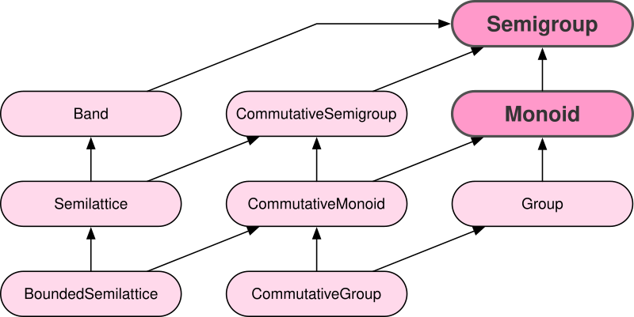
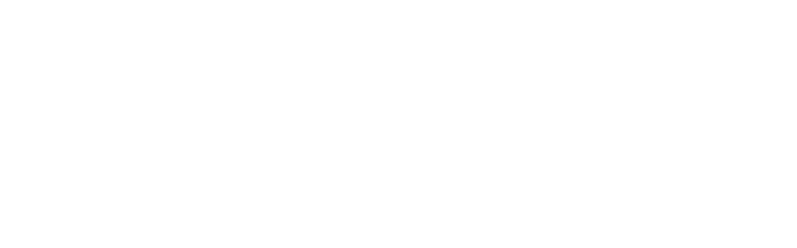

# Cats

In this chapter we will tour the data types and typeclasses in cats
and its related ecosystem. We don't use everything in
`drone-dynamic-agents` so we will give standalone examples when
appropriate.

There has been criticism of the naming in cats, and functional
programming in general. Cats is a word play on *Category Theory* and
the concepts originate from academia, much like object oriented
programming originated from academic research in the 1960s (with their
high falutin words like *polymorphism*, *subtyping*, *generics* and
*aspects*). We'll use the cats names in this book, but feel free to
set up `type` aliases if you would prefer to use names based on the
primary functionality of the typeclass.

Before we introduce the complete typeclass hierarchy, we will look at
the three most important methods from a control flow perspective,
which live on: `Functor`, `Applicative` and `Monad` (each extending
the former).

| Typeclass     | Method    | From   |               | To     |
|------------- |--------- |------ |------------- |------ |
| `Functor`     | `map`     | `F[A]` | `(A => B)`    | `F[B]` |
| `Applicative` | `pure`    | `A`    |               | `F[A]` |
| `Monad`       | `flatMap` | `F[A]` | `(A => F[B])` | `F[B]` |

We know that operations which return a `F[_]` can be sequenced in a
`for` comprehension by `.flatMap`, defined on its `Monad[F]`. The
context `F[_]` can be thought of as a container for an intentional
*effect* with `A` as the output: `flatMap` allows us to generate new
effects `F[B]` at runtime based on the results of evaluating previous
effects.

Of course, not all Higher Kinded Types `F[_]` are effectful, even if
they have a `Monad[F]`. Often they are data structures. By using the
least specific abstraction, our code can work for `List`, `Either`,
`Future` and more, without us needing to know.

If we only need to transform the output from an effect or contents of
a data structure, that's just `map`, introduced by `Functor`. In
Chapter 3, we ran effects in parallel by creating a product and
mapping over them. In Functional Programming, parallel computations
are considered **less** powerful than sequential ones.

In between `Monad` and `Functor` is `Applicative`, defining `pure`
that lets us elevate a value into an effect, or create a data
structure from a single value.

## Data Types

### TODO NonEmptyList

### TODO NonEmptyVector

### TODO Validated

A> This ADT has methods on it, but in Chapter 4 we said that ADTs
A> shouldn't have methods on them and that the functionality should live
A> on typeclasses! You caught us red handed. There are several reasons
A> for doing it this way.
A> 
A> Sorry, but there are more methods than the `value` and `memoize` on
A> `Eval` shown here: it also has `map` and `flatMap`. The reason they
A> live on the ADT and not in an instance of `Monad` is because it is
A> slightly more efficient for the compiler to find these methods instead
A> of looking for `Monad.ops._`, and it is slightly more efficient at
A> runtime. This is an optimisation step that is absolutely vital in a
A> core library such as cats, but please do not perform these
A> optimisations in user code unless you have profiled and found a
A> performance bottleneck. There is a significant cost to code
A> readability.

### Eval

`Eval` is a monadic effect (i.e. there is an instance of
`Monad[Eval]`) which controls evaluation. It wraps a value or
computation and produces the result when `value` is called.

There are three evaluation strategies:

{lang="text"}
~~~~~~~~
  sealed abstract class Eval[+A] {
    def value: A
    def memoize: Eval[A]
  }
  final case class Now[A](value: A) extends Eval[A] {
    def memoize: Eval[A] = this
  }
  final case class Later[A](f: () => A) extends Eval[A] {
    lazy val value: A = f()
    def memoize: Eval[A] = this
  }
  final case class Always[A](f: () => A) extends Eval[A] {
    def value: A = f()
    def memoize: Eval[A] = Later(f)
  }
~~~~~~~~

`Later` and `Always` are lazy strategies while `Now` is eager. `Later`
will run the computation at most once whereas `Always` will run
computations every time they are requested. Calling `.memoize` will
return an `Eval` with "at most once" semantics.

`Eval` supports stack-safe computation via `map` and `flatMap` methods
(not shown here), which trampoline to avoid stack overflows.
Computation within `map` and `flatMap` is always lazy, even when
applied to a `Now` instance.

There is no need for a standalone example of `Eval` as we will use it
in many of the typeclasses of this chapter. It's primary use is to
ensure that calculations are not needlessly re-performed and so that
non `@tailrec` recursive methods do not result in
`StackOverflowError`.

`Eval` has instances of `Bimonad`, `Reducible`, `Order` and `Group`.

A> `Eval` is quite naughty and breaks a few more Chapter 4 rules about
A> what can live on a data type: it is necessary to use a `lazy val`
A> inside `Later` to get the required semantics. It would not be possible
A> to do this in a typeclass, because it requires managing state.
A> 
A> Not shown are two more children of `Eval`: `Call` and `Compute`, which
A> are used to do the trampolining. `Eval` should therefore not be
A> pattern-matched, despite being a sealed coproduct.
A> 
A> If you find yourself reading the actual implementation of `Later`, you
A> might be surprised to see a `var`. Functional Programmers will get
A> their hands dirty in JVM details to squeeze extra performance out of
A> core components of their toolbox, so long as the really dirty hacks do
A> not leak into the API.

#### TODO The Lambda Calculus

### TODO Ior

### TODO Esoteric / Advanced

Maybe leave until after typeclasses

-   Cokleisli
-   Const
-   Coproduct
-   Func
-   Kleisli
-   Nested
-   OneAnd
-   Prod

### TODO Monad Transformers

-   EitherT
-   IdT
-   OptionT
-   StateT
-   WriterT

## Typeclasses

There is an overwhelming number of typeclasses, so we will [visualise
the clusters](https://github.com/tpolecat/cats-infographic) and discuss, with simplified definitions. We'll gloss
over the more esoteric typeclasses.

### Combinable Things

{width=60%}

Defined roughly as:

{lang="text"}
~~~~~~~~
  @typeclass trait Semigroup {
    @op("|+|") def combine(x: A, y: A): A
  }
  
  @typeclass trait Monoid extends Semigroup[A] {
    def empty: A
  
    def combineAll(as: Seq[A]): A = as.foldLeft(empty)(combine)
  }
  
  @typeclass trait Group extends Monoid[A] {
    def inverse(a: A): A
  
    @op("|-|") def remove(a: A, b: A): A = combine(a, inverse(b))
  }
~~~~~~~~

A `Semigroup` should exist for a set of elements that have an
*associative* operation `|+|`.

A> It is common to use `|+|` instead of `combine`, known as the TIE
A> Fighter operator. There is an Advanced TIE Fighter in the next
A> section, which is very exciting.

*Associative* means that the order of applications should not matter,
i.e.

{lang="text"}
~~~~~~~~
  (a |+| b) |+| c == a |+| (b |+| c)
  
  (1 |+| 2) |+| 3 == 1 |+| (2 |+| 3)
~~~~~~~~

A `Monoid` is a `Semigroup` with an *empty* element (also called
*zero* or *identity*). Combining `empty` with any other `a` should
give `a`.

{lang="text"}
~~~~~~~~
  a |+| empty == a
  
  a |+| 0 == a
~~~~~~~~

A `Group` is a `Monoid` where every element has an *inverse* such that
adding any element and its inverse should give the empty. For numbers,
`remove` is synonymous with `minus`:

{lang="text"}
~~~~~~~~
  a |+| (a.inverse) == empty
  a |-| a == empty
  
  1 |-| 1 == 0
  3 |-| 2 == 1
~~~~~~~~

This is probably bringing back memories of `Numeric` from Chapter 4,
which tried to do too much and was unusable beyond the most basic of
number types. There are implementations of `Group` for all the
primitive numbers, but the concept to *combinable* things is useful
beyond numbers.

As a realistic example, consider a trading system that has a large
database of reusable trade templates. Creating the default values for
a new trade involves picking a sequence of off-the-shelf templates and
combining them with a "last rule wins" merge policy in case of
conflict.

We'll create a simple template to demonstrate the principle, but keep
in mind that a realistic system would have hundreds of parameters
within nested `case class`.

{lang="text"}
~~~~~~~~
  sealed abstract class Currency
  case object EUR extends Currency
  case object USD extends Currency
  
  final case class TradeTemplate(
    payments: Seq[java.time.LocalDate],
    ccy: Option[Currency],
    otc: Option[Boolean]
  )
~~~~~~~~

If we write a method that takes `templates: Seq[TradeTemplate]`, we
only need to call `combineAll` and our job is done!

But to call `combineAll` we must have an instance of
`Monoid[TradeTemplate]`. Cats provides generic instances, so we do not
need to write one manually.

{lang="text"}
~~~~~~~~
  import cats._
  import cats.implicits._
  import cats.derived._, monoid._, legacy._
  import java.time.LocalDate
~~~~~~~~

However, generic derivation will fail because `Monoid[Option[T]]`
defers to `Monoid[T]` and we have neither a `Monoid[Currency]` (cats
cannot derive a `Monoid` for a coproduct) nor a `Monoid[Boolean]`
(inclusive or exclusive logic must be explicitly chosen).

To explain what we mean by "defers to", consider
`Monoid[Option[Int]]`:

{lang="text"}
~~~~~~~~
  scala> Option(2) |+| None
  res: Option[Int] = Some(2)
  scala> Option(2) |+| Option(1)
  res: Option[Int] = Some(3)
~~~~~~~~

We can see the content's `combine` has been called, which for `Int` is
integer addition.

But our business rules state that we use "last rule wins" on
conflicts, so we introduce a higher priority implicit
`Monoid[Option[T]]` instance and use it during our generic derivation
instead of the default one:

{lang="text"}
~~~~~~~~
  implicit def lastWins[A]: Monoid[Option[A]] = new Monoid[Option[A]] {
    def combine(x: Option[A], y: Option[A]): Option[A] = (x, y) match {
      case (Some(_)     , winner@Some(_)) => winner
      case (only@Some(_),              _) => only
      case (           _,   only@Some(_)) => only
      case _                              => None
    }
    def empty: Option[A] = None
  }
~~~~~~~~

Let's try it out...

{lang="text"}
~~~~~~~~
  scala> val templates = List(
           TradeTemplate(Nil,                            None,      None),
           TradeTemplate(Nil,                            Some(EUR), None),
           TradeTemplate(List(LocalDate.of(2017, 8, 5)), Some(USD), None),
           TradeTemplate(List(LocalDate.of(2017, 9, 5)), None,      Some(true)),
           TradeTemplate(Nil,                            None,      Some(false))
         )
  
  scala> Monoid[TradeTemplate].combineAll(templates)
  res: TradeTemplate = TradeTemplate(
                         List(2017-08-05,2017-09-05),
                         Some(USD),
                         Some(false))
~~~~~~~~

All we needed to do was implement one piece of business logic and
`Monoid` took care of everything else for us! Can you imagine doing
this without using a generically derived typeclass? It could easily be
thousands of lines of code to do it manually for realistic sized
cases.

Note that the list of `payments` are concatenated. This is because the
default `Monoid[Seq]` uses concatenation of elements and happens to be
the desired behaviour. If the business requirement was different, it
would be a simple case of providing a custom `Monoid[Seq[LocalDate]]`.
Recall from Chapter 4 that with compiletime polymorphism we can have a
different implementation of `combine` depending on the `E` in
`Seq[E]`, not just the base runtime class `Seq`.

#### Esoterics

The `Commutative*` variants have an additional requirement / law
imposed upon them that the order of parameters to `combine` does not
matter, i.e.

{lang="text"}
~~~~~~~~
  a |+| b == b |+| a
~~~~~~~~

Our trading example is most definitely **non** commutative, since the
order of application is important, however this is a useful property
to require if you are building a distributed system where there are
efficiencies to be gained by reordering your calculations.

`Band`, `Semilattice` and `BoundedSemilattice` have the additional law
that the `combine` operation of the same two elements is *idempotent*,
i.e. gives the same value. An example is anything that can only be one
value, such as `Unit`, or if the `combine` is a least upper bound.
These exist so that niche downstream mathematics libraries `spire` and
`algebird` can share common definitions.

### Mappable Things

{width=60%}

This is only a partial view of the full typeclass hierarchy. We're
focussing on things that can be "mapped over" in some sense.

#### Functor

{lang="text"}
~~~~~~~~
  @typeclass trait Functor[F[_]] {
    def map[A, B](fa: F[A])(f: A => B): F[B]
  
    def void[A](fa: F[A]): F[Unit] = map(fa)(_ => ())
    def fproduct[A, B](fa: F[A])(f: A => B): F[(A, B)] = map(fa)(a => a -> f(a))
    def as[A, B](fa: F[A], b: B): F[B] = map(fa)(_ => b)
  
    def lift[A, B](f: A => B): F[A] => F[B] = map(_)(f)
    def widen[A, B >: A](fa: F[A]): F[B] = fa.asInstanceOf[F[B]]
  
    def compose[G[_]: Functor]: Functor[λ[α => F[G[α]]]] = ...
  }
~~~~~~~~

The only abstract method is `map`, and it must *compose*, i.e. mapping
with `f` and then again with `g` is the same as mapping once with the
composition of `f` and `g`:

{lang="text"}
~~~~~~~~
  fa.map(f).map(g) == fa.map(f.andThen(g))
~~~~~~~~

The `map` should also perform a no-op if the provided function is
`identity` (i.e. `x => x`)

{lang="text"}
~~~~~~~~
  fa.map(identity) == fa
  
  fa.map(x => x) == fa
~~~~~~~~

`Functor` defines some convenience methods around `map` that can be
optimised by specific instances. The documentation has been
intentionally omitted in the above definitions to encourage you to
guess what a method does before looking at the implementation. Please
spend a moment studying only the type signature of the following
before reading further:

{lang="text"}
~~~~~~~~
  def void[A](fa: F[A]): F[Unit]
  def fproduct[A, B](fa: F[A])(f: A => B): F[(A, B)]
  def as[A, B](fa: F[A], b: B): F[B]
  def lift[A, B](f: A => B): F[A] => F[B]
  def widen[A, B >: A](fa: F[A]): F[B]
~~~~~~~~

1.  `void` takes an instance of the `F[A]` and always returns an
    `F[Unit]`, it forgets all the values whilst preserving the
    structure.
2.  `fproduct` takes the same input as `map` but returns `F[(A, B)]`,
    it tuples the contents of `F[A]` with the result of applying the
    function.
3.  `as` is a way of replacing every value with a constant. For
    example, a parser may wish to `string("foo").as(true)` for a format
    that uses the existence of the `foo` keyword to set a `Boolean`
    flag.
4.  `lift` takes a `A => B` and returns a `F[A] => F[B]`, or in
    English, it takes a function over the contents of an `F[A]` and
    returns a function that operates **on** the `F[A]` directly.
5.  `widen` is a safe upcast that can use `asInstanceOf` for
    performance thanks to the no-op identity law.

Finally we have `compose`, which has a complex type signature. The
arrow syntax is a `kind-projector` *type lambda* that says if this
`Functor[F]` is composed with a type `G[_]` (that has a `Functor[G]`),
we get a `Functor[F[G[_]]]` that can operate on `F[G[A]]`.

A simple example is where `F[_]` is `List` and `G[_]` is `Option`, and
we want to be able to map over the `Int` inside a `List[Option[Int]]`
without changing the two structures:

{lang="text"}
~~~~~~~~
  scala> val lo = List(Some(1), None, Some(2))
  scala> Functor[List].compose[Option].map(lo)(_ + 1)
  res: List[Option[Int]] = List(Some(2), None, Some(3))
~~~~~~~~

This lets us jump into nested effects and structures and apply a
function at the layer we want.

#### TODO Foldable

Fold is for data structures that can be walked to produce a summary
value. It is a one-trait army that can provide much of what you'd
expect to see in a Collections API.

#### TODO Traversable

#### TODO Reducible

#### TODO Esoteric

-   FunctorFilter
-   TraverseFilter
-   CoflatMap
-   Comonad

### Variance

{width=60%}

We must return to `Functor` for a moment and reveal a typeclass parent
and method that we previously ignored:

{lang="text"}
~~~~~~~~
  @typeclass trait Invariant[F[_]] {
    def imap[A, B](fa: F[A])(f: A => B)(g: B => A): F[B]
  
    def compose[G[_]: Invariant]: Invariant[λ[α => F[G[α]]]] = ...
    def composeFunctor[G[_]: Functor]: Invariant[λ[α => F[G[α]]]] = ...
    def composeContravariant[G[_]: Contravariant]: Invariant[λ[α => F[G[α]]]] = ...
  }
  
  @typeclass trait Functor[F[_]] extends Invariant[F] {
    def map[A, B](fa: F[A])(f: A => B): F[B]
  
    def imap[A, B](fa: F[A])(f: A => B)(fi: B => A): F[B] = map(fa)(f)
  
    def compose[G[_]: Functor]: Functor[λ[α => F[G[α]]]] = ...
    ...
  }
  
  @typeclass trait Contravariant[F[_]] extends Invariant[F] {
    def contramap[A, B](fa: F[A])(f: B => A): F[B]
  
    def imap[A, B](fa: F[A])(f: A => B)(fi: B => A): F[B] = contramap(fa)(fi)
  
    def narrow[A, B <: A](fa: F[A]): F[B] = fa.asInstanceOf[F[B]]
  
    def compose[G[_]: Contravariant]: Functor[λ[α => F[G[α]]]] = ...
  }
~~~~~~~~

`Functor` is a short name for what should be *covariant functor*. But
since `Functor` is so popular it gets the nickname. Likewise
`Contravariant` should really be *contravariant functor* and
`Invariant` should be *invariant functor*.

It is important to note that, although related at a theoretical level,
the words *covariant*, *contravariant* and *invariant* do not directly
refer to type variance (i.e. `+` and `-` prefixes that may be written
in type signatures).

*Invariance* here means that it is possible to map the contents of a
structure `F[A]` into `F[B]` if we can provide a map from `A => B` and
a map from `B => A`. A normal, covariant, functor only needs the `A =>
B` to be able to do this, exemplified in its implementation of `imap`,
but a bizarro contravariant functor only needs a map from `B => A`.

This is so ridiculously abstract and seemingly impossible that it
needs a practical example immediately, before we can continue on good
terms. In Chapter 4 we used circe to derive a JSON encoder for our
data types and we gave a brief description of the `Encoder` typeclass.
This is an expanded version:

{lang="text"}
~~~~~~~~
  @typeclass trait Encoder[A] { self =>
    def encodeJson(a: A): Json
  
    def contramap[B](f: B => A): Encoder[B] = new Encoder[B] {
      final def apply(a: B) = self(f(a))
    }
  }
~~~~~~~~

Now consider the case where we want to write an instance of an
`Encoder[B]` in terms of another `Encoder[A]`, that's exactly what
`contramap` is for (recall that it is safe to call `Some.get`, but not
`Option.get`):

{lang="text"}
~~~~~~~~
  implicit def encodeSome[A: Encoder]: Encoder[Some[A]] =
    Encoder[A].contramap(_.get)
~~~~~~~~

<http://typelevel.org/blog/2016/02/04/variance-and-functors.html>

A `Functor` is documented in cats as a "covariant functor". This seems
immediately contradictory since it inherits from `Invariant`. TODO

the sub typing relationship does make sense, functors answer the question: "what do I need, to go from an F[A] to an F[B]" ?

1.  invariant: you need both an A => B, and a B => A

2 ) covariant: you only need an A => B
1.  contravariant: you only need a B => A

The requirements for 2) are a subset of the requirements for 1), so 2) is a subtype of 1)
The requirements for 3) are a subset of the requirements for 1) so 3) is a subtype of 1)

{lang="text"}
~~~~~~~~
  sealed trait Foo[A]
  case class Bar[A](a: A) extends Foo[A]
  case class Baz[A](f: A => Int) extends Foo[A]
~~~~~~~~

-   Invariant

### TODO Bifunctor

### TODO Applicative Things

### TODO Monads

Or should this live in the Effects chapter?

### TODO Comparable Things

### TODO Very Abstract Things

Category, etc

### TODO Other

## Laws

# TODO Effects

# TODO FS2

Task, Stream

The basics, and covering the Effect, which can be our free monad.

Why streams are so awesome. I'd like a simple example here of reading
from a huge data source, doing parallel work and then writing out in
order to a (slower) device to demonstrate backpressure and constant
memory overhead. Maybe compare this vs hand rolled and akka streams
for a perf test?

Rewrite our business logic to be streaming, convert our GET api into a
`Stream` by polling.

# TODO Implementing the Application

Pad out the application implementation with everything we've learnt.

May need union types, see <https://github.com/propensive/totalitarian>

Will probably be a big chapter. Maybe best to leave it for a final
part of the book?

## TODO Spotting patterns, refactoring

Note that some of our algebras are actually common things and can be
rewritten: reader / writer / state / error / indexed monad. It's ok
that this is a step you can do later.

### RESEARCH perf numbers

# TODO Dependent Types

Jons talks are usually good for this <https://www.youtube.com/watch?v=a1whaMzrtsY>

# TODO Type Refinement

instead of needing those `error` calls in the first place, just don't
allow them to happen at your layer if you can get away with it.

Protect yourself from mistyping

# TODO Generic Programming

-   a mini Shapeless for Mortals
-   typeclass derivation (UrlEncoding, QueryEncoding)
-   scalacheck-shapeless
-   cachedImplicit into a val
-   downside is compile time speeds for ADTs of 50+
-   alternative is <https://github.com/propensive/magnolia>
-   some advanced cases, e.g. spray-json-shapeless stuff, typeclass
    hierarchy / ambiguities and Not
-   <https://issues.scala-lang.org/browse/SI-2509>

# TODO Recursion Schemes

# TODO Optics

not sure what the relevance to this project would be yet.

# TODO Category Theory

Just some of the high level concepts, where to get started if you're interested.
Not needed to write FP but it is needed if you want to read any academic papers.

